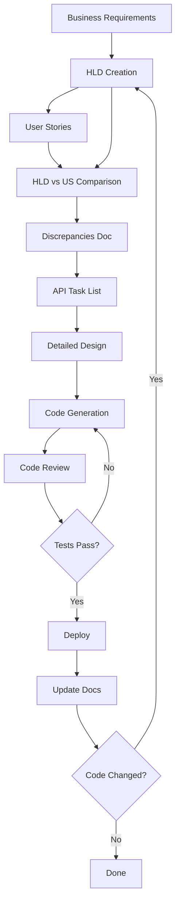

# Architecture & Design Decisions

> Giải thích các quyết định thiết kế quan trọng trong Documentation-as-Code Template

---

## Table of Contents

- [Design Philosophy](#design-philosophy)
- [Workflow Architecture](#workflow-architecture)
- [Template Design](#template-design)
- [Multi-tenant Pattern](#multi-tenant-pattern)
- [Event-Driven Pattern](#event-driven-pattern)
- [AI Integration](#ai-integration)
- [Trade-offs & Alternatives](#trade-offs--alternatives)

---

## Design Philosophy

### Documentation-as-Code

**Principle**: Documentation should be:
- **Versioned** như code (Git)
- **Reviewed** như code (Pull Requests)
- **Tested** như code (Validation)
- **Deployed** cùng code (Sync)

**Benefits**:
- ✅ Single source of truth
- ✅ Documentation never outdated
- ✅ Easy collaboration
- ✅ Searchable & indexable

### Component-Based Templates

**Why?**
- **Modularity**: Pick only what you need
- **Maintainability**: Update one component at a time
- **Reusability**: Mix and match components
- **Token Efficiency**: Load only necessary sections for AI

**Example**:
```
DD Template =
  Section 1 (Business Context) +
  Section 2 (Architecture) +
  Section 3 (API Endpoints) +
  Section 4 (Workflows) +
  Section 5 (Events)
```

Instead of one monolithic 5000-line template.

### AI-Friendly Structure

**Design Goals**:
1. **Clear Structure**: Headings, sections, numbering
2. **Explicit Placeholders**: `[UPPERCASE]` format dễ identify
3. **Examples Included**: AI learns from examples
4. **Cross-References**: Link instead of duplicate
5. **Token Optimized**: ~10K tokens per DD template

**Before**:
```markdown
# Detailed Design
[3000 lines of everything mixed together]
```

**After**:
```markdown
# Detailed Design

## 1. Business Context
See: 01-hld-keypoints/01-business-context.md

## 2. Architecture
See: 02-architecture-design/01-architecture-decisions.md
```

---

## Workflow Architecture

### End-to-End Flow



### Why This Flow?

**1. HLD First**
- Forces thinking about architecture upfront
- Prevents scope creep
- Identifies dependencies early

**2. US Next**
- Detailed requirements from user perspective
- Testable acceptance criteria
- Foundation for QA

**3. Compare HLD vs US**
- Catches gaps and conflicts early
- Clarifies ambiguities before coding
- Prevents rework

**4. DD Last**
- Implementation roadmap for developers
- Task breakdown for estimation
- Clear API contracts

### Alternative Flows Considered

❌ **Code-First**:
```
Code → Docs (later)
```
**Problems**: Docs outdated, inconsistent, incomplete

❌ **US-First**:
```
US → Code → HLD (later)
```
**Problems**: No architecture vision, technical debt

✅ **Our Approach**:
```
HLD → US → DD → Code
```
**Benefits**: Architecture-driven, requirements-clear, maintainable

---

## Template Design

### HLD: 8 Sections

**Decision**: Split vào 8 sections instead of monolithic

**Why 8?**
1. **Context (1-2)**: Understand the problem
2. **Workflows (3-4)**: How it works
3. **Data (5)**: What we store
4. **Events (6)**: How services communicate
5. **Orchestration (7)**: Complex workflows
6. **Appendix (8)**: Supporting info

**Alternatives Considered**:
- ❌ **3 Sections** (Context, Design, Data): Too high-level
- ❌ **15 Sections**: Too granular, overwhelming

**Trade-off**: 8 is sweet spot giữa completeness và simplicity

### DD: 6 Sections Component-Based

**Decision**: Component-based thay vì monolithic

**Before (Monolithic)**:
```
DD-MODULE.md (2000+ lines)
├── Everything in one file
└── Hard to maintain
```

**After (Component-Based)**:
```
dd/overview/template/
├── 01-hld-keypoints/01-business-context.md
├── 02-architecture-design/01-architecture-decisions.md
├── 03-source-code/01-api-endpoints.md
├── 04-workflows/01-workflow-diagrams.md
├── 05-events/01-event-catalog.md
└── 06-patterns/01-pattern.md
```

**Benefits**:
- ✅ Easy to update one component
- ✅ Reuse across modules
- ✅ Token-efficient for AI (load only needed)
- ✅ Clear separation of concerns

**Drawbacks**:
- ⚠️ More files to manage
- ⚠️ Need to assemble components

**Decision**: Benefits >> Drawbacks

### Why Section 3 (API Endpoints) is Critical

**Most Important Section in DD!**

Before optimization:
```markdown
## 3. Source Code
[Generic code structure, no API table]
```

After optimization:
```markdown
## 3. Source Code

### 3.1 API Endpoints

| API | Method | Operation | Business Logic | Request | Response |
|-----|--------|-----------|----------------|---------|----------|
| `/api/v1/orders` | POST | createOrder | 1. Validate<br>2. Create<br>3. Publish event | CreateOrderRequest | OrderResponse |
```

**Why Critical?**
- Developers know exactly what to implement
- Clear task breakdown for estimation
- Foundation for code generation
- API contract between FE/BE

**Token Cost**: ~3K tokens
**Value**: Saves 10+ hours of clarification meetings

---

## Multi-tenant Pattern

### Design Decision: POOLED Model

**Options Considered**:

1. **Database per Tenant**
   - ✅ Complete isolation
   - ❌ High cost, hard to maintain
   - ❌ Not scalable

2. **Schema per Tenant**
   - ✅ Good isolation
   - ❌ Medium cost
   - ❌ Limited scalability

3. **Row-Level (POOLED)** ← **Our Choice**
   - ✅ Cost-effective
   - ✅ Highly scalable
   - ⚠️ Need careful implementation
   - ⚠️ Shared resources

### Implementation in Templates

**HLD Section 1**:
```markdown
## Business Contexts

| Context | Tenant Type | Access | Actions |
|---------|------------|--------|---------|
| School manages PIM | PRIVATE_SCHOOL | Full write | Create, Publish |
| Teacher views PIM | INDIVIDUAL | Read-only | View, Register |
```

**DD Section 1**:
```markdown
## Multi-tenant Handling

- Model: POOLED (row-level isolation)
- Identifier: `tenant_id` (BIGINT)
- Header: `X-Tenant-ID`
- Validation: Every request must have valid tenant
- Queries: Always filter by `tenant_id`
```

**Coding Rules**:
```markdown
## Database Design
- Every table must have `tenant_id` column
- Every query must filter by `tenant_id`
- Indexes must include `tenant_id`
```

### Why Describe Business Contexts, Not Folder Structure?

❌ **Wrong Way**:
```markdown
## Code Structure
domain/
├── ind/  # Individual tenant
└── ps/   # Private School tenant
```

✅ **Right Way**:
```markdown
## Business Contexts

| Context | Tenant Type | Domain Access |
|---------|------------|---------------|
| School manages PIM | PRIVATE_SCHOOL | Full write |
| Teacher views PIM | INDIVIDUAL | Read-only |

Cross-context communication: Via Kafka events
```

**Why?**
- Folder structure là implementation detail (có thể change)
- Business context là stable (rarely changes)
- Focus on WHAT, not HOW

---

## Event-Driven Pattern

### Design Decision: Kafka for Events

**Why Kafka?**
- ✅ High throughput
- ✅ Event replay capability
- ✅ Multiple consumers per topic
- ✅ Durable storage

**Alternatives**:
- RabbitMQ: Good but no replay
- AWS SQS: Cloud-locked
- Redis Pub/Sub: No persistence

### Event Naming Convention

**Pattern**: `[Domain].[Entity].[Action]Event`

**Examples**:
```
cart.item.added
order.created
payment.processed
user.registered
```

**Why This Pattern?**
- Domain prefix prevents naming conflicts
- Clear hierarchy
- Easy filtering by domain

### Event Schema Design

**Decision**: Include full payload + metadata

```json
{
  "eventId": "uuid",
  "eventType": "cart.item.added",
  "eventVersion": "1.0",
  "timestamp": "2026-01-09T10:30:00Z",
  "tenantId": "123",
  "data": {
    "cartId": "456",
    "productId": "789",
    "quantity": 2
  },
  "metadata": {
    "correlationId": "uuid",
    "causationId": "uuid",
    "userId": "999"
  }
}
```

**Why Full Payload?**
- ✅ Consumers không cần query database
- ✅ Event replay works without DB
- ✅ Debugging easier

**Trade-off**: Larger event size (~1-2KB vs ~100 bytes)

**Decision**: Network bandwidth cheap, developer time expensive

---

## AI Integration

### Design for AI Consumption

**Principles**:

1. **Structured Format**
   - Clear headings (Markdown H1-H3)
   - Tables for structured data
   - Consistent numbering

2. **Explicit Placeholders**
   - Format: `[UPPERCASE_WITH_UNDERSCORES]`
   - Easy to regex search
   - AI can identify and replace

3. **Examples Included**
   - examples/ folder với real-world samples
   - AI learns patterns from examples
   - Reduces ambiguity

4. **Token Optimization**
   - Component-based (~10K tokens vs 14K)
   - Cross-references thay vì duplicate
   - Focus on control logic, not code

### Prompt Engineering

**6-Phase Workflow**:

Why 6 phases?
- **Too few** (1-2): AI overwhelmed, poor output
- **Too many** (10+): Tedious, hard to follow
- **6 phases**: Balance between thoroughness và efficiency

Each phase:
- Clear input/output
- Specific prompts
- Validation checkpoints

---

## Trade-offs & Alternatives

### Component-Based vs Monolithic Templates

| Aspect | Component-Based ✅ | Monolithic |
|--------|-------------------|------------|
| **Maintainability** | High (edit 1 file) | Low (edit big file) |
| **Reusability** | High (mix & match) | Low (copy all) |
| **Token Cost** | Lower (~10K) | Higher (~14K) |
| **Complexity** | Higher (more files) | Lower (1 file) |
| **Learning Curve** | Steeper | Easier |

**Decision**: Component-based cho long-term maintainability

### Vietnamese vs English

**Current**: Vietnamese for README, templates optional bilingual

**Why Vietnamese?**
- Primary audience is Vietnamese teams
- Business context in Vietnamese
- Easier for local teams

**Future**: English translation for global audience

### Mermaid vs Other Diagram Tools

| Tool | Pros | Cons |
|------|------|------|
| **Mermaid** ✅ | Text-based, version control friendly, renders in GitHub | Limited styling |
| PlantUML | More features | Requires Java runtime |
| Draw.io | WYSIWYG | Binary files, hard to version |
| Visio | Professional | Expensive, not open |

**Decision**: Mermaid for simplicity và version control

---

## Future Architecture Considerations

### v2.1-v2.2

- [ ] CLI tool để scaffold projects
- [ ] VS Code extension
- [ ] Template validation scripts
- [ ] Automated docs-to-code sync checker

### v3.0

- [ ] Real-time collaboration
- [ ] Documentation versioning system
- [ ] Integration với Notion, Confluence
- [ ] AI-powered documentation generator

---

## Lessons Learned

### What Worked Well

✅ **Component-based templates**: Easy to maintain
✅ **AI-friendly structure**: High quality AI output
✅ **Examples included**: Reduces ambiguity
✅ **Token optimization**: Cost-effective for AI

### What Could Be Improved

⚠️ **More language support**: Need English, Chinese translations
⚠️ **Automation**: Scripts for validation, generation
⚠️ **Integration**: Better IDE support

### What We'd Do Differently

If starting over:
- Start with English documentation
- Build CLI tool from day 1
- Add automated tests for templates
- Include video tutorials

---

## Contributing to Architecture

Có ý tưởng về architecture improvements? Xem [CONTRIBUTING.md](CONTRIBUTING.md)!

---

**Last Updated**: 2026-01-09
**Version**: 2.0
