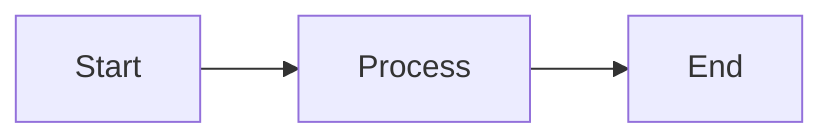

# Contributing Guide

Cảm ơn bạn quan tâm đến việc contribute vào **Documentation-as-Code Template**! 🎉

---

## Table of Contents

- [Code of Conduct](#code-of-conduct)
- [How Can I Contribute?](#how-can-i-contribute)
- [Development Setup](#development-setup)
- [Contribution Workflow](#contribution-workflow)
- [Style Guidelines](#style-guidelines)
- [Testing Your Changes](#testing-your-changes)
- [Submitting Changes](#submitting-changes)

---

## Code of Conduct

### Our Standards

- ✅ Be respectful and inclusive
- ✅ Welcome newcomers and help them learn
- ✅ Focus on what is best for the community
- ✅ Show empathy towards other community members
- ❌ No harassment, trolling, or derogatory comments

---

## How Can I Contribute?

### 🐛 Reporting Bugs

**Before submitting a bug report**:
1. Check [existing issues](https://github.com/your-repo/issues)
2. Ensure you're using the latest version

**Bug report template**:

```markdown
**Describe the bug**
A clear description of what the bug is.

**To Reproduce**
Steps to reproduce:
1. Go to '...'
2. Use template '...'
3. See error

**Expected behavior**
What you expected to happen.

**Screenshots**
If applicable, add screenshots.

**Environment**
- OS: [e.g., Windows 11]
- Editor: [e.g., VS Code 1.85]
- Template version: [e.g., 2.0.0]
```

### 💡 Suggesting Features

**Feature request template**:

```markdown
**Is your feature request related to a problem?**
A clear description of the problem.

**Describe the solution you'd like**
What you want to happen.

**Describe alternatives you've considered**
Other solutions you've thought about.

**Additional context**
Mockups, examples, etc.
```

### 📝 Improving Documentation

- Fix typos, grammar, or unclear explanations
- Add more examples or use cases
- Translate to other languages
- Improve diagrams or visualizations

### 🎨 Contributing Templates

**We welcome**:
- Coding rules for new tech stacks (Python, .NET, Go, Ruby, PHP, etc.)
- Industry-specific templates (Healthcare, Finance, IoT, etc.)
- Alternative HLD/DD/US formats
- Automation scripts

### 🌍 Translations

Currently, docs are in Vietnamese. English translation is highly appreciated!

**Translation priorities**:
1. README.md
2. QUICKSTART.md
3. Templates (HLD, DD, US)
4. Examples

---

## Development Setup

### Prerequisites

```bash
# Git
git --version

# Markdown editor (VS Code recommended)
code --version

# Optional: Mermaid CLI for diagram validation
npm install -g @mermaid-js/mermaid-cli
```

### Fork & Clone

```bash
# 1. Fork repo trên GitHub

# 2. Clone your fork
git clone https://github.com/YOUR_USERNAME/aeh-document-by-ai.git
cd aeh-document-by-ai

# 3. Add upstream remote
git remote add upstream https://github.com/ORIGINAL_OWNER/aeh-document-by-ai.git

# 4. Create feature branch
git checkout -b feature/my-new-feature
```

---

## Contribution Workflow

### 1. Sync with upstream

```bash
git fetch upstream
git checkout main
git merge upstream/main
```

### 2. Create feature branch

```bash
git checkout -b feature/add-python-coding-rules
# or
git checkout -b fix/broken-link-in-readme
# or
git checkout -b docs/improve-quickstart
```

**Branch naming**:
- `feature/` - New features
- `fix/` - Bug fixes
- `docs/` - Documentation improvements
- `refactor/` - Code/template refactoring
- `test/` - Adding tests

### 3. Make changes

```bash
# Edit files
# Add new templates, examples, docs, etc.
```

### 4. Test your changes

See [Testing Your Changes](#testing-your-changes) below.

### 5. Commit

```bash
git add .
git commit -m "feat: add Python/Django coding rules example

- Created CODING-RULES-PYTHON-DJANGO.mdc
- Added Django-specific naming conventions
- Included ORM and migration rules
- Added REST framework guidelines

Closes #123"
```

**Commit message format**:

```
<type>(<scope>): <subject>

<body>

<footer>
```

**Types**:
- `feat`: New feature
- `fix`: Bug fix
- `docs`: Documentation only
- `style`: Formatting, missing semicolons, etc.
- `refactor`: Code restructuring
- `test`: Adding tests
- `chore`: Updating build tasks, dependencies, etc.

### 6. Push

```bash
git push origin feature/add-python-coding-rules
```

### 7. Create Pull Request

Go to GitHub and create PR from your branch to `main`.

---

## Style Guidelines

### Markdown Style

**Headers**:
```markdown
# H1 - Document title
## H2 - Major sections
### H3 - Subsections
```

**Lists**:
```markdown
- Use `-` for unordered lists
1. Use `1.` for ordered lists
- [ ] Use `- [ ]` for task lists
```

**Code blocks**:
````markdown
```language
code here
```
````

**Links**:
```markdown
[Text](url) - Inline links
[Text](./relative/path.md) - Relative paths for internal links
```

### Template Style

**Placeholders**:
- Format: `[UPPERCASE_WITH_UNDERSCORES]`
- Examples: `[PROJECT_NAME]`, `[DATABASE_TYPE]`, `[API_ENDPOINT]`

**Sections**:
- Clear, descriptive headings
- Consistent numbering
- Cross-references where appropriate

**Mermaid Diagrams**:
```markdown

```

### Coding Rules Style

**Structure**:
1. Always start with frontmatter:
   ```yaml
   ---
   alwaysApply: true
   ---
   ```

2. Follow this order:
   - Project Overview
   - Naming Conventions
   - API Design
   - Architecture
   - Database/ORM
   - Testing
   - Security
   - Performance

3. Include examples:
   - ✅ DO examples
   - ❌ DON'T examples

---

## Testing Your Changes

### 1. Validate Markdown

```bash
# Install markdownlint
npm install -g markdownlint-cli

# Run validation
markdownlint '**/*.md' --ignore node_modules
```

### 2. Validate Mermaid Diagrams

```bash
# Extract mermaid code to temp file
# Validate with mermaid-cli
mmdc -i diagram.mmd -o diagram.png
```

Or test at [mermaid.live](https://mermaid.live/)

### 3. Test Templates

**Checklist**:
- [ ] All placeholders are documented
- [ ] Examples are provided
- [ ] Cross-references are valid
- [ ] No broken links
- [ ] Diagrams render correctly
- [ ] Follows existing style

**Manual test**:
1. Copy template to new file
2. Try to fill placeholders
3. Verify it makes sense
4. Check if AI understands it (optional)

### 4. Spell Check

Use VS Code spell checker or:

```bash
npm install -g cspell
cspell '**/*.md'
```

---

## Submitting Changes

### Pull Request Checklist

Before submitting PR:

- [ ] Code/templates follow style guidelines
- [ ] All tests pass (if applicable)
- [ ] Documentation updated (if needed)
- [ ] CHANGELOG.md updated (for significant changes)
- [ ] Commit messages follow convention
- [ ] No merge conflicts
- [ ] PR description is clear and complete

### PR Template

```markdown
## Description
Brief description of changes.

## Type of Change
- [ ] Bug fix
- [ ] New feature
- [ ] Documentation improvement
- [ ] Template enhancement
- [ ] Breaking change

## Related Issues
Fixes #123
Related to #456

## Testing
How did you test this?

## Screenshots (if applicable)
Add screenshots/diagrams.

## Checklist
- [ ] Self-review done
- [ ] Comments added for complex parts
- [ ] Documentation updated
- [ ] No breaking changes (or documented)
```

### Review Process

1. **Automated checks**: CI will run linting, validation
2. **Maintainer review**: A maintainer will review your PR
3. **Feedback**: Address any requested changes
4. **Merge**: Once approved, PR will be merged

**Review timeline**: Usually 2-7 days. Be patient!

---

## Recognition

### Contributors

All contributors will be:
- Listed in CONTRIBUTING.md
- Credited in release notes
- Given credit in commit messages (Co-authored-by)

### Significant Contributions

For major contributions (new templates, translations, features):
- Mentioned in README.md
- Added to AUTHORS file (if exists)
- Special thanks in release announcements

---

## Questions?

### Need Help?

- 💬 Ask in [GitHub Discussions]
- 📧 Email: [maintainer-email@example.com]
- 💡 Check [FAQ in README](README.md#faq)

### Want to Become a Maintainer?

We're always looking for active contributors to join as maintainers! Requirements:
- 5+ merged PRs
- Active participation for 3+ months
- Good understanding of project goals
- Helpful to other contributors

---

## Thank You! 🙏

Every contribution, no matter how small, helps improve this project for everyone. Thank you for taking the time to contribute!

---

**Last Updated**: 2026-01-09
**Version**: 2.0
