# HLD - TF-GRADING (Grading Ecosystem)

## 1. Bối cảnh (Context)

### 1.1 Bối cảnh về kinh doanh (Business Context)

Trong hệ sinh thái giáo dục, việc đánh giá và chấm điểm (Grading) là một trong những chức năng cốt lõi, kết nối giữa hoạt động giảng dạy của Giáo viên và quá trình học tập của Học sinh. Tài liệu này mô tả thiết kế **hệ sinh thái Grading** bao gồm 3 services chính:

| Service | Domain | User | Responsibility |
|---------|--------|------|----------------|
| **tf-grading** | Teaching Functions | Teacher | Tạo grade items, giao bài tập, giao bài kiểm tra, chấm điểm, quản lý gradebook, release grades |
| **lf-assignment** | Learning Functions | Student | Xem bài tập, nộp bài (File upload hoặc Link) |
| **lf-assessment** | Learning Functions | Student | Làm bài kiểm tra (MCQ, True/False, Essay, Short Answer) |

**Mô hình Grading tổng quan:**

```
┌─────────────────────────────────────────────────────────────────────────────────────┐
│                              GRADING ECOSYSTEM                                        │
├─────────────────────────────────────────────────────────────────────────────────────┤
│                                                                                      │
│   ┌─────────────────────────────────────────────────────────────────────────────┐   │
│   │                         GRADE ITEM (Hạng mục điểm)                           │   │
│   │  ━━━━━━━━━━━━━━━━━━━━━━━━━━━━━━━━━━━━━━━━━━━━━━━━━━━━━━━━━━━━━━━━━━━━━━━━  │   │
│   │  • Hạng mục để tính điểm trong lớp học (Quiz, Assignment, Midterm, Final)   │   │
│   │  • Mỗi Grade Item có weight (%) trong Final Grade                           │   │
│   │  • Tổng weight của tất cả Grade Items = 100%                                │   │
│   │  • Có thể link với Assignment hoặc Assessment                                │   │
│   └───────────────────────────────┬─────────────────────────────────────────────┘   │
│                                   │                                                  │
│               ┌───────────────────┼───────────────────┐                             │
│               │                   │                   │                             │
│               ▼                   │                   ▼                             │
│   ┌───────────────────────┐       │       ┌───────────────────────┐                 │
│   │     ASSIGNMENT        │       │       │     ASSESSMENT        │                 │
│   │    (Bài tập)          │       │       │   (Bài kiểm tra)      │                 │
│   ├───────────────────────┤       │       ├───────────────────────┤                 │
│   │ • File upload         │       │       │ • MCQ (auto-grading)  │                 │
│   │ • Link submission     │       │       │ • True/False (auto)   │                 │
│   │ • Manual grading      │       │       │ • Short Answer        │                 │
│   │ • lf-assignment       │       │       │ • Essay               │                 │
│   └───────────┬───────────┘       │       │ • lf-assessment       │                 │
│               │                   │       └───────────┬───────────┘                 │
│               ▼                   │                   ▼                             │
│   ┌───────────────────────┐       │       ┌───────────────────────┐                 │
│   │     SUBMISSION        │       │       │      ATTEMPT          │                 │
│   │  (Student nộp bài)    │       │       │  (Student làm bài)    │                 │
│   └───────────┬───────────┘       │       └───────────┬───────────┘                 │
│               │                   │                   │                             │
│               └───────────────────┼───────────────────┘                             │
│                                   │                                                  │
│                                   ▼                                                  │
│   ┌─────────────────────────────────────────────────────────────────────────────┐   │
│   │                         STUDENT GRADE (Điểm học sinh)                        │   │
│   │  ━━━━━━━━━━━━━━━━━━━━━━━━━━━━━━━━━━━━━━━━━━━━━━━━━━━━━━━━━━━━━━━━━━━━━━━━  │   │
│   │  • Điểm của học sinh cho từng Grade Item                                    │   │
│   │  • Thang điểm 0-10 (2 decimal places)                                       │   │
│   │  • Trạng thái: NOT_GRADED → GRADED → RELEASED                               │   │
│   │  • Student chỉ thấy điểm khi Teacher RELEASE                                │   │
│   └───────────────────────────────┬─────────────────────────────────────────────┘   │
│                                   │                                                  │
│                                   ▼                                                  │
│   ┌─────────────────────────────────────────────────────────────────────────────┐   │
│   │                         FINAL GRADE (Điểm tổng kết)                          │   │
│   │  ━━━━━━━━━━━━━━━━━━━━━━━━━━━━━━━━━━━━━━━━━━━━━━━━━━━━━━━━━━━━━━━━━━━━━━━━  │   │
│   │  • Weighted Average của tất cả Grade Items                                  │   │
│   │  • Tính tự động khi Class COMPLETED                                         │   │
│   │  • Sync về tf-class-management (enrollment.final_grade)                     │   │
│   │  • Pass threshold: 5.0                                                       │   │
│   └─────────────────────────────────────────────────────────────────────────────┘   │
│                                                                                      │
└─────────────────────────────────────────────────────────────────────────────────────┘
```

**Core Concepts:**

| Concept | Mô tả |
|---------|-------|
| **Grade Item** | Hạng mục điểm trong lớp học (Quiz, Assignment, Midterm, Final). Mỗi Grade Item có trọng số (weight) trong điểm tổng kết |
| **Assignment** | Bài tập do Teacher giao. Student nộp bài thông qua File upload hoặc Link. Teacher chấm điểm thủ công |
| **Assessment** | Bài kiểm tra với các dạng câu hỏi: MCQ, True/False (auto-grading), Short Answer, Essay (manual grading) |
| **Submission** | Bài nộp của Student cho Assignment (file hoặc link) |
| **Attempt** | Lần làm bài của Student cho Assessment (bao gồm các câu trả lời) |
| **Student Grade** | Điểm của học sinh cho từng Grade Item |
| **Gradebook** | Bảng điểm tổng hợp của Class, hiển thị tất cả Grade Items và điểm của từng học sinh |
| **Final Grade** | Điểm tổng kết = Weighted Average của các Grade Items |

**So sánh INDIVIDUAL vs PRIVATE_SCHOOL:**

| Tính năng | INDIVIDUAL | PRIVATE_SCHOOL |
|-----------|------------|----------------|
| **Tạo Grade Items** | Main Teacher | Main Teacher |
| **Giao Assignment/Assessment** | Main Teacher | Main Teacher |
| **Chấm điểm** | Main Teacher | Main Teacher |
| **Release Grades** | Main Teacher | Main Teacher |
| **Xem Gradebook** | Main Teacher + Assistant | Main Teacher + Assistant |
| **Quy trình duyệt** | Không | Có thể cần duyệt |

> **Note:** Quy trình Grading giống nhau giữa INDIVIDUAL và PRIVATE_SCHOOL. Sự khác biệt chủ yếu nằm ở quy trình quản lý lớp học (Class Management).

**Grading Workflow tổng quan:**

```
┌─────────────────────────────────────────────────────────────────────────────────────────┐
│                              GRADING WORKFLOW OVERVIEW                                    │
├─────────────────────────────────────────────────────────────────────────────────────────┤
│                                                                                          │
│  [MAIN TEACHER - tf-grading]                                                            │
│       │                                                                                  │
│  1. Tạo Grade Items cho Class                                                           │
│       │   - Quiz (10%), Assignment (20%), Midterm (30%), Final (40%)                   │
│       │   - Validate: Total weight = 100%                                              │
│       │                                                                                  │
│  2. Giao Assignment (Bài tập)                                                           │
│       │   - Tạo Assignment với title, description, due_date                            │
│       │   - Link với Grade Item                                                         │
│       │   - Set submission_type: FILE_UPLOAD hoặc LINK                                 │
│       │   - (Optional) Enable late submission + penalty                                │
│       │   - Publish → lf-assignment                                                    │
│       │                                                                                  │
│  3. Giao Assessment (Bài kiểm tra)                                                      │
│       │   - Tạo Assessment với title, time_limit, due_date                             │
│       │   - Thêm câu hỏi: MCQ, True/False, Short Answer, Essay                         │
│       │   - Set correct answers cho MCQ & True/False                                   │
│       │   - Link với Grade Item                                                         │
│       │   - Publish → lf-assessment                                                    │
│       │                                                                                  │
│       ▼                                                                                  │
│  ┌─────────────────────────────────────────────────────────────────────────────────┐   │
│  │  [STUDENT - lf-assignment / lf-assessment]                                       │   │
│  │                                                                                   │   │
│  │  4a. Làm Assignment (lf-assignment)                                              │   │
│  │      - View assignment details                                                    │   │
│  │      - Upload file HOẶC submit link                                              │   │
│  │      - Submit trước due_date (hoặc late_deadline nếu cho phép)                   │   │
│  │                                                                                   │   │
│  │  4b. Làm Assessment (lf-assessment)                                              │   │
│  │      - Start attempt (bắt đầu làm bài)                                           │   │
│  │      - Trả lời câu hỏi trong time_limit                                          │   │
│  │      - Submit → Auto-grade MCQ & True/False immediately                          │   │
│  │      - Essay & Short Answer chờ Teacher manual grading                           │   │
│  └─────────────────────────────────────────────────────────────────────────────────┘   │
│       │                                                                                  │
│       ▼                                                                                  │
│  [MAIN TEACHER - tf-grading]                                                            │
│       │                                                                                  │
│  5. Chấm điểm Manual                                                                    │
│       │   - Review submissions (Assignments)                                            │
│       │   - Review answers cần manual grading (Essay, Short Answer)                    │
│       │   - Enter score (0-10) + feedback                                              │
│       │                                                                                  │
│  6. Release Grades                                                                      │
│       │   - Chọn Grade Items để release                                                │
│       │   - System marks grades as RELEASED                                            │
│       │   - Notify students                                                             │
│       │   - Students có thể xem điểm trên lf-web                                       │
│       │                                                                                  │
│  7. Khi Class COMPLETED                                                                 │
│       │   - System tính Final Grade (Weighted Average)                                 │
│       │   - Sync Final Grade → tf-class-management                                     │
│       │   - Update enrollment.final_grade                                              │
│       │                                                                                  │
│       ▼                                                                                  │
│  [GRADEBOOK COMPLETE]                                                                   │
│                                                                                          │
└─────────────────────────────────────────────────────────────────────────────────────────┘
```

**Giá trị mang lại:**

| Giá trị | Mô tả |
|---------|-------|
| **Đánh giá đa chiều** | Hỗ trợ nhiều loại Grade Items (Quiz, Assignment, Midterm, Final) |
| **Auto-grading** | Tự động chấm điểm MCQ và True/False, tiết kiệm thời gian cho Teacher |
| **Flexible Submission** | Student có thể nộp bài qua File upload hoặc Link |
| **Late Submission** | Cho phép nộp muộn với penalty (nếu Teacher enable) |
| **Grade Visibility Control** | Teacher kiểm soát khi nào Student được xem điểm thông qua Release |
| **Integrated Gradebook** | Bảng điểm tổng hợp với weighted average |
| **Final Grade Sync** | Tự động tính và sync điểm tổng kết về Class Management |

**Business Rules:**

| # | Rule | Mô tả |
|---|------|-------|
| 1 | **Grading Scale** | Thang điểm 0-10 với 2 decimal places |
| 2 | **Pass Threshold** | Điểm đạt: 5.0 |
| 3 | **Weight Validation** | Tổng weight của tất cả Grade Items phải = 100% |
| 4 | **Main Teacher Only** | Chỉ Main Teacher được tạo Grade Items, giao bài, và chấm điểm |
| 5 | **Grade Visibility** | Student chỉ thấy điểm sau khi Teacher RELEASE |
| 6 | **Auto-grading** | MCQ và True/False được chấm điểm tự động ngay sau khi submit |
| 7 | **Final Grade Calculation** | Final Grade = Weighted Average, tính tự động khi Class COMPLETED |

---

### 1.2 Bối cảnh hệ thống (System Context)

**Các hệ thống liên quan:**

| Layer | Component | Mô tả |
|-------|-----------|-------|
| **Frontend** | tf-web | Web application cho Teacher (Teaching Functions) |
| **Frontend** | lf-web | Web application cho Student (Learning Functions) |
| **BFF** | tf-graph | GraphQL BFF cho Teaching Functions |
| **BFF** | lf-graph | GraphQL BFF cho Learning Functions |
| **Backend** | tf-grading | Core service: Quản lý Grade Items, Assignments, Assessments, Grading, Gradebook |
| **Backend** | lf-assignment | Student service: Xử lý Assignment submissions |
| **Backend** | lf-assessment | Student service: Xử lý Assessment attempts |
| **Backend** | tf-class-management | Class & Enrollment info, nhận Final Grade sync |
| **External** | Kafka | Message broker cho event-driven communication |
| **External** | PostgreSQL | Primary database |
| **External** | Redis | Caching và session management |
| **External** | S3 | File storage cho assignment submissions |

**Service Responsibilities:**

```
┌─────────────────────────────────────────────────────────────────────────────────────────┐
│                              3 SERVICES GRADING ECOSYSTEM                                 │
├─────────────────────────────────────────────────────────────────────────────────────────┤
│                                                                                          │
│   ┌─────────────────────────────────────────────────────────────────────────────────┐   │
│   │  TF-GRADING (Teaching Functions - Core Service)                                  │   │
│   │  ━━━━━━━━━━━━━━━━━━━━━━━━━━━━━━━━━━━━━━━━━━━━━━━━━━━━━━━━━━━━━━━━━━━━━━━━━━━━  │   │
│   │  User: Teacher                                                                   │   │
│   │  ──────────────────────────────────────────────────────────────────────────────  │   │
│   │  Functions:                                                                      │   │
│   │  • Quản lý Grade Items (CRUD, weight, publish)                                  │   │
│   │  • Quản lý Assignments (create, publish, close)                                 │   │
│   │  • Quản lý Assessments (create, add questions, publish, close)                  │   │
│   │  • Chấm điểm manual (submissions, essay, short answer)                          │   │
│   │  • Quản lý Gradebook (view, release grades)                                     │   │
│   │  • Tính Final Grade và sync về tf-class-management                              │   │
│   │  ──────────────────────────────────────────────────────────────────────────────  │   │
│   │  Database Schema: tf_grading                                                     │   │
│   │  Tables: grade_item, student_grade, assignment, assessment, assessment_question │   │
│   └─────────────────────────────────────────────────────────────────────────────────┘   │
│                                                                                          │
│   ┌─────────────────────────────────────────────────────────────────────────────────┐   │
│   │  LF-ASSIGNMENT (Learning Functions - Assignment Service)                         │   │
│   │  ━━━━━━━━━━━━━━━━━━━━━━━━━━━━━━━━━━━━━━━━━━━━━━━━━━━━━━━━━━━━━━━━━━━━━━━━━━━━  │   │
│   │  User: Student                                                                   │   │
│   │  ──────────────────────────────────────────────────────────────────────────────  │   │
│   │  Functions:                                                                      │   │
│   │  • Xem danh sách Assignments được giao                                          │   │
│   │  • Nộp bài: File upload (PDF, Word, Image) hoặc Link                           │   │
│   │  • Cập nhật submission (trước khi bị chấm điểm)                                 │   │
│   │  • Xem điểm và feedback (sau khi Teacher release)                               │   │
│   │  ──────────────────────────────────────────────────────────────────────────────  │   │
│   │  Database Schema: lf_assignment                                                  │   │
│   │  Tables: assignment_submission                                                   │   │
│   └─────────────────────────────────────────────────────────────────────────────────┘   │
│                                                                                          │
│   ┌─────────────────────────────────────────────────────────────────────────────────┐   │
│   │  LF-ASSESSMENT (Learning Functions - Assessment Service)                         │   │
│   │  ━━━━━━━━━━━━━━━━━━━━━━━━━━━━━━━━━━━━━━━━━━━━━━━━━━━━━━━━━━━━━━━━━━━━━━━━━━━━  │   │
│   │  User: Student                                                                   │   │
│   │  ──────────────────────────────────────────────────────────────────────────────  │   │
│   │  Functions:                                                                      │   │
│   │  • Xem danh sách Assessments được giao                                          │   │
│   │  • Bắt đầu làm bài (start attempt)                                              │   │
│   │  • Trả lời câu hỏi trong time limit                                             │   │
│   │  • Submit và nhận auto-grade cho MCQ, True/False                                │   │
│   │  • Xem kết quả (sau khi Teacher release)                                        │   │
│   │  ──────────────────────────────────────────────────────────────────────────────  │   │
│   │  Database Schema: lf_assessment                                                  │   │
│   │  Tables: assessment_attempt, student_answer                                      │   │
│   └─────────────────────────────────────────────────────────────────────────────────┘   │
│                                                                                          │
└─────────────────────────────────────────────────────────────────────────────────────────┘
```

**Integration Points:**

| From | To | Integration Type | Purpose |
|------|----|--------------------|---------|
| tf-grading | lf-assignment | Kafka Event | Publish Assignment để Student làm bài |
| tf-grading | lf-assessment | Kafka Event | Publish Assessment để Student làm bài |
| lf-assignment | tf-grading | Kafka Event | Sync submission metadata sau khi Student nộp bài |
| lf-assessment | tf-grading | Kafka Event | Sync attempt scores (auto + manual) |
| tf-grading | tf-class-management | Kafka Event | Sync Final Grade về enrollment |
| tf-grading | notification | Kafka Event | Notify students khi grades released |
| lf-assignment | S3 | HTTP | Upload file submissions |

---

### 1.3 Phạm vi ngoài (Out of Scope)

Tài liệu này **KHÔNG** bao gồm:

| Phạm vi ngoài | Tài liệu tham khảo |
|---------------|---------------------|
| Quản lý lớp học (Class Management) | HLD-TF-CLASS-MANAGEMENT |
| Quản lý khóa học (Course Management) | HLD-LF-COURSE |
| Lớp học trực tuyến (Live Class) | HLD-LF-LIVECLASS |
| Ghi danh học sinh (Enrollment) | HLD-LF-ENROLLMENT |
| Thanh toán (Payment/Billing) | HLD-TF-BILLING |
| Thông báo (Notification) | HLD-NOTIFICATION |
| Analytics & Reporting | HLD-ANALYTICS |

---

### 1.4 Các tác nhân (Actors)

| Actor | Tenant Type | Mô tả | Hành động chính |
|-------|-------------|-------|-----------------|
| **Main Teacher** | ALL | Giáo viên dạy chính của Class | Tạo grade items, giao bài tập/kiểm tra, chấm điểm, release grades |
| **Assistant Teacher** | ALL | Giáo viên hỗ trợ | Xem gradebook (không được tạo grade items hoặc chấm điểm) |
| **Student** | ALL | Học sinh đã enrolled trong Class | Làm bài tập (lf-assignment), làm bài kiểm tra (lf-assessment), xem điểm sau khi release |
| **System** | - | Hệ thống tự động | Auto-grade MCQ/True-False, tính final grade, sync grades |

**Permission Matrix:**

| Function | Main Teacher | Assistant Teacher | Student |
|----------|--------------|-------------------|---------|
| Create Grade Items | ✅ | ❌ | ❌ |
| Edit Grade Items | ✅ | ❌ | ❌ |
| Publish Grade Items | ✅ | ❌ | ❌ |
| Create Assignments | ✅ | ❌ | ❌ |
| Create Assessments | ✅ | ❌ | ❌ |
| Grade Submissions | ✅ | ❌ | ❌ |
| Release Grades | ✅ | ❌ | ❌ |
| View Gradebook | ✅ | ✅ (view only) | ❌ |
| Submit Assignments | ❌ | ❌ | ✅ |
| Take Assessments | ❌ | ❌ | ✅ |
| View Own Grades (after release) | ❌ | ❌ | ✅ |

---

## 2. Context Diagram

### 2.1 System Context Diagram (C4 Level 1)

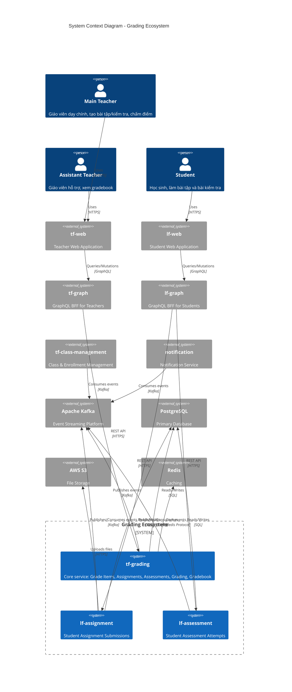
```mermaid
C4Context
    title System Context Diagram - Grading Ecosystem

    Person(mainTeacher, "Main Teacher", "Giáo viên dạy chính, tạo bài tập/kiểm tra, chấm điểm")
    Person(assistantTeacher, "Assistant Teacher", "Giáo viên hỗ trợ, xem gradebook")
    Person(student, "Student", "Học sinh, làm bài tập và bài kiểm tra")

    System_Boundary(grading_ecosystem, "Grading Ecosystem") {
        System(tf_grading, "tf-grading", "Core service: Grade Items, Assignments, Assessments, Grading, Gradebook")
        System(lf_assignment, "lf-assignment", "Student Assignment Submissions")
        System(lf_assessment, "lf-assessment", "Student Assessment Attempts")
    }

    System_Ext(tf_web, "tf-web", "Teacher Web Application")
    System_Ext(lf_web, "lf-web", "Student Web Application")
    System_Ext(tf_graph, "tf-graph", "GraphQL BFF for Teachers")
    System_Ext(lf_graph, "lf-graph", "GraphQL BFF for Students")
    System_Ext(tf_class_mgmt, "tf-class-management", "Class & Enrollment Management")
    System_Ext(notification, "notification", "Notification Service")
    System_Ext(kafka, "Apache Kafka", "Event Streaming Platform")
    System_Ext(postgres, "PostgreSQL", "Primary Database")
    System_Ext(s3, "AWS S3", "File Storage")
    System_Ext(redis, "Redis", "Caching")

    Rel(mainTeacher, tf_web, "Uses", "HTTPS")
    Rel(assistantTeacher, tf_web, "Uses", "HTTPS")
    Rel(student, lf_web, "Uses", "HTTPS")

    Rel(tf_web, tf_graph, "Queries/Mutations", "GraphQL")
    Rel(lf_web, lf_graph, "Queries/Mutations", "GraphQL")

    Rel(tf_graph, tf_grading, "REST API", "HTTPS")
    Rel(lf_graph, lf_assignment, "REST API", "HTTPS")
    Rel(lf_graph, lf_assessment, "REST API", "HTTPS")

    Rel(tf_grading, kafka, "Publishes events", "Kafka")
    Rel(lf_assignment, kafka, "Publishes/Consumes events", "Kafka")
    Rel(lf_assessment, kafka, "Publishes/Consumes events", "Kafka")
    Rel(tf_class_mgmt, kafka, "Consumes events", "Kafka")
    Rel(notification, kafka, "Consumes events", "Kafka")

    Rel(tf_grading, postgres, "Reads/Writes", "SQL")
    Rel(lf_assignment, postgres, "Reads/Writes", "SQL")
    Rel(lf_assessment, postgres, "Reads/Writes", "SQL")

    Rel(lf_assignment, s3, "Uploads files", "HTTPS")
    Rel(tf_grading, redis, "Caches", "Redis Protocol")

    UpdateLayoutConfig($c4ShapeInRow="3", $c4BoundaryInRow="1")
```

### 2.2 Container Diagram (C4 Level 2)

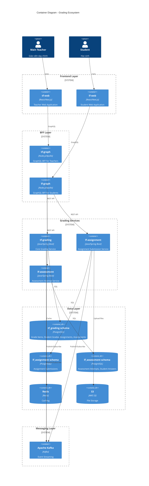
```mermaid
C4Container
    title Container Diagram - Grading Ecosystem

    Person(mainTeacher, "Main Teacher", "Giáo viên dạy chính")
    Person(student, "Student", "Học sinh")

    System_Boundary(frontend, "Frontend Layer") {
        Container(tf_web, "tf-web", "React/Next.js", "Teacher Web Application")
        Container(lf_web, "lf-web", "React/Next.js", "Student Web Application")
    }

    System_Boundary(bff, "BFF Layer") {
        Container(tf_graph, "tf-graph", "Node.js/Apollo", "GraphQL BFF for Teachers")
        Container(lf_graph, "lf-graph", "Node.js/Apollo", "GraphQL BFF for Students")
    }

    System_Boundary(grading_services, "Grading Services") {
        Container(tf_grading, "tf-grading", "Java/Spring Boot", "Core Grading Service")
        Container(lf_assignment, "lf-assignment", "Java/Spring Boot", "Assignment Submission Service")
        Container(lf_assessment, "lf-assessment", "Java/Spring Boot", "Assessment Attempt Service")
    }

    System_Boundary(data, "Data Layer") {
        ContainerDb(tf_grading_db, "tf_grading schema", "PostgreSQL", "Grade Items, Student Grades, Assignments, Assessments")
        ContainerDb(lf_assignment_db, "lf_assignment schema", "PostgreSQL", "Assignment Submissions")
        ContainerDb(lf_assessment_db, "lf_assessment schema", "PostgreSQL", "Assessment Attempts, Student Answers")
        ContainerDb(redis, "Redis", "Redis", "Caching")
        ContainerDb(s3, "S3", "AWS S3", "File Storage")
    }

    System_Boundary(messaging, "Messaging Layer") {
        Container(kafka, "Apache Kafka", "Kafka", "Event Streaming")
    }

    Rel(mainTeacher, tf_web, "Uses")
    Rel(student, lf_web, "Uses")

    Rel(tf_web, tf_graph, "GraphQL")
    Rel(lf_web, lf_graph, "GraphQL")

    Rel(tf_graph, tf_grading, "REST API")
    Rel(lf_graph, lf_assignment, "REST API")
    Rel(lf_graph, lf_assessment, "REST API")

    Rel(tf_grading, tf_grading_db, "SQL")
    Rel(lf_assignment, lf_assignment_db, "SQL")
    Rel(lf_assessment, lf_assessment_db, "SQL")

    Rel(tf_grading, kafka, "Publish/Subscribe")
    Rel(lf_assignment, kafka, "Publish/Subscribe")
    Rel(lf_assessment, kafka, "Publish/Subscribe")

    Rel(lf_assignment, s3, "Upload files")
    Rel(tf_grading, redis, "Cache")

    UpdateLayoutConfig($c4ShapeInRow="3", $c4BoundaryInRow="1")
```

### 2.3 Component Diagram - tf-grading (C4 Level 3)

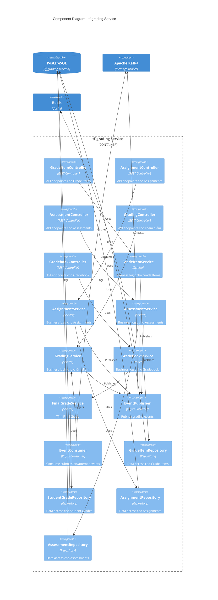
```mermaid
C4Component
    title Component Diagram - tf-grading Service

    Container_Boundary(tf_grading, "tf-grading Service") {
        Component(grade_item_ctrl, "GradeItemController", "REST Controller", "API endpoints cho Grade Items")
        Component(assignment_ctrl, "AssignmentController", "REST Controller", "API endpoints cho Assignments")
        Component(assessment_ctrl, "AssessmentController", "REST Controller", "API endpoints cho Assessments")
        Component(grading_ctrl, "GradingController", "REST Controller", "API endpoints cho chấm điểm")
        Component(gradebook_ctrl, "GradebookController", "REST Controller", "API endpoints cho Gradebook")

        Component(grade_item_svc, "GradeItemService", "Service", "Business logic cho Grade Items")
        Component(assignment_svc, "AssignmentService", "Service", "Business logic cho Assignments")
        Component(assessment_svc, "AssessmentService", "Service", "Business logic cho Assessments")
        Component(grading_svc, "GradingService", "Service", "Business logic cho chấm điểm")
        Component(gradebook_svc, "GradebookService", "Service", "Business logic cho Gradebook")
        Component(final_grade_svc, "FinalGradeService", "Service", "Tính Final Grade")

        Component(event_publisher, "EventPublisher", "Kafka Producer", "Publish grading events")
        Component(event_consumer, "EventConsumer", "Kafka Consumer", "Consume submission/attempt events")

        Component(grade_item_repo, "GradeItemRepository", "Repository", "Data access cho Grade Items")
        Component(student_grade_repo, "StudentGradeRepository", "Repository", "Data access cho Student Grades")
        Component(assignment_repo, "AssignmentRepository", "Repository", "Data access cho Assignments")
        Component(assessment_repo, "AssessmentRepository", "Repository", "Data access cho Assessments")
    }

    ContainerDb(db, "PostgreSQL", "tf_grading schema")
    Container(kafka, "Apache Kafka", "Message Broker")
    Container(redis, "Redis", "Cache")

    Rel(grade_item_ctrl, grade_item_svc, "Uses")
    Rel(assignment_ctrl, assignment_svc, "Uses")
    Rel(assessment_ctrl, assessment_svc, "Uses")
    Rel(grading_ctrl, grading_svc, "Uses")
    Rel(gradebook_ctrl, gradebook_svc, "Uses")

    Rel(grade_item_svc, grade_item_repo, "Uses")
    Rel(grading_svc, student_grade_repo, "Uses")
    Rel(assignment_svc, assignment_repo, "Uses")
    Rel(assessment_svc, assessment_repo, "Uses")
    Rel(gradebook_svc, final_grade_svc, "Uses")

    Rel(grade_item_svc, event_publisher, "Publishes")
    Rel(assignment_svc, event_publisher, "Publishes")
    Rel(assessment_svc, event_publisher, "Publishes")
    Rel(grading_svc, event_publisher, "Publishes")

    Rel(event_consumer, grading_svc, "Triggers")

    Rel(grade_item_repo, db, "SQL")
    Rel(student_grade_repo, db, "SQL")
    Rel(assignment_repo, db, "SQL")
    Rel(assessment_repo, db, "SQL")

    Rel(event_publisher, kafka, "Publishes")
    Rel(event_consumer, kafka, "Consumes")
    Rel(gradebook_svc, redis, "Caches")

    UpdateLayoutConfig($c4ShapeInRow="4", $c4BoundaryInRow="1")
```

### 2.4 Data Flow Overview

```
┌─────────────────────────────────────────────────────────────────────────────────────────────────────┐
│                                    DATA FLOW - GRADING ECOSYSTEM                                      │
├─────────────────────────────────────────────────────────────────────────────────────────────────────┤
│                                                                                                      │
│   [TEACHER FLOW]                                                                                    │
│   ──────────────                                                                                    │
│                                                                                                      │
│   Main Teacher ──► tf-web ──► tf-graph ──► tf-grading                                              │
│       │                                        │                                                    │
│       │  1. Create Grade Items                 ├──► tf_grading.grade_item                          │
│       │  2. Create Assignment                  ├──► tf_grading.assignment                          │
│       │  3. Create Assessment + Questions      ├──► tf_grading.assessment                          │
│       │  4. Publish Assignment/Assessment      │        └──► tf_grading.assessment_question        │
│       │                                        │                                                    │
│       │                                        ▼                                                    │
│       │                              ┌─────────────────┐                                            │
│       │                              │  Kafka Events   │                                            │
│       │                              │  (Publish)      │                                            │
│       │                              └────────┬────────┘                                            │
│       │                                       │                                                     │
│       │                    ┌──────────────────┼──────────────────┐                                  │
│       │                    ▼                  ▼                  ▼                                  │
│       │            lf-assignment        lf-assessment      notification                             │
│       │            (Receive Assignment) (Receive Assessment) (Notify Students)                     │
│       │                                                                                             │
│   ═══════════════════════════════════════════════════════════════════════════════════════════════  │
│                                                                                                      │
│   [STUDENT FLOW]                                                                                    │
│   ──────────────                                                                                    │
│                                                                                                      │
│   Student ──► lf-web ──► lf-graph ──┬──► lf-assignment                                             │
│       │                              │       │                                                      │
│       │  1. View Assignments         │       ├──► Upload file to S3                                │
│       │  2. Submit (file/link)       │       ├──► lf_assignment.assignment_submission              │
│       │                              │       │                                                      │
│       │                              │       ▼                                                      │
│       │                              │   ┌─────────────────┐                                        │
│       │                              │   │  Kafka Event    │                                        │
│       │                              │   │  (Submission    │                                        │
│       │                              │   │   Received)     │                                        │
│       │                              │   └────────┬────────┘                                        │
│       │                              │            │                                                 │
│       │                              │            ▼                                                 │
│       │                              │      tf-grading                                              │
│       │                              │      (Update submission metadata)                            │
│       │                              │                                                              │
│       │                              └──► lf-assessment                                             │
│       │                                      │                                                      │
│       │  3. Start Assessment                 ├──► lf_assessment.assessment_attempt                 │
│       │  4. Answer Questions                 ├──► lf_assessment.student_answer                     │
│       │  5. Submit Attempt                   │                                                      │
│       │                                      ▼                                                      │
│       │                              ┌─────────────────┐                                            │
│       │                              │  Auto-Grading   │                                            │
│       │                              │  (MCQ, T/F)     │                                            │
│       │                              └────────┬────────┘                                            │
│       │                                       │                                                     │
│       │                                       ▼                                                     │
│       │                              ┌─────────────────┐                                            │
│       │                              │  Kafka Event    │                                            │
│       │                              │  (Assessment    │                                            │
│       │                              │   Completed)    │                                            │
│       │                              └────────┬────────┘                                            │
│       │                                       │                                                     │
│       │                                       ▼                                                     │
│       │                                 tf-grading                                                  │
│       │                                 (Receive auto-grade scores)                                 │
│                                                                                                      │
│   ═══════════════════════════════════════════════════════════════════════════════════════════════  │
│                                                                                                      │
│   [GRADING & RELEASE FLOW]                                                                          │
│   ────────────────────────                                                                          │
│                                                                                                      │
│   Main Teacher ──► tf-web ──► tf-graph ──► tf-grading                                              │
│       │                                        │                                                    │
│       │  1. View Pending Reviews               ├──► Query submissions needing manual grading       │
│       │  2. Grade manually                     ├──► tf_grading.student_grade                       │
│       │  3. Add feedback                       │                                                    │
│       │  4. Release Grades                     │                                                    │
│       │                                        ▼                                                    │
│       │                              ┌─────────────────┐                                            │
│       │                              │  Kafka Event    │                                            │
│       │                              │  (Grades        │                                            │
│       │                              │   Released)     │                                            │
│       │                              └────────┬────────┘                                            │
│       │                                       │                                                     │
│       │                    ┌──────────────────┼──────────────────┐                                  │
│       │                    ▼                  ▼                  ▼                                  │
│       │            lf-assignment        lf-assessment      notification                             │
│       │            (Mark released)      (Mark released)    (Notify: Grades available)              │
│                                                                                                      │
│   ═══════════════════════════════════════════════════════════════════════════════════════════════  │
│                                                                                                      │
│   [FINAL GRADE FLOW]                                                                                │
│   ──────────────────                                                                                │
│                                                                                                      │
│   System (Class COMPLETED trigger)                                                                  │
│       │                                                                                             │
│       ▼                                                                                             │
│   tf-grading                                                                                        │
│       │                                                                                             │
│       │  1. Get all Grade Items for Class                                                          │
│       │  2. Get all Student Grades                                                                 │
│       │  3. Calculate Weighted Average per Student                                                 │
│       │                                                                                             │
│       ▼                                                                                             │
│   ┌─────────────────┐                                                                               │
│   │  Kafka Event    │                                                                               │
│   │  (Final Grade   │                                                                               │
│   │   Synced)       │                                                                               │
│   └────────┬────────┘                                                                               │
│            │                                                                                        │
│            ▼                                                                                        │
│   tf-class-management                                                                               │
│   (Update enrollment.final_grade)                                                                   │
│                                                                                                      │
└─────────────────────────────────────────────────────────────────────────────────────────────────────┘
```

---

## 3. Core Business Workflows

### 3.1 Sequence Diagrams

#### 3.1.1 Luồng tạo Grade Items

**Actor:** Main Teacher
**Precondition:** Class ở trạng thái ACTIVATED hoặc IN_PROGRESS
**Description:** Teacher tạo các hạng mục điểm (Grade Items) cho lớp học

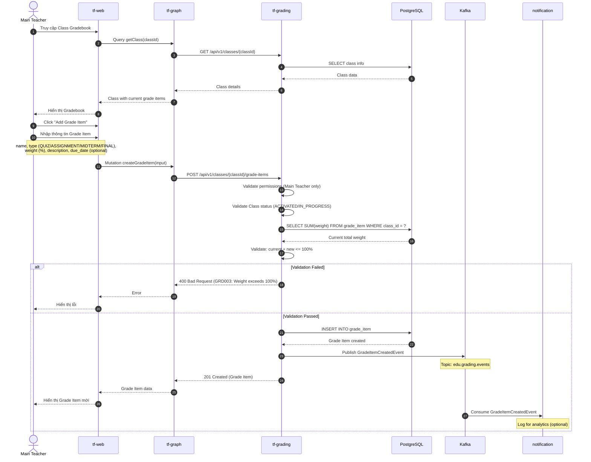
```mermaid
sequenceDiagram
    autonumber
    actor Teacher as Main Teacher
    participant TFWeb as tf-web
    participant TFGraph as tf-graph
    participant TFGrading as tf-grading
    participant DB as PostgreSQL
    participant Kafka as Kafka
    participant Notif as notification

    Teacher->>TFWeb: Truy cập Class Gradebook
    TFWeb->>TFGraph: Query getClass(classId)
    TFGraph->>TFGrading: GET /api/v1/classes/{classId}
    TFGrading->>DB: SELECT class info
    DB-->>TFGrading: Class data
    TFGrading-->>TFGraph: Class details
    TFGraph-->>TFWeb: Class with current grade items
    TFWeb-->>Teacher: Hiển thị Gradebook

    Teacher->>TFWeb: Click "Add Grade Item"
    Teacher->>TFWeb: Nhập thông tin Grade Item
    Note over Teacher,TFWeb: name, type (QUIZ/ASSIGNMENT/MIDTERM/FINAL),<br/>weight (%), description, due_date (optional)

    TFWeb->>TFGraph: Mutation createGradeItem(input)
    TFGraph->>TFGrading: POST /api/v1/classes/{classId}/grade-items

    TFGrading->>TFGrading: Validate permissions (Main Teacher only)
    TFGrading->>TFGrading: Validate Class status (ACTIVATED/IN_PROGRESS)
    TFGrading->>DB: SELECT SUM(weight) FROM grade_item WHERE class_id = ?
    DB-->>TFGrading: Current total weight
    TFGrading->>TFGrading: Validate: current + new <= 100%

    alt Validation Failed
        TFGrading-->>TFGraph: 400 Bad Request (GRD003: Weight exceeds 100%)
        TFGraph-->>TFWeb: Error
        TFWeb-->>Teacher: Hiển thị lỗi
    else Validation Passed
        TFGrading->>DB: INSERT INTO grade_item
        DB-->>TFGrading: Grade Item created

        TFGrading->>Kafka: Publish GradeItemCreatedEvent
        Note over Kafka: Topic: edu.grading.events

        TFGrading-->>TFGraph: 201 Created (Grade Item)
        TFGraph-->>TFWeb: Grade Item data
        TFWeb-->>Teacher: Hiển thị Grade Item mới

        Kafka->>Notif: Consume GradeItemCreatedEvent
        Note over Notif: Log for analytics (optional)
    end
```

**Business Rules:**
- Chỉ Main Teacher được tạo Grade Items
- Class phải ở trạng thái ACTIVATED hoặc IN_PROGRESS
- Tổng weight của tất cả Grade Items không được vượt quá 100%
- Grade Item được tạo với status = DRAFT

---

#### 3.1.2 Luồng giao Assignment (Bài tập)

**Actor:** Main Teacher
**Precondition:** Grade Item đã được tạo
**Description:** Teacher tạo và publish Assignment để Student làm bài

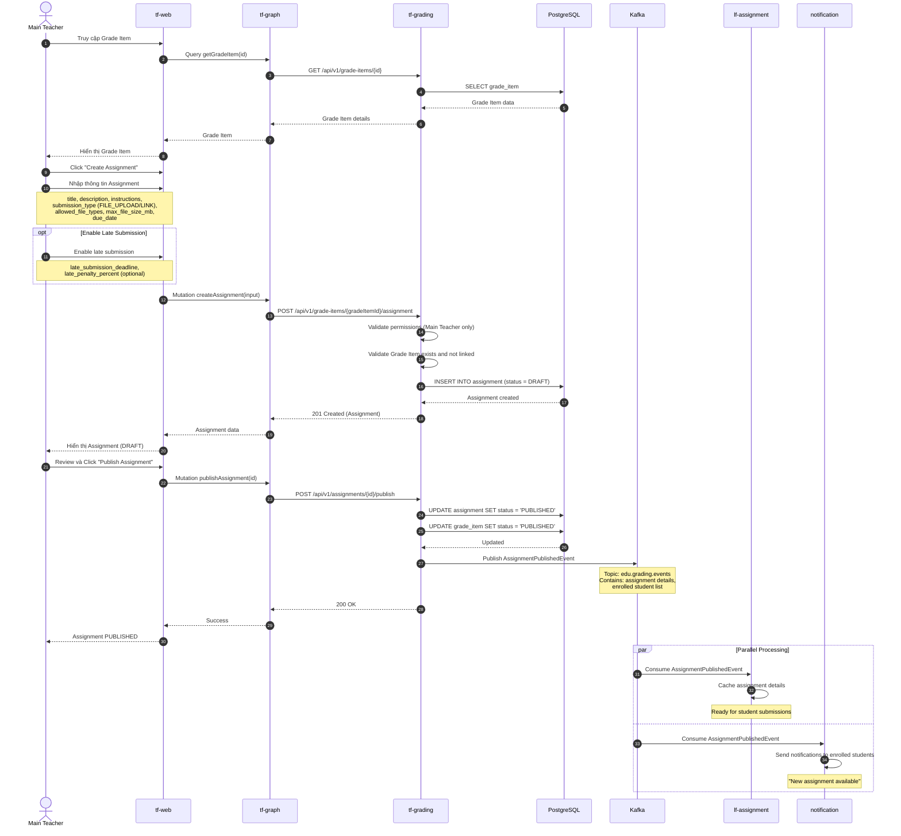
```mermaid
sequenceDiagram
    autonumber
    actor Teacher as Main Teacher
    participant TFWeb as tf-web
    participant TFGraph as tf-graph
    participant TFGrading as tf-grading
    participant DB as PostgreSQL
    participant Kafka as Kafka
    participant LFAssign as lf-assignment
    participant Notif as notification

    Teacher->>TFWeb: Truy cập Grade Item
    TFWeb->>TFGraph: Query getGradeItem(id)
    TFGraph->>TFGrading: GET /api/v1/grade-items/{id}
    TFGrading->>DB: SELECT grade_item
    DB-->>TFGrading: Grade Item data
    TFGrading-->>TFGraph: Grade Item details
    TFGraph-->>TFWeb: Grade Item
    TFWeb-->>Teacher: Hiển thị Grade Item

    Teacher->>TFWeb: Click "Create Assignment"
    Teacher->>TFWeb: Nhập thông tin Assignment
    Note over Teacher,TFWeb: title, description, instructions,<br/>submission_type (FILE_UPLOAD/LINK),<br/>allowed_file_types, max_file_size_mb,<br/>due_date

    opt Enable Late Submission
        Teacher->>TFWeb: Enable late submission
        Note over Teacher,TFWeb: late_submission_deadline,<br/>late_penalty_percent (optional)
    end

    TFWeb->>TFGraph: Mutation createAssignment(input)
    TFGraph->>TFGrading: POST /api/v1/grade-items/{gradeItemId}/assignment

    TFGrading->>TFGrading: Validate permissions (Main Teacher only)
    TFGrading->>TFGrading: Validate Grade Item exists and not linked
    TFGrading->>DB: INSERT INTO assignment (status = DRAFT)
    DB-->>TFGrading: Assignment created
    TFGrading-->>TFGraph: 201 Created (Assignment)
    TFGraph-->>TFWeb: Assignment data
    TFWeb-->>Teacher: Hiển thị Assignment (DRAFT)

    Teacher->>TFWeb: Review và Click "Publish Assignment"
    TFWeb->>TFGraph: Mutation publishAssignment(id)
    TFGraph->>TFGrading: POST /api/v1/assignments/{id}/publish

    TFGrading->>DB: UPDATE assignment SET status = 'PUBLISHED'
    TFGrading->>DB: UPDATE grade_item SET status = 'PUBLISHED'
    DB-->>TFGrading: Updated

    TFGrading->>Kafka: Publish AssignmentPublishedEvent
    Note over Kafka: Topic: edu.grading.events<br/>Contains: assignment details,<br/>enrolled student list

    TFGrading-->>TFGraph: 200 OK
    TFGraph-->>TFWeb: Success
    TFWeb-->>Teacher: Assignment PUBLISHED

    par Parallel Processing
        Kafka->>LFAssign: Consume AssignmentPublishedEvent
        LFAssign->>LFAssign: Cache assignment details
        Note over LFAssign: Ready for student submissions
    and
        Kafka->>Notif: Consume AssignmentPublishedEvent
        Notif->>Notif: Send notifications to enrolled students
        Note over Notif: "New assignment available"
    end
```

**Business Rules:**
- Assignment phải link với một Grade Item
- Một Grade Item chỉ có thể link với một Assignment HOẶC một Assessment
- submission_type: FILE_UPLOAD hoặc LINK
- FILE_UPLOAD: Cần set allowed_file_types và max_file_size_mb
- Late submission: Teacher quyết định có cho phép nộp muộn hay không

---

#### 3.1.3 Luồng Student nộp Assignment

**Actor:** Student
**Precondition:** Assignment đã được PUBLISHED, Student đã enrolled trong Class
**Description:** Student nộp bài tập (file upload hoặc link)

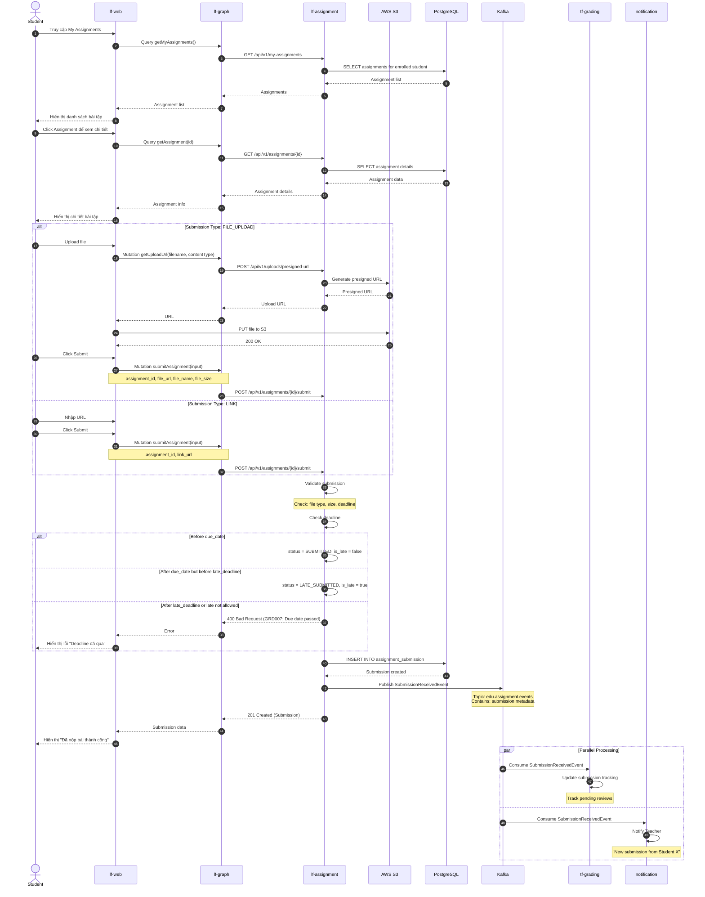
```mermaid
sequenceDiagram
    autonumber
    actor Student as Student
    participant LFWeb as lf-web
    participant LFGraph as lf-graph
    participant LFAssign as lf-assignment
    participant S3 as AWS S3
    participant DB as PostgreSQL
    participant Kafka as Kafka
    participant TFGrading as tf-grading
    participant Notif as notification

    Student->>LFWeb: Truy cập My Assignments
    LFWeb->>LFGraph: Query getMyAssignments()
    LFGraph->>LFAssign: GET /api/v1/my-assignments
    LFAssign->>DB: SELECT assignments for enrolled student
    DB-->>LFAssign: Assignment list
    LFAssign-->>LFGraph: Assignments
    LFGraph-->>LFWeb: Assignment list
    LFWeb-->>Student: Hiển thị danh sách bài tập

    Student->>LFWeb: Click Assignment để xem chi tiết
    LFWeb->>LFGraph: Query getAssignment(id)
    LFGraph->>LFAssign: GET /api/v1/assignments/{id}
    LFAssign->>DB: SELECT assignment details
    DB-->>LFAssign: Assignment data
    LFAssign-->>LFGraph: Assignment details
    LFGraph-->>LFWeb: Assignment info
    LFWeb-->>Student: Hiển thị chi tiết bài tập

    alt Submission Type: FILE_UPLOAD
        Student->>LFWeb: Upload file
        LFWeb->>LFGraph: Mutation getUploadUrl(filename, contentType)
        LFGraph->>LFAssign: POST /api/v1/uploads/presigned-url
        LFAssign->>S3: Generate presigned URL
        S3-->>LFAssign: Presigned URL
        LFAssign-->>LFGraph: Upload URL
        LFGraph-->>LFWeb: URL
        LFWeb->>S3: PUT file to S3
        S3-->>LFWeb: 200 OK

        Student->>LFWeb: Click Submit
        LFWeb->>LFGraph: Mutation submitAssignment(input)
        Note over LFWeb,LFGraph: assignment_id, file_url, file_name, file_size
        LFGraph->>LFAssign: POST /api/v1/assignments/{id}/submit
    else Submission Type: LINK
        Student->>LFWeb: Nhập URL
        Student->>LFWeb: Click Submit
        LFWeb->>LFGraph: Mutation submitAssignment(input)
        Note over LFWeb,LFGraph: assignment_id, link_url
        LFGraph->>LFAssign: POST /api/v1/assignments/{id}/submit
    end

    LFAssign->>LFAssign: Validate submission
    Note over LFAssign: Check: file type, size, deadline

    LFAssign->>LFAssign: Check deadline
    alt Before due_date
        LFAssign->>LFAssign: status = SUBMITTED, is_late = false
    else After due_date but before late_deadline
        LFAssign->>LFAssign: status = LATE_SUBMITTED, is_late = true
    else After late_deadline or late not allowed
        LFAssign-->>LFGraph: 400 Bad Request (GRD007: Due date passed)
        LFGraph-->>LFWeb: Error
        LFWeb-->>Student: Hiển thị lỗi "Deadline đã qua"
    end

    LFAssign->>DB: INSERT INTO assignment_submission
    DB-->>LFAssign: Submission created

    LFAssign->>Kafka: Publish SubmissionReceivedEvent
    Note over Kafka: Topic: edu.assignment.events<br/>Contains: submission metadata

    LFAssign-->>LFGraph: 201 Created (Submission)
    LFGraph-->>LFWeb: Submission data
    LFWeb-->>Student: Hiển thị "Đã nộp bài thành công"

    par Parallel Processing
        Kafka->>TFGrading: Consume SubmissionReceivedEvent
        TFGrading->>TFGrading: Update submission tracking
        Note over TFGrading: Track pending reviews
    and
        Kafka->>Notif: Consume SubmissionReceivedEvent
        Notif->>Notif: Notify Teacher
        Note over Notif: "New submission from Student X"
    end
```

**Business Rules:**
- Student chỉ có thể submit nếu đã enrolled trong Class
- FILE_UPLOAD: File phải đúng loại cho phép và không vượt quá max size
- Deadline check:
  - Trước due_date: SUBMITTED (is_late = false)
  - Sau due_date nhưng trước late_deadline (nếu có): LATE_SUBMITTED (is_late = true)
  - Sau late_deadline hoặc không cho phép late: Từ chối
- Student có thể update submission trước khi bị graded

---

#### 3.1.4 Luồng giao Assessment (Bài kiểm tra)

**Actor:** Main Teacher
**Precondition:** Grade Item đã được tạo
**Description:** Teacher tạo bài kiểm tra với các câu hỏi và publish

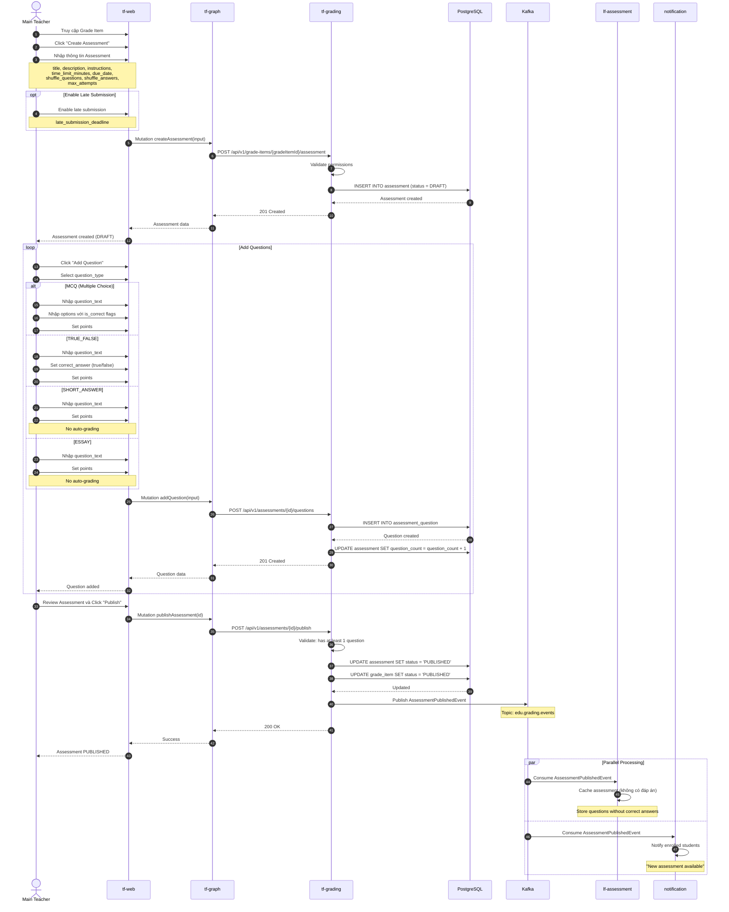
```mermaid
sequenceDiagram
    autonumber
    actor Teacher as Main Teacher
    participant TFWeb as tf-web
    participant TFGraph as tf-graph
    participant TFGrading as tf-grading
    participant DB as PostgreSQL
    participant Kafka as Kafka
    participant LFAssess as lf-assessment
    participant Notif as notification

    Teacher->>TFWeb: Truy cập Grade Item
    Teacher->>TFWeb: Click "Create Assessment"
    Teacher->>TFWeb: Nhập thông tin Assessment
    Note over Teacher,TFWeb: title, description, instructions,<br/>time_limit_minutes, due_date,<br/>shuffle_questions, shuffle_answers,<br/>max_attempts

    opt Enable Late Submission
        Teacher->>TFWeb: Enable late submission
        Note over Teacher,TFWeb: late_submission_deadline
    end

    TFWeb->>TFGraph: Mutation createAssessment(input)
    TFGraph->>TFGrading: POST /api/v1/grade-items/{gradeItemId}/assessment

    TFGrading->>TFGrading: Validate permissions
    TFGrading->>DB: INSERT INTO assessment (status = DRAFT)
    DB-->>TFGrading: Assessment created
    TFGrading-->>TFGraph: 201 Created
    TFGraph-->>TFWeb: Assessment data
    TFWeb-->>Teacher: Assessment created (DRAFT)

    loop Add Questions
        Teacher->>TFWeb: Click "Add Question"
        Teacher->>TFWeb: Select question_type

        alt MCQ (Multiple Choice)
            Teacher->>TFWeb: Nhập question_text
            Teacher->>TFWeb: Nhập options với is_correct flags
            Teacher->>TFWeb: Set points
        else TRUE_FALSE
            Teacher->>TFWeb: Nhập question_text
            Teacher->>TFWeb: Set correct_answer (true/false)
            Teacher->>TFWeb: Set points
        else SHORT_ANSWER
            Teacher->>TFWeb: Nhập question_text
            Teacher->>TFWeb: Set points
            Note over Teacher,TFWeb: No auto-grading
        else ESSAY
            Teacher->>TFWeb: Nhập question_text
            Teacher->>TFWeb: Set points
            Note over Teacher,TFWeb: No auto-grading
        end

        TFWeb->>TFGraph: Mutation addQuestion(input)
        TFGraph->>TFGrading: POST /api/v1/assessments/{id}/questions
        TFGrading->>DB: INSERT INTO assessment_question
        DB-->>TFGrading: Question created
        TFGrading->>DB: UPDATE assessment SET question_count = question_count + 1
        TFGrading-->>TFGraph: 201 Created
        TFGraph-->>TFWeb: Question data
        TFWeb-->>Teacher: Question added
    end

    Teacher->>TFWeb: Review Assessment và Click "Publish"
    TFWeb->>TFGraph: Mutation publishAssessment(id)
    TFGraph->>TFGrading: POST /api/v1/assessments/{id}/publish

    TFGrading->>TFGrading: Validate: has at least 1 question
    TFGrading->>DB: UPDATE assessment SET status = 'PUBLISHED'
    TFGrading->>DB: UPDATE grade_item SET status = 'PUBLISHED'
    DB-->>TFGrading: Updated

    TFGrading->>Kafka: Publish AssessmentPublishedEvent
    Note over Kafka: Topic: edu.grading.events

    TFGrading-->>TFGraph: 200 OK
    TFGraph-->>TFWeb: Success
    TFWeb-->>Teacher: Assessment PUBLISHED

    par Parallel Processing
        Kafka->>LFAssess: Consume AssessmentPublishedEvent
        LFAssess->>LFAssess: Cache assessment (không có đáp án)
        Note over LFAssess: Store questions without correct answers
    and
        Kafka->>Notif: Consume AssessmentPublishedEvent
        Notif->>Notif: Notify enrolled students
        Note over Notif: "New assessment available"
    end
```

**Business Rules:**
- Assessment phải có ít nhất 1 câu hỏi trước khi publish
- MCQ và TRUE_FALSE: Phải có correct answer để auto-grading
- SHORT_ANSWER và ESSAY: Manual grading
- time_limit_minutes: Thời gian làm bài (0 = không giới hạn)
- max_attempts: Số lần làm bài tối đa (default = 1)

---

#### 3.1.5 Luồng Student làm Assessment

**Actor:** Student
**Precondition:** Assessment đã PUBLISHED, Student đã enrolled
**Description:** Student làm bài kiểm tra và nhận auto-grade cho MCQ/True-False

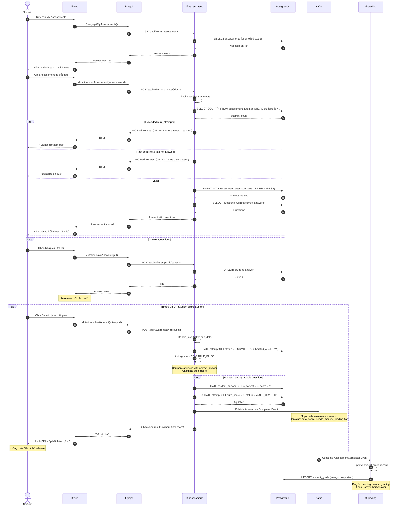
```mermaid
sequenceDiagram
    autonumber
    actor Student as Student
    participant LFWeb as lf-web
    participant LFGraph as lf-graph
    participant LFAssess as lf-assessment
    participant DB as PostgreSQL
    participant Kafka as Kafka
    participant TFGrading as tf-grading

    Student->>LFWeb: Truy cập My Assessments
    LFWeb->>LFGraph: Query getMyAssessments()
    LFGraph->>LFAssess: GET /api/v1/my-assessments
    LFAssess->>DB: SELECT assessments for enrolled student
    DB-->>LFAssess: Assessment list
    LFAssess-->>LFGraph: Assessments
    LFGraph-->>LFWeb: Assessment list
    LFWeb-->>Student: Hiển thị danh sách bài kiểm tra

    Student->>LFWeb: Click Assessment để bắt đầu
    LFWeb->>LFGraph: Mutation startAssessment(assessmentId)
    LFGraph->>LFAssess: POST /api/v1/assessments/{id}/start

    LFAssess->>LFAssess: Check deadline & attempts
    LFAssess->>DB: SELECT COUNT(*) FROM assessment_attempt WHERE student_id = ?
    DB-->>LFAssess: attempt_count

    alt Exceeded max_attempts
        LFAssess-->>LFGraph: 400 Bad Request (GRD006: Max attempts reached)
        LFGraph-->>LFWeb: Error
        LFWeb-->>Student: "Đã hết lượt làm bài"
    else Past deadline & late not allowed
        LFAssess-->>LFGraph: 400 Bad Request (GRD007: Due date passed)
        LFGraph-->>LFWeb: Error
        LFWeb-->>Student: "Deadline đã qua"
    else Valid
        LFAssess->>DB: INSERT INTO assessment_attempt (status = IN_PROGRESS)
        DB-->>LFAssess: Attempt created
        LFAssess->>DB: SELECT questions (without correct answers)
        DB-->>LFAssess: Questions
        LFAssess-->>LFGraph: Attempt with questions
        LFGraph-->>LFWeb: Assessment started
        LFWeb-->>Student: Hiển thị câu hỏi (timer bắt đầu)
    end

    loop Answer Questions
        Student->>LFWeb: Chọn/Nhập câu trả lời
        LFWeb->>LFGraph: Mutation saveAnswer(input)
        LFGraph->>LFAssess: POST /api/v1/attempts/{id}/answer
        LFAssess->>DB: UPSERT student_answer
        DB-->>LFAssess: Saved
        LFAssess-->>LFGraph: OK
        LFGraph-->>LFWeb: Answer saved
        Note over LFWeb: Auto-save mỗi câu trả lời
    end

    alt Time's up OR Student clicks Submit
        Student->>LFWeb: Click Submit (hoặc hết giờ)
        LFWeb->>LFGraph: Mutation submitAttempt(attemptId)
        LFGraph->>LFAssess: POST /api/v1/attempts/{id}/submit

        LFAssess->>LFAssess: Mark is_late if after due_date
        LFAssess->>DB: UPDATE attempt SET status = 'SUBMITTED', submitted_at = NOW()

        LFAssess->>LFAssess: Auto-grade MCQ & TRUE_FALSE
        Note over LFAssess: Compare answers with correct_answer<br/>Calculate auto_score

        loop For each auto-gradable question
            LFAssess->>DB: UPDATE student_answer SET is_correct = ?, score = ?
        end

        LFAssess->>DB: UPDATE attempt SET auto_score = ?, status = 'AUTO_GRADED'
        DB-->>LFAssess: Updated

        LFAssess->>Kafka: Publish AssessmentCompletedEvent
        Note over Kafka: Topic: edu.assessment.events<br/>Contains: auto_score, needs_manual_grading flag

        LFAssess-->>LFGraph: Submission result (without final score)
        LFGraph-->>LFWeb: "Đã nộp bài"
        LFWeb-->>Student: Hiển thị "Đã nộp bài thành công"
        Note over Student: Không thấy điểm (chờ release)
    end

    Kafka->>TFGrading: Consume AssessmentCompletedEvent
    TFGrading->>TFGrading: Update student grade record
    TFGrading->>DB: UPSERT student_grade (auto_score portion)
    Note over TFGrading: Flag for pending manual grading<br/>if has Essay/Short Answer
```

**Business Rules:**
- Student không thể vượt quá max_attempts
- Timer bắt đầu khi start attempt
- Auto-save mỗi câu trả lời để tránh mất dữ liệu
- Khi hết giờ: Tự động submit
- Auto-grading ngay lập tức cho MCQ và TRUE_FALSE
- Essay và SHORT_ANSWER: Chờ Teacher manual grading
- Student KHÔNG thấy điểm sau khi submit (chờ Teacher release)

---

#### 3.1.6 Luồng Teacher chấm điểm Manual

**Actor:** Main Teacher
**Precondition:** Có submissions/attempts cần manual grading
**Description:** Teacher review và chấm điểm thủ công

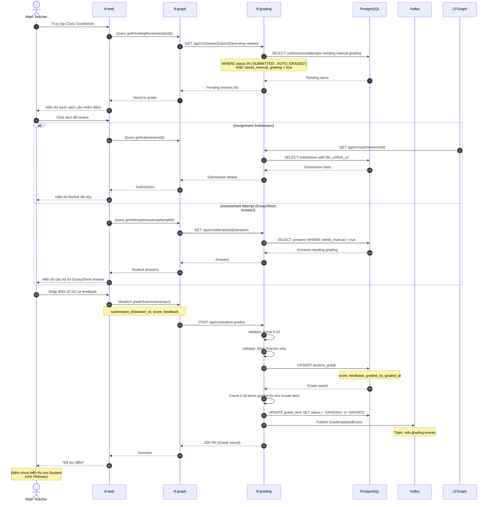
```mermaid
sequenceDiagram
    autonumber
    actor Teacher as Main Teacher
    participant TFWeb as tf-web
    participant TFGraph as tf-graph
    participant TFGrading as tf-grading
    participant DB as PostgreSQL
    participant Kafka as Kafka

    Teacher->>TFWeb: Truy cập Class Gradebook
    TFWeb->>TFGraph: Query getPendingReviews(classId)
    TFGraph->>TFGrading: GET /api/v1/classes/{classId}/pending-reviews

    TFGrading->>DB: SELECT submissions/attempts needing manual grading
    Note over TFGrading: WHERE status IN ('SUBMITTED', 'AUTO_GRADED')<br/>AND needs_manual_grading = true
    DB-->>TFGrading: Pending items
    TFGrading-->>TFGraph: Pending reviews list
    TFGraph-->>TFWeb: Items to grade
    TFWeb-->>Teacher: Hiển thị danh sách cần chấm điểm

    Teacher->>TFWeb: Click item để review

    alt Assignment Submission
        TFWeb->>TFGraph: Query getSubmission(id)
        LFGraph->>TFGrading: GET /api/v1/submissions/{id}
        TFGrading->>DB: SELECT submission with file_url/link_url
        DB-->>TFGrading: Submission data
        TFGrading-->>TFGraph: Submission details
        TFGraph-->>TFWeb: Submission
        TFWeb-->>Teacher: Hiển thị file/link đã nộp
    else Assessment Attempt (Essay/Short Answer)
        TFWeb->>TFGraph: Query getAttemptAnswers(attemptId)
        TFGraph->>TFGrading: GET /api/v1/attempts/{id}/answers
        TFGrading->>DB: SELECT answers WHERE needs_manual = true
        DB-->>TFGrading: Answers needing grading
        TFGrading-->>TFGraph: Answers
        TFGraph-->>TFWeb: Student answers
        TFWeb-->>Teacher: Hiển thị câu trả lời Essay/Short Answer
    end

    Teacher->>TFWeb: Nhập điểm (0-10) và feedback
    TFWeb->>TFGraph: Mutation gradeSubmission(input)
    Note over TFWeb,TFGraph: submission_id/answer_id, score, feedback
    TFGraph->>TFGrading: POST /api/v1/student-grades

    TFGrading->>TFGrading: Validate: score 0-10
    TFGrading->>TFGrading: Validate: Main Teacher only

    TFGrading->>DB: UPSERT student_grade
    Note over DB: score, feedback, graded_by, graded_at
    DB-->>TFGrading: Grade saved

    TFGrading->>TFGrading: Check if all items graded for this Grade Item
    TFGrading->>DB: UPDATE grade_item SET status = 'GRADING' or 'GRADED'

    TFGrading->>Kafka: Publish GradeUpdatedEvent
    Note over Kafka: Topic: edu.grading.events

    TFGrading-->>TFGraph: 200 OK (Grade saved)
    TFGraph-->>TFWeb: Success
    TFWeb-->>Teacher: "Đã lưu điểm"
    Note over Teacher: Điểm chưa hiển thị cho Student<br/>(chờ Release)
```

**Business Rules:**
- Chỉ Main Teacher được chấm điểm
- Score phải trong khoảng 0-10
- Có thể thêm feedback text
- Grade được lưu nhưng chưa hiển thị cho Student
- Grade Item status cập nhật: GRADING (đang chấm) → GRADED (đã chấm hết)

---

#### 3.1.7 Luồng Release Grades

**Actor:** Main Teacher
**Precondition:** Có grades đã được chấm nhưng chưa release
**Description:** Teacher release grades để Student có thể xem

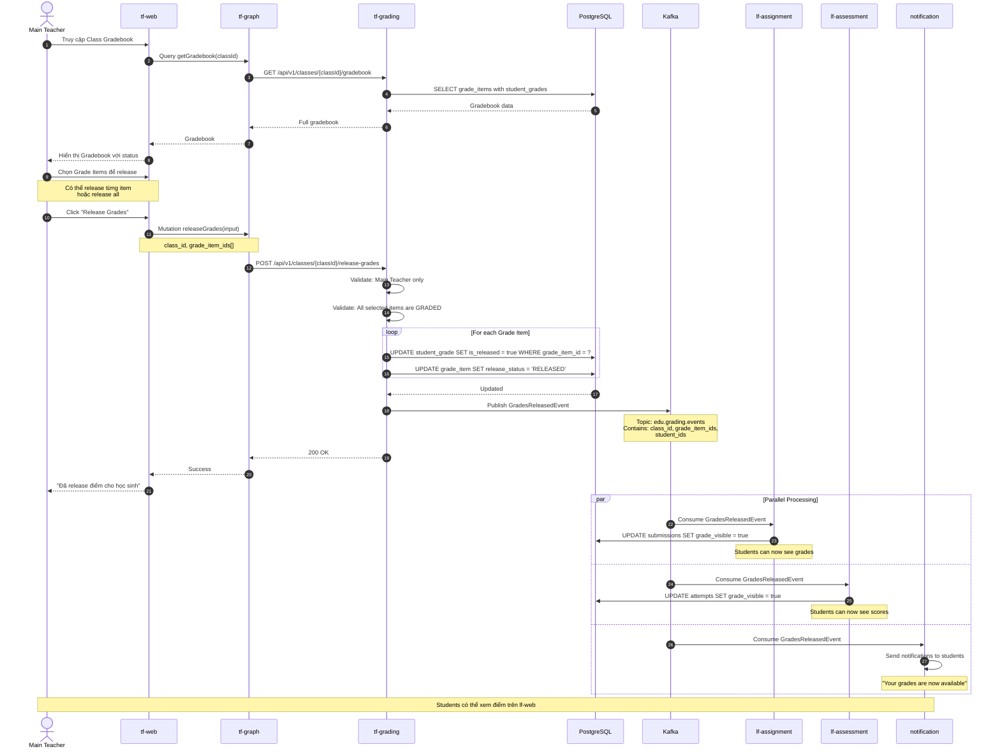
```mermaid
sequenceDiagram
    autonumber
    actor Teacher as Main Teacher
    participant TFWeb as tf-web
    participant TFGraph as tf-graph
    participant TFGrading as tf-grading
    participant DB as PostgreSQL
    participant Kafka as Kafka
    participant LFAssign as lf-assignment
    participant LFAssess as lf-assessment
    participant Notif as notification

    Teacher->>TFWeb: Truy cập Class Gradebook
    TFWeb->>TFGraph: Query getGradebook(classId)
    TFGraph->>TFGrading: GET /api/v1/classes/{classId}/gradebook
    TFGrading->>DB: SELECT grade_items with student_grades
    DB-->>TFGrading: Gradebook data
    TFGrading-->>TFGraph: Full gradebook
    TFGraph-->>TFWeb: Gradebook
    TFWeb-->>Teacher: Hiển thị Gradebook với status

    Teacher->>TFWeb: Chọn Grade Items để release
    Note over Teacher,TFWeb: Có thể release từng item<br/>hoặc release all

    Teacher->>TFWeb: Click "Release Grades"
    TFWeb->>TFGraph: Mutation releaseGrades(input)
    Note over TFWeb,TFGraph: class_id, grade_item_ids[]
    TFGraph->>TFGrading: POST /api/v1/classes/{classId}/release-grades

    TFGrading->>TFGrading: Validate: Main Teacher only
    TFGrading->>TFGrading: Validate: All selected items are GRADED

    loop For each Grade Item
        TFGrading->>DB: UPDATE student_grade SET is_released = true WHERE grade_item_id = ?
        TFGrading->>DB: UPDATE grade_item SET release_status = 'RELEASED'
    end
    DB-->>TFGrading: Updated

    TFGrading->>Kafka: Publish GradesReleasedEvent
    Note over Kafka: Topic: edu.grading.events<br/>Contains: class_id, grade_item_ids,<br/>student_ids

    TFGrading-->>TFGraph: 200 OK
    TFGraph-->>TFWeb: Success
    TFWeb-->>Teacher: "Đã release điểm cho học sinh"

    par Parallel Processing
        Kafka->>LFAssign: Consume GradesReleasedEvent
        LFAssign->>DB: UPDATE submissions SET grade_visible = true
        Note over LFAssign: Students can now see grades
    and
        Kafka->>LFAssess: Consume GradesReleasedEvent
        LFAssess->>DB: UPDATE attempts SET grade_visible = true
        Note over LFAssess: Students can now see scores
    and
        Kafka->>Notif: Consume GradesReleasedEvent
        Notif->>Notif: Send notifications to students
        Note over Notif: "Your grades are now available"
    end

    Note over Teacher,Notif: Students có thể xem điểm trên lf-web
```

**Business Rules:**
- Chỉ Main Teacher được release grades
- Có thể release từng Grade Item hoặc release all
- Chỉ có thể release Grade Items đã GRADED
- Sau khi release, Student có thể xem điểm và feedback
- Notification được gửi đến Students

---

#### 3.1.8 Luồng tính Final Grade

**Actor:** System
**Trigger:** Class chuyển sang COMPLETED hoặc Teacher trigger thủ công
**Description:** Hệ thống tính điểm tổng kết và sync về tf-class-management

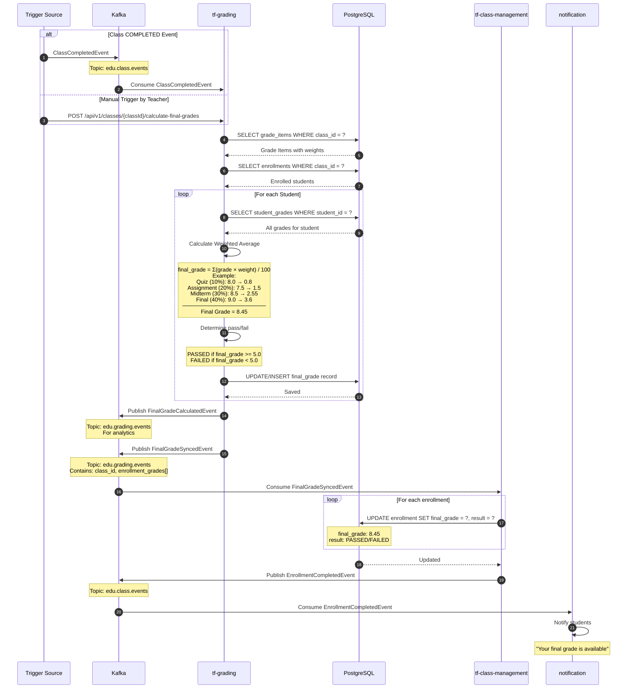
```mermaid
sequenceDiagram
    autonumber
    participant Trigger as Trigger Source
    participant Kafka as Kafka
    participant TFGrading as tf-grading
    participant DB as PostgreSQL
    participant TFClass as tf-class-management
    participant Notif as notification

    alt Class COMPLETED Event
        Trigger->>Kafka: ClassCompletedEvent
        Note over Kafka: Topic: edu.class.events
        Kafka->>TFGrading: Consume ClassCompletedEvent
    else Manual Trigger by Teacher
        Trigger->>TFGrading: POST /api/v1/classes/{classId}/calculate-final-grades
    end

    TFGrading->>DB: SELECT grade_items WHERE class_id = ?
    DB-->>TFGrading: Grade Items with weights

    TFGrading->>DB: SELECT enrollments WHERE class_id = ?
    DB-->>TFGrading: Enrolled students

    loop For each Student
        TFGrading->>DB: SELECT student_grades WHERE student_id = ?
        DB-->>TFGrading: All grades for student

        TFGrading->>TFGrading: Calculate Weighted Average
        Note over TFGrading: final_grade = Σ(grade × weight) / 100<br/>Example:<br/>Quiz (10%): 8.0 → 0.8<br/>Assignment (20%): 7.5 → 1.5<br/>Midterm (30%): 8.5 → 2.55<br/>Final (40%): 9.0 → 3.6<br/>─────────────────────<br/>Final Grade = 8.45

        TFGrading->>TFGrading: Determine pass/fail
        Note over TFGrading: PASSED if final_grade >= 5.0<br/>FAILED if final_grade < 5.0

        TFGrading->>DB: UPDATE/INSERT final_grade record
        DB-->>TFGrading: Saved
    end

    TFGrading->>Kafka: Publish FinalGradeCalculatedEvent
    Note over Kafka: Topic: edu.grading.events<br/>For analytics

    TFGrading->>Kafka: Publish FinalGradeSyncedEvent
    Note over Kafka: Topic: edu.grading.events<br/>Contains: class_id, enrollment_grades[]

    Kafka->>TFClass: Consume FinalGradeSyncedEvent

    loop For each enrollment
        TFClass->>DB: UPDATE enrollment SET final_grade = ?, result = ?
        Note over DB: final_grade: 8.45<br/>result: PASSED/FAILED
    end
    DB-->>TFClass: Updated

    TFClass->>Kafka: Publish EnrollmentCompletedEvent
    Note over Kafka: Topic: edu.class.events

    Kafka->>Notif: Consume EnrollmentCompletedEvent
    Notif->>Notif: Notify students
    Note over Notif: "Your final grade is available"
```

**Business Rules:**
- Final Grade = Weighted Average của tất cả Grade Items
- Pass threshold: 5.0
- result: PASSED (>= 5.0) hoặc FAILED (< 5.0)
- Điểm được làm tròn đến 2 decimal places
- Final Grade được sync về enrollment trong tf-class-management
- Chỉ tính cho các Grade Items đã được graded và released

**Weighted Average Formula:**
```
Final Grade = Σ (Grade Item Score × Weight) / 100

Example:
┌─────────────┬────────┬───────┬─────────────────┐
│ Grade Item  │ Weight │ Score │ Weighted Score  │
├─────────────┼────────┼───────┼─────────────────┤
│ Quiz        │ 10%    │ 8.0   │ 0.80            │
│ Assignment  │ 20%    │ 7.5   │ 1.50            │
│ Midterm     │ 30%    │ 8.5   │ 2.55            │
│ Final       │ 40%    │ 9.0   │ 3.60            │
├─────────────┼────────┼───────┼─────────────────┤
│ TOTAL       │ 100%   │   -   │ 8.45            │
└─────────────┴────────┴───────┴─────────────────┘

Final Grade = 8.45 → PASSED (>= 5.0)
```

---

## 4. State Machine Diagrams

### 4.1 Grade Item State Machine

**Description:** Vòng đời của một Grade Item từ khi tạo đến khi archive

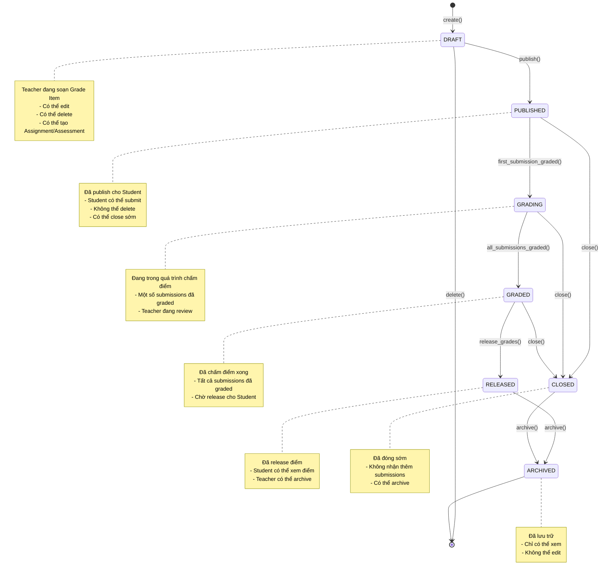
```mermaid
stateDiagram-v2
    [*] --> DRAFT: create()

    DRAFT --> PUBLISHED: publish()
    DRAFT --> [*]: delete()

    PUBLISHED --> GRADING: first_submission_graded()
    PUBLISHED --> CLOSED: close()

    GRADING --> GRADED: all_submissions_graded()
    GRADING --> CLOSED: close()

    GRADED --> RELEASED: release_grades()
    GRADED --> CLOSED: close()

    RELEASED --> ARCHIVED: archive()

    CLOSED --> ARCHIVED: archive()

    ARCHIVED --> [*]

    note right of DRAFT
        Teacher đang soạn Grade Item
        - Có thể edit
        - Có thể delete
        - Có thể tạo Assignment/Assessment
    end note

    note right of PUBLISHED
        Đã publish cho Student
        - Student có thể submit
        - Không thể delete
        - Có thể close sớm
    end note

    note right of GRADING
        Đang trong quá trình chấm điểm
        - Một số submissions đã graded
        - Teacher đang review
    end note

    note right of GRADED
        Đã chấm điểm xong
        - Tất cả submissions đã graded
        - Chờ release cho Student
    end note

    note right of RELEASED
        Đã release điểm
        - Student có thể xem điểm
        - Teacher có thể archive
    end note

    note right of CLOSED
        Đã đóng sớm
        - Không nhận thêm submissions
        - Có thể archive
    end note

    note right of ARCHIVED
        Đã lưu trữ
        - Chỉ có thể xem
        - Không thể edit
    end note
```

**State Definitions:**

| State | Description | Allowed Actions |
|-------|-------------|-----------------|
| **DRAFT** | Grade Item đang được soạn, chưa publish | Edit, Delete, Create Assignment/Assessment, Publish |
| **PUBLISHED** | Đã publish, Student có thể submit | Close, Edit (limited), View submissions |
| **GRADING** | Đang chấm điểm (ít nhất 1 submission đã graded) | Grade, Close, View progress |
| **GRADED** | Tất cả submissions đã được chấm điểm | Release, Close, View gradebook |
| **RELEASED** | Điểm đã được release cho Student xem | Archive |
| **CLOSED** | Đã đóng sớm, không nhận thêm submission | Archive |
| **ARCHIVED** | Đã lưu trữ, chỉ có thể xem | View only |

**Transition Rules:**

| From | To | Trigger | Conditions |
|------|----|---------| ------------|
| DRAFT | PUBLISHED | `publish()` | Has Assignment OR Assessment linked |
| DRAFT | [deleted] | `delete()` | No submissions yet |
| PUBLISHED | GRADING | `first_submission_graded()` | At least 1 submission graded |
| PUBLISHED | CLOSED | `close()` | Teacher decides to close |
| GRADING | GRADED | `all_submissions_graded()` | All enrolled students graded |
| GRADED | RELEASED | `release_grades()` | Main Teacher action |
| RELEASED | ARCHIVED | `archive()` | Class COMPLETED or manual |
| CLOSED | ARCHIVED | `archive()` | Class COMPLETED or manual |

---

### 4.2 Assignment Submission State Machine

**Description:** Vòng đời của một Assignment Submission từ Student

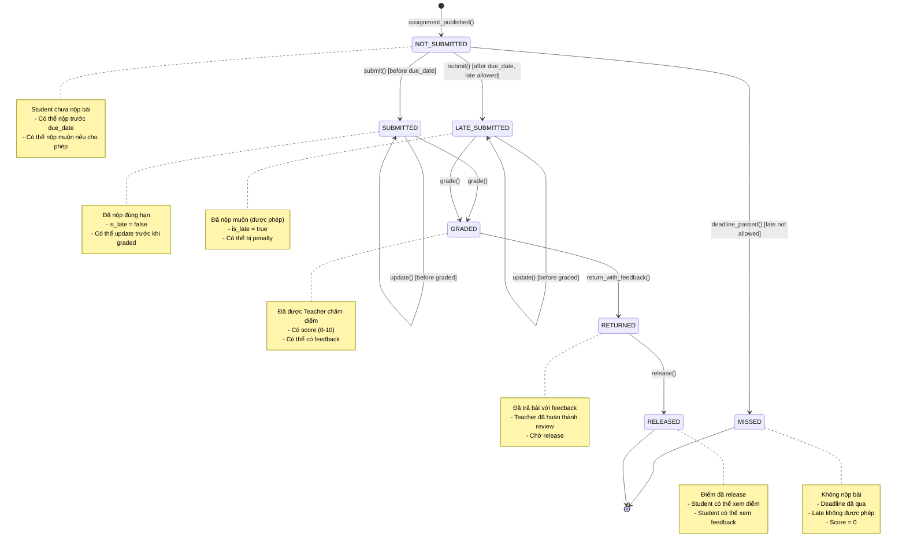
```mermaid
stateDiagram-v2
    [*] --> NOT_SUBMITTED: assignment_published()

    NOT_SUBMITTED --> SUBMITTED: submit() [before due_date]
    NOT_SUBMITTED --> LATE_SUBMITTED: submit() [after due_date, late allowed]
    NOT_SUBMITTED --> MISSED: deadline_passed() [late not allowed]

    SUBMITTED --> SUBMITTED: update() [before graded]
    SUBMITTED --> GRADED: grade()

    LATE_SUBMITTED --> LATE_SUBMITTED: update() [before graded]
    LATE_SUBMITTED --> GRADED: grade()

    GRADED --> RETURNED: return_with_feedback()

    RETURNED --> RELEASED: release()

    MISSED --> [*]
    RELEASED --> [*]

    note right of NOT_SUBMITTED
        Student chưa nộp bài
        - Có thể nộp trước due_date
        - Có thể nộp muộn nếu cho phép
    end note

    note right of SUBMITTED
        Đã nộp đúng hạn
        - is_late = false
        - Có thể update trước khi graded
    end note

    note right of LATE_SUBMITTED
        Đã nộp muộn (được phép)
        - is_late = true
        - Có thể bị penalty
    end note

    note right of GRADED
        Đã được Teacher chấm điểm
        - Có score (0-10)
        - Có thể có feedback
    end note

    note right of RETURNED
        Đã trả bài với feedback
        - Teacher đã hoàn thành review
        - Chờ release
    end note

    note right of RELEASED
        Điểm đã release
        - Student có thể xem điểm
        - Student có thể xem feedback
    end note

    note right of MISSED
        Không nộp bài
        - Deadline đã qua
        - Late không được phép
        - Score = 0
    end note
```

**State Definitions:**

| State | Description | is_late | grade_visible |
|-------|-------------|---------|---------------|
| **NOT_SUBMITTED** | Student chưa nộp bài | - | - |
| **SUBMITTED** | Đã nộp đúng hạn | false | false |
| **LATE_SUBMITTED** | Đã nộp muộn (được phép) | true | false |
| **GRADED** | Đã được Teacher chấm điểm | - | false |
| **RETURNED** | Đã trả bài với feedback | - | false |
| **RELEASED** | Điểm đã được release | - | true |
| **MISSED** | Không nộp bài, deadline qua | - | - |

---

### 4.3 Assessment Attempt State Machine

**Description:** Vòng đời của một Assessment Attempt từ Student

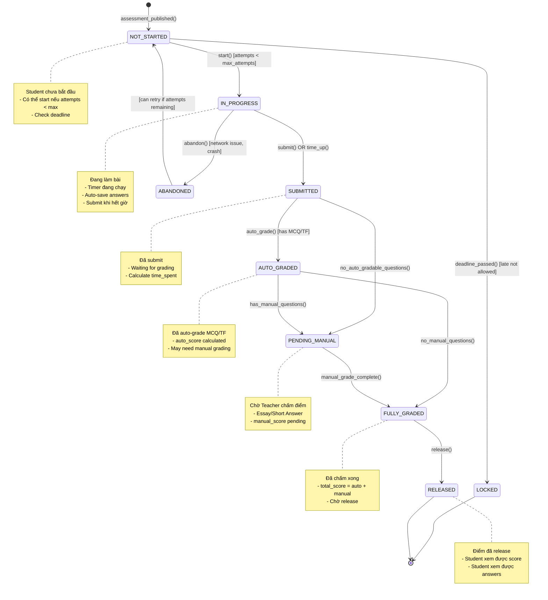
```mermaid
stateDiagram-v2
    [*] --> NOT_STARTED: assessment_published()

    NOT_STARTED --> IN_PROGRESS: start() [attempts < max_attempts]
    NOT_STARTED --> LOCKED: deadline_passed() [late not allowed]

    IN_PROGRESS --> SUBMITTED: submit() OR time_up()
    IN_PROGRESS --> ABANDONED: abandon() [network issue, crash]

    SUBMITTED --> AUTO_GRADED: auto_grade() [has MCQ/TF]
    SUBMITTED --> PENDING_MANUAL: no_auto_gradable_questions()

    AUTO_GRADED --> PENDING_MANUAL: has_manual_questions()
    AUTO_GRADED --> FULLY_GRADED: no_manual_questions()

    PENDING_MANUAL --> FULLY_GRADED: manual_grade_complete()

    FULLY_GRADED --> RELEASED: release()

    ABANDONED --> NOT_STARTED: [can retry if attempts remaining]

    LOCKED --> [*]
    RELEASED --> [*]

    note right of NOT_STARTED
        Student chưa bắt đầu
        - Có thể start nếu attempts < max
        - Check deadline
    end note

    note right of IN_PROGRESS
        Đang làm bài
        - Timer đang chạy
        - Auto-save answers
        - Submit khi hết giờ
    end note

    note right of SUBMITTED
        Đã submit
        - Waiting for grading
        - Calculate time_spent
    end note

    note right of AUTO_GRADED
        Đã auto-grade MCQ/TF
        - auto_score calculated
        - May need manual grading
    end note

    note right of PENDING_MANUAL
        Chờ Teacher chấm điểm
        - Essay/Short Answer
        - manual_score pending
    end note

    note right of FULLY_GRADED
        Đã chấm xong
        - total_score = auto + manual
        - Chờ release
    end note

    note right of RELEASED
        Điểm đã release
        - Student xem được score
        - Student xem được answers
    end note
```

**State Definitions:**

| State | Description | Timer Running | Score Visible |
|-------|-------------|---------------|---------------|
| **NOT_STARTED** | Chưa bắt đầu làm bài | No | No |
| **IN_PROGRESS** | Đang làm bài | Yes | No |
| **SUBMITTED** | Đã nộp, chờ grading | No | No |
| **AUTO_GRADED** | MCQ/TF đã được auto-grade | No | No |
| **PENDING_MANUAL** | Chờ Teacher chấm Essay/Short Answer | No | No |
| **FULLY_GRADED** | Đã chấm điểm hoàn tất | No | No |
| **RELEASED** | Điểm đã release cho Student | No | Yes |
| **LOCKED** | Deadline qua, không thể làm | No | No |
| **ABANDONED** | Đã bỏ dở (network issue) | No | No |

---

### 4.4 Student Grade State Machine

**Description:** Vòng đời của điểm số cho một Student trên một Grade Item

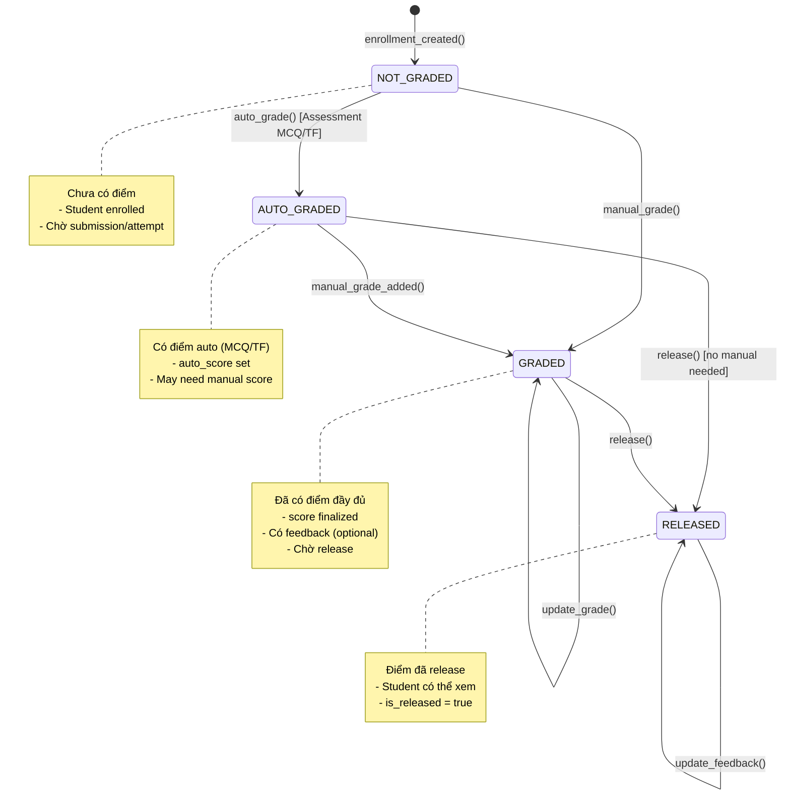
```mermaid
stateDiagram-v2
    [*] --> NOT_GRADED: enrollment_created()

    NOT_GRADED --> AUTO_GRADED: auto_grade() [Assessment MCQ/TF]
    NOT_GRADED --> GRADED: manual_grade()

    AUTO_GRADED --> GRADED: manual_grade_added()
    AUTO_GRADED --> RELEASED: release() [no manual needed]

    GRADED --> GRADED: update_grade()
    GRADED --> RELEASED: release()

    RELEASED --> RELEASED: update_feedback()

    note right of NOT_GRADED
        Chưa có điểm
        - Student enrolled
        - Chờ submission/attempt
    end note

    note right of AUTO_GRADED
        Có điểm auto (MCQ/TF)
        - auto_score set
        - May need manual score
    end note

    note right of GRADED
        Đã có điểm đầy đủ
        - score finalized
        - Có feedback (optional)
        - Chờ release
    end note

    note right of RELEASED
        Điểm đã release
        - Student có thể xem
        - is_released = true
    end note
```

**State Definitions:**

| State | Description | score | is_released |
|-------|-------------|-------|-------------|
| **NOT_GRADED** | Chưa có điểm | null | false |
| **AUTO_GRADED** | Có điểm auto từ MCQ/TF | auto_score only | false |
| **GRADED** | Đã có điểm đầy đủ | final score | false |
| **RELEASED** | Điểm đã release | final score | true |

---

### 4.5 Assessment Question Grading Status

**Description:** Trạng thái chấm điểm của từng câu hỏi trong Assessment

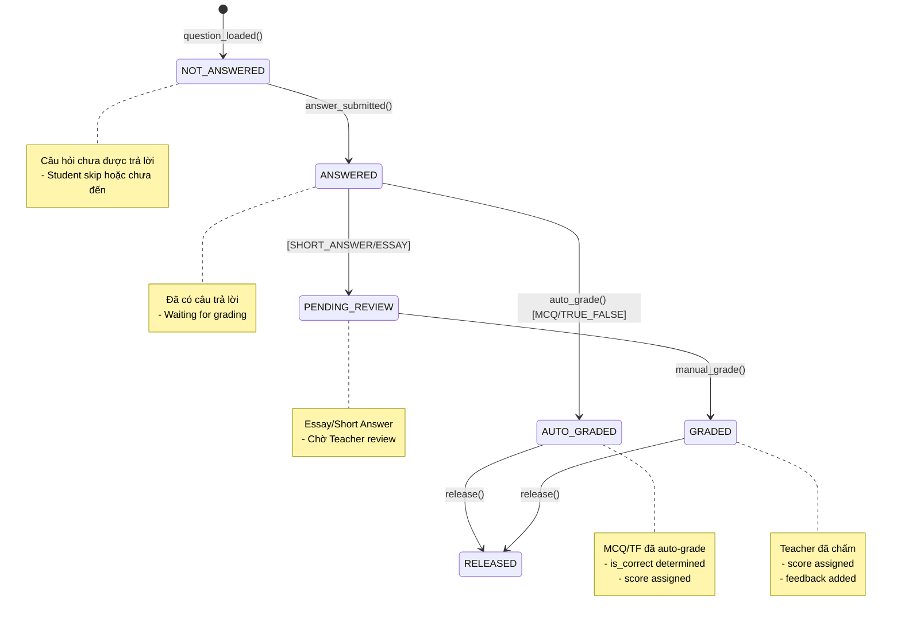
```mermaid
stateDiagram-v2
    [*] --> NOT_ANSWERED: question_loaded()

    NOT_ANSWERED --> ANSWERED: answer_submitted()

    ANSWERED --> AUTO_GRADED: auto_grade() [MCQ/TRUE_FALSE]
    ANSWERED --> PENDING_REVIEW: [SHORT_ANSWER/ESSAY]

    AUTO_GRADED --> RELEASED: release()

    PENDING_REVIEW --> GRADED: manual_grade()

    GRADED --> RELEASED: release()

    note right of NOT_ANSWERED
        Câu hỏi chưa được trả lời
        - Student skip hoặc chưa đến
    end note

    note right of ANSWERED
        Đã có câu trả lời
        - Waiting for grading
    end note

    note right of AUTO_GRADED
        MCQ/TF đã auto-grade
        - is_correct determined
        - score assigned
    end note

    note right of PENDING_REVIEW
        Essay/Short Answer
        - Chờ Teacher review
    end note

    note right of GRADED
        Teacher đã chấm
        - score assigned
        - feedback added
    end note
```

**Grading by Question Type:**

| Question Type | Auto-Gradable | Grading Logic |
|---------------|---------------|---------------|
| **MCQ** | ✅ Yes | Compare selected_option_ids with correct options |
| **TRUE_FALSE** | ✅ Yes | Compare answer with correct_answer |
| **SHORT_ANSWER** | ❌ No | Teacher manual review |
| **ESSAY** | ❌ No | Teacher manual review |

---

### 4.6 Combined State Overview

```
┌─────────────────────────────────────────────────────────────────────────────────────────┐
│                            STATE MACHINE RELATIONSHIPS                                    │
├─────────────────────────────────────────────────────────────────────────────────────────┤
│                                                                                          │
│   GRADE ITEM                         STUDENT GRADE                                       │
│   ──────────                         ─────────────                                       │
│   DRAFT ──────────────────────────► (No grade yet)                                      │
│     │                                     │                                              │
│     ▼                                     │                                              │
│   PUBLISHED ──────────────────────► NOT_GRADED                                          │
│     │                                     │                                              │
│     │  (submission received)              │ (auto/manual grade)                          │
│     │                                     │                                              │
│     ▼                                     ▼                                              │
│   GRADING ────────────────────────► AUTO_GRADED / GRADED                                │
│     │                                     │                                              │
│     │  (all graded)                       │                                              │
│     │                                     │                                              │
│     ▼                                     │                                              │
│   GRADED ─────────────────────────────────┤                                             │
│     │                                     │                                              │
│     │  release_grades()                   │                                              │
│     │                                     │                                              │
│     ▼                                     ▼                                              │
│   RELEASED ───────────────────────► RELEASED                                            │
│     │                                     │                                              │
│     │  archive()                          │                                              │
│     │                                     │                                              │
│     ▼                                     │                                              │
│   ARCHIVED                                │                                              │
│                                           │                                              │
│                                           │                                              │
│   SUBMISSION/ATTEMPT                      │                                              │
│   ──────────────────                      │                                              │
│   NOT_SUBMITTED ──────────────────────────┤                                             │
│     │                                     │                                              │
│     ▼                                     │                                              │
│   SUBMITTED/IN_PROGRESS ──────────────────┤                                             │
│     │                                     │                                              │
│     ▼                                     ▼                                              │
│   GRADED ──────────────────────────► Affects student_grade.score                        │
│     │                                                                                    │
│     ▼                                                                                    │
│   RELEASED ────────────────────────► is_released = true                                 │
│                                                                                          │
└─────────────────────────────────────────────────────────────────────────────────────────┘
```

---

## 5. Data Model

### 5.1 ERD Overview

```mermaid
erDiagram
    CLASS ||--o{ GRADE_ITEM : "has"
    GRADE_ITEM ||--o{ STUDENT_GRADE : "has"
    GRADE_ITEM ||--o| ASSIGNMENT : "linked_to"
    GRADE_ITEM ||--o| ASSESSMENT : "linked_to"

    ASSESSMENT ||--o{ ASSESSMENT_QUESTION : "contains"

    ASSIGNMENT ||--o{ ASSIGNMENT_SUBMISSION : "receives"
    ASSESSMENT ||--o{ ASSESSMENT_ATTEMPT : "receives"

    ASSESSMENT_ATTEMPT ||--o{ STUDENT_ANSWER : "contains"
    ASSESSMENT_QUESTION ||--o{ STUDENT_ANSWER : "answered_by"

    ENROLLMENT ||--o{ STUDENT_GRADE : "for"
    ENROLLMENT ||--o{ ASSIGNMENT_SUBMISSION : "from"
    ENROLLMENT ||--o{ ASSESSMENT_ATTEMPT : "from"

    GRADE_ITEM {
        bigint id PK
        bigint tenant_id
        bigint class_id FK
        varchar name
        varchar type
        decimal weight
        varchar status
    }

    STUDENT_GRADE {
        bigint id PK
        bigint tenant_id
        bigint grade_item_id FK
        bigint enrollment_id FK
        decimal score
        varchar status
        boolean is_released
    }

    ASSIGNMENT {
        bigint id PK
        bigint tenant_id
        bigint grade_item_id FK
        varchar title
        varchar submission_type
        timestamp due_date
        varchar status
    }

    ASSESSMENT {
        bigint id PK
        bigint tenant_id
        bigint grade_item_id FK
        varchar title
        int time_limit_minutes
        timestamp due_date
        varchar status
    }

    ASSESSMENT_QUESTION {
        bigint id PK
        bigint tenant_id
        bigint assessment_id FK
        varchar question_type
        text question_text
        jsonb options
        decimal points
    }

    ASSIGNMENT_SUBMISSION {
        bigint id PK
        bigint tenant_id
        bigint assignment_id FK
        bigint enrollment_id FK
        varchar submission_type
        text file_url
        varchar status
        boolean is_late
    }

    ASSESSMENT_ATTEMPT {
        bigint id PK
        bigint tenant_id
        bigint assessment_id FK
        bigint enrollment_id FK
        int attempt_number
        varchar status
        decimal auto_score
        decimal manual_score
        decimal total_score
    }

    STUDENT_ANSWER {
        bigint id PK
        bigint tenant_id
        bigint attempt_id FK
        bigint question_id FK
        text answer_text
        boolean is_correct
        decimal score
    }
```

### 5.2 Schema Organization

Hệ thống Grading sử dụng **3 database schemas** riêng biệt cho mỗi service:

| Schema | Service | Tables | Description |
|--------|---------|--------|-------------|
| `tf_grading` | tf-grading | 5 tables | Core grading data (Teacher domain) |
| `lf_assignment` | lf-assignment | 1 table | Assignment submissions (Student domain) |
| `lf_assessment` | lf-assessment | 2 tables | Assessment attempts & answers (Student domain) |

```
┌─────────────────────────────────────────────────────────────────────────────────────────┐
│                              DATABASE SCHEMA ORGANIZATION                                 │
├─────────────────────────────────────────────────────────────────────────────────────────┤
│                                                                                          │
│   ┌─────────────────────────────────────────────────────────────────────────────────┐   │
│   │  SCHEMA: tf_grading (Teaching Functions - Core Service)                          │   │
│   │  ─────────────────────────────────────────────────────────────────────────────── │   │
│   │  Tables:                                                                          │   │
│   │  • grade_item          - Hạng mục điểm                                           │   │
│   │  • student_grade       - Điểm của học sinh                                       │   │
│   │  • assignment          - Định nghĩa bài tập                                      │   │
│   │  • assessment          - Định nghĩa bài kiểm tra                                 │   │
│   │  • assessment_question - Câu hỏi trong bài kiểm tra                              │   │
│   └─────────────────────────────────────────────────────────────────────────────────┘   │
│                                                                                          │
│   ┌─────────────────────────────────────────────────────────────────────────────────┐   │
│   │  SCHEMA: lf_assignment (Learning Functions - Assignment Service)                 │   │
│   │  ─────────────────────────────────────────────────────────────────────────────── │   │
│   │  Tables:                                                                          │   │
│   │  • assignment_submission - Bài nộp của học sinh                                  │   │
│   └─────────────────────────────────────────────────────────────────────────────────┘   │
│                                                                                          │
│   ┌─────────────────────────────────────────────────────────────────────────────────┐   │
│   │  SCHEMA: lf_assessment (Learning Functions - Assessment Service)                 │   │
│   │  ─────────────────────────────────────────────────────────────────────────────── │   │
│   │  Tables:                                                                          │   │
│   │  • assessment_attempt  - Lần làm bài của học sinh                                │   │
│   │  • student_answer      - Câu trả lời của học sinh                                │   │
│   └─────────────────────────────────────────────────────────────────────────────────┘   │
│                                                                                          │
└─────────────────────────────────────────────────────────────────────────────────────────┘
```

---

### 5.3 Schema: tf_grading

#### 5.3.1 Table: `tf_grading.grade_item`

**Description:** Hạng mục điểm trong lớp học (Quiz, Assignment, Midterm, Final)

| Column | Type | Nullable | Default | Description |
|--------|------|----------|---------|-------------|
| `id` | BIGINT | NO | GENERATED | Primary key |
| `tenant_id` | BIGINT | NO | - | Tenant identifier (multi-tenancy) |
| `class_id` | BIGINT | NO | - | FK to tf_class_management.class |
| `name` | VARCHAR(255) | NO | - | Tên hạng mục điểm |
| `type` | VARCHAR(30) | NO | - | QUIZ / ASSIGNMENT / MIDTERM / FINAL |
| `description` | TEXT | YES | NULL | Mô tả chi tiết |
| `weight` | DECIMAL(5,2) | NO | - | Trọng số trong điểm tổng kết (%) |
| `max_score` | DECIMAL(4,2) | NO | 10.00 | Điểm tối đa |
| `due_date` | TIMESTAMP | YES | NULL | Deadline (optional) |
| `status` | VARCHAR(20) | NO | 'DRAFT' | DRAFT/PUBLISHED/GRADING/GRADED/RELEASED/CLOSED/ARCHIVED |
| `release_status` | VARCHAR(20) | NO | 'NOT_RELEASED' | NOT_RELEASED / RELEASED |
| `order_index` | INT | NO | 0 | Thứ tự hiển thị |
| `settings` | JSONB | YES | '{}' | Cài đặt bổ sung |
| `created_at` | TIMESTAMP | NO | NOW() | Thời gian tạo |
| `updated_at` | TIMESTAMP | NO | NOW() | Thời gian cập nhật |
| `created_by` | BIGINT | NO | - | Teacher ID đã tạo |

**Indexes:**
```sql
CREATE INDEX idx_grade_item_tenant_class ON tf_grading.grade_item(tenant_id, class_id);
CREATE INDEX idx_grade_item_status ON tf_grading.grade_item(status);
CREATE UNIQUE INDEX idx_grade_item_class_order ON tf_grading.grade_item(class_id, order_index);
```

**Constraints:**
```sql
ALTER TABLE tf_grading.grade_item
ADD CONSTRAINT chk_grade_item_type
CHECK (type IN ('QUIZ', 'ASSIGNMENT', 'MIDTERM', 'FINAL'));

ALTER TABLE tf_grading.grade_item
ADD CONSTRAINT chk_grade_item_status
CHECK (status IN ('DRAFT', 'PUBLISHED', 'GRADING', 'GRADED', 'RELEASED', 'CLOSED', 'ARCHIVED'));

ALTER TABLE tf_grading.grade_item
ADD CONSTRAINT chk_grade_item_weight
CHECK (weight >= 0 AND weight <= 100);
```

---

#### 5.3.2 Table: `tf_grading.student_grade`

**Description:** Điểm của học sinh cho từng Grade Item

| Column | Type | Nullable | Default | Description |
|--------|------|----------|---------|-------------|
| `id` | BIGINT | NO | GENERATED | Primary key |
| `tenant_id` | BIGINT | NO | - | Tenant identifier |
| `grade_item_id` | BIGINT | NO | - | FK to grade_item |
| `enrollment_id` | BIGINT | NO | - | FK to tf_class_management.enrollment |
| `student_id` | BIGINT | NO | - | Student ID (denormalized for query) |
| `score` | DECIMAL(4,2) | YES | NULL | Điểm số (0-10) |
| `percentage` | DECIMAL(5,2) | YES | NULL | Phần trăm (calculated) |
| `status` | VARCHAR(20) | NO | 'NOT_GRADED' | NOT_GRADED/AUTO_GRADED/GRADED/RELEASED |
| `is_released` | BOOLEAN | NO | FALSE | Điểm đã release cho student xem |
| `graded_by` | BIGINT | YES | NULL | Teacher ID đã chấm |
| `graded_at` | TIMESTAMP | YES | NULL | Thời gian chấm |
| `feedback` | TEXT | YES | NULL | Nhận xét của Teacher |
| `auto_score` | DECIMAL(4,2) | YES | NULL | Điểm auto-grade (for assessment) |
| `manual_score` | DECIMAL(4,2) | YES | NULL | Điểm manual grade |
| `late_penalty` | DECIMAL(5,2) | YES | NULL | Phần trăm bị trừ do nộp muộn |
| `created_at` | TIMESTAMP | NO | NOW() | Thời gian tạo |
| `updated_at` | TIMESTAMP | NO | NOW() | Thời gian cập nhật |

**Indexes:**
```sql
CREATE INDEX idx_student_grade_tenant ON tf_grading.student_grade(tenant_id);
CREATE INDEX idx_student_grade_grade_item ON tf_grading.student_grade(grade_item_id);
CREATE INDEX idx_student_grade_enrollment ON tf_grading.student_grade(enrollment_id);
CREATE INDEX idx_student_grade_student ON tf_grading.student_grade(student_id);
CREATE UNIQUE INDEX idx_student_grade_unique ON tf_grading.student_grade(grade_item_id, enrollment_id);
```

**Constraints:**
```sql
ALTER TABLE tf_grading.student_grade
ADD CONSTRAINT chk_student_grade_score
CHECK (score IS NULL OR (score >= 0 AND score <= 10));

ALTER TABLE tf_grading.student_grade
ADD CONSTRAINT chk_student_grade_status
CHECK (status IN ('NOT_GRADED', 'AUTO_GRADED', 'GRADED', 'RELEASED'));
```

---

#### 5.3.3 Table: `tf_grading.assignment`

**Description:** Định nghĩa bài tập do Teacher tạo

| Column | Type | Nullable | Default | Description |
|--------|------|----------|---------|-------------|
| `id` | BIGINT | NO | GENERATED | Primary key |
| `tenant_id` | BIGINT | NO | - | Tenant identifier |
| `grade_item_id` | BIGINT | NO | - | FK to grade_item (one-to-one) |
| `title` | VARCHAR(255) | NO | - | Tiêu đề bài tập |
| `description` | TEXT | YES | NULL | Mô tả bài tập |
| `instructions` | TEXT | YES | NULL | Hướng dẫn làm bài |
| `submission_type` | VARCHAR(30) | NO | - | FILE_UPLOAD / LINK |
| `allowed_file_types` | VARCHAR[] | YES | NULL | Các loại file được phép (pdf, docx, jpg...) |
| `max_file_size_mb` | INT | YES | 50 | Dung lượng file tối đa (MB) |
| `due_date` | TIMESTAMP | NO | - | Deadline nộp bài |
| `allow_late_submission` | BOOLEAN | NO | FALSE | Cho phép nộp muộn |
| `late_submission_deadline` | TIMESTAMP | YES | NULL | Deadline nộp muộn |
| `late_penalty_percent` | DECIMAL(5,2) | YES | NULL | % trừ điểm khi nộp muộn |
| `status` | VARCHAR(20) | NO | 'DRAFT' | DRAFT / PUBLISHED / CLOSED |
| `published_at` | TIMESTAMP | YES | NULL | Thời gian publish |
| `closed_at` | TIMESTAMP | YES | NULL | Thời gian đóng |
| `created_at` | TIMESTAMP | NO | NOW() | Thời gian tạo |
| `updated_at` | TIMESTAMP | NO | NOW() | Thời gian cập nhật |

**Indexes:**
```sql
CREATE INDEX idx_assignment_tenant ON tf_grading.assignment(tenant_id);
CREATE UNIQUE INDEX idx_assignment_grade_item ON tf_grading.assignment(grade_item_id);
CREATE INDEX idx_assignment_status ON tf_grading.assignment(status);
CREATE INDEX idx_assignment_due_date ON tf_grading.assignment(due_date);
```

**Constraints:**
```sql
ALTER TABLE tf_grading.assignment
ADD CONSTRAINT chk_assignment_submission_type
CHECK (submission_type IN ('FILE_UPLOAD', 'LINK'));

ALTER TABLE tf_grading.assignment
ADD CONSTRAINT chk_assignment_status
CHECK (status IN ('DRAFT', 'PUBLISHED', 'CLOSED'));

ALTER TABLE tf_grading.assignment
ADD CONSTRAINT chk_assignment_late_deadline
CHECK (late_submission_deadline IS NULL OR late_submission_deadline > due_date);
```

---

#### 5.3.4 Table: `tf_grading.assessment`

**Description:** Định nghĩa bài kiểm tra do Teacher tạo

| Column | Type | Nullable | Default | Description |
|--------|------|----------|---------|-------------|
| `id` | BIGINT | NO | GENERATED | Primary key |
| `tenant_id` | BIGINT | NO | - | Tenant identifier |
| `grade_item_id` | BIGINT | NO | - | FK to grade_item (one-to-one) |
| `title` | VARCHAR(255) | NO | - | Tiêu đề bài kiểm tra |
| `description` | TEXT | YES | NULL | Mô tả |
| `instructions` | TEXT | YES | NULL | Hướng dẫn làm bài |
| `time_limit_minutes` | INT | YES | NULL | Thời gian làm bài (phút), NULL = không giới hạn |
| `question_count` | INT | NO | 0 | Số câu hỏi |
| `total_points` | DECIMAL(5,2) | NO | 0 | Tổng điểm các câu hỏi |
| `passing_score` | DECIMAL(5,2) | YES | NULL | Điểm đạt |
| `shuffle_questions` | BOOLEAN | NO | TRUE | Xáo trộn câu hỏi |
| `shuffle_answers` | BOOLEAN | NO | TRUE | Xáo trộn đáp án |
| `show_correct_answers` | BOOLEAN | NO | FALSE | Hiển thị đáp án đúng sau khi release |
| `due_date` | TIMESTAMP | NO | - | Deadline làm bài |
| `allow_late_submission` | BOOLEAN | NO | FALSE | Cho phép làm muộn |
| `late_submission_deadline` | TIMESTAMP | YES | NULL | Deadline làm muộn |
| `max_attempts` | INT | NO | 1 | Số lần làm bài tối đa |
| `status` | VARCHAR(20) | NO | 'DRAFT' | DRAFT / PUBLISHED / CLOSED |
| `published_at` | TIMESTAMP | YES | NULL | Thời gian publish |
| `closed_at` | TIMESTAMP | YES | NULL | Thời gian đóng |
| `created_at` | TIMESTAMP | NO | NOW() | Thời gian tạo |
| `updated_at` | TIMESTAMP | NO | NOW() | Thời gian cập nhật |

**Indexes:**
```sql
CREATE INDEX idx_assessment_tenant ON tf_grading.assessment(tenant_id);
CREATE UNIQUE INDEX idx_assessment_grade_item ON tf_grading.assessment(grade_item_id);
CREATE INDEX idx_assessment_status ON tf_grading.assessment(status);
CREATE INDEX idx_assessment_due_date ON tf_grading.assessment(due_date);
```

**Constraints:**
```sql
ALTER TABLE tf_grading.assessment
ADD CONSTRAINT chk_assessment_status
CHECK (status IN ('DRAFT', 'PUBLISHED', 'CLOSED'));

ALTER TABLE tf_grading.assessment
ADD CONSTRAINT chk_assessment_max_attempts
CHECK (max_attempts >= 1);

ALTER TABLE tf_grading.assessment
ADD CONSTRAINT chk_assessment_time_limit
CHECK (time_limit_minutes IS NULL OR time_limit_minutes > 0);
```

---

#### 5.3.5 Table: `tf_grading.assessment_question`

**Description:** Câu hỏi trong bài kiểm tra

| Column | Type | Nullable | Default | Description |
|--------|------|----------|---------|-------------|
| `id` | BIGINT | NO | GENERATED | Primary key |
| `tenant_id` | BIGINT | NO | - | Tenant identifier |
| `assessment_id` | BIGINT | NO | - | FK to assessment |
| `question_type` | VARCHAR(20) | NO | - | MCQ / TRUE_FALSE / SHORT_ANSWER / ESSAY |
| `question_text` | TEXT | NO | - | Nội dung câu hỏi |
| `options` | JSONB | YES | NULL | Đáp án cho MCQ: [{id, text, is_correct}] |
| `correct_answer` | TEXT | YES | NULL | Đáp án đúng (TRUE_FALSE: 'true'/'false') |
| `points` | DECIMAL(4,2) | NO | 1.00 | Điểm của câu hỏi |
| `order_index` | INT | NO | 0 | Thứ tự câu hỏi |
| `explanation` | TEXT | YES | NULL | Giải thích đáp án |
| `created_at` | TIMESTAMP | NO | NOW() | Thời gian tạo |
| `updated_at` | TIMESTAMP | NO | NOW() | Thời gian cập nhật |

**Indexes:**
```sql
CREATE INDEX idx_assessment_question_tenant ON tf_grading.assessment_question(tenant_id);
CREATE INDEX idx_assessment_question_assessment ON tf_grading.assessment_question(assessment_id);
CREATE INDEX idx_assessment_question_type ON tf_grading.assessment_question(question_type);
CREATE UNIQUE INDEX idx_assessment_question_order ON tf_grading.assessment_question(assessment_id, order_index);
```

**Constraints:**
```sql
ALTER TABLE tf_grading.assessment_question
ADD CONSTRAINT chk_question_type
CHECK (question_type IN ('MCQ', 'TRUE_FALSE', 'SHORT_ANSWER', 'ESSAY'));

ALTER TABLE tf_grading.assessment_question
ADD CONSTRAINT chk_question_points
CHECK (points > 0);
```

**JSONB Schema for `options` (MCQ):**
```json
[
  {
    "id": 1,
    "text": "Option A",
    "is_correct": true
  },
  {
    "id": 2,
    "text": "Option B",
    "is_correct": false
  },
  {
    "id": 3,
    "text": "Option C",
    "is_correct": false
  },
  {
    "id": 4,
    "text": "Option D",
    "is_correct": false
  }
]
```

---

### 5.4 Schema: lf_assignment

#### 5.4.1 Table: `lf_assignment.assignment_submission`

**Description:** Bài nộp của học sinh cho Assignment

| Column | Type | Nullable | Default | Description |
|--------|------|----------|---------|-------------|
| `id` | BIGINT | NO | GENERATED | Primary key |
| `tenant_id` | BIGINT | NO | - | Tenant identifier |
| `assignment_id` | BIGINT | NO | - | FK to tf_grading.assignment |
| `enrollment_id` | BIGINT | NO | - | FK to tf_class_management.enrollment |
| `student_id` | BIGINT | NO | - | Student ID (denormalized) |
| `submission_type` | VARCHAR(20) | NO | - | FILE_UPLOAD / LINK |
| `file_url` | TEXT | YES | NULL | S3 URL cho file upload |
| `file_name` | VARCHAR(255) | YES | NULL | Tên file gốc |
| `file_size_bytes` | BIGINT | YES | NULL | Dung lượng file |
| `file_content_type` | VARCHAR(100) | YES | NULL | MIME type |
| `link_url` | TEXT | YES | NULL | URL cho LINK submission |
| `status` | VARCHAR(20) | NO | 'NOT_SUBMITTED' | NOT_SUBMITTED/SUBMITTED/LATE_SUBMITTED/GRADED/RETURNED/RELEASED/MISSED |
| `is_late` | BOOLEAN | NO | FALSE | Có phải nộp muộn không |
| `submitted_at` | TIMESTAMP | YES | NULL | Thời gian nộp |
| `grade_visible` | BOOLEAN | NO | FALSE | Điểm có visible cho student không |
| `created_at` | TIMESTAMP | NO | NOW() | Thời gian tạo |
| `updated_at` | TIMESTAMP | NO | NOW() | Thời gian cập nhật |

**Indexes:**
```sql
CREATE INDEX idx_submission_tenant ON lf_assignment.assignment_submission(tenant_id);
CREATE INDEX idx_submission_assignment ON lf_assignment.assignment_submission(assignment_id);
CREATE INDEX idx_submission_enrollment ON lf_assignment.assignment_submission(enrollment_id);
CREATE INDEX idx_submission_student ON lf_assignment.assignment_submission(student_id);
CREATE INDEX idx_submission_status ON lf_assignment.assignment_submission(status);
CREATE UNIQUE INDEX idx_submission_unique ON lf_assignment.assignment_submission(assignment_id, enrollment_id);
```

**Constraints:**
```sql
ALTER TABLE lf_assignment.assignment_submission
ADD CONSTRAINT chk_submission_type
CHECK (submission_type IN ('FILE_UPLOAD', 'LINK'));

ALTER TABLE lf_assignment.assignment_submission
ADD CONSTRAINT chk_submission_status
CHECK (status IN ('NOT_SUBMITTED', 'SUBMITTED', 'LATE_SUBMITTED', 'GRADED', 'RETURNED', 'RELEASED', 'MISSED'));

ALTER TABLE lf_assignment.assignment_submission
ADD CONSTRAINT chk_submission_file_or_link
CHECK (
  (submission_type = 'FILE_UPLOAD' AND file_url IS NOT NULL) OR
  (submission_type = 'LINK' AND link_url IS NOT NULL) OR
  (status = 'NOT_SUBMITTED')
);
```

---

### 5.5 Schema: lf_assessment

#### 5.5.1 Table: `lf_assessment.assessment_attempt`

**Description:** Lần làm bài kiểm tra của học sinh

| Column | Type | Nullable | Default | Description |
|--------|------|----------|---------|-------------|
| `id` | BIGINT | NO | GENERATED | Primary key |
| `tenant_id` | BIGINT | NO | - | Tenant identifier |
| `assessment_id` | BIGINT | NO | - | FK to tf_grading.assessment |
| `enrollment_id` | BIGINT | NO | - | FK to tf_class_management.enrollment |
| `student_id` | BIGINT | NO | - | Student ID (denormalized) |
| `attempt_number` | INT | NO | 1 | Lần thứ mấy (1, 2, 3...) |
| `status` | VARCHAR(20) | NO | 'NOT_STARTED' | NOT_STARTED/IN_PROGRESS/SUBMITTED/AUTO_GRADED/PENDING_MANUAL/FULLY_GRADED/RELEASED/LOCKED/ABANDONED |
| `started_at` | TIMESTAMP | YES | NULL | Thời gian bắt đầu |
| `submitted_at` | TIMESTAMP | YES | NULL | Thời gian nộp |
| `is_late` | BOOLEAN | NO | FALSE | Có phải nộp muộn không |
| `auto_score` | DECIMAL(5,2) | YES | NULL | Điểm auto-grade (MCQ + TRUE_FALSE) |
| `manual_score` | DECIMAL(5,2) | YES | NULL | Điểm manual grade (Essay + Short Answer) |
| `total_score` | DECIMAL(5,2) | YES | NULL | Tổng điểm = auto + manual |
| `time_spent_seconds` | INT | YES | NULL | Thời gian làm bài (giây) |
| `grade_visible` | BOOLEAN | NO | FALSE | Điểm có visible cho student không |
| `created_at` | TIMESTAMP | NO | NOW() | Thời gian tạo |
| `updated_at` | TIMESTAMP | NO | NOW() | Thời gian cập nhật |

**Indexes:**
```sql
CREATE INDEX idx_attempt_tenant ON lf_assessment.assessment_attempt(tenant_id);
CREATE INDEX idx_attempt_assessment ON lf_assessment.assessment_attempt(assessment_id);
CREATE INDEX idx_attempt_enrollment ON lf_assessment.assessment_attempt(enrollment_id);
CREATE INDEX idx_attempt_student ON lf_assessment.assessment_attempt(student_id);
CREATE INDEX idx_attempt_status ON lf_assessment.assessment_attempt(status);
CREATE UNIQUE INDEX idx_attempt_unique ON lf_assessment.assessment_attempt(assessment_id, enrollment_id, attempt_number);
```

**Constraints:**
```sql
ALTER TABLE lf_assessment.assessment_attempt
ADD CONSTRAINT chk_attempt_status
CHECK (status IN ('NOT_STARTED', 'IN_PROGRESS', 'SUBMITTED', 'AUTO_GRADED', 'PENDING_MANUAL', 'FULLY_GRADED', 'RELEASED', 'LOCKED', 'ABANDONED'));

ALTER TABLE lf_assessment.assessment_attempt
ADD CONSTRAINT chk_attempt_number
CHECK (attempt_number >= 1);
```

---

#### 5.5.2 Table: `lf_assessment.student_answer`

**Description:** Câu trả lời của học sinh cho từng câu hỏi

| Column | Type | Nullable | Default | Description |
|--------|------|----------|---------|-------------|
| `id` | BIGINT | NO | GENERATED | Primary key |
| `tenant_id` | BIGINT | NO | - | Tenant identifier |
| `attempt_id` | BIGINT | NO | - | FK to assessment_attempt |
| `question_id` | BIGINT | NO | - | FK to tf_grading.assessment_question |
| `answer_text` | TEXT | YES | NULL | Câu trả lời text (Essay, Short Answer) |
| `selected_option_ids` | BIGINT[] | YES | NULL | Các option đã chọn (MCQ) |
| `is_correct` | BOOLEAN | YES | NULL | Có đúng không (auto-graded questions) |
| `score` | DECIMAL(4,2) | YES | NULL | Điểm cho câu này |
| `feedback` | TEXT | YES | NULL | Nhận xét của Teacher |
| `graded_by` | BIGINT | YES | NULL | Teacher ID (manual grading) |
| `graded_at` | TIMESTAMP | YES | NULL | Thời gian chấm |
| `answered_at` | TIMESTAMP | YES | NULL | Thời gian trả lời |
| `created_at` | TIMESTAMP | NO | NOW() | Thời gian tạo |
| `updated_at` | TIMESTAMP | NO | NOW() | Thời gian cập nhật |

**Indexes:**
```sql
CREATE INDEX idx_answer_tenant ON lf_assessment.student_answer(tenant_id);
CREATE INDEX idx_answer_attempt ON lf_assessment.student_answer(attempt_id);
CREATE INDEX idx_answer_question ON lf_assessment.student_answer(question_id);
CREATE UNIQUE INDEX idx_answer_unique ON lf_assessment.student_answer(attempt_id, question_id);
```

**Constraints:**
```sql
ALTER TABLE lf_assessment.student_answer
ADD CONSTRAINT chk_answer_score
CHECK (score IS NULL OR (score >= 0));
```

---

### 5.6 Cross-Schema Relationships

```
┌─────────────────────────────────────────────────────────────────────────────────────────┐
│                              CROSS-SCHEMA RELATIONSHIPS                                   │
├─────────────────────────────────────────────────────────────────────────────────────────┤
│                                                                                          │
│   tf_class_management.class                                                             │
│        │                                                                                 │
│        │ (class_id)                                                                     │
│        ▼                                                                                 │
│   tf_grading.grade_item ◄────────────────────────────────────────────────────────────┐  │
│        │                                                                              │  │
│        ├─── (grade_item_id) ──► tf_grading.assignment                                │  │
│        │                              │                                               │  │
│        │                              │ (assignment_id)                               │  │
│        │                              ▼                                               │  │
│        │                    lf_assignment.assignment_submission ◄─────────┐          │  │
│        │                                                                   │          │  │
│        ├─── (grade_item_id) ──► tf_grading.assessment                     │          │  │
│        │                              │                                    │          │  │
│        │                              ├─── (assessment_id)                 │          │  │
│        │                              │         │                          │          │  │
│        │                              │         ▼                          │          │  │
│        │                              │   lf_assessment.assessment_attempt │          │  │
│        │                              │         │                          │          │  │
│        │                              │         │ (attempt_id)             │          │  │
│        │                              │         ▼                          │          │  │
│        │                              │   lf_assessment.student_answer     │          │  │
│        │                              │         │                          │          │  │
│        │                              │         │ (question_id)            │          │  │
│        │                              │         │                          │          │  │
│        │                              ├─────────┼──────────────────────────┘          │  │
│        │                              │         │                                      │  │
│        │                              ▼         │                                      │  │
│        │                    tf_grading.assessment_question                            │  │
│        │                                                                               │  │
│        └─── (grade_item_id) ──► tf_grading.student_grade                              │  │
│                                       │                                                │  │
│                                       │ (enrollment_id)                                │  │
│                                       ▼                                                │  │
│   tf_class_management.enrollment ◄────┴────────────────────────────────────────────────┘  │
│                                                                                          │
└─────────────────────────────────────────────────────────────────────────────────────────┘
```

**Foreign Key Notes:**
- Cross-schema FKs are **logical relationships** (not enforced by DB constraints)
- tf_grading tables reference tf_class_management via `class_id` and `enrollment_id`
- lf_assignment and lf_assessment reference tf_grading via `assignment_id`, `assessment_id`, `question_id`
- Consistency is maintained via **event-driven synchronization**

---

## 6. Event Architecture

### 6.1 Event Overview

Hệ thống Grading sử dụng **Kafka** cho event-driven communication giữa các services.

```
┌─────────────────────────────────────────────────────────────────────────────────────────┐
│                              EVENT ARCHITECTURE OVERVIEW                                  │
├─────────────────────────────────────────────────────────────────────────────────────────┤
│                                                                                          │
│   ┌─────────────────────────────────────────────────────────────────────────────────┐   │
│   │                             KAFKA TOPICS                                         │   │
│   │  ─────────────────────────────────────────────────────────────────────────────  │   │
│   │                                                                                  │   │
│   │  edu.grading.events ◄───── tf-grading (Publisher)                              │   │
│   │        │                                                                         │   │
│   │        ├──► lf-assignment (Consumer)                                            │   │
│   │        ├──► lf-assessment (Consumer)                                            │   │
│   │        ├──► tf-class-management (Consumer)                                      │   │
│   │        └──► notification (Consumer)                                             │   │
│   │                                                                                  │   │
│   │  edu.assignment.events ◄── lf-assignment (Publisher)                           │   │
│   │        │                                                                         │   │
│   │        ├──► tf-grading (Consumer)                                               │   │
│   │        └──► notification (Consumer)                                             │   │
│   │                                                                                  │   │
│   │  edu.assessment.events ◄── lf-assessment (Publisher)                           │   │
│   │        │                                                                         │   │
│   │        ├──► tf-grading (Consumer)                                               │   │
│   │        └──► notification (Consumer)                                             │   │
│   │                                                                                  │   │
│   │  edu.class.events ◄─────── tf-class-management (Publisher)                     │   │
│   │        │                                                                         │   │
│   │        └──► tf-grading (Consumer - ClassCompletedEvent)                         │   │
│   │                                                                                  │   │
│   └─────────────────────────────────────────────────────────────────────────────────┘   │
│                                                                                          │
└─────────────────────────────────────────────────────────────────────────────────────────┘
```

### 6.2 Kafka Topics

| Topic | Publisher | Consumer(s) | Description |
|-------|-----------|-------------|-------------|
| `edu.grading.events` | tf-grading | lf-assignment, lf-assessment, tf-class-management, notification | Core grading events |
| `edu.assignment.events` | lf-assignment | tf-grading, notification | Assignment submission events |
| `edu.assessment.events` | lf-assessment | tf-grading, notification | Assessment attempt events |
| `edu.class.events` | tf-class-management | tf-grading | Class lifecycle events |

---

### 6.3 Event Definitions

#### 6.3.1 Events from tf-grading (Topic: `edu.grading.events`)

##### GradeItemCreatedEvent

**Description:** Phát khi Teacher tạo Grade Item mới

```json
{
  "eventId": "uuid",
  "eventType": "GradeItemCreatedEvent",
  "timestamp": "2024-01-15T10:30:00Z",
  "version": "1.0",
  "payload": {
    "gradeItemId": 12345,
    "tenantId": 1,
    "classId": 100,
    "name": "Quiz 1",
    "type": "QUIZ",
    "weight": 10.0,
    "maxScore": 10.0,
    "dueDate": "2024-01-20T23:59:59Z",
    "status": "DRAFT",
    "createdBy": 50001
  },
  "metadata": {
    "correlationId": "uuid",
    "source": "tf-grading",
    "userId": 50001
  }
}
```

##### AssignmentPublishedEvent

**Description:** Phát khi Teacher publish Assignment

```json
{
  "eventId": "uuid",
  "eventType": "AssignmentPublishedEvent",
  "timestamp": "2024-01-15T11:00:00Z",
  "version": "1.0",
  "payload": {
    "assignmentId": 2001,
    "gradeItemId": 12345,
    "tenantId": 1,
    "classId": 100,
    "title": "Essay Assignment 1",
    "description": "Write an essay about...",
    "instructions": "Submit in PDF format",
    "submissionType": "FILE_UPLOAD",
    "allowedFileTypes": ["pdf", "docx"],
    "maxFileSizeMb": 10,
    "dueDate": "2024-01-20T23:59:59Z",
    "allowLateSubmission": true,
    "lateSubmissionDeadline": "2024-01-22T23:59:59Z",
    "latePenaltyPercent": 10.0,
    "enrolledStudentIds": [1001, 1002, 1003, 1004, 1005]
  },
  "metadata": {
    "correlationId": "uuid",
    "source": "tf-grading",
    "userId": 50001
  }
}
```

##### AssessmentPublishedEvent

**Description:** Phát khi Teacher publish Assessment

```json
{
  "eventId": "uuid",
  "eventType": "AssessmentPublishedEvent",
  "timestamp": "2024-01-15T11:00:00Z",
  "version": "1.0",
  "payload": {
    "assessmentId": 3001,
    "gradeItemId": 12346,
    "tenantId": 1,
    "classId": 100,
    "title": "Midterm Exam",
    "description": "Midterm examination",
    "instructions": "Answer all questions",
    "timeLimitMinutes": 60,
    "questionCount": 20,
    "totalPoints": 100.0,
    "shuffleQuestions": true,
    "shuffleAnswers": true,
    "dueDate": "2024-01-25T23:59:59Z",
    "allowLateSubmission": false,
    "maxAttempts": 1,
    "questions": [
      {
        "questionId": 5001,
        "questionType": "MCQ",
        "questionText": "What is...?",
        "points": 5.0
      }
    ],
    "enrolledStudentIds": [1001, 1002, 1003, 1004, 1005]
  },
  "metadata": {
    "correlationId": "uuid",
    "source": "tf-grading",
    "userId": 50001
  }
}
```

##### GradeUpdatedEvent

**Description:** Phát khi Teacher chấm điểm cho student

```json
{
  "eventId": "uuid",
  "eventType": "GradeUpdatedEvent",
  "timestamp": "2024-01-16T14:00:00Z",
  "version": "1.0",
  "payload": {
    "studentGradeId": 8001,
    "gradeItemId": 12345,
    "tenantId": 1,
    "classId": 100,
    "enrollmentId": 2001,
    "studentId": 1001,
    "score": 8.5,
    "feedback": "Good work!",
    "gradedBy": 50001,
    "gradedAt": "2024-01-16T14:00:00Z",
    "isReleased": false
  },
  "metadata": {
    "correlationId": "uuid",
    "source": "tf-grading",
    "userId": 50001
  }
}
```

##### GradesReleasedEvent

**Description:** Phát khi Teacher release grades cho students

```json
{
  "eventId": "uuid",
  "eventType": "GradesReleasedEvent",
  "timestamp": "2024-01-17T10:00:00Z",
  "version": "1.0",
  "payload": {
    "tenantId": 1,
    "classId": 100,
    "gradeItemIds": [12345, 12346],
    "releasedGrades": [
      {
        "gradeItemId": 12345,
        "studentGrades": [
          {"studentId": 1001, "score": 8.5},
          {"studentId": 1002, "score": 7.0}
        ]
      }
    ],
    "studentIds": [1001, 1002, 1003, 1004, 1005],
    "releasedBy": 50001,
    "releasedAt": "2024-01-17T10:00:00Z"
  },
  "metadata": {
    "correlationId": "uuid",
    "source": "tf-grading",
    "userId": 50001
  }
}
```

##### FinalGradeCalculatedEvent

**Description:** Phát khi hệ thống tính xong Final Grade

```json
{
  "eventId": "uuid",
  "eventType": "FinalGradeCalculatedEvent",
  "timestamp": "2024-02-01T00:00:00Z",
  "version": "1.0",
  "payload": {
    "tenantId": 1,
    "classId": 100,
    "calculatedAt": "2024-02-01T00:00:00Z",
    "studentResults": [
      {
        "studentId": 1001,
        "enrollmentId": 2001,
        "finalGrade": 8.45,
        "result": "PASSED",
        "gradeBreakdown": {
          "Quiz": {"weight": 10, "score": 8.0, "weighted": 0.8},
          "Assignment": {"weight": 20, "score": 7.5, "weighted": 1.5},
          "Midterm": {"weight": 30, "score": 8.5, "weighted": 2.55},
          "Final": {"weight": 40, "score": 9.0, "weighted": 3.6}
        }
      }
    ],
    "statistics": {
      "totalStudents": 25,
      "passed": 22,
      "failed": 3,
      "averageGrade": 7.8,
      "highestGrade": 9.5,
      "lowestGrade": 4.2
    }
  },
  "metadata": {
    "correlationId": "uuid",
    "source": "tf-grading",
    "triggeredBy": "ClassCompletedEvent"
  }
}
```

##### FinalGradeSyncedEvent

**Description:** Phát để sync Final Grade về tf-class-management

```json
{
  "eventId": "uuid",
  "eventType": "FinalGradeSyncedEvent",
  "timestamp": "2024-02-01T00:05:00Z",
  "version": "1.0",
  "payload": {
    "tenantId": 1,
    "classId": 100,
    "enrollmentGrades": [
      {
        "enrollmentId": 2001,
        "studentId": 1001,
        "finalGrade": 8.45,
        "result": "PASSED"
      },
      {
        "enrollmentId": 2002,
        "studentId": 1002,
        "finalGrade": 4.5,
        "result": "FAILED"
      }
    ],
    "syncedAt": "2024-02-01T00:05:00Z"
  },
  "metadata": {
    "correlationId": "uuid",
    "source": "tf-grading"
  }
}
```

---

#### 6.3.2 Events from lf-assignment (Topic: `edu.assignment.events`)

##### SubmissionReceivedEvent

**Description:** Phát khi Student nộp bài Assignment

```json
{
  "eventId": "uuid",
  "eventType": "SubmissionReceivedEvent",
  "timestamp": "2024-01-18T15:30:00Z",
  "version": "1.0",
  "payload": {
    "submissionId": 9001,
    "assignmentId": 2001,
    "tenantId": 1,
    "classId": 100,
    "enrollmentId": 2001,
    "studentId": 1001,
    "submissionType": "FILE_UPLOAD",
    "fileUrl": "s3://bucket/assignments/9001/essay.pdf",
    "fileName": "essay.pdf",
    "fileSizeBytes": 1024000,
    "isLate": false,
    "submittedAt": "2024-01-18T15:30:00Z"
  },
  "metadata": {
    "correlationId": "uuid",
    "source": "lf-assignment",
    "userId": 1001
  }
}
```

##### SubmissionUpdatedEvent

**Description:** Phát khi Student cập nhật bài nộp

```json
{
  "eventId": "uuid",
  "eventType": "SubmissionUpdatedEvent",
  "timestamp": "2024-01-18T16:00:00Z",
  "version": "1.0",
  "payload": {
    "submissionId": 9001,
    "assignmentId": 2001,
    "tenantId": 1,
    "studentId": 1001,
    "previousFileUrl": "s3://bucket/assignments/9001/essay_v1.pdf",
    "newFileUrl": "s3://bucket/assignments/9001/essay_v2.pdf",
    "newFileName": "essay_v2.pdf",
    "updatedAt": "2024-01-18T16:00:00Z"
  },
  "metadata": {
    "correlationId": "uuid",
    "source": "lf-assignment",
    "userId": 1001
  }
}
```

---

#### 6.3.3 Events from lf-assessment (Topic: `edu.assessment.events`)

##### AssessmentStartedEvent

**Description:** Phát khi Student bắt đầu làm Assessment

```json
{
  "eventId": "uuid",
  "eventType": "AssessmentStartedEvent",
  "timestamp": "2024-01-20T09:00:00Z",
  "version": "1.0",
  "payload": {
    "attemptId": 7001,
    "assessmentId": 3001,
    "tenantId": 1,
    "classId": 100,
    "enrollmentId": 2001,
    "studentId": 1001,
    "attemptNumber": 1,
    "startedAt": "2024-01-20T09:00:00Z",
    "timeLimitMinutes": 60,
    "expectedEndTime": "2024-01-20T10:00:00Z"
  },
  "metadata": {
    "correlationId": "uuid",
    "source": "lf-assessment",
    "userId": 1001
  }
}
```

##### AssessmentCompletedEvent

**Description:** Phát khi Student submit Assessment

```json
{
  "eventId": "uuid",
  "eventType": "AssessmentCompletedEvent",
  "timestamp": "2024-01-20T09:45:00Z",
  "version": "1.0",
  "payload": {
    "attemptId": 7001,
    "assessmentId": 3001,
    "tenantId": 1,
    "classId": 100,
    "enrollmentId": 2001,
    "studentId": 1001,
    "attemptNumber": 1,
    "submittedAt": "2024-01-20T09:45:00Z",
    "timeSpentSeconds": 2700,
    "isLate": false,
    "answeredQuestions": 20,
    "totalQuestions": 20
  },
  "metadata": {
    "correlationId": "uuid",
    "source": "lf-assessment",
    "userId": 1001
  }
}
```

##### AutoGradingCompletedEvent

**Description:** Phát khi auto-grading hoàn thành

```json
{
  "eventId": "uuid",
  "eventType": "AutoGradingCompletedEvent",
  "timestamp": "2024-01-20T09:45:05Z",
  "version": "1.0",
  "payload": {
    "attemptId": 7001,
    "assessmentId": 3001,
    "gradeItemId": 12346,
    "tenantId": 1,
    "classId": 100,
    "enrollmentId": 2001,
    "studentId": 1001,
    "autoScore": 75.0,
    "autoGradedQuestions": 15,
    "correctAnswers": 12,
    "incorrectAnswers": 3,
    "needsManualGrading": true,
    "manualGradingQuestions": 5,
    "questionResults": [
      {
        "questionId": 5001,
        "questionType": "MCQ",
        "isCorrect": true,
        "score": 5.0,
        "maxScore": 5.0
      }
    ]
  },
  "metadata": {
    "correlationId": "uuid",
    "source": "lf-assessment"
  }
}
```

---

#### 6.3.4 Events from tf-class-management (Topic: `edu.class.events`)

##### ClassCompletedEvent

**Description:** Phát khi Class chuyển sang COMPLETED (tf-grading consume để trigger Final Grade calculation)

```json
{
  "eventId": "uuid",
  "eventType": "ClassCompletedEvent",
  "timestamp": "2024-02-01T00:00:00Z",
  "version": "1.0",
  "payload": {
    "classId": 100,
    "tenantId": 1,
    "courseId": 50,
    "completedAt": "2024-02-01T00:00:00Z",
    "enrollmentCount": 25,
    "enrollmentIds": [2001, 2002, 2003]
  },
  "metadata": {
    "correlationId": "uuid",
    "source": "tf-class-management"
  }
}
```

---

### 6.4 Event Flow Summary

```
┌─────────────────────────────────────────────────────────────────────────────────────────┐
│                              EVENT FLOW SUMMARY                                           │
├─────────────────────────────────────────────────────────────────────────────────────────┤
│                                                                                          │
│   TEACHER CREATES CONTENT                                                               │
│   ═══════════════════════                                                               │
│   tf-grading                                                                            │
│       │                                                                                  │
│       ├── GradeItemCreatedEvent ──────────► notification (optional logging)             │
│       │                                                                                  │
│       ├── AssignmentPublishedEvent ───────┬─► lf-assignment (store assignment)          │
│       │                                   └─► notification (notify students)            │
│       │                                                                                  │
│       └── AssessmentPublishedEvent ───────┬─► lf-assessment (store assessment)          │
│                                           └─► notification (notify students)            │
│                                                                                          │
│   ═════════════════════════════════════════════════════════════════════════════════════ │
│                                                                                          │
│   STUDENT SUBMITS WORK                                                                  │
│   ════════════════════                                                                  │
│   lf-assignment                                                                         │
│       │                                                                                  │
│       └── SubmissionReceivedEvent ────────┬─► tf-grading (track submission)             │
│                                           └─► notification (notify teacher)             │
│                                                                                          │
│   lf-assessment                                                                         │
│       │                                                                                  │
│       ├── AssessmentStartedEvent ─────────► tf-grading (track attempt)                  │
│       │                                                                                  │
│       ├── AssessmentCompletedEvent ───────► tf-grading (track completion)               │
│       │                                                                                  │
│       └── AutoGradingCompletedEvent ──────┬─► tf-grading (receive auto scores)          │
│                                           └─► notification (notify teacher if manual)   │
│                                                                                          │
│   ═════════════════════════════════════════════════════════════════════════════════════ │
│                                                                                          │
│   TEACHER GRADES & RELEASES                                                             │
│   ═════════════════════════                                                             │
│   tf-grading                                                                            │
│       │                                                                                  │
│       ├── GradeUpdatedEvent ──────────────► (internal tracking)                         │
│       │                                                                                  │
│       └── GradesReleasedEvent ────────────┬─► lf-assignment (mark visible)              │
│                                           ├─► lf-assessment (mark visible)              │
│                                           └─► notification (notify students)            │
│                                                                                          │
│   ═════════════════════════════════════════════════════════════════════════════════════ │
│                                                                                          │
│   CLASS COMPLETION & FINAL GRADE                                                        │
│   ══════════════════════════════                                                        │
│   tf-class-management                                                                   │
│       │                                                                                  │
│       └── ClassCompletedEvent ────────────► tf-grading (trigger final grade calc)       │
│                                                                                          │
│   tf-grading                                                                            │
│       │                                                                                  │
│       ├── FinalGradeCalculatedEvent ──────► analytics (for reporting)                   │
│       │                                                                                  │
│       └── FinalGradeSyncedEvent ──────────► tf-class-management (update enrollments)    │
│                                                                                          │
└─────────────────────────────────────────────────────────────────────────────────────────┘
```

---

### 6.5 Event Handling Configuration

#### Kafka Configuration

```yaml
kafka:
  bootstrap-servers: kafka:9092
  consumer:
    group-id: ${spring.application.name}
    auto-offset-reset: earliest
    enable-auto-commit: false
    max-poll-records: 100
  producer:
    acks: all
    retries: 3
    batch-size: 16384
    linger-ms: 5

  topics:
    grading-events:
      name: edu.grading.events
      partitions: 6
      replication-factor: 3
      retention-ms: 604800000  # 7 days
    assignment-events:
      name: edu.assignment.events
      partitions: 6
      replication-factor: 3
      retention-ms: 604800000
    assessment-events:
      name: edu.assessment.events
      partitions: 6
      replication-factor: 3
      retention-ms: 604800000
```

#### Consumer Groups

| Service | Consumer Group | Topics Consumed |
|---------|----------------|-----------------|
| tf-grading | tf-grading-consumer | edu.assignment.events, edu.assessment.events, edu.class.events |
| lf-assignment | lf-assignment-consumer | edu.grading.events |
| lf-assessment | lf-assessment-consumer | edu.grading.events |
| tf-class-management | tf-class-management-consumer | edu.grading.events |
| notification | notification-consumer | edu.grading.events, edu.assignment.events, edu.assessment.events |

---

## 7. Temporal Workflows

### 7.1 Workflow Overview

Hệ thống sử dụng **Temporal.io** để orchestrate các business processes phức tạp, đảm bảo reliability và durability.

```
┌─────────────────────────────────────────────────────────────────────────────────────────┐
│                           TEMPORAL WORKFLOW ARCHITECTURE                                 │
├─────────────────────────────────────────────────────────────────────────────────────────┤
│                                                                                          │
│   ┌─────────────────┐                    ┌──────────────────────────────────────┐       │
│   │   tf-grading    │                    │         Temporal Cluster             │       │
│   │   (Starter)     │                    │                                      │       │
│   │                 │   Start Workflow   │   ┌──────────────────────────────┐   │       │
│   │  ┌───────────┐  │  ───────────────►  │   │  AssignmentPublishWorkflow   │   │       │
│   │  │  Service  │  │                    │   │  AssessmentPublishWorkflow   │   │       │
│   │  │   Layer   │  │                    │   │  FinalGradeCalculationWF     │   │       │
│   │  └───────────┘  │                    │   │  GradeSyncWorkflow           │   │       │
│   └─────────────────┘                    │   │  BulkGradingWorkflow         │   │       │
│                                          │   └──────────────────────────────┘   │       │
│   ┌─────────────────┐                    │                                      │       │
│   │   tf-grading    │   Execute Activity │   ┌──────────────────────────────┐   │       │
│   │   (Worker)      │  ◄───────────────  │   │        Task Queues           │   │       │
│   │                 │                    │   │  • grading-workflow-queue    │   │       │
│   │  ┌───────────┐  │                    │   │  • assignment-workflow-queue │   │       │
│   │  │ Activities│  │                    │   │  • assessment-workflow-queue │   │       │
│   │  └───────────┘  │                    │   └──────────────────────────────┘   │       │
│   └─────────────────┘                    └──────────────────────────────────────┘       │
│                                                                                          │
└─────────────────────────────────────────────────────────────────────────────────────────┘
```

### 7.2 Workflow Catalog

| Workflow | Task Queue | Description | Trigger | Timeout |
|----------|------------|-------------|---------|---------|
| AssignmentPublishWorkflow | assignment-workflow-queue | Publish assignment đến lf-assignment | Assignment published | 5 minutes |
| AssessmentPublishWorkflow | assessment-workflow-queue | Publish assessment đến lf-assessment | Assessment published | 5 minutes |
| FinalGradeCalculationWorkflow | grading-workflow-queue | Tính toán final grades cho class | Class completed / Manual | 30 minutes |
| GradeSyncWorkflow | grading-workflow-queue | Sync final grades đến tf-class-management | Final grade calculated | 10 minutes |
| BulkGradingWorkflow | grading-workflow-queue | Chấm điểm hàng loạt | Manual trigger | 1 hour |
| LateSubmissionReminderWorkflow | grading-workflow-queue | Nhắc nhở deadline sắp đến | Scheduled | 5 minutes |

---

### 7.3 AssignmentPublishWorkflow

#### 7.3.1 Mô tả
Workflow này đảm bảo Assignment được publish thành công đến lf-assignment service và thông báo đến students.

#### 7.3.2 Workflow Diagram

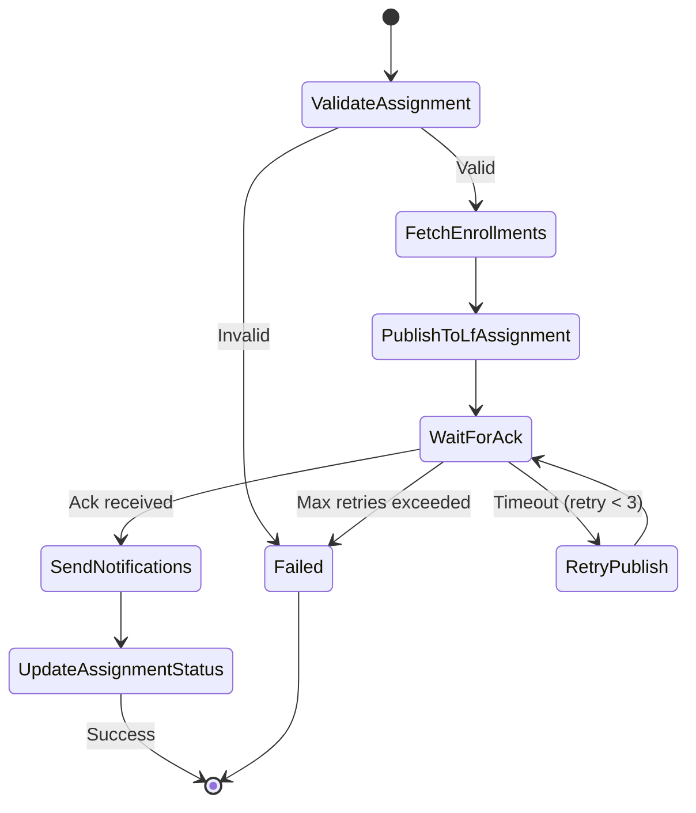
```mermaid
stateDiagram-v2
    [*] --> ValidateAssignment
    ValidateAssignment --> FetchEnrollments: Valid
    ValidateAssignment --> Failed: Invalid

    FetchEnrollments --> PublishToLfAssignment
    PublishToLfAssignment --> WaitForAck

    WaitForAck --> SendNotifications: Ack received
    WaitForAck --> RetryPublish: Timeout (retry < 3)
    WaitForAck --> Failed: Max retries exceeded

    RetryPublish --> WaitForAck

    SendNotifications --> UpdateAssignmentStatus
    UpdateAssignmentStatus --> [*]: Success

    Failed --> [*]
```

#### 7.3.3 Workflow Definition

```java
@WorkflowInterface
public interface AssignmentPublishWorkflow {

    @WorkflowMethod
    AssignmentPublishResult execute(AssignmentPublishRequest request);

    @SignalMethod
    void acknowledgePublish(String assignmentId);

    @QueryMethod
    AssignmentPublishStatus getStatus();
}

@Data
public class AssignmentPublishRequest {
    private Long assignmentId;
    private Long tenantId;
    private Long gradeItemId;
    private Long classId;
    private String title;
    private String description;
    private String instructions;
    private String submissionType;
    private List<String> allowedFileTypes;
    private Integer maxFileSizeMb;
    private LocalDateTime dueDate;
    private boolean allowLateSubmission;
    private LocalDateTime lateSubmissionDeadline;
    private BigDecimal latePenaltyPercent;
}

@Data
public class AssignmentPublishResult {
    private String workflowId;
    private Long assignmentId;
    private boolean success;
    private String errorMessage;
    private int notificationsSent;
    private LocalDateTime completedAt;
}
```

#### 7.3.4 Workflow Implementation

```java
public class AssignmentPublishWorkflowImpl implements AssignmentPublishWorkflow {

    private final AssignmentActivities activities =
        Workflow.newActivityStub(AssignmentActivities.class,
            ActivityOptions.newBuilder()
                .setStartToCloseTimeout(Duration.ofMinutes(2))
                .setRetryOptions(RetryOptions.newBuilder()
                    .setMaximumAttempts(3)
                    .setBackoffCoefficient(2.0)
                    .build())
                .build());

    private AssignmentPublishStatus status = AssignmentPublishStatus.PENDING;
    private boolean publishAcknowledged = false;

    @Override
    public AssignmentPublishResult execute(AssignmentPublishRequest request) {
        try {
            // Step 1: Validate assignment
            status = AssignmentPublishStatus.VALIDATING;
            ValidationResult validation = activities.validateAssignment(request);
            if (!validation.isValid()) {
                return failResult(request.getAssignmentId(), validation.getError());
            }

            // Step 2: Fetch enrolled students
            status = AssignmentPublishStatus.FETCHING_ENROLLMENTS;
            List<EnrollmentInfo> enrollments = activities.fetchEnrollments(
                request.getTenantId(),
                request.getClassId()
            );

            // Step 3: Publish to lf-assignment via Kafka
            status = AssignmentPublishStatus.PUBLISHING;
            activities.publishAssignmentEvent(request);

            // Step 4: Wait for acknowledgment (with timeout)
            boolean acked = Workflow.await(Duration.ofMinutes(2), () -> publishAcknowledged);
            if (!acked) {
                // Retry logic handled by activity retry options
                throw new ApplicationFailure("Publish acknowledgment timeout", "TIMEOUT");
            }

            // Step 5: Send notifications to students
            status = AssignmentPublishStatus.NOTIFYING;
            int notificationsSent = activities.sendNotifications(
                request.getTenantId(),
                request.getAssignmentId(),
                enrollments
            );

            // Step 6: Update assignment status
            status = AssignmentPublishStatus.UPDATING_STATUS;
            activities.updateAssignmentStatus(request.getAssignmentId(), "PUBLISHED");

            status = AssignmentPublishStatus.COMPLETED;
            return AssignmentPublishResult.builder()
                .workflowId(Workflow.getInfo().getWorkflowId())
                .assignmentId(request.getAssignmentId())
                .success(true)
                .notificationsSent(notificationsSent)
                .completedAt(LocalDateTime.now())
                .build();

        } catch (Exception e) {
            status = AssignmentPublishStatus.FAILED;
            return failResult(request.getAssignmentId(), e.getMessage());
        }
    }

    @Override
    public void acknowledgePublish(String assignmentId) {
        this.publishAcknowledged = true;
    }

    @Override
    public AssignmentPublishStatus getStatus() {
        return status;
    }
}
```

#### 7.3.5 Activities

```java
@ActivityInterface
public interface AssignmentActivities {

    @ActivityMethod
    ValidationResult validateAssignment(AssignmentPublishRequest request);

    @ActivityMethod
    List<EnrollmentInfo> fetchEnrollments(Long tenantId, Long classId);

    @ActivityMethod
    void publishAssignmentEvent(AssignmentPublishRequest request);

    @ActivityMethod
    int sendNotifications(Long tenantId, Long assignmentId, List<EnrollmentInfo> enrollments);

    @ActivityMethod
    void updateAssignmentStatus(Long assignmentId, String status);
}
```

---

### 7.4 AssessmentPublishWorkflow

#### 7.4.1 Mô tả
Tương tự AssignmentPublishWorkflow, workflow này publish Assessment đến lf-assessment service bao gồm cả questions.

#### 7.4.2 Workflow Diagram

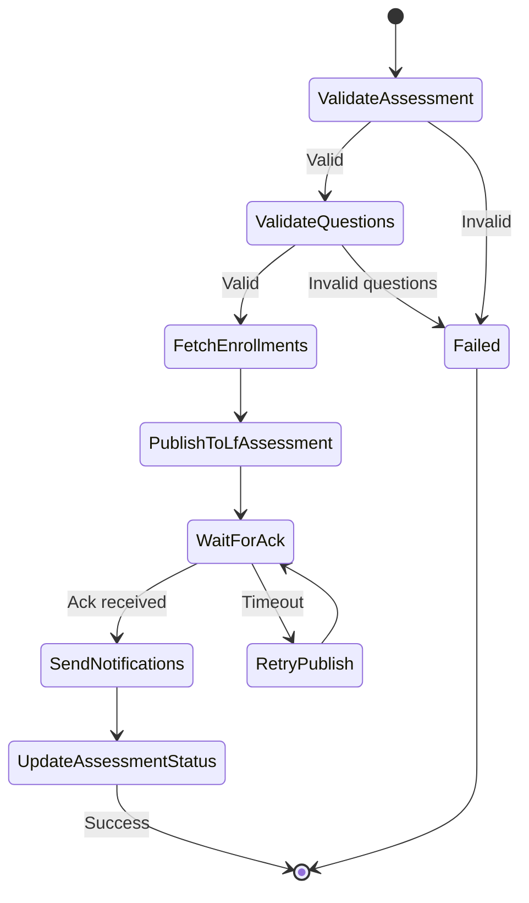
```mermaid
stateDiagram-v2
    [*] --> ValidateAssessment
    ValidateAssessment --> ValidateQuestions: Valid
    ValidateAssessment --> Failed: Invalid

    ValidateQuestions --> FetchEnrollments: Valid
    ValidateQuestions --> Failed: Invalid questions

    FetchEnrollments --> PublishToLfAssessment
    PublishToLfAssessment --> WaitForAck

    WaitForAck --> SendNotifications: Ack received
    WaitForAck --> RetryPublish: Timeout

    RetryPublish --> WaitForAck

    SendNotifications --> UpdateAssessmentStatus
    UpdateAssessmentStatus --> [*]: Success

    Failed --> [*]
```

#### 7.4.3 Workflow Definition

```java
@WorkflowInterface
public interface AssessmentPublishWorkflow {

    @WorkflowMethod
    AssessmentPublishResult execute(AssessmentPublishRequest request);

    @SignalMethod
    void acknowledgePublish(String assessmentId);

    @QueryMethod
    AssessmentPublishStatus getStatus();
}

@Data
public class AssessmentPublishRequest {
    private Long assessmentId;
    private Long tenantId;
    private Long gradeItemId;
    private Long classId;
    private String title;
    private String description;
    private String instructions;
    private Integer timeLimitMinutes;
    private LocalDateTime dueDate;
    private boolean allowLateSubmission;
    private LocalDateTime lateSubmissionDeadline;
    private Integer maxAttempts;
    private boolean shuffleQuestions;
    private boolean shuffleAnswers;
    private List<QuestionDTO> questions;
}

@Data
public class QuestionDTO {
    private Long questionId;
    private String questionType; // MCQ, TRUE_FALSE, SHORT_ANSWER, ESSAY
    private String questionText;
    private List<OptionDTO> options; // For MCQ
    private String correctAnswer; // For TRUE_FALSE
    private BigDecimal points;
    private Integer orderIndex;
}
```

---

### 7.5 FinalGradeCalculationWorkflow

#### 7.5.1 Mô tả
Workflow này tính toán Final Grade cho tất cả students trong một class dựa trên weighted average của các Grade Items.

#### 7.5.2 Business Rules
- Final Grade = Σ (Grade Item Score × Weight) / Σ Weights
- Chỉ tính các Grade Items có status = GRADED
- Pass threshold: 5.0 / 10
- Round to 2 decimal places

#### 7.5.3 Workflow Diagram

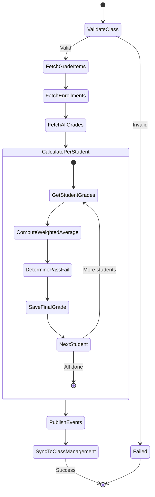
```mermaid
stateDiagram-v2
    [*] --> ValidateClass
    ValidateClass --> FetchGradeItems: Valid
    ValidateClass --> Failed: Invalid

    FetchGradeItems --> FetchEnrollments
    FetchEnrollments --> FetchAllGrades

    FetchAllGrades --> CalculatePerStudent

    state CalculatePerStudent {
        [*] --> GetStudentGrades
        GetStudentGrades --> ComputeWeightedAverage
        ComputeWeightedAverage --> DeterminePassFail
        DeterminePassFail --> SaveFinalGrade
        SaveFinalGrade --> NextStudent
        NextStudent --> GetStudentGrades: More students
        NextStudent --> [*]: All done
    }

    CalculatePerStudent --> PublishEvents
    PublishEvents --> SyncToClassManagement
    SyncToClassManagement --> [*]: Success

    Failed --> [*]
```

#### 7.5.4 Workflow Definition

```java
@WorkflowInterface
public interface FinalGradeCalculationWorkflow {

    @WorkflowMethod
    FinalGradeCalculationResult execute(FinalGradeCalculationRequest request);

    @SignalMethod
    void cancelCalculation();

    @QueryMethod
    FinalGradeProgress getProgress();
}

@Data
public class FinalGradeCalculationRequest {
    private Long tenantId;
    private Long classId;
    private boolean forceRecalculate; // Recalculate even if already calculated
    private String triggeredBy; // USER / SYSTEM
}

@Data
public class FinalGradeCalculationResult {
    private String workflowId;
    private Long classId;
    private int totalStudents;
    private int successCount;
    private int failedCount;
    private int passedStudents;
    private int failedStudents;
    private BigDecimal classAverage;
    private LocalDateTime calculatedAt;
    private List<StudentFinalGrade> grades;
}

@Data
public class StudentFinalGrade {
    private Long enrollmentId;
    private Long studentId;
    private BigDecimal finalGrade;
    private boolean passed;
    private Map<Long, BigDecimal> gradeItemScores; // gradeItemId -> score
}

@Data
public class FinalGradeProgress {
    private String status; // INITIALIZING, CALCULATING, SYNCING, COMPLETED, FAILED
    private int totalStudents;
    private int processedStudents;
    private int percentage;
}
```

#### 7.5.5 Workflow Implementation

```java
public class FinalGradeCalculationWorkflowImpl implements FinalGradeCalculationWorkflow {

    private final GradingActivities activities =
        Workflow.newActivityStub(GradingActivities.class,
            ActivityOptions.newBuilder()
                .setStartToCloseTimeout(Duration.ofMinutes(5))
                .setRetryOptions(RetryOptions.newBuilder()
                    .setMaximumAttempts(3)
                    .build())
                .build());

    private FinalGradeProgress progress = new FinalGradeProgress();
    private boolean cancelled = false;

    @Override
    public FinalGradeCalculationResult execute(FinalGradeCalculationRequest request) {
        try {
            progress.setStatus("INITIALIZING");

            // Step 1: Validate class
            ClassInfo classInfo = activities.validateClassForGrading(
                request.getTenantId(),
                request.getClassId()
            );

            // Step 2: Fetch all grade items
            List<GradeItemInfo> gradeItems = activities.fetchGradeItems(
                request.getTenantId(),
                request.getClassId()
            );

            // Validate total weight = 100%
            BigDecimal totalWeight = gradeItems.stream()
                .map(GradeItemInfo::getWeight)
                .reduce(BigDecimal.ZERO, BigDecimal::add);

            if (totalWeight.compareTo(new BigDecimal("100")) != 0) {
                throw new ApplicationFailure(
                    "Total grade item weight must be 100%, current: " + totalWeight,
                    "INVALID_WEIGHT"
                );
            }

            // Step 3: Fetch all enrollments
            List<EnrollmentInfo> enrollments = activities.fetchEnrollments(
                request.getTenantId(),
                request.getClassId()
            );

            progress.setTotalStudents(enrollments.size());
            progress.setStatus("CALCULATING");

            // Step 4: Calculate final grade for each student
            List<StudentFinalGrade> finalGrades = new ArrayList<>();
            int passedCount = 0;
            BigDecimal totalGrades = BigDecimal.ZERO;

            for (int i = 0; i < enrollments.size(); i++) {
                if (cancelled) {
                    throw new CancelledException("Calculation cancelled by user");
                }

                EnrollmentInfo enrollment = enrollments.get(i);

                // Fetch student's grades
                Map<Long, BigDecimal> studentGrades = activities.fetchStudentGrades(
                    request.getTenantId(),
                    enrollment.getEnrollmentId()
                );

                // Calculate weighted average
                BigDecimal weightedSum = BigDecimal.ZERO;
                BigDecimal appliedWeight = BigDecimal.ZERO;

                for (GradeItemInfo gradeItem : gradeItems) {
                    BigDecimal score = studentGrades.get(gradeItem.getId());
                    if (score != null) {
                        weightedSum = weightedSum.add(
                            score.multiply(gradeItem.getWeight())
                        );
                        appliedWeight = appliedWeight.add(gradeItem.getWeight());
                    }
                }

                BigDecimal finalGrade = BigDecimal.ZERO;
                if (appliedWeight.compareTo(BigDecimal.ZERO) > 0) {
                    finalGrade = weightedSum.divide(appliedWeight, 2, RoundingMode.HALF_UP);
                }

                boolean passed = finalGrade.compareTo(new BigDecimal("5.0")) >= 0;
                if (passed) passedCount++;
                totalGrades = totalGrades.add(finalGrade);

                // Save final grade
                activities.saveFinalGrade(
                    enrollment.getEnrollmentId(),
                    finalGrade,
                    passed
                );

                StudentFinalGrade studentFinalGrade = new StudentFinalGrade();
                studentFinalGrade.setEnrollmentId(enrollment.getEnrollmentId());
                studentFinalGrade.setStudentId(enrollment.getStudentId());
                studentFinalGrade.setFinalGrade(finalGrade);
                studentFinalGrade.setPassed(passed);
                studentFinalGrade.setGradeItemScores(studentGrades);
                finalGrades.add(studentFinalGrade);

                progress.setProcessedStudents(i + 1);
                progress.setPercentage((i + 1) * 100 / enrollments.size());
            }

            // Step 5: Publish events
            progress.setStatus("SYNCING");
            activities.publishFinalGradeCalculatedEvent(
                request.getTenantId(),
                request.getClassId(),
                finalGrades
            );

            // Step 6: Sync to tf-class-management
            activities.syncFinalGradesToClassManagement(
                request.getTenantId(),
                request.getClassId(),
                finalGrades
            );

            progress.setStatus("COMPLETED");

            BigDecimal classAverage = enrollments.isEmpty() ? BigDecimal.ZERO :
                totalGrades.divide(new BigDecimal(enrollments.size()), 2, RoundingMode.HALF_UP);

            return FinalGradeCalculationResult.builder()
                .workflowId(Workflow.getInfo().getWorkflowId())
                .classId(request.getClassId())
                .totalStudents(enrollments.size())
                .successCount(finalGrades.size())
                .failedCount(0)
                .passedStudents(passedCount)
                .failedStudents(enrollments.size() - passedCount)
                .classAverage(classAverage)
                .calculatedAt(LocalDateTime.now())
                .grades(finalGrades)
                .build();

        } catch (Exception e) {
            progress.setStatus("FAILED");
            throw e;
        }
    }

    @Override
    public void cancelCalculation() {
        this.cancelled = true;
    }

    @Override
    public FinalGradeProgress getProgress() {
        return progress;
    }
}
```

---

### 7.6 GradeSyncWorkflow

#### 7.6.1 Mô tả
Workflow này đồng bộ Final Grades từ tf-grading sang tf-class-management để update enrollment records.

#### 7.6.2 Workflow Diagram

```mermaid
sequenceDiagram
    participant TG as tf-grading
    participant TW as Temporal Worker
    participant TCM as tf-class-management

    TG->>TW: Start GradeSyncWorkflow

    TW->>TW: Validate grades data
    TW->>TW: Prepare sync payload

    loop For each enrollment batch (100)
        TW->>TCM: POST /internal/enrollments/grades
        TCM-->>TW: Batch result
        TW->>TW: Track progress
    end

    TW->>TG: Publish FinalGradeSyncedEvent
    TW->>TG: Return sync result
```

#### 7.6.3 Workflow Definition

```java
@WorkflowInterface
public interface GradeSyncWorkflow {

    @WorkflowMethod
    GradeSyncResult execute(GradeSyncRequest request);

    @QueryMethod
    GradeSyncProgress getProgress();
}

@Data
public class GradeSyncRequest {
    private Long tenantId;
    private Long classId;
    private List<EnrollmentGrade> enrollmentGrades;
}

@Data
public class EnrollmentGrade {
    private Long enrollmentId;
    private BigDecimal finalGrade;
    private boolean passed;
}

@Data
public class GradeSyncResult {
    private String workflowId;
    private Long classId;
    private int totalEnrollments;
    private int syncedCount;
    private int failedCount;
    private List<Long> failedEnrollmentIds;
    private LocalDateTime syncedAt;
}
```

#### 7.6.4 Activities

```java
@ActivityInterface
public interface GradeSyncActivities {

    @ActivityMethod
    BatchSyncResult syncEnrollmentBatch(Long tenantId, List<EnrollmentGrade> batch);

    @ActivityMethod
    void publishFinalGradeSyncedEvent(Long tenantId, Long classId, GradeSyncResult result);
}
```

---

### 7.7 BulkGradingWorkflow

#### 7.7.1 Mô tả
Workflow hỗ trợ Teacher chấm điểm hàng loạt (bulk grading) cho nhiều submissions cùng lúc.

#### 7.7.2 Use Cases
- Teacher import grades từ Excel/CSV
- Teacher apply same grade to multiple submissions (e.g., attendance grade)
- Auto-apply late penalty to late submissions

#### 7.7.3 Workflow Diagram

```mermaid
stateDiagram-v2
    [*] --> ValidateInput
    ValidateInput --> ParseGrades: Valid
    ValidateInput --> Failed: Invalid

    ParseGrades --> ValidateScores
    ValidateScores --> ApplyGrades: All valid
    ValidateScores --> ReportErrors: Has errors

    state ApplyGrades {
        [*] --> ProcessBatch
        ProcessBatch --> SaveGrades
        SaveGrades --> NextBatch: More batches
        SaveGrades --> [*]: All done
        NextBatch --> ProcessBatch
    }

    ApplyGrades --> PublishEvents
    PublishEvents --> GenerateReport
    GenerateReport --> [*]: Success

    ReportErrors --> [*]
    Failed --> [*]
```

#### 7.7.4 Workflow Definition

```java
@WorkflowInterface
public interface BulkGradingWorkflow {

    @WorkflowMethod
    BulkGradingResult execute(BulkGradingRequest request);

    @SignalMethod
    void cancelGrading();

    @QueryMethod
    BulkGradingProgress getProgress();
}

@Data
public class BulkGradingRequest {
    private Long tenantId;
    private Long gradeItemId;
    private Long gradedBy; // Teacher ID
    private List<GradeEntry> grades;
    private boolean applyLatePenalty;
    private String source; // MANUAL, IMPORT_CSV, IMPORT_EXCEL
}

@Data
public class GradeEntry {
    private Long enrollmentId;
    private Long studentId;
    private BigDecimal score;
    private String feedback;
}

@Data
public class BulkGradingResult {
    private String workflowId;
    private Long gradeItemId;
    private int totalEntries;
    private int successCount;
    private int failedCount;
    private List<GradeError> errors;
    private LocalDateTime completedAt;
}

@Data
public class GradeError {
    private Long enrollmentId;
    private String errorCode;
    private String errorMessage;
}
```

---

### 7.8 LateSubmissionReminderWorkflow

#### 7.8.1 Mô tả
Scheduled workflow gửi reminders cho students về deadlines sắp đến.

#### 7.8.2 Schedule
- Chạy mỗi ngày lúc 8:00 AM (UTC+7)
- Gửi reminder trước deadline: 24 hours, 6 hours, 1 hour

#### 7.8.3 Workflow Definition

```java
@WorkflowInterface
public interface LateSubmissionReminderWorkflow {

    @WorkflowMethod
    ReminderResult execute(ReminderRequest request);
}

@Data
public class ReminderRequest {
    private Long tenantId;
    private LocalDateTime checkTime;
    private List<Integer> reminderHoursBefore; // [24, 6, 1]
}

@Data
public class ReminderResult {
    private int assignmentsChecked;
    private int assessmentsChecked;
    private int remindersQueued;
    private LocalDateTime completedAt;
}
```

---

### 7.9 Workflow Configuration

#### 7.9.1 Temporal Configuration

```yaml
temporal:
  namespace: grading-namespace
  task-queues:
    grading-workflow-queue:
      workflow-executors: 4
      activity-executors: 8
      max-concurrent-workflow-tasks: 200
      max-concurrent-activity-tasks: 400
    assignment-workflow-queue:
      workflow-executors: 2
      activity-executors: 4
    assessment-workflow-queue:
      workflow-executors: 2
      activity-executors: 4

  workflow-defaults:
    execution-timeout: 1h
    run-timeout: 30m
    task-timeout: 10s

  retry-policy:
    initial-interval: 1s
    backoff-coefficient: 2.0
    maximum-interval: 60s
    maximum-attempts: 5
```

#### 7.9.2 Workflow Registration

```java
@Configuration
public class TemporalConfig {

    @Bean
    public WorkerFactory workerFactory(WorkflowClient workflowClient) {
        return WorkerFactory.newInstance(workflowClient);
    }

    @Bean
    public Worker gradingWorker(WorkerFactory factory,
                                 GradingActivities gradingActivities) {
        Worker worker = factory.newWorker("grading-workflow-queue");

        // Register workflows
        worker.registerWorkflowImplementationTypes(
            FinalGradeCalculationWorkflowImpl.class,
            GradeSyncWorkflowImpl.class,
            BulkGradingWorkflowImpl.class,
            LateSubmissionReminderWorkflowImpl.class
        );

        // Register activities
        worker.registerActivitiesImplementations(gradingActivities);

        return worker;
    }

    @Bean
    public Worker assignmentWorker(WorkerFactory factory,
                                    AssignmentActivities assignmentActivities) {
        Worker worker = factory.newWorker("assignment-workflow-queue");

        worker.registerWorkflowImplementationTypes(
            AssignmentPublishWorkflowImpl.class
        );
        worker.registerActivitiesImplementations(assignmentActivities);

        return worker;
    }

    @Bean
    public Worker assessmentWorker(WorkerFactory factory,
                                    AssessmentActivities assessmentActivities) {
        Worker worker = factory.newWorker("assessment-workflow-queue");

        worker.registerWorkflowImplementationTypes(
            AssessmentPublishWorkflowImpl.class
        );
        worker.registerActivitiesImplementations(assessmentActivities);

        return worker;
    }
}
```

#### 7.9.3 Workflow Starter Service

```java
@Service
@RequiredArgsConstructor
public class GradingWorkflowStarter {

    private final WorkflowClient workflowClient;

    public String startFinalGradeCalculation(FinalGradeCalculationRequest request) {
        WorkflowOptions options = WorkflowOptions.newBuilder()
            .setTaskQueue("grading-workflow-queue")
            .setWorkflowId("final-grade-" + request.getClassId() + "-" +
                           System.currentTimeMillis())
            .setWorkflowExecutionTimeout(Duration.ofHours(1))
            .build();

        FinalGradeCalculationWorkflow workflow = workflowClient.newWorkflowStub(
            FinalGradeCalculationWorkflow.class,
            options
        );

        WorkflowClient.start(workflow::execute, request);
        return options.getWorkflowId();
    }

    public String startAssignmentPublish(AssignmentPublishRequest request) {
        WorkflowOptions options = WorkflowOptions.newBuilder()
            .setTaskQueue("assignment-workflow-queue")
            .setWorkflowId("assignment-publish-" + request.getAssignmentId())
            .setWorkflowExecutionTimeout(Duration.ofMinutes(10))
            .build();

        AssignmentPublishWorkflow workflow = workflowClient.newWorkflowStub(
            AssignmentPublishWorkflow.class,
            options
        );

        WorkflowClient.start(workflow::execute, request);
        return options.getWorkflowId();
    }

    public FinalGradeProgress queryFinalGradeProgress(String workflowId) {
        FinalGradeCalculationWorkflow workflow = workflowClient.newWorkflowStub(
            FinalGradeCalculationWorkflow.class,
            workflowId
        );
        return workflow.getProgress();
    }
}
```

---

### 7.10 Error Handling & Compensation

#### 7.10.1 Retry Strategies

| Activity Type | Max Attempts | Initial Interval | Backoff | Max Interval |
|---------------|--------------|------------------|---------|--------------|
| Database operations | 3 | 1s | 2.0 | 30s |
| External service calls | 5 | 2s | 2.0 | 60s |
| Kafka publish | 3 | 1s | 2.0 | 30s |
| Notification | 3 | 5s | 1.5 | 30s |

#### 7.10.2 Compensation Actions

```java
public class FinalGradeCalculationWorkflowImpl implements FinalGradeCalculationWorkflow {

    private final List<Long> processedEnrollments = new ArrayList<>();

    @Override
    public FinalGradeCalculationResult execute(FinalGradeCalculationRequest request) {
        try {
            // ... calculation logic ...

            for (EnrollmentInfo enrollment : enrollments) {
                activities.saveFinalGrade(enrollment.getEnrollmentId(), finalGrade, passed);
                processedEnrollments.add(enrollment.getEnrollmentId());
            }

        } catch (Exception e) {
            // Compensation: rollback saved grades
            for (Long enrollmentId : processedEnrollments) {
                try {
                    activities.rollbackFinalGrade(enrollmentId);
                } catch (Exception rollbackEx) {
                    // Log rollback failure
                }
            }
            throw e;
        }
    }
}
```

#### 7.10.3 Dead Letter Handling

```java
@ActivityImpl
public class GradingActivitiesImpl implements GradingActivities {

    @Override
    public void saveFinalGrade(Long enrollmentId, BigDecimal grade, boolean passed) {
        try {
            gradeRepository.saveFinalGrade(enrollmentId, grade, passed);
        } catch (Exception e) {
            // Send to dead letter queue for manual review
            deadLetterService.send(DeadLetterMessage.builder()
                .type("FINAL_GRADE_SAVE_FAILED")
                .payload(Map.of(
                    "enrollmentId", enrollmentId,
                    "grade", grade,
                    "passed", passed
                ))
                .error(e.getMessage())
                .timestamp(Instant.now())
                .build());
            throw e;
        }
    }
}
```

---

## 8. API Contracts

### 8.1 API Overview

```
┌─────────────────────────────────────────────────────────────────────────────────────────┐
│                               API ARCHITECTURE OVERVIEW                                  │
├─────────────────────────────────────────────────────────────────────────────────────────┤
│                                                                                          │
│   ┌──────────────────────────────────────────────────────────────────────────────────┐  │
│   │                              TEACHER FACING (tf-grading)                          │  │
│   │                                                                                    │  │
│   │   Grade Items        Assignments         Assessments         Grading              │  │
│   │   ────────────       ───────────        ────────────        ─────────             │  │
│   │   POST /grade-items  POST /assignments  POST /assessments   POST /student-grades  │  │
│   │   GET  /grade-items  GET  /assignments  GET  /assessments   GET  /gradebook       │  │
│   │   PUT  /grade-items  PUT  /assignments  PUT  /assessments   POST /release-grades  │  │
│   │   DEL  /grade-items  POST /close        POST /questions     GET  /pending-reviews │  │
│   │                                                                                    │  │
│   └──────────────────────────────────────────────────────────────────────────────────┘  │
│                                                                                          │
│   ┌──────────────────────────────────────────────────────────────────────────────────┐  │
│   │                            STUDENT FACING (lf-assignment)                         │  │
│   │                                                                                    │  │
│   │   GET  /my-assignments                 View assigned assignments                   │  │
│   │   GET  /assignments/{id}               Get assignment details                      │  │
│   │   POST /assignments/{id}/submit        Submit assignment (file/link)               │  │
│   │   PUT  /submissions/{id}               Update submission before graded             │  │
│   │   GET  /submissions/{id}/grade         View grade after release                    │  │
│   │                                                                                    │  │
│   └──────────────────────────────────────────────────────────────────────────────────┘  │
│                                                                                          │
│   ┌──────────────────────────────────────────────────────────────────────────────────┐  │
│   │                            STUDENT FACING (lf-assessment)                         │  │
│   │                                                                                    │  │
│   │   GET  /my-assessments                 View assigned assessments                   │  │
│   │   GET  /assessments/{id}               Get assessment info                         │  │
│   │   POST /assessments/{id}/start         Start assessment attempt                    │  │
│   │   POST /attempts/{id}/answer           Submit answer for question                  │  │
│   │   POST /attempts/{id}/submit           Submit entire assessment                    │  │
│   │   GET  /attempts/{id}/result           View result after release                   │  │
│   │                                                                                    │  │
│   └──────────────────────────────────────────────────────────────────────────────────┘  │
│                                                                                          │
└─────────────────────────────────────────────────────────────────────────────────────────┘
```

### 8.2 Common Standards

#### 8.2.1 Base URL
```
tf-grading:     /api/v1/grading
lf-assignment:  /api/v1/assignment
lf-assessment:  /api/v1/assessment
```

#### 8.2.2 Common Headers
```
Authorization: Bearer <JWT_TOKEN>
Content-Type: application/json
X-Tenant-Id: <tenant_id>
X-Request-Id: <uuid>
Accept-Language: vi-VN | en-US
```

#### 8.2.3 Common Response Format

**Success Response**
```json
{
  "success": true,
  "data": { },
  "meta": {
    "requestId": "uuid",
    "timestamp": "2024-01-15T10:30:00Z"
  }
}
```

**Error Response**
```json
{
  "success": false,
  "error": {
    "code": "GRD001",
    "message": "Not authorized to grade",
    "details": { }
  },
  "meta": {
    "requestId": "uuid",
    "timestamp": "2024-01-15T10:30:00Z"
  }
}
```

**Paginated Response**
```json
{
  "success": true,
  "data": [ ],
  "pagination": {
    "page": 1,
    "size": 20,
    "totalElements": 100,
    "totalPages": 5,
    "hasNext": true,
    "hasPrevious": false
  },
  "meta": {
    "requestId": "uuid",
    "timestamp": "2024-01-15T10:30:00Z"
  }
}
```

---

### 8.3 tf-grading APIs (Teacher Service)

#### 8.3.1 Grade Item APIs

##### Create Grade Item

```
POST /api/v1/grading/classes/{classId}/grade-items
```

**Authorization:** Main Teacher only

**Path Parameters:**
| Parameter | Type | Required | Description |
|-----------|------|----------|-------------|
| classId | Long | Yes | Class ID |

**Request Body:**
```json
{
  "name": "Midterm Exam",
  "type": "MIDTERM",
  "description": "Kiểm tra giữa kỳ môn Toán",
  "weight": 30.00,
  "maxScore": 10.00,
  "dueDate": "2024-02-15T23:59:59Z",
  "orderIndex": 2
}
```

**Request Validation:**
| Field | Type | Required | Validation |
|-------|------|----------|------------|
| name | String | Yes | Max 255 chars |
| type | Enum | Yes | QUIZ, ASSIGNMENT, MIDTERM, FINAL |
| description | String | No | Max 2000 chars |
| weight | Decimal | Yes | 0.01 - 100.00 |
| maxScore | Decimal | No | Default 10.00, range 0.01 - 100.00 |
| dueDate | DateTime | No | Must be future date |
| orderIndex | Integer | No | Auto-increment if not provided |

**Response (201 Created):**
```json
{
  "success": true,
  "data": {
    "id": 101,
    "tenantId": 1,
    "classId": 100,
    "name": "Midterm Exam",
    "type": "MIDTERM",
    "description": "Kiểm tra giữa kỳ môn Toán",
    "weight": 30.00,
    "maxScore": 10.00,
    "dueDate": "2024-02-15T23:59:59Z",
    "status": "DRAFT",
    "orderIndex": 2,
    "createdAt": "2024-01-15T10:30:00Z",
    "createdBy": 5001
  }
}
```

**Business Rules:**
- Total weight of all grade items in a class must not exceed 100%
- Cannot create grade item for COMPLETED class
- Name must be unique within the class

---

##### List Grade Items

```
GET /api/v1/grading/classes/{classId}/grade-items
```

**Authorization:** Main Teacher, Assistant Teacher

**Query Parameters:**
| Parameter | Type | Required | Default | Description |
|-----------|------|----------|---------|-------------|
| status | String | No | all | DRAFT, PUBLISHED, GRADING, GRADED, ARCHIVED |
| type | String | No | all | QUIZ, ASSIGNMENT, MIDTERM, FINAL |
| page | Integer | No | 0 | Page number |
| size | Integer | No | 20 | Page size (max 100) |
| sort | String | No | orderIndex,asc | Sort field and direction |

**Response (200 OK):**
```json
{
  "success": true,
  "data": [
    {
      "id": 101,
      "name": "Midterm Exam",
      "type": "MIDTERM",
      "weight": 30.00,
      "maxScore": 10.00,
      "dueDate": "2024-02-15T23:59:59Z",
      "status": "PUBLISHED",
      "orderIndex": 2,
      "hasAssignment": false,
      "hasAssessment": true,
      "submissionCount": 25,
      "gradedCount": 20,
      "createdAt": "2024-01-15T10:30:00Z"
    }
  ],
  "pagination": {
    "page": 0,
    "size": 20,
    "totalElements": 5,
    "totalPages": 1
  }
}
```

---

##### Get Grade Item Detail

```
GET /api/v1/grading/grade-items/{id}
```

**Authorization:** Main Teacher, Assistant Teacher

**Response (200 OK):**
```json
{
  "success": true,
  "data": {
    "id": 101,
    "tenantId": 1,
    "classId": 100,
    "name": "Midterm Exam",
    "type": "MIDTERM",
    "description": "Kiểm tra giữa kỳ môn Toán",
    "weight": 30.00,
    "maxScore": 10.00,
    "dueDate": "2024-02-15T23:59:59Z",
    "status": "PUBLISHED",
    "orderIndex": 2,
    "settings": {
      "showToStudents": true
    },
    "assignment": null,
    "assessment": {
      "id": 201,
      "title": "Midterm Math Assessment",
      "timeLimitMinutes": 60,
      "questionCount": 30
    },
    "statistics": {
      "totalStudents": 25,
      "submittedCount": 25,
      "gradedCount": 20,
      "pendingCount": 5,
      "averageScore": 7.85,
      "highestScore": 10.00,
      "lowestScore": 4.50
    },
    "createdAt": "2024-01-15T10:30:00Z",
    "updatedAt": "2024-01-20T15:00:00Z",
    "createdBy": 5001
  }
}
```

---

##### Update Grade Item

```
PUT /api/v1/grading/grade-items/{id}
```

**Authorization:** Main Teacher only

**Request Body:**
```json
{
  "name": "Midterm Exam - Updated",
  "description": "Updated description",
  "weight": 35.00,
  "dueDate": "2024-02-20T23:59:59Z",
  "orderIndex": 3
}
```

**Business Rules:**
- Cannot update if status is GRADED or ARCHIVED
- Cannot change type after creation
- Validate total weight constraint

---

##### Delete Grade Item

```
DELETE /api/v1/grading/grade-items/{id}
```

**Authorization:** Main Teacher only

**Business Rules:**
- Can only delete DRAFT grade items
- Must delete associated assignment/assessment first
- Returns 409 Conflict if has student grades

---

##### Publish Grade Item

```
POST /api/v1/grading/grade-items/{id}/publish
```

**Authorization:** Main Teacher only

**Business Rules:**
- Must have either Assignment or Assessment linked
- Assignment/Assessment must be ready (has content)
- Transitions status from DRAFT to PUBLISHED

---

#### 8.3.2 Assignment APIs (Teacher)

##### Create Assignment

```
POST /api/v1/grading/grade-items/{gradeItemId}/assignment
```

**Authorization:** Main Teacher only

**Request Body:**
```json
{
  "title": "Essay: Vietnam History",
  "description": "Write an essay about Vietnam history",
  "instructions": "1. Choose a topic\n2. Write 1000-1500 words\n3. Include references",
  "submissionType": "FILE_UPLOAD",
  "allowedFileTypes": ["pdf", "docx", "doc"],
  "maxFileSizeMb": 10,
  "dueDate": "2024-02-15T23:59:59Z",
  "allowLateSubmission": true,
  "lateSubmissionDeadline": "2024-02-17T23:59:59Z",
  "latePenaltyPercent": 10.00
}
```

**Request Validation:**
| Field | Type | Required | Validation |
|-------|------|----------|------------|
| title | String | Yes | Max 255 chars |
| description | String | No | Max 5000 chars |
| instructions | String | No | Max 10000 chars |
| submissionType | Enum | Yes | FILE_UPLOAD, LINK |
| allowedFileTypes | Array | No | Required if FILE_UPLOAD |
| maxFileSizeMb | Integer | No | Default 50, max 100 |
| dueDate | DateTime | Yes | Must be future |
| allowLateSubmission | Boolean | No | Default false |
| lateSubmissionDeadline | DateTime | Conditional | Required if allowLateSubmission=true |
| latePenaltyPercent | Decimal | No | 0-100, default 0 |

**Response (201 Created):**
```json
{
  "success": true,
  "data": {
    "id": 301,
    "gradeItemId": 101,
    "title": "Essay: Vietnam History",
    "submissionType": "FILE_UPLOAD",
    "status": "DRAFT",
    "dueDate": "2024-02-15T23:59:59Z",
    "allowLateSubmission": true,
    "lateSubmissionDeadline": "2024-02-17T23:59:59Z",
    "latePenaltyPercent": 10.00,
    "createdAt": "2024-01-15T10:30:00Z"
  }
}
```

---

##### Get Assignment Submissions

```
GET /api/v1/grading/assignments/{id}/submissions
```

**Authorization:** Main Teacher, Assistant Teacher

**Query Parameters:**
| Parameter | Type | Required | Default | Description |
|-----------|------|----------|---------|-------------|
| status | String | No | all | SUBMITTED, LATE_SUBMITTED, GRADED, RETURNED |
| search | String | No | - | Search by student name/email |
| page | Integer | No | 0 | Page number |
| size | Integer | No | 20 | Page size |

**Response (200 OK):**
```json
{
  "success": true,
  "data": [
    {
      "id": 401,
      "enrollmentId": 2001,
      "student": {
        "id": 6001,
        "name": "Nguyen Van A",
        "email": "a.nguyen@email.com",
        "avatarUrl": "https://..."
      },
      "submissionType": "FILE_UPLOAD",
      "fileName": "essay.pdf",
      "fileUrl": "https://s3.../essay.pdf",
      "fileSizeBytes": 1048576,
      "status": "SUBMITTED",
      "submittedAt": "2024-02-14T22:30:00Z",
      "isLate": false,
      "grade": null,
      "feedback": null
    }
  ],
  "pagination": {
    "page": 0,
    "size": 20,
    "totalElements": 25
  }
}
```

---

##### Close Assignment

```
POST /api/v1/grading/assignments/{id}/close
```

**Authorization:** Main Teacher only

**Business Rules:**
- No more submissions accepted after close
- Existing submissions remain for grading

---

#### 8.3.3 Assessment APIs (Teacher)

##### Create Assessment

```
POST /api/v1/grading/grade-items/{gradeItemId}/assessment
```

**Authorization:** Main Teacher only

**Request Body:**
```json
{
  "title": "Midterm Math Quiz",
  "description": "Multiple choice quiz covering chapters 1-5",
  "instructions": "Read each question carefully. You have 60 minutes.",
  "timeLimitMinutes": 60,
  "dueDate": "2024-02-15T23:59:59Z",
  "allowLateSubmission": false,
  "maxAttempts": 1,
  "shuffleQuestions": true,
  "shuffleAnswers": true,
  "passingScore": 5.00
}
```

**Response (201 Created):**
```json
{
  "success": true,
  "data": {
    "id": 201,
    "gradeItemId": 101,
    "title": "Midterm Math Quiz",
    "timeLimitMinutes": 60,
    "questionCount": 0,
    "totalPoints": 0,
    "status": "DRAFT",
    "dueDate": "2024-02-15T23:59:59Z",
    "maxAttempts": 1,
    "shuffleQuestions": true,
    "shuffleAnswers": true,
    "createdAt": "2024-01-15T10:30:00Z"
  }
}
```

---

##### Add Question to Assessment

```
POST /api/v1/grading/assessments/{id}/questions
```

**Authorization:** Main Teacher only

**Request Body (MCQ):**
```json
{
  "questionType": "MCQ",
  "questionText": "What is 2 + 2?",
  "points": 1.00,
  "orderIndex": 1,
  "options": [
    { "text": "3", "isCorrect": false },
    { "text": "4", "isCorrect": true },
    { "text": "5", "isCorrect": false },
    { "text": "6", "isCorrect": false }
  ]
}
```

**Request Body (TRUE_FALSE):**
```json
{
  "questionType": "TRUE_FALSE",
  "questionText": "The Earth is flat.",
  "points": 1.00,
  "orderIndex": 2,
  "correctAnswer": "false"
}
```

**Request Body (ESSAY):**
```json
{
  "questionType": "ESSAY",
  "questionText": "Explain the theory of relativity.",
  "points": 5.00,
  "orderIndex": 3
}
```

**Response (201 Created):**
```json
{
  "success": true,
  "data": {
    "id": 501,
    "assessmentId": 201,
    "questionType": "MCQ",
    "questionText": "What is 2 + 2?",
    "points": 1.00,
    "orderIndex": 1,
    "options": [
      { "id": 1, "text": "3", "isCorrect": false },
      { "id": 2, "text": "4", "isCorrect": true },
      { "id": 3, "text": "5", "isCorrect": false },
      { "id": 4, "text": "6", "isCorrect": false }
    ],
    "createdAt": "2024-01-15T10:30:00Z"
  }
}
```

---

##### Get Assessment Attempts

```
GET /api/v1/grading/assessments/{id}/attempts
```

**Authorization:** Main Teacher, Assistant Teacher

**Query Parameters:**
| Parameter | Type | Required | Default | Description |
|-----------|------|----------|---------|-------------|
| status | String | No | all | IN_PROGRESS, SUBMITTED, AUTO_GRADED, GRADED |
| needsManualGrading | Boolean | No | - | Filter attempts needing manual review |
| page | Integer | No | 0 | Page number |
| size | Integer | No | 20 | Page size |

**Response (200 OK):**
```json
{
  "success": true,
  "data": [
    {
      "id": 601,
      "enrollmentId": 2001,
      "student": {
        "id": 6001,
        "name": "Nguyen Van A",
        "email": "a.nguyen@email.com"
      },
      "attemptNumber": 1,
      "status": "AUTO_GRADED",
      "startedAt": "2024-02-15T10:00:00Z",
      "submittedAt": "2024-02-15T10:45:00Z",
      "isLate": false,
      "autoScore": 8.00,
      "manualScore": null,
      "totalScore": 8.00,
      "timeSpentSeconds": 2700,
      "needsManualGrading": true,
      "manualGradingPending": 2
    }
  ]
}
```

---

#### 8.3.4 Grading APIs

##### Submit Grade

```
POST /api/v1/grading/student-grades
```

**Authorization:** Main Teacher only

**Request Body:**
```json
{
  "gradeItemId": 101,
  "enrollmentId": 2001,
  "score": 8.50,
  "feedback": "Good work! Could improve on section 3."
}
```

**Request Validation:**
| Field | Type | Required | Validation |
|-------|------|----------|------------|
| gradeItemId | Long | Yes | Must exist |
| enrollmentId | Long | Yes | Must belong to class |
| score | Decimal | Yes | 0 - maxScore (default 10) |
| feedback | String | No | Max 5000 chars |

**Response (201 Created):**
```json
{
  "success": true,
  "data": {
    "id": 701,
    "gradeItemId": 101,
    "enrollmentId": 2001,
    "studentId": 6001,
    "score": 8.50,
    "percentage": 85.00,
    "status": "GRADED",
    "feedback": "Good work! Could improve on section 3.",
    "gradedBy": 5001,
    "gradedAt": "2024-02-20T14:30:00Z"
  }
}
```

---

##### Bulk Grade Submissions

```
POST /api/v1/grading/student-grades/bulk
```

**Authorization:** Main Teacher only

**Request Body:**
```json
{
  "gradeItemId": 101,
  "grades": [
    { "enrollmentId": 2001, "score": 8.50, "feedback": "Good work!" },
    { "enrollmentId": 2002, "score": 7.00, "feedback": "Needs improvement" },
    { "enrollmentId": 2003, "score": 9.00, "feedback": "Excellent!" }
  ],
  "applyLatePenalty": true
}
```

**Response (200 OK):**
```json
{
  "success": true,
  "data": {
    "totalSubmitted": 3,
    "successCount": 3,
    "failedCount": 0,
    "errors": [],
    "workflowId": "bulk-grading-101-1705320000000"
  }
}
```

---

##### Get Gradebook

```
GET /api/v1/grading/classes/{classId}/gradebook
```

**Authorization:** Main Teacher, Assistant Teacher

**Query Parameters:**
| Parameter | Type | Required | Default | Description |
|-----------|------|----------|---------|-------------|
| search | String | No | - | Search by student name |
| sortBy | String | No | studentName | studentName, finalGrade, submissionStatus |
| sortDir | String | No | asc | asc, desc |
| page | Integer | No | 0 | Page number |
| size | Integer | No | 50 | Page size |

**Response (200 OK):**
```json
{
  "success": true,
  "data": {
    "classId": 100,
    "className": "Math 101 - Spring 2024",
    "gradeItems": [
      { "id": 101, "name": "Quiz 1", "type": "QUIZ", "weight": 10, "maxScore": 10 },
      { "id": 102, "name": "Midterm", "type": "MIDTERM", "weight": 30, "maxScore": 10 },
      { "id": 103, "name": "Assignment 1", "type": "ASSIGNMENT", "weight": 20, "maxScore": 10 },
      { "id": 104, "name": "Final", "type": "FINAL", "weight": 40, "maxScore": 10 }
    ],
    "students": [
      {
        "enrollmentId": 2001,
        "studentId": 6001,
        "studentName": "Nguyen Van A",
        "studentEmail": "a.nguyen@email.com",
        "grades": {
          "101": { "score": 9.00, "status": "GRADED", "released": true },
          "102": { "score": 8.50, "status": "GRADED", "released": true },
          "103": { "score": 7.00, "status": "GRADED", "released": false },
          "104": { "score": null, "status": "NOT_GRADED", "released": false }
        },
        "finalGrade": null,
        "passed": null
      },
      {
        "enrollmentId": 2002,
        "studentId": 6002,
        "studentName": "Tran Thi B",
        "studentEmail": "b.tran@email.com",
        "grades": {
          "101": { "score": 8.00, "status": "GRADED", "released": true },
          "102": { "score": 9.50, "status": "GRADED", "released": true },
          "103": { "score": 8.50, "status": "GRADED", "released": false },
          "104": { "score": null, "status": "NOT_GRADED", "released": false }
        },
        "finalGrade": null,
        "passed": null
      }
    ],
    "statistics": {
      "totalStudents": 25,
      "averageFinalGrade": null,
      "passRate": null,
      "gradeDistribution": null
    }
  },
  "pagination": {
    "page": 0,
    "size": 50,
    "totalElements": 25
  }
}
```

---

##### Get Pending Reviews

```
GET /api/v1/grading/classes/{classId}/pending-reviews
```

**Authorization:** Main Teacher, Assistant Teacher

**Response (200 OK):**
```json
{
  "success": true,
  "data": {
    "summary": {
      "totalPending": 15,
      "assignments": 5,
      "assessments": 10
    },
    "items": [
      {
        "type": "ASSIGNMENT",
        "gradeItemId": 103,
        "gradeItemName": "Essay Assignment",
        "assignmentId": 301,
        "pendingCount": 5,
        "oldestSubmission": "2024-02-14T10:00:00Z"
      },
      {
        "type": "ASSESSMENT",
        "gradeItemId": 102,
        "gradeItemName": "Midterm",
        "assessmentId": 201,
        "pendingCount": 10,
        "questionsNeedingReview": ["ESSAY", "SHORT_ANSWER"],
        "oldestSubmission": "2024-02-15T09:00:00Z"
      }
    ]
  }
}
```

---

##### Release Grades

```
POST /api/v1/grading/classes/{classId}/release-grades
```

**Authorization:** Main Teacher only

**Request Body:**
```json
{
  "gradeItemIds": [101, 102],
  "notifyStudents": true
}
```

**Business Rules:**
- Only release GRADED grade items
- Once released, students can see their grades
- Send notifications if notifyStudents=true

**Response (200 OK):**
```json
{
  "success": true,
  "data": {
    "releasedCount": 2,
    "gradeItemIds": [101, 102],
    "studentsNotified": 25,
    "releasedAt": "2024-02-20T15:00:00Z"
  }
}
```

---

##### Calculate Final Grades

```
POST /api/v1/grading/classes/{classId}/calculate-final-grades
```

**Authorization:** Main Teacher only

**Request Body:**
```json
{
  "forceRecalculate": false
}
```

**Response (202 Accepted):**
```json
{
  "success": true,
  "data": {
    "workflowId": "final-grade-100-1705320000000",
    "status": "STARTED",
    "message": "Final grade calculation started. Track progress using workflow ID."
  }
}
```

---

##### Check Final Grade Calculation Progress

```
GET /api/v1/grading/classes/{classId}/final-grade-progress/{workflowId}
```

**Response (200 OK):**
```json
{
  "success": true,
  "data": {
    "workflowId": "final-grade-100-1705320000000",
    "status": "CALCULATING",
    "totalStudents": 25,
    "processedStudents": 15,
    "percentage": 60,
    "startedAt": "2024-02-25T10:00:00Z",
    "estimatedCompletion": "2024-02-25T10:05:00Z"
  }
}
```

---

### 8.4 lf-assignment APIs (Student Service)

#### 8.4.1 List My Assignments

```
GET /api/v1/assignment/my-assignments
```

**Authorization:** Student

**Query Parameters:**
| Parameter | Type | Required | Default | Description |
|-----------|------|----------|---------|-------------|
| classId | Long | No | - | Filter by class |
| status | String | No | all | NOT_SUBMITTED, SUBMITTED, GRADED |
| upcoming | Boolean | No | false | Only show assignments with future due dates |
| page | Integer | No | 0 | Page number |
| size | Integer | No | 20 | Page size |

**Response (200 OK):**
```json
{
  "success": true,
  "data": [
    {
      "id": 301,
      "title": "Essay: Vietnam History",
      "classId": 100,
      "className": "History 101",
      "gradeItemName": "Essay Assignment",
      "submissionType": "FILE_UPLOAD",
      "dueDate": "2024-02-15T23:59:59Z",
      "allowLateSubmission": true,
      "lateSubmissionDeadline": "2024-02-17T23:59:59Z",
      "submissionStatus": "NOT_SUBMITTED",
      "mySubmission": null,
      "isOverdue": false,
      "daysUntilDue": 5
    },
    {
      "id": 302,
      "title": "Math Homework 1",
      "classId": 100,
      "className": "Math 101",
      "gradeItemName": "Homework 1",
      "submissionType": "FILE_UPLOAD",
      "dueDate": "2024-02-10T23:59:59Z",
      "submissionStatus": "GRADED",
      "mySubmission": {
        "id": 401,
        "submittedAt": "2024-02-09T20:00:00Z",
        "isLate": false
      },
      "grade": {
        "score": 8.50,
        "maxScore": 10.00,
        "released": true,
        "feedback": "Good work!"
      }
    }
  ]
}
```

---

#### 8.4.2 Get Assignment Detail

```
GET /api/v1/assignment/assignments/{id}
```

**Authorization:** Student (must be enrolled)

**Response (200 OK):**
```json
{
  "success": true,
  "data": {
    "id": 301,
    "title": "Essay: Vietnam History",
    "description": "Write an essay about Vietnam history",
    "instructions": "1. Choose a topic\n2. Write 1000-1500 words\n3. Include references",
    "submissionType": "FILE_UPLOAD",
    "allowedFileTypes": ["pdf", "docx", "doc"],
    "maxFileSizeMb": 10,
    "dueDate": "2024-02-15T23:59:59Z",
    "allowLateSubmission": true,
    "lateSubmissionDeadline": "2024-02-17T23:59:59Z",
    "latePenaltyPercent": 10.00,
    "status": "PUBLISHED",
    "classInfo": {
      "id": 100,
      "name": "History 101",
      "teacherName": "Prof. Nguyen"
    },
    "mySubmission": null,
    "canSubmit": true,
    "isOverdue": false
  }
}
```

---

#### 8.4.3 Submit Assignment

```
POST /api/v1/assignment/assignments/{id}/submit
```

**Authorization:** Student (must be enrolled)

**Request Body (FILE_UPLOAD):**
```
Content-Type: multipart/form-data

file: <binary>
```

**Request Body (LINK):**
```json
{
  "linkUrl": "https://docs.google.com/document/d/..."
}
```

**Response (201 Created):**
```json
{
  "success": true,
  "data": {
    "id": 401,
    "assignmentId": 301,
    "submissionType": "FILE_UPLOAD",
    "fileName": "my_essay.pdf",
    "fileUrl": "https://s3.../submissions/401/my_essay.pdf",
    "fileSizeBytes": 524288,
    "status": "SUBMITTED",
    "submittedAt": "2024-02-14T22:30:00Z",
    "isLate": false
  }
}
```

**Business Rules:**
- Cannot submit after due date unless allowLateSubmission=true
- Cannot submit after lateSubmissionDeadline
- File type and size validation
- Can resubmit until graded

---

#### 8.4.4 Update Submission

```
PUT /api/v1/assignment/submissions/{id}
```

**Authorization:** Student (owner only)

**Business Rules:**
- Can only update if status is SUBMITTED or LATE_SUBMITTED
- Cannot update after grading

---

#### 8.4.5 Get Submission Grade

```
GET /api/v1/assignment/submissions/{id}/grade
```

**Authorization:** Student (owner only)

**Response (200 OK - Grade Released):**
```json
{
  "success": true,
  "data": {
    "submissionId": 401,
    "assignmentTitle": "Essay: Vietnam History",
    "score": 8.50,
    "maxScore": 10.00,
    "percentage": 85.00,
    "isLate": false,
    "latePenaltyApplied": 0,
    "originalScore": 8.50,
    "feedback": "Good work! Nice structure and references.",
    "gradedAt": "2024-02-20T14:30:00Z",
    "releasedAt": "2024-02-20T15:00:00Z"
  }
}
```

**Response (200 OK - Grade Not Released):**
```json
{
  "success": true,
  "data": {
    "submissionId": 401,
    "assignmentTitle": "Essay: Vietnam History",
    "gradeStatus": "GRADED_NOT_RELEASED",
    "message": "Your submission has been graded. Grades will be released by your teacher."
  }
}
```

---

### 8.5 lf-assessment APIs (Student Service)

#### 8.5.1 List My Assessments

```
GET /api/v1/assessment/my-assessments
```

**Authorization:** Student

**Query Parameters:**
| Parameter | Type | Required | Default | Description |
|-----------|------|----------|---------|-------------|
| classId | Long | No | - | Filter by class |
| status | String | No | all | NOT_STARTED, IN_PROGRESS, COMPLETED |
| upcoming | Boolean | No | false | Only show with future due dates |
| page | Integer | No | 0 | Page number |
| size | Integer | No | 20 | Page size |

**Response (200 OK):**
```json
{
  "success": true,
  "data": [
    {
      "id": 201,
      "title": "Midterm Math Quiz",
      "classId": 100,
      "className": "Math 101",
      "gradeItemName": "Midterm",
      "timeLimitMinutes": 60,
      "questionCount": 30,
      "dueDate": "2024-02-15T23:59:59Z",
      "maxAttempts": 1,
      "myAttempts": 0,
      "canStart": true,
      "status": "NOT_STARTED",
      "daysUntilDue": 3
    },
    {
      "id": 202,
      "title": "Quiz 1",
      "classId": 100,
      "className": "Math 101",
      "gradeItemName": "Quiz 1",
      "timeLimitMinutes": 30,
      "questionCount": 20,
      "dueDate": "2024-02-10T23:59:59Z",
      "maxAttempts": 1,
      "myAttempts": 1,
      "canStart": false,
      "status": "COMPLETED",
      "myBestScore": 9.00,
      "gradeReleased": true
    }
  ]
}
```

---

#### 8.5.2 Get Assessment Detail

```
GET /api/v1/assessment/assessments/{id}
```

**Authorization:** Student (must be enrolled)

**Response (200 OK):**
```json
{
  "success": true,
  "data": {
    "id": 201,
    "title": "Midterm Math Quiz",
    "description": "Multiple choice quiz covering chapters 1-5",
    "instructions": "Read each question carefully. You have 60 minutes.",
    "timeLimitMinutes": 60,
    "questionCount": 30,
    "totalPoints": 30.00,
    "dueDate": "2024-02-15T23:59:59Z",
    "allowLateSubmission": false,
    "maxAttempts": 1,
    "shuffleQuestions": true,
    "shuffleAnswers": true,
    "classInfo": {
      "id": 100,
      "name": "Math 101",
      "teacherName": "Prof. Nguyen"
    },
    "myAttempts": [],
    "attemptsRemaining": 1,
    "canStart": true
  }
}
```

---

#### 8.5.3 Start Assessment Attempt

```
POST /api/v1/assessment/assessments/{id}/start
```

**Authorization:** Student (must be enrolled)

**Business Rules:**
- Check attempts remaining
- Check due date
- Create new attempt, set startedAt
- Return questions (shuffled if configured)

**Response (201 Created):**
```json
{
  "success": true,
  "data": {
    "attemptId": 601,
    "assessmentId": 201,
    "attemptNumber": 1,
    "startedAt": "2024-02-15T10:00:00Z",
    "expiresAt": "2024-02-15T11:00:00Z",
    "timeLimitMinutes": 60,
    "questions": [
      {
        "id": 501,
        "orderIndex": 1,
        "questionType": "MCQ",
        "questionText": "What is 2 + 2?",
        "points": 1.00,
        "options": [
          { "id": 1, "text": "3" },
          { "id": 2, "text": "4" },
          { "id": 3, "text": "5" },
          { "id": 4, "text": "6" }
        ],
        "myAnswer": null
      },
      {
        "id": 502,
        "orderIndex": 2,
        "questionType": "TRUE_FALSE",
        "questionText": "The Earth is round.",
        "points": 1.00,
        "myAnswer": null
      },
      {
        "id": 503,
        "orderIndex": 3,
        "questionType": "ESSAY",
        "questionText": "Explain the Pythagorean theorem.",
        "points": 5.00,
        "myAnswer": null
      }
    ]
  }
}
```

---

#### 8.5.4 Get Current Attempt

```
GET /api/v1/assessment/attempts/{id}
```

**Authorization:** Student (owner only)

**Response (200 OK):**
```json
{
  "success": true,
  "data": {
    "attemptId": 601,
    "assessmentId": 201,
    "assessmentTitle": "Midterm Math Quiz",
    "status": "IN_PROGRESS",
    "startedAt": "2024-02-15T10:00:00Z",
    "expiresAt": "2024-02-15T11:00:00Z",
    "timeRemainingSeconds": 2400,
    "questions": [
      {
        "id": 501,
        "orderIndex": 1,
        "questionType": "MCQ",
        "questionText": "What is 2 + 2?",
        "points": 1.00,
        "options": [
          { "id": 1, "text": "3" },
          { "id": 2, "text": "4" },
          { "id": 3, "text": "5" },
          { "id": 4, "text": "6" }
        ],
        "myAnswer": { "selectedOptionIds": [2] }
      }
    ],
    "answeredCount": 15,
    "totalQuestions": 30
  }
}
```

---

#### 8.5.5 Submit Answer

```
POST /api/v1/assessment/attempts/{id}/answer
```

**Authorization:** Student (owner only, attempt IN_PROGRESS)

**Request Body (MCQ):**
```json
{
  "questionId": 501,
  "selectedOptionIds": [2]
}
```

**Request Body (TRUE_FALSE):**
```json
{
  "questionId": 502,
  "answerText": "true"
}
```

**Request Body (ESSAY/SHORT_ANSWER):**
```json
{
  "questionId": 503,
  "answerText": "The Pythagorean theorem states that in a right triangle..."
}
```

**Response (200 OK):**
```json
{
  "success": true,
  "data": {
    "questionId": 501,
    "saved": true,
    "savedAt": "2024-02-15T10:15:00Z"
  }
}
```

---

#### 8.5.6 Submit Assessment

```
POST /api/v1/assessment/attempts/{id}/submit
```

**Authorization:** Student (owner only)

**Business Rules:**
- Auto-grade MCQ and TRUE_FALSE immediately
- Mark ESSAY and SHORT_ANSWER for manual grading
- Calculate total score
- Cannot submit after time expires (auto-submit on expiry)

**Response (200 OK):**
```json
{
  "success": true,
  "data": {
    "attemptId": 601,
    "status": "AUTO_GRADED",
    "submittedAt": "2024-02-15T10:45:00Z",
    "autoGradedQuestions": 25,
    "pendingManualGrading": 5,
    "message": "Your assessment has been submitted. Some questions require manual grading by your teacher."
  }
}
```

---

#### 8.5.7 Get Assessment Result

```
GET /api/v1/assessment/attempts/{id}/result
```

**Authorization:** Student (owner only)

**Response (200 OK - Grade Released):**
```json
{
  "success": true,
  "data": {
    "attemptId": 601,
    "assessmentTitle": "Midterm Math Quiz",
    "status": "GRADED",
    "submittedAt": "2024-02-15T10:45:00Z",
    "timeSpentSeconds": 2700,
    "autoScore": 20.00,
    "manualScore": 4.00,
    "totalScore": 24.00,
    "maxScore": 30.00,
    "percentage": 80.00,
    "passed": true,
    "passingScore": 15.00,
    "gradeReleased": true,
    "questions": [
      {
        "id": 501,
        "questionType": "MCQ",
        "questionText": "What is 2 + 2?",
        "points": 1.00,
        "myAnswer": { "selectedOptionIds": [2] },
        "correctAnswer": { "selectedOptionIds": [2] },
        "isCorrect": true,
        "score": 1.00,
        "feedback": null
      },
      {
        "id": 503,
        "questionType": "ESSAY",
        "questionText": "Explain the Pythagorean theorem.",
        "points": 5.00,
        "myAnswer": { "answerText": "The Pythagorean theorem..." },
        "score": 4.00,
        "feedback": "Good explanation, but missing proof."
      }
    ]
  }
}
```

**Response (200 OK - Grade Not Released):**
```json
{
  "success": true,
  "data": {
    "attemptId": 601,
    "assessmentTitle": "Midterm Math Quiz",
    "status": "GRADED",
    "submittedAt": "2024-02-15T10:45:00Z",
    "gradeReleased": false,
    "message": "Your assessment has been graded. Results will be released by your teacher."
  }
}
```

---

### 8.6 Internal APIs

#### 8.6.1 tf-grading Internal APIs (for lf-assignment, lf-assessment)

##### Sync Submission from lf-assignment

```
POST /internal/v1/grading/submissions/sync
```

**Request Body:**
```json
{
  "assignmentId": 301,
  "enrollmentId": 2001,
  "submissionId": 401,
  "status": "SUBMITTED",
  "submittedAt": "2024-02-14T22:30:00Z",
  "isLate": false
}
```

---

##### Sync Assessment Score from lf-assessment

```
POST /internal/v1/grading/assessment-scores/sync
```

**Request Body:**
```json
{
  "assessmentId": 201,
  "enrollmentId": 2001,
  "attemptId": 601,
  "autoScore": 20.00,
  "manualScore": null,
  "totalScore": 20.00,
  "status": "AUTO_GRADED",
  "needsManualGrading": true,
  "submittedAt": "2024-02-15T10:45:00Z"
}
```

---

#### 8.6.2 tf-class-management Internal APIs (for tf-grading)

##### Sync Final Grades

```
POST /internal/v1/enrollments/final-grades
```

**Request Body:**
```json
{
  "classId": 100,
  "grades": [
    { "enrollmentId": 2001, "finalGrade": 8.50, "passed": true },
    { "enrollmentId": 2002, "finalGrade": 7.00, "passed": true },
    { "enrollmentId": 2003, "finalGrade": 4.50, "passed": false }
  ]
}
```

---

## 9. Phụ lục

### A. Error Codes

#### A.1 tf-grading Error Codes

| Code | HTTP Status | Message | Description | Resolution |
|------|-------------|---------|-------------|------------|
| GRD001 | 403 | Not authorized to grade | User không phải Main Teacher | Chỉ Main Teacher được chấm điểm |
| GRD002 | 400 | Invalid score | Điểm không hợp lệ | Score phải trong khoảng 0-maxScore |
| GRD003 | 400 | Weight exceeds 100% | Tổng weight vượt quá 100% | Điều chỉnh weight của các grade items |
| GRD004 | 404 | Grade item not found | Không tìm thấy grade item | Kiểm tra gradeItemId |
| GRD005 | 404 | Submission not found | Không tìm thấy submission | Kiểm tra submissionId |
| GRD006 | 409 | Already graded | Đã chấm điểm rồi | Dùng update thay vì create |
| GRD007 | 400 | Class not activated | Class chưa ACTIVATED | Chờ class được activate |
| GRD008 | 400 | Class already completed | Class đã COMPLETED | Không thể thay đổi |
| GRD009 | 400 | Grade item not published | Grade item chưa publish | Publish trước khi chấm |
| GRD010 | 400 | Missing assignment or assessment | Chưa có assignment/assessment | Tạo assignment hoặc assessment |
| GRD011 | 400 | Invalid due date | Due date không hợp lệ | Due date phải là tương lai |
| GRD012 | 409 | Cannot delete graded item | Không thể xóa item đã chấm | Chỉ xóa DRAFT items |
| GRD013 | 400 | Duplicate grade item name | Tên grade item trùng | Đổi tên grade item |
| GRD014 | 400 | Final grade not calculated | Chưa tính final grade | Tính final grade trước |
| GRD015 | 400 | Grades not released | Điểm chưa được release | Chờ teacher release |

#### A.2 lf-assignment Error Codes

| Code | HTTP Status | Message | Description | Resolution |
|------|-------------|---------|-------------|------------|
| ASG001 | 403 | Not enrolled in class | Không enrolled trong class | Kiểm tra enrollment |
| ASG002 | 400 | Assignment closed | Assignment đã đóng | Không thể submit |
| ASG003 | 400 | Due date passed | Quá hạn nộp bài | Kiểm tra late submission |
| ASG004 | 400 | Late submission not allowed | Không cho phép nộp muộn | Liên hệ teacher |
| ASG005 | 400 | Late deadline passed | Quá hạn nộp muộn | Không thể submit |
| ASG006 | 400 | Invalid file type | Loại file không hợp lệ | Kiểm tra allowed file types |
| ASG007 | 400 | File too large | File quá lớn | Giảm kích thước file |
| ASG008 | 400 | Invalid link URL | URL không hợp lệ | Kiểm tra URL format |
| ASG009 | 409 | Already submitted | Đã nộp bài | Dùng update để cập nhật |
| ASG010 | 409 | Cannot update graded submission | Không thể sửa bài đã chấm | Liên hệ teacher |
| ASG011 | 404 | Assignment not found | Không tìm thấy assignment | Kiểm tra assignmentId |
| ASG012 | 404 | Submission not found | Không tìm thấy submission | Kiểm tra submissionId |

#### A.3 lf-assessment Error Codes

| Code | HTTP Status | Message | Description | Resolution |
|------|-------------|---------|-------------|------------|
| ASM001 | 403 | Not enrolled in class | Không enrolled trong class | Kiểm tra enrollment |
| ASM002 | 400 | Assessment closed | Assessment đã đóng | Không thể làm bài |
| ASM003 | 400 | Due date passed | Quá hạn làm bài | Kiểm tra late submission |
| ASM004 | 400 | No attempts remaining | Hết lượt làm bài | Đã dùng hết max attempts |
| ASM005 | 400 | Attempt expired | Hết thời gian làm bài | Bài đã tự động nộp |
| ASM006 | 409 | Attempt already submitted | Đã nộp bài | Không thể nộp lại |
| ASM007 | 400 | Invalid answer format | Format câu trả lời sai | Kiểm tra answer format |
| ASM008 | 404 | Assessment not found | Không tìm thấy assessment | Kiểm tra assessmentId |
| ASM009 | 404 | Attempt not found | Không tìm thấy attempt | Kiểm tra attemptId |
| ASM010 | 404 | Question not found | Không tìm thấy câu hỏi | Kiểm tra questionId |
| ASM011 | 400 | Attempt not in progress | Attempt không ở trạng thái IN_PROGRESS | Không thể trả lời |
| ASM012 | 409 | Active attempt exists | Đang có attempt chưa hoàn thành | Hoàn thành hoặc submit trước |

---

### B. Configuration

#### B.1 tf-grading Configuration

```yaml
# application.yml for tf-grading service

spring:
  application:
    name: tf-grading
  datasource:
    url: jdbc:postgresql://${DB_HOST:localhost}:${DB_PORT:5432}/${DB_NAME:grading_db}
    username: ${DB_USERNAME:grading_user}
    password: ${DB_PASSWORD}
    hikari:
      maximum-pool-size: 20
      minimum-idle: 5
      connection-timeout: 30000
      idle-timeout: 600000
      max-lifetime: 1800000

# Grading configuration
grading:
  scale: 10                           # Thang điểm
  pass-threshold: 5.0                 # Điểm đậu
  decimal-places: 2                   # Số chữ số thập phân
  auto-calculate-final: true          # Tự động tính final grade khi class completed
  weight-validation:
    min: 0.01
    max: 100.00
    total-must-equal-100: false       # Có bắt buộc tổng weight = 100% không

# Assignment configuration
assignment:
  default-late-penalty: 10            # % trừ điểm mỗi ngày trễ
  max-file-size-mb: 50                # Kích thước file tối đa
  allowed-file-types:
    - pdf
    - docx
    - doc
    - txt
    - zip
    - rar
    - jpg
    - jpeg
    - png
  upload:
    storage: s3                       # s3 hoặc local
    s3-bucket: ${S3_BUCKET:grading-submissions}
    s3-prefix: submissions/

# Assessment configuration
assessment:
  default-time-limit-minutes: 60      # Thời gian làm bài mặc định
  default-max-attempts: 1             # Số lần làm bài tối đa mặc định
  shuffle-questions: true             # Xáo trộn câu hỏi mặc định
  shuffle-answers: true               # Xáo trộn đáp án mặc định
  auto-submit-on-timeout: true        # Tự động nộp khi hết giờ
  grace-period-seconds: 30            # Thời gian ân hạn thêm (network latency)

# Grade release configuration
grade-release:
  notify-students: true               # Thông báo student khi release
  notification-channel: email         # email, push, both
  batch-size: 100                     # Số notification gửi mỗi batch

# Final grade calculation
final-grade:
  calculation-mode: weighted-average  # weighted-average, simple-average
  include-incomplete-grades: false    # Có tính grade item chưa có điểm không
  rounding-mode: HALF_UP              # HALF_UP, HALF_DOWN, FLOOR, CEILING
```

#### B.2 lf-assignment Configuration

```yaml
# application.yml for lf-assignment service

spring:
  application:
    name: lf-assignment
  datasource:
    url: jdbc:postgresql://${DB_HOST:localhost}:${DB_PORT:5432}/${DB_NAME:assignment_db}
    username: ${DB_USERNAME:assignment_user}
    password: ${DB_PASSWORD}

# File upload configuration
file-upload:
  storage-type: s3                    # s3, local
  s3:
    bucket: ${S3_BUCKET:student-submissions}
    region: ${AWS_REGION:ap-southeast-1}
    prefix: assignments/
  local:
    base-path: /data/uploads/assignments

  # Validation
  max-file-size-mb: 100               # Absolute max, overridden by assignment config
  allowed-mime-types:
    - application/pdf
    - application/msword
    - application/vnd.openxmlformats-officedocument.wordprocessingml.document
    - text/plain
    - application/zip
    - application/x-rar-compressed
    - image/jpeg
    - image/png

  # Antivirus scanning
  antivirus:
    enabled: true
    scan-timeout-seconds: 30

# Submission configuration
submission:
  allow-resubmission: true            # Cho phép nộp lại
  resubmission-limit: -1              # -1 = unlimited
  notify-teacher-on-submit: true

  # Late submission
  late:
    default-penalty-percent: 10       # Mặc định 10% mỗi ngày
    max-penalty-percent: 50           # Tối đa trừ 50%
    penalty-calculation: per-day      # per-day, per-hour, flat

# Sync configuration
sync:
  tf-grading:
    enabled: true
    retry-attempts: 3
    retry-delay-ms: 1000
```

#### B.3 lf-assessment Configuration

```yaml
# application.yml for lf-assessment service

spring:
  application:
    name: lf-assessment
  datasource:
    url: jdbc:postgresql://${DB_HOST:localhost}:${DB_PORT:5432}/${DB_NAME:assessment_db}
    username: ${DB_USERNAME:assessment_user}
    password: ${DB_PASSWORD}

# Assessment configuration
assessment:
  # Time limits
  min-time-limit-minutes: 5
  max-time-limit-minutes: 480         # 8 hours max
  default-time-limit-minutes: 60

  # Attempts
  min-attempts: 1
  max-attempts: 10
  default-max-attempts: 1

  # Questions
  max-questions-per-assessment: 200
  max-options-per-question: 10

  # Shuffling
  default-shuffle-questions: true
  default-shuffle-answers: true

# Auto-grading configuration
auto-grading:
  enabled: true
  question-types:
    - MCQ
    - TRUE_FALSE

  # Performance
  batch-size: 50
  parallel-grading: true
  max-concurrent-graders: 4

# Timer configuration
timer:
  check-interval-seconds: 10          # Kiểm tra hết giờ
  auto-submit-grace-seconds: 30       # Grace period trước auto-submit
  warning-thresholds-minutes:         # Hiện cảnh báo
    - 10
    - 5
    - 1

# Answer saving
answer-save:
  auto-save-enabled: true
  auto-save-interval-seconds: 30
  max-answer-length: 50000            # Max chars cho essay

# Sync configuration
sync:
  tf-grading:
    enabled: true
    retry-attempts: 3
    retry-delay-ms: 1000
```

#### B.4 Kafka Configuration

```yaml
# Common Kafka configuration

kafka:
  bootstrap-servers: ${KAFKA_BROKERS:localhost:9092}

  # Producer configuration
  producer:
    acks: all                         # all, 1, 0
    retries: 3
    batch-size: 16384
    linger-ms: 5
    buffer-memory: 33554432
    compression-type: snappy
    key-serializer: org.apache.kafka.common.serialization.StringSerializer
    value-serializer: org.springframework.kafka.support.serializer.JsonSerializer

  # Consumer configuration
  consumer:
    auto-offset-reset: earliest
    enable-auto-commit: false
    max-poll-records: 100
    max-poll-interval-ms: 300000
    session-timeout-ms: 30000
    heartbeat-interval-ms: 10000
    key-deserializer: org.apache.kafka.common.serialization.StringDeserializer
    value-deserializer: org.springframework.kafka.support.serializer.JsonDeserializer

  # Topics
  topics:
    grading-events:
      name: edu.grading.events
      partitions: 6
      replication-factor: 3
      retention-ms: 604800000         # 7 days
      cleanup-policy: delete

    assignment-events:
      name: edu.assignment.events
      partitions: 6
      replication-factor: 3
      retention-ms: 604800000

    assessment-events:
      name: edu.assessment.events
      partitions: 6
      replication-factor: 3
      retention-ms: 604800000

    dead-letter:
      name: edu.grading.dead-letter
      partitions: 3
      replication-factor: 3
      retention-ms: 2592000000        # 30 days
```

#### B.5 Temporal Configuration

```yaml
# Temporal configuration

temporal:
  # Connection
  service-address: ${TEMPORAL_HOST:localhost}:${TEMPORAL_PORT:7233}
  namespace: grading-namespace

  # Worker configuration
  worker:
    # Task queues
    task-queues:
      grading-workflow-queue:
        workflow-poll-threads: 4
        activity-poll-threads: 8
        max-concurrent-workflow-tasks: 200
        max-concurrent-activity-tasks: 400

      assignment-workflow-queue:
        workflow-poll-threads: 2
        activity-poll-threads: 4
        max-concurrent-workflow-tasks: 100
        max-concurrent-activity-tasks: 200

      assessment-workflow-queue:
        workflow-poll-threads: 2
        activity-poll-threads: 4
        max-concurrent-workflow-tasks: 100
        max-concurrent-activity-tasks: 200

  # Workflow defaults
  workflow-defaults:
    execution-timeout: PT1H           # 1 hour
    run-timeout: PT30M                # 30 minutes
    task-timeout: PT10S               # 10 seconds

  # Activity defaults
  activity-defaults:
    start-to-close-timeout: PT5M      # 5 minutes
    schedule-to-close-timeout: PT10M  # 10 minutes
    heartbeat-timeout: PT30S          # 30 seconds

  # Retry policy
  retry-policy:
    initial-interval: PT1S            # 1 second
    backoff-coefficient: 2.0
    maximum-interval: PT1M            # 1 minute
    maximum-attempts: 5
    non-retryable-errors:
      - io.temporal.failure.ApplicationFailure
```

#### B.6 Redis Configuration

```yaml
# Redis configuration for caching and session

redis:
  host: ${REDIS_HOST:localhost}
  port: ${REDIS_PORT:6379}
  password: ${REDIS_PASSWORD:}
  database: 0

  # Connection pool
  lettuce:
    pool:
      max-active: 20
      max-idle: 10
      min-idle: 5
      max-wait: -1ms

  # Cache configuration
  cache:
    default-ttl: 3600                 # 1 hour default TTL

    # Specific cache TTLs
    ttl:
      grade-items: 1800               # 30 minutes
      gradebook: 300                  # 5 minutes
      assessment-questions: 3600      # 1 hour
      student-grades: 300             # 5 minutes

    # Cache key prefixes
    prefix:
      grade-item: "grading:gi:"
      gradebook: "grading:gb:"
      assessment: "assessment:as:"
      attempt: "assessment:att:"
```

---

### C. Security Configuration

#### C.1 Permission Matrix

| Resource | Action | Main Teacher | Assistant Teacher | Student |
|----------|--------|--------------|-------------------|---------|
| Grade Item | Create | ✓ | ✗ | ✗ |
| Grade Item | Read | ✓ | ✓ | ✗ |
| Grade Item | Update | ✓ | ✗ | ✗ |
| Grade Item | Delete | ✓ | ✗ | ✗ |
| Grade Item | Publish | ✓ | ✗ | ✗ |
| Assignment | Create | ✓ | ✗ | ✗ |
| Assignment | Read | ✓ | ✓ | ✓ (enrolled) |
| Assignment | Submit | ✗ | ✗ | ✓ (enrolled) |
| Assessment | Create | ✓ | ✗ | ✗ |
| Assessment | Read | ✓ | ✓ | ✓ (enrolled) |
| Assessment | Take | ✗ | ✗ | ✓ (enrolled) |
| Student Grade | Create | ✓ | ✗ | ✗ |
| Student Grade | Read | ✓ | ✓ | ✓ (own, released) |
| Student Grade | Update | ✓ | ✗ | ✗ |
| Gradebook | Read | ✓ | ✓ | ✗ |
| Grade Release | Execute | ✓ | ✗ | ✗ |
| Final Grade | Calculate | ✓ | ✗ | ✗ |

#### C.2 Data Access Rules

```java
// Security annotations for service methods

@Service
public class GradeItemService {

    @PreAuthorize("hasRole('TEACHER') and @classSecurityChecker.isMainTeacher(#classId)")
    public GradeItem createGradeItem(Long classId, CreateGradeItemRequest request) {
        // Only Main Teacher can create
    }

    @PreAuthorize("hasRole('TEACHER') and @classSecurityChecker.isTeacherOfClass(#classId)")
    public List<GradeItem> listGradeItems(Long classId) {
        // Main + Assistant can view
    }

    @PreAuthorize("hasRole('TEACHER') and @classSecurityChecker.isMainTeacher(#gradeItem.classId)")
    public void deleteGradeItem(Long gradeItemId) {
        // Only Main Teacher can delete
    }
}

@Service
public class StudentGradeService {

    @PreAuthorize("hasRole('STUDENT') and @enrollmentChecker.isEnrolled(#studentId, #classId)")
    @PostFilter("filterObject.released == true or hasRole('TEACHER')")
    public List<StudentGrade> getMyGrades(Long studentId, Long classId) {
        // Student only sees released grades
    }
}
```

---

### D. Monitoring & Observability

#### D.1 Metrics

| Metric | Type | Description | Labels |
|--------|------|-------------|--------|
| `grading_submissions_total` | Counter | Tổng số submission | service, type |
| `grading_submissions_graded_total` | Counter | Tổng số submission đã chấm | service, type |
| `grading_latency_seconds` | Histogram | Thời gian chấm điểm | service, type |
| `assessment_attempts_total` | Counter | Tổng số lần làm bài | assessment_id |
| `assessment_auto_grading_duration_seconds` | Histogram | Thời gian auto-grading | |
| `final_grade_calculation_duration_seconds` | Histogram | Thời gian tính final grade | |
| `kafka_events_published_total` | Counter | Events đã publish | topic, event_type |
| `kafka_events_consumed_total` | Counter | Events đã consume | topic, event_type |
| `workflow_executions_total` | Counter | Số workflow executions | workflow_type, status |

#### D.2 Logging Configuration

```yaml
logging:
  level:
    root: INFO
    com.aeh.grading: DEBUG
    org.springframework.kafka: INFO
    io.temporal: INFO

  pattern:
    console: "%d{yyyy-MM-dd HH:mm:ss.SSS} [%thread] %-5level [%X{traceId},%X{spanId}] %logger{36} - %msg%n"

  # Structured logging for production
  structured:
    enabled: true
    fields:
      - timestamp
      - level
      - logger
      - message
      - traceId
      - spanId
      - tenantId
      - userId
```

#### D.3 Health Checks

```yaml
management:
  endpoints:
    web:
      exposure:
        include: health,info,metrics,prometheus

  health:
    defaults:
      enabled: true
    db:
      enabled: true
    redis:
      enabled: true
    kafka:
      enabled: true
    temporal:
      enabled: true
```

---

### E. Deployment

#### E.1 Service Dependencies

```mermaid
graph TB
    subgraph "Grading Ecosystem"
        TG[tf-grading]
        LA[lf-assignment]
        LS[lf-assessment]
    end

    subgraph "Data Stores"
        PG[(PostgreSQL)]
        RD[(Redis)]
    end

    subgraph "Infrastructure"
        KF[Kafka]
        TM[Temporal]
        S3[S3/MinIO]
    end

    subgraph "Dependencies"
        TCM[tf-class-management]
        NT[notification-service]
    end

    TG --> PG
    TG --> RD
    TG --> KF
    TG --> TM

    LA --> PG
    LA --> S3
    LA --> KF

    LS --> PG
    LS --> RD
    LS --> KF

    TG --> TCM
    TG --> NT
    LA --> TG
    LS --> TG
```

#### E.2 Scaling Recommendations

| Service | Min Replicas | Max Replicas | CPU Request | Memory Request | Notes |
|---------|--------------|--------------|-------------|----------------|-------|
| tf-grading | 2 | 10 | 500m | 1Gi | Scale on CPU > 70% |
| lf-assignment | 2 | 8 | 250m | 512Mi | Scale on submission rate |
| lf-assessment | 2 | 12 | 500m | 1Gi | Scale during exam periods |

#### E.3 Database Connection Pool Sizing

| Service | Min Connections | Max Connections | Notes |
|---------|-----------------|-----------------|-------|
| tf-grading | 5 | 20 | Main grading service |
| lf-assignment | 3 | 10 | Less DB intensive |
| lf-assessment | 5 | 15 | Heavy read during exams |

---

### F. Migration Guide

#### F.1 Database Migrations

```sql
-- Migration V1: Create tf_grading schema
CREATE SCHEMA IF NOT EXISTS tf_grading;

-- Migration V2: Create grade_item table
CREATE TABLE tf_grading.grade_item (
    -- See Data Model section for full definition
);

-- Migration V3: Create student_grade table
CREATE TABLE tf_grading.student_grade (
    -- See Data Model section for full definition
);

-- Continue with other tables...
```

#### F.2 Kafka Topic Creation

```bash
# Create grading topics
kafka-topics --create \
  --bootstrap-server kafka:9092 \
  --topic edu.grading.events \
  --partitions 6 \
  --replication-factor 3 \
  --config retention.ms=604800000

kafka-topics --create \
  --bootstrap-server kafka:9092 \
  --topic edu.assignment.events \
  --partitions 6 \
  --replication-factor 3 \
  --config retention.ms=604800000

kafka-topics --create \
  --bootstrap-server kafka:9092 \
  --topic edu.assessment.events \
  --partitions 6 \
  --replication-factor 3 \
  --config retention.ms=604800000
```

---

### G. Glossary

| Term | Definition |
|------|------------|
| **Grade Item** | Hạng mục điểm trong gradebook (Quiz, Assignment, Midterm, Final) |
| **Assignment** | Bài tập do Teacher giao, Student nộp file hoặc link |
| **Assessment** | Bài kiểm tra với các câu hỏi (MCQ, True/False, Essay, Short Answer) |
| **Submission** | Bài nộp của Student cho Assignment |
| **Attempt** | Lần làm bài của Student cho Assessment |
| **Gradebook** | Bảng điểm tổng hợp của Class |
| **Final Grade** | Điểm tổng kết (weighted average của các Grade Items) |
| **Auto-grading** | Chấm điểm tự động cho MCQ và True/False |
| **Manual Grading** | Chấm điểm thủ công cho Essay và Short Answer |
| **Grade Release** | Hành động công bố điểm cho Student xem |
| **Late Submission** | Nộp bài sau deadline nhưng trong thời hạn cho phép |
| **Late Penalty** | % điểm bị trừ khi nộp muộn |

---

## Revision History

| Version | Date | Author | Changes |
|---------|------|--------|---------|
| 1.0 | 2024-12-06 | System | Initial HLD document |

---

**End of Document**
