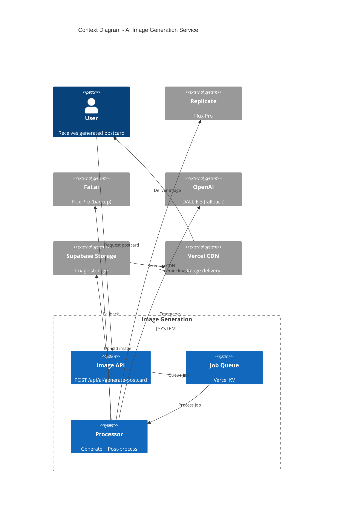
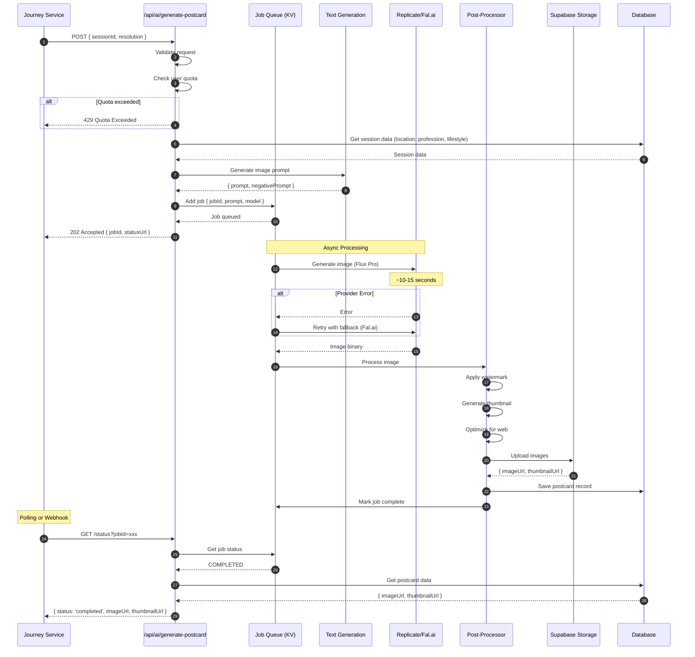
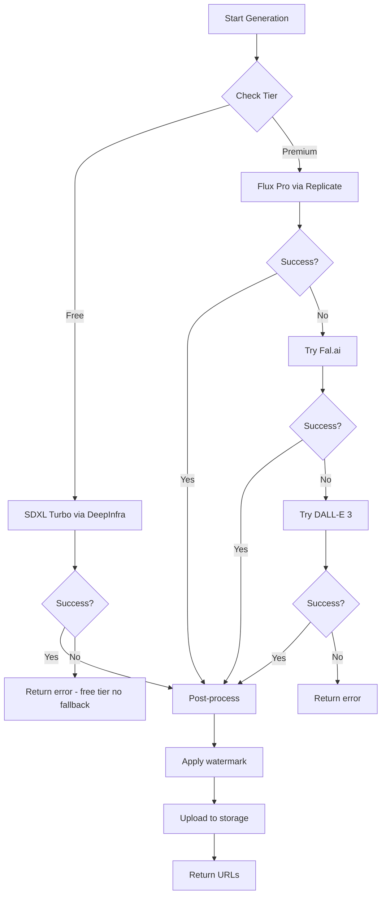
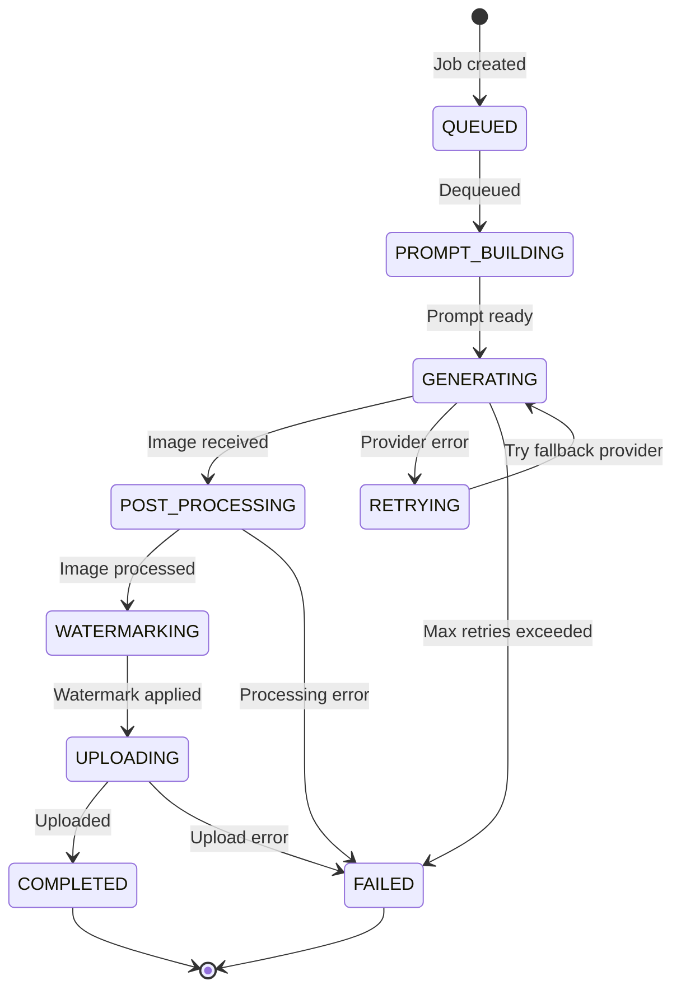

# HLD - AI-IMAGE-GENERATION (AI Integration - Image Generation Service)

## 1. Bối cảnh (Context)

### 1.1 Bối cảnh về kinh doanh (Business Context)

**AI Image Generation Service** chịu trách nhiệm tạo ra "Bưu thiếp từ Tương lai 2045" - tài sản viral cốt lõi của kynguyenAI.vn. Service này sử dụng các mô hình Text-to-Image tiên tiến (Flux Pro, DALL-E 3) để tạo hình ảnh Solarpunk độc đáo cho mỗi người dùng.

**Mục tiêu kinh doanh:**
- Tạo hình ảnh chất lượng cao, phù hợp thẩm mỹ Solarpunk Việt Nam
- Tối ưu chi phí thông qua tiered model selection (Free vs Premium)
- Tạo viral asset để người dùng chia sẻ trên social media
- Apply watermark để brand awareness

**Use Cases:**

| ID | Use Case | Tier | Model | Resolution |
|----|----------|------|-------|------------|
| UC-1 | Generate postcard (Free) | Free | SDXL Turbo | 1024x1024 |
| UC-2 | Generate postcard (Premium) | Premium | Flux Pro | 1024x1024 |
| UC-3 | Generate postcard 4K | Premium | Flux Pro + Upscaler | 4096x4096 |
| UC-4 | Generate City Dreamer image | Premium | Flux Pro | 1024x1024 |
| UC-5 | Generate Cultural Evolution | Premium | Flux + Face Swap | 1024x1024 |

**Thẩm mỹ Solarpunk Guidelines:**

```
┌─────────────────────────────────────────────────────────────────────────────┐
│                       SOLARPUNK AESTHETIC GUIDELINES                         │
├─────────────────────────────────────────────────────────────────────────────┤
│                                                                               │
│   ✓ DO:                              ✗ DON'T:                                │
│   ─────                              ────────                                 │
│   • Green architecture               • Dark/dystopian atmosphere             │
│   • Vertical gardens                 • Pollution/destruction                 │
│   • Clean energy visible             • Cyberpunk neon overload               │
│   • Natural materials + glass        • Industrial decay                      │
│   • Golden hour lighting             • Night scenes (unless requested)       │
│   • Diverse Vietnamese people        • Western-only aesthetics               │
│   • Traditional elements subtly      • Overcrowded/chaotic scenes            │
│   • Drone/clean transport            • Fossil fuel vehicles                  │
│                                                                               │
│   Color Palette:                                                              │
│   ┌────────┐ ┌────────┐ ┌────────┐ ┌────────┐ ┌────────┐                    │
│   │ #00A86B│ │ #FFD700│ │ #87CEEB│ │ #F5DEB3│ │ #228B22│                    │
│   │ Emerald│ │  Gold  │ │Sky Blue│ │  Wheat │ │ Forest │                    │
│   └────────┘ └────────┘ └────────┘ └────────┘ └────────┘                    │
│                                                                               │
└─────────────────────────────────────────────────────────────────────────────┘
```

### 1.2 Bối cảnh về hệ thống (System Context)

```
┌─────────────────────────────────────────────────────────────────────────────┐
│                   AI IMAGE GENERATION SYSTEM CONTEXT                         │
├─────────────────────────────────────────────────────────────────────────────┤
│                                                                               │
│                      ┌─────────────────────┐                                 │
│                      │   Journey Service   │                                 │
│                      │   (Consumer)        │                                 │
│                      └──────────┬──────────┘                                 │
│                                 │                                             │
│                                 ▼                                             │
│   ┌─────────────────────────────────────────────────────────────────────┐   │
│   │                  AI IMAGE GENERATION SERVICE                         │   │
│   │                                                                       │   │
│   │   ┌─────────────┐   ┌─────────────┐   ┌─────────────┐               │   │
│   │   │  API Layer  │──►│   Queue     │──►│  Processor  │               │   │
│   │   │             │   │  (Vercel KV)│   │             │               │   │
│   │   └─────────────┘   └─────────────┘   └──────┬──────┘               │   │
│   │                                              │                       │   │
│   │                     ┌────────────────────────┼───────────────────┐   │   │
│   │                     │                        │                   │   │   │
│   │                     ▼                        ▼                   ▼   │   │
│   │            ┌─────────────┐          ┌─────────────┐     ┌──────────┐│   │
│   │            │  Replicate  │          │   Fal.ai    │     │  OpenAI  ││   │
│   │            │  (Flux Pro) │          │ (Flux Pro)  │     │ (DALL-E) ││   │
│   │            └─────────────┘          └─────────────┘     └──────────┘│   │
│   │                                              │                       │   │
│   │                                              ▼                       │   │
│   │                                     ┌─────────────┐                  │   │
│   │                                     │ Post-Process│                  │   │
│   │                                     │ • Watermark │                  │   │
│   │                                     │ • Resize    │                  │   │
│   │                                     │ • Optimize  │                  │   │
│   │                                     └──────┬──────┘                  │   │
│   │                                            │                         │   │
│   └────────────────────────────────────────────┼─────────────────────────┘   │
│                                                │                             │
│                                                ▼                             │
│                                       ┌─────────────┐                       │
│                                       │  Supabase   │                       │
│                                       │  Storage    │                       │
│                                       └─────────────┘                       │
│                                                                               │
└─────────────────────────────────────────────────────────────────────────────┘
```

#### API Endpoints:

| Endpoint | Method | Mô tả |
|----------|--------|-------|
| `/api/ai/generate-postcard` | POST | Generate postcard image |
| `/api/ai/generate-postcard/status` | GET | Check generation status |
| `/api/ai/upscale` | POST | Upscale image to 4K |

#### External Providers:

| Provider | API | Models | Use Case |
|----------|-----|--------|----------|
| **Replicate** | REST + Webhooks | Flux.1 Pro, Flux.1 Schnell | Primary provider |
| **Fal.ai** | REST | Flux.1 Pro | Backup provider |
| **OpenAI** | REST | DALL-E 3 | Emergency fallback |
| **DeepInfra** | REST | SDXL Turbo | Free tier (fast, lower quality) |

### 1.3 Phạm vi ngoài (Out Of Scope)

| STT | Nội dung | Lý do |
|-----|----------|-------|
| 1 | Text Generation | Xem HLD-AI-TEXT-GENERATION |
| 2 | Video Generation | Future phase (Luma/Runway) |
| 3 | Face Swap (full) | Xem HLD-TM-CULTURAL-EVOLUTION |
| 4 | Real-time editing | Out of MVP scope |

### 1.4 Các chân dung (Actors)

| Actor | Mô tả | Hành động |
|-------|-------|-----------|
| **Journey Service** | Internal service | Request postcard generation |
| **Module Services** | City Dreamer, etc. | Request specialized images |
| **System** | Background processes | Process queue, cleanup |
| **CDN** | Content delivery | Serve generated images |

---

## 2. Context Diagram



---

## 3. Core Business Workflow

### 3.1 Sequence Diagram - Generate Postcard



### 3.2 Provider Fallback Flow



---

## 4. State Machine

### 4.1 Image Generation Job State



### 4.2 State Transitions

| From | To | Trigger | Action |
|------|-----|---------|--------|
| QUEUED | PROMPT_BUILDING | Worker picks up | Load session data |
| PROMPT_BUILDING | GENERATING | Prompt ready | Call AI provider |
| GENERATING | POST_PROCESSING | Image received | Start processing |
| GENERATING | RETRYING | Provider error | Switch provider |
| RETRYING | GENERATING | Fallback available | Retry with new provider |
| POST_PROCESSING | WATERMARKING | Processed | Apply branding |
| WATERMARKING | UPLOADING | Done | Upload to storage |
| UPLOADING | COMPLETED | URLs received | Update database |

---

## 5. Data Model

### 5.1 Database Schema

```sql
-- Image Generation Jobs
CREATE TABLE image_jobs (
    id UUID PRIMARY KEY DEFAULT gen_random_uuid(),
    session_id UUID NOT NULL REFERENCES journey_sessions(id),
    status VARCHAR(30) NOT NULL DEFAULT 'QUEUED',
    prompt TEXT NOT NULL,
    negative_prompt TEXT,
    model VARCHAR(50) NOT NULL,
    provider VARCHAR(30) NOT NULL,
    resolution VARCHAR(20) NOT NULL DEFAULT '1024x1024',
    attempts INTEGER DEFAULT 0,
    error_message TEXT,
    created_at TIMESTAMPTZ DEFAULT NOW(),
    started_at TIMESTAMPTZ,
    completed_at TIMESTAMPTZ
);

-- Generated Images (Postcards)
CREATE TABLE postcards (
    id UUID PRIMARY KEY DEFAULT gen_random_uuid(),
    session_id UUID NOT NULL REFERENCES journey_sessions(id),
    job_id UUID REFERENCES image_jobs(id),
    image_url TEXT NOT NULL,
    thumbnail_url TEXT,
    prompt_used TEXT NOT NULL,
    resolution VARCHAR(20) NOT NULL,
    file_size INTEGER,
    share_count INTEGER DEFAULT 0,
    created_at TIMESTAMPTZ DEFAULT NOW()
);

-- Model Usage Tracking
CREATE TABLE model_usage (
    id UUID PRIMARY KEY DEFAULT gen_random_uuid(),
    provider VARCHAR(30) NOT NULL,
    model VARCHAR(50) NOT NULL,
    job_id UUID REFERENCES image_jobs(id),
    input_cost DECIMAL(10,6),
    generation_time_ms INTEGER,
    success BOOLEAN,
    created_at TIMESTAMPTZ DEFAULT NOW()
);

-- Indexes
CREATE INDEX idx_image_jobs_status ON image_jobs(status);
CREATE INDEX idx_image_jobs_session ON image_jobs(session_id);
CREATE INDEX idx_postcards_session ON postcards(session_id);
```

### 5.2 Job Queue Structure (Vercel KV)

```typescript
interface ImageJob {
    id: string;
    sessionId: string;
    status: JobStatus;
    prompt: string;
    negativePrompt: string;
    model: string;
    provider: string;
    resolution: '1024' | '4k';
    tier: 'free' | 'premium';
    attempts: number;
    maxAttempts: number;
    error?: string;
    result?: {
        imageUrl: string;
        thumbnailUrl: string;
    };
    createdAt: string;
    startedAt?: string;
    completedAt?: string;
}

// Redis key patterns
const JOB_KEY = (id: string) => `imgjob:${id}`;
const JOB_QUEUE = 'imgjob:queue';
const JOB_PROCESSING = 'imgjob:processing';
```

---

## 6. API Contracts

### 6.1 POST /api/ai/generate-postcard

**Request:**
```typescript
interface GeneratePostcardRequest {
    sessionId: string;
    resolution: '1080' | '4k';
    style?: 'solarpunk' | 'utopian' | 'tech';
}
```

**Response (202 Accepted):**
```typescript
interface GeneratePostcardResponse {
    jobId: string;
    status: 'queued';
    statusUrl: string;
    estimatedTime: number; // seconds
}
```

### 6.2 GET /api/ai/generate-postcard/status

**Request:**
```
GET /api/ai/generate-postcard/status?jobId={jobId}
```

**Response:**
```typescript
interface JobStatusResponse {
    jobId: string;
    status: 'queued' | 'processing' | 'completed' | 'failed';
    progress?: number; // 0-100
    result?: {
        postcardId: string;
        imageUrl: string;
        thumbnailUrl: string;
        shareUrl: string;
    };
    error?: {
        code: string;
        message: string;
    };
}
```

### 6.3 Error Codes

| Code | HTTP Status | Message |
|------|-------------|---------|
| `QUOTA_EXCEEDED` | 429 | Daily image limit reached |
| `INVALID_SESSION` | 400 | Session not found or expired |
| `GENERATION_FAILED` | 500 | All providers failed |
| `PROCESSING_ERROR` | 500 | Post-processing failed |
| `UPLOAD_ERROR` | 500 | Storage upload failed |

---

## 7. Prompt Engineering for Images

### 7.1 Base Prompt Structure

```typescript
const buildImagePrompt = (session: JourneySession): ImagePrompt => {
    const location = getLocationData(session.location);

    // Base aesthetic (always included)
    const baseAesthetic = `
        Solarpunk aesthetic, Vietnam 2045,
        biophilic architecture, sustainable technology,
        golden hour lighting, cinematic composition,
        8k resolution, photorealistic rendering,
        vibrant colors, lush vegetation
    `;

    // Location-specific elements
    const locationPrompt = {
        'can-gio': `
            Coastal eco-city, mangrove forests integrated with
            glass eco-resorts, electric water taxis, sustainable
            wooden walkways over wetlands, floating solar panels,
            seafood restaurants with vertical farms
        `,
        'thu-duc': `
            Innovation district skyline, gleaming skyscrapers with
            vertical gardens, autonomous vehicle lanes, drone
            delivery networks, holographic billboards, quantum
            computing research towers
        `,
        'hanoi': `
            Red River axis development, fusion of French colonial
            architecture with futuristic additions, metro stations
            with traditional roof designs, thousand-year-old temples
            with modern eco-additions
        `
    }[session.location];

    // Profession context
    const professionPrompt = `
        Scene includes a ${session.profession} in their workspace,
        advanced tools and interfaces related to ${session.profession}
    `;

    // Lifestyle mood
    const lifestyleMood = {
        'peaceful': 'serene, zen gardens, minimalist design, calm atmosphere',
        'vibrant': 'bustling activity, warm lights, dynamic movement',
        'connected': 'community gathering, shared spaces, collaborative environment'
    }[session.lifestyle];

    return {
        prompt: `
            ${baseAesthetic}
            Location: ${locationPrompt}
            ${professionPrompt}
            Mood: ${lifestyleMood}
            Vietnamese cultural elements subtly present,
            no text or watermarks in image
        `.replace(/\s+/g, ' ').trim(),

        negativePrompt: `
            dystopian, dark, polluted, destroyed, abandoned,
            cyberpunk neon overload, western-only aesthetics,
            chaotic, crowded slums, fossil fuel vehicles,
            low quality, blurry, deformed, ugly, text, watermark,
            logo, signature, frame, border
        `.replace(/\s+/g, ' ').trim()
    };
};
```

### 7.2 Location-Specific Keywords

```typescript
const locationKeywords: Record<string, LocationKeywords> = {
    'can-gio': {
        architecture: [
            'glass eco-resorts',
            'floating structures',
            'mangrove-integrated buildings',
            'thatched-roof modern fusion',
            'elevated walkways'
        ],
        nature: [
            'mangrove forests',
            'pristine beaches',
            'bird sanctuaries',
            'coastal wetlands',
            'bioluminescent waters'
        ],
        transport: [
            'electric water taxis',
            'solar-powered boats',
            'cable cars',
            'bicycle paths',
            'underwater tunnels'
        ]
    },
    'thu-duc': {
        architecture: [
            'innovation towers',
            'tech campus',
            'vertical farms on buildings',
            'smart glass facades',
            'rooftop gardens'
        ],
        technology: [
            'holographic displays',
            'autonomous vehicles',
            'drone highways',
            'quantum labs',
            'AI research centers'
        ],
        transport: [
            'metro line 1',
            'autonomous pods',
            'aerial taxis',
            'hyperloop station',
            'smart intersections'
        ]
    },
    'hanoi': {
        architecture: [
            'colonial-modern fusion',
            'traditional pagoda roofs on skyscrapers',
            'Old Quarter preservation',
            'underground city',
            'riverside promenades'
        ],
        culture: [
            'thousand-year heritage',
            'temple gardens',
            'traditional craft villages',
            'water puppetry theaters',
            'silk lanterns'
        ],
        transport: [
            'extensive metro network',
            'electric cyclos',
            'river boats',
            'high-speed rail',
            'pedestrian-first streets'
        ]
    }
};
```

---

## 8. Provider Configuration

### 8.1 Model Selection

```typescript
interface ModelConfig {
    id: string;
    provider: string;
    endpoint: string;
    cost: number;      // USD per image
    avgTime: number;   // seconds
    quality: 'standard' | 'high' | 'premium';
    tier: 'free' | 'premium';
}

const MODELS: Record<string, ModelConfig> = {
    'flux-pro-replicate': {
        id: 'black-forest-labs/flux-1.1-pro',
        provider: 'replicate',
        endpoint: 'https://api.replicate.com/v1/predictions',
        cost: 0.05,
        avgTime: 12,
        quality: 'premium',
        tier: 'premium'
    },
    'flux-pro-fal': {
        id: 'fal-ai/flux-pro',
        provider: 'fal',
        endpoint: 'https://fal.run/fal-ai/flux-pro',
        cost: 0.04,
        avgTime: 10,
        quality: 'premium',
        tier: 'premium'
    },
    'flux-schnell': {
        id: 'black-forest-labs/flux-schnell',
        provider: 'replicate',
        endpoint: 'https://api.replicate.com/v1/predictions',
        cost: 0.003,
        avgTime: 3,
        quality: 'high',
        tier: 'free'
    },
    'sdxl-turbo': {
        id: 'stabilityai/sdxl-turbo',
        provider: 'deepinfra',
        endpoint: 'https://api.deepinfra.com/v1/inference',
        cost: 0.001,
        avgTime: 1,
        quality: 'standard',
        tier: 'free'
    },
    'dall-e-3': {
        id: 'dall-e-3',
        provider: 'openai',
        endpoint: 'https://api.openai.com/v1/images/generations',
        cost: 0.04,
        avgTime: 15,
        quality: 'high',
        tier: 'premium'
    }
};
```

### 8.2 Provider API Examples

```typescript
// Replicate (Flux Pro)
const generateWithReplicate = async (prompt: string): Promise<string> => {
    const response = await fetch('https://api.replicate.com/v1/predictions', {
        method: 'POST',
        headers: {
            'Authorization': `Token ${process.env.REPLICATE_API_TOKEN}`,
            'Content-Type': 'application/json',
        },
        body: JSON.stringify({
            version: 'black-forest-labs/flux-1.1-pro',
            input: {
                prompt,
                aspect_ratio: '1:1',
                output_format: 'webp',
                output_quality: 90,
                safety_tolerance: 2,
                prompt_upsampling: true
            }
        })
    });

    const prediction = await response.json();
    // Poll for completion...
    return prediction.output[0];
};

// Fal.ai (Flux Pro)
const generateWithFal = async (prompt: string): Promise<string> => {
    const response = await fetch('https://fal.run/fal-ai/flux-pro', {
        method: 'POST',
        headers: {
            'Authorization': `Key ${process.env.FAL_KEY}`,
            'Content-Type': 'application/json',
        },
        body: JSON.stringify({
            prompt,
            image_size: 'square_hd',
            num_images: 1,
            enable_safety_checker: true
        })
    });

    const result = await response.json();
    return result.images[0].url;
};
```

---

## 9. Post-Processing Pipeline

### 9.1 Watermark Application

```typescript
import sharp from 'sharp';

const applyWatermark = async (
    imageBuffer: Buffer,
    watermarkPath: string
): Promise<Buffer> => {
    const watermark = await sharp(watermarkPath)
        .resize(150, null) // 150px width, auto height
        .toBuffer();

    return sharp(imageBuffer)
        .composite([{
            input: watermark,
            gravity: 'southeast',
            blend: 'over',
            opacity: 0.7
        }])
        .toBuffer();
};
```

### 9.2 Thumbnail Generation

```typescript
const generateThumbnail = async (
    imageBuffer: Buffer,
    size: number = 400
): Promise<Buffer> => {
    return sharp(imageBuffer)
        .resize(size, size, { fit: 'cover' })
        .webp({ quality: 80 })
        .toBuffer();
};
```

### 9.3 Social Media Formats

```typescript
const generateSocialFormats = async (
    imageBuffer: Buffer
): Promise<SocialFormats> => {
    const [instagram, story, twitter, og] = await Promise.all([
        // Instagram square
        sharp(imageBuffer).resize(1080, 1080, { fit: 'cover' }).webp().toBuffer(),
        // Instagram/TikTok story
        sharp(imageBuffer).resize(1080, 1920, { fit: 'cover', position: 'center' }).webp().toBuffer(),
        // Twitter card
        sharp(imageBuffer).resize(1200, 675, { fit: 'cover' }).webp().toBuffer(),
        // Open Graph
        sharp(imageBuffer).resize(1200, 630, { fit: 'cover' }).webp().toBuffer(),
    ]);

    return { instagram, story, twitter, og };
};
```

---

## 10. Storage Strategy

### 10.1 Supabase Storage Buckets

| Bucket | Access | Content |
|--------|--------|---------|
| `postcards` | Public | Generated postcards |
| `thumbnails` | Public | Thumbnail versions |
| `social-formats` | Public | Social media optimized |
| `temp` | Private | Processing temp files |

### 10.2 File Naming Convention

```typescript
const generateFilePath = (
    sessionId: string,
    type: 'postcard' | 'thumbnail' | 'social',
    format: string = 'webp'
): string => {
    const timestamp = Date.now();
    const random = Math.random().toString(36).substring(7);

    return `${type}/${sessionId}/${timestamp}-${random}.${format}`;
};

// Examples:
// postcards/550e8400-e29b-41d4/1705312345678-abc123.webp
// thumbnails/550e8400-e29b-41d4/1705312345678-abc123.webp
```

### 10.3 CDN Configuration

```typescript
// Supabase Storage URL pattern
const getPublicUrl = (bucket: string, path: string): string => {
    return `${process.env.NEXT_PUBLIC_SUPABASE_URL}/storage/v1/object/public/${bucket}/${path}`;
};

// With Vercel Image Optimization
const getOptimizedUrl = (url: string, width: number): string => {
    return `/_next/image?url=${encodeURIComponent(url)}&w=${width}&q=80`;
};
```

---

## 11. Non-Functional Requirements

### 11.1 Performance

| Metric | Target | Measurement |
|--------|--------|-------------|
| **Generation Time (Free)** | < 5s | SDXL Turbo |
| **Generation Time (Premium)** | < 15s | Flux Pro |
| **Post-processing** | < 2s | Sharp operations |
| **Total E2E (Premium)** | < 20s | API monitoring |
| **Thumbnail Load** | < 500ms | CDN metrics |

### 11.2 Cost Optimization

| Strategy | Implementation |
|----------|----------------|
| **Tiered Models** | Free: SDXL Turbo ($0.001), Premium: Flux Pro ($0.05) |
| **Caching** | Cache generated images indefinitely |
| **Batch Processing** | Queue system prevents concurrent expensive calls |
| **Resolution Control** | Default 1024px, 4K only for premium |

### 11.3 Reliability

| Aspect | Implementation |
|--------|----------------|
| **Provider Fallback** | Replicate → Fal.ai → DALL-E 3 |
| **Retry Logic** | 3 attempts per provider |
| **Queue Persistence** | Vercel KV with TTL |
| **Graceful Degradation** | Return cached/similar image if all fail |

### 11.4 Security

| Aspect | Implementation |
|--------|----------------|
| **Content Filtering** | Provider built-in safety filters |
| **Rate Limiting** | 3 images/day (free), 20/day (premium) |
| **Prompt Injection** | Sanitize user inputs |
| **Storage Security** | Public read, authenticated write |

---

## 12. Monitoring & Observability

### 12.1 Metrics to Track

```typescript
interface ImageGenMetrics {
    // Generation metrics
    generationTime: number;
    providerUsed: string;
    modelUsed: string;
    success: boolean;

    // Cost metrics
    estimatedCost: number;
    resolution: string;
    tier: string;

    // Quality metrics
    retryCount: number;
    fallbackUsed: boolean;

    // Business metrics
    shareCount: number;
    conversionToChat: boolean;
}
```

### 12.2 Alerts

| Alert | Condition | Action |
|-------|-----------|--------|
| High Failure Rate | >10% failures in 1 hour | Page on-call |
| Provider Down | 3 consecutive failures | Switch to fallback |
| Cost Spike | >$100/day | Notify finance |
| Queue Backup | >100 pending jobs | Scale workers |

---

**Tài liệu liên quan:**
- [HLD-TM-JOURNEY.md](./HLD-TM-JOURNEY.md) - Journey Experience (Consumer)
- [HLD-AI-TEXT-GENERATION.md](./HLD-AI-TEXT-GENERATION.md) - Text Generation (Prompt source)
- [HLD-TM-CITY-DREAMER.md](./HLD-TM-CITY-DREAMER.md) - City Dreamer Module
- [HLD-TM-CULTURAL-EVOLUTION.md](./HLD-TM-CULTURAL-EVOLUTION.md) - Cultural Evolution Module
