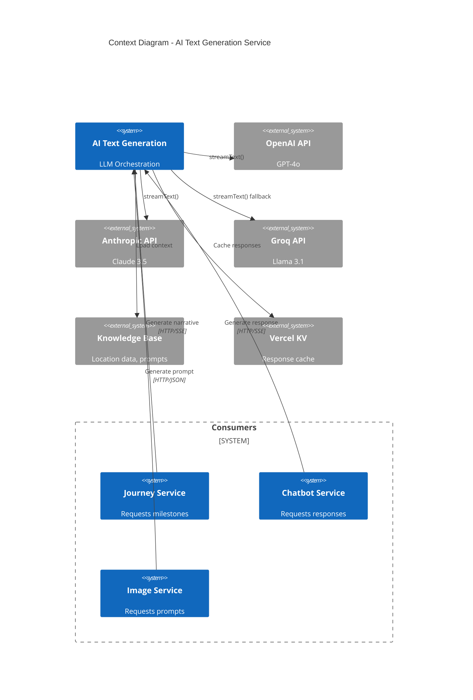
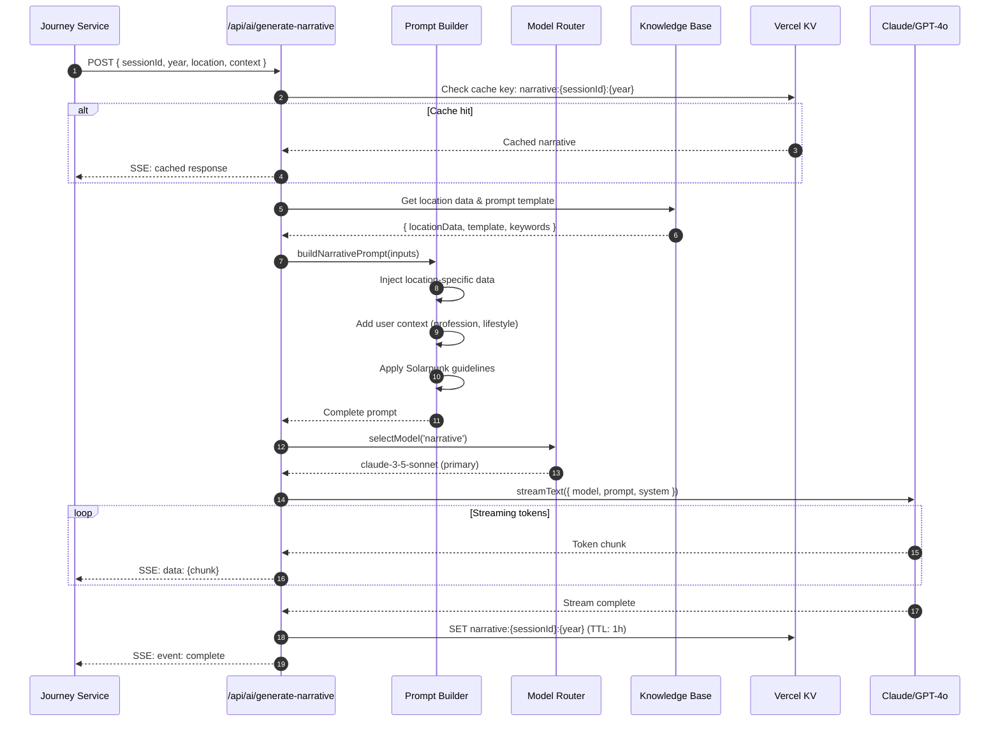
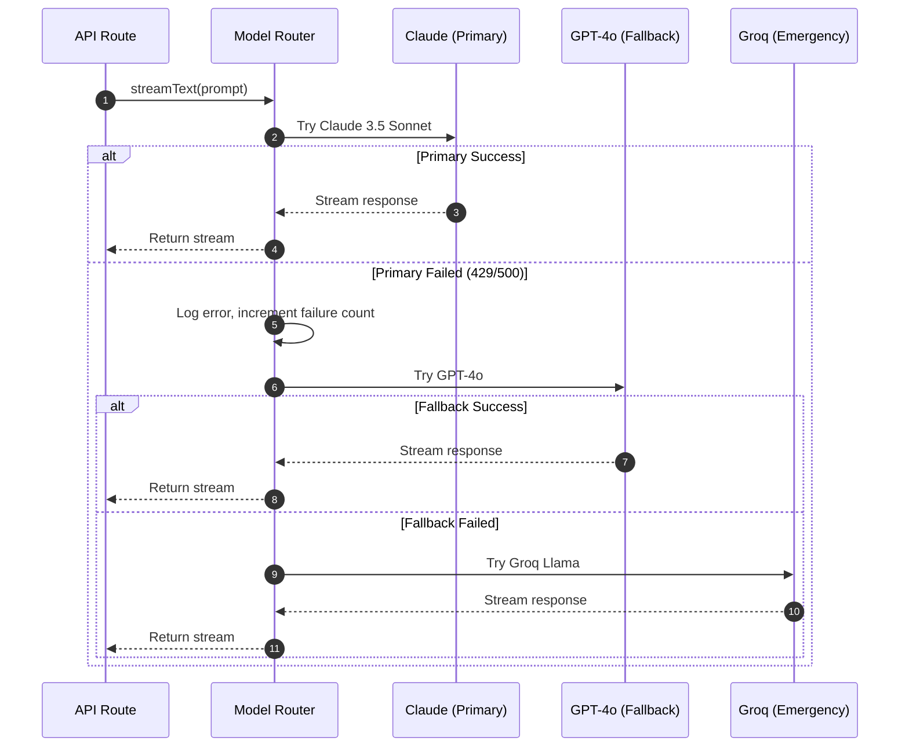
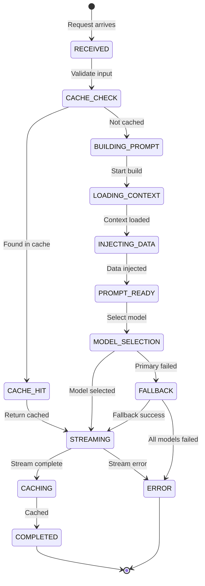

# HLD - AI-TEXT-GENERATION (AI Integration - Text Generation Service)

## 1. Bối cảnh (Context)

### 1.1 Bối cảnh về kinh doanh (Business Context)

**AI Text Generation Service** là thành phần cốt lõi chịu trách nhiệm tạo ra các đoạn văn narrative mô tả tương lai Việt Nam 2045. Service này sử dụng LLM (Large Language Models) để tạo nội dung cá nhân hóa dựa trên lựa chọn của người dùng.

**Mục tiêu:**
- Tạo narrative chất lượng cao, phù hợp ngữ cảnh Việt Nam
- Đảm bảo nội dung "grounded" (neo) vào dữ liệu quy hoạch thực
- Tối ưu chi phí API thông qua caching và model selection
- Cung cấp trải nghiệm streaming mượt mà

**Use Cases:**

| ID | Use Case | Model ưu tiên | Output |
|----|----------|---------------|--------|
| UC-1 | Generate milestone narrative (2030, 2035, 2040, 2045) | Claude 3.5 Sonnet | Streaming text |
| UC-2 | Generate career prediction | GPT-4o | Structured JSON |
| UC-3 | Generate conversation response (chatbot) | Claude 3.5 Sonnet | Streaming text |
| UC-4 | Generate image prompt | GPT-4o | Structured prompt |

### 1.2 Bối cảnh về hệ thống (System Context)

```
┌─────────────────────────────────────────────────────────────────────────────┐
│                     AI TEXT GENERATION SYSTEM CONTEXT                        │
├─────────────────────────────────────────────────────────────────────────────┤
│                                                                               │
│                        ┌─────────────────────┐                               │
│                        │   Journey Service   │                               │
│                        │   (Consumer)        │                               │
│                        └──────────┬──────────┘                               │
│                                   │                                           │
│                                   ▼                                           │
│    ┌──────────────────────────────────────────────────────────────────┐     │
│    │                    AI TEXT GENERATION SERVICE                     │     │
│    │  ┌─────────────────────────────────────────────────────────────┐ │     │
│    │  │                    API LAYER                                 │ │     │
│    │  │  /api/ai/generate-narrative                                 │ │     │
│    │  │  /api/ai/generate-prompt                                    │ │     │
│    │  │  /api/ai/generate-career                                    │ │     │
│    │  └─────────────────────────────────────────────────────────────┘ │     │
│    │                              │                                    │     │
│    │                              ▼                                    │     │
│    │  ┌─────────────────────────────────────────────────────────────┐ │     │
│    │  │               ORCHESTRATION LAYER                           │ │     │
│    │  │  • Prompt Builder                                           │ │     │
│    │  │  • Model Router                                             │ │     │
│    │  │  • Response Processor                                       │ │     │
│    │  │  • Cost Tracker                                             │ │     │
│    │  └─────────────────────────────────────────────────────────────┘ │     │
│    │                              │                                    │     │
│    │             ┌────────────────┼────────────────┐                  │     │
│    │             ▼                ▼                ▼                  │     │
│    │   ┌─────────────┐   ┌─────────────┐   ┌─────────────┐           │     │
│    │   │   OpenAI    │   │  Anthropic  │   │   Groq      │           │     │
│    │   │   GPT-4o    │   │   Claude    │   │  (Backup)   │           │     │
│    │   └─────────────┘   └─────────────┘   └─────────────┘           │     │
│    └──────────────────────────────────────────────────────────────────┘     │
│                              │                                               │
│                              ▼                                               │
│    ┌──────────────────────────────────────────────────────────────────┐     │
│    │                         DATA LAYER                                │     │
│    │  ┌─────────────┐   ┌─────────────┐   ┌─────────────┐            │     │
│    │  │  Knowledge  │   │   Cache     │   │   Usage     │            │     │
│    │  │    Base     │   │  (Vercel KV)│   │  Tracking   │            │     │
│    │  └─────────────┘   └─────────────┘   └─────────────┘            │     │
│    └──────────────────────────────────────────────────────────────────┘     │
│                                                                               │
└─────────────────────────────────────────────────────────────────────────────┘
```

#### API Endpoints:

| Endpoint | Method | Mô tả | Response Type |
|----------|--------|-------|---------------|
| `/api/ai/generate-narrative` | POST | Generate milestone narrative | SSE Stream |
| `/api/ai/generate-prompt` | POST | Generate image prompt | JSON |
| `/api/ai/generate-career` | POST | Generate career prediction | JSON |

#### External Dependencies:

| Provider | SDK | Models | Fallback |
|----------|-----|--------|----------|
| **OpenAI** | @ai-sdk/openai | gpt-4o, gpt-4o-mini | Anthropic |
| **Anthropic** | @ai-sdk/anthropic | claude-3-5-sonnet | OpenAI |
| **Groq** | @ai-sdk/groq | llama-3.1-70b | N/A |

### 1.3 Phạm vi ngoài (Out Of Scope)

| STT | Nội dung | Lý do |
|-----|----------|-------|
| 1 | Image Generation | Xem HLD-AI-IMAGE-GENERATION |
| 2 | RAG/Vector Search | Xem HLD-CB-FUTURE-SELF |
| 3 | Model Fine-tuning | Sử dụng prompt engineering thay vì fine-tuning |
| 4 | Content Moderation | Sử dụng built-in filters của providers |

### 1.4 Các chân dung (Actors)

| Actor | Mô tả | Hành động |
|-------|-------|-----------|
| **Journey Service** | Internal service | Request narrative generation |
| **Chatbot Service** | Internal service | Request conversation response |
| **Admin** | System administrator | Manage prompts, view usage |
| **System** | Background processes | Cache cleanup, usage tracking |

---

## 2. Context Diagram



---

## 3. Core Business Workflow

### 3.1 Sequence Diagram - Generate Narrative



### 3.2 Sequence Diagram - Model Fallback



---

## 4. State Machine

### 4.1 Generation Request State



---

## 5. Data Model

### 5.1 Database Schema

```sql
-- Prompt Templates
CREATE TABLE prompt_templates (
    id UUID PRIMARY KEY DEFAULT gen_random_uuid(),
    name VARCHAR(100) NOT NULL UNIQUE,
    type VARCHAR(50) NOT NULL, -- 'narrative', 'career', 'image_prompt', 'chat'
    system_prompt TEXT NOT NULL,
    user_template TEXT NOT NULL,
    variables JSONB DEFAULT '[]', -- Required variables
    model_preference VARCHAR(50) DEFAULT 'claude-3-5-sonnet',
    max_tokens INTEGER DEFAULT 500,
    temperature DECIMAL(2,1) DEFAULT 0.7,
    is_active BOOLEAN DEFAULT true,
    created_at TIMESTAMPTZ DEFAULT NOW(),
    updated_at TIMESTAMPTZ DEFAULT NOW()
);

-- Generation Logs (for cost tracking)
CREATE TABLE generation_logs (
    id UUID PRIMARY KEY DEFAULT gen_random_uuid(),
    session_id UUID,
    prompt_type VARCHAR(50) NOT NULL,
    model_used VARCHAR(50) NOT NULL,
    input_tokens INTEGER NOT NULL,
    output_tokens INTEGER NOT NULL,
    latency_ms INTEGER NOT NULL,
    cache_hit BOOLEAN DEFAULT false,
    error_message TEXT,
    created_at TIMESTAMPTZ DEFAULT NOW()
);

-- Indexes
CREATE INDEX idx_generation_logs_session ON generation_logs(session_id);
CREATE INDEX idx_generation_logs_created ON generation_logs(created_at DESC);
CREATE INDEX idx_generation_logs_model ON generation_logs(model_used);
```

### 5.2 Knowledge Base Structure

```typescript
// Location data structure
interface LocationKnowledge {
    id: string;
    name: string;
    description: string;
    planning: {
        source: string;           // "Quy hoạch TP.HCM 2040-2060"
        keyProjects: string[];
        timeline: {
            2030: string[];
            2035: string[];
            2040: string[];
            2045: string[];
        };
    };
    keywords: {
        architecture: string[];
        transport: string[];
        lifestyle: string[];
        technology: string[];
    };
    atmosphere: {
        peaceful: string[];
        vibrant: string[];
        connected: string[];
    };
}

// Example: Thu Duc
const thuDucKnowledge: LocationKnowledge = {
    id: 'thu-duc',
    name: 'Trung tâm Đổi mới Thủ Đức',
    description: 'Silicon Valley của Việt Nam, trung tâm đổi mới sáng tạo',
    planning: {
        source: 'Quy hoạch TP Thủ Đức',
        keyProjects: ['Innovation District', 'Khu công nghệ cao', 'Metro Line 1'],
        timeline: {
            2030: ['Metro hoàn thành', 'Startup hub đầu tiên', 'Khu R&D AI'],
            2035: ['Autonomous vehicle zones', 'Vertical farming towers', 'Quantum lab'],
            2040: ['Flying taxi routes', 'Neural interface centers', 'Space tech hub'],
            2045: ['Fully integrated smart city', 'Carbon negative district', 'Global AI capital']
        }
    },
    keywords: {
        architecture: ['gleaming skyscrapers', 'vertical gardens', 'glass facades', 'biophilic design'],
        transport: ['metro system', 'autonomous pods', 'drone highways', 'hyperloop station'],
        lifestyle: ['co-working spaces', 'innovation cafes', 'tech meetups', 'startup culture'],
        technology: ['quantum computing', 'AI research', 'biotech labs', 'clean energy']
    },
    atmosphere: {
        peaceful: ['zen gardens amidst tech campuses', 'quiet research pods', 'meditation spaces'],
        vibrant: ['bustling startup scene', 'neon-lit streets', '24/7 innovation hubs'],
        connected: ['global talent network', 'virtual collaboration', 'community co-ops']
    }
};
```

---

## 6. API Contracts

### 6.1 POST /api/ai/generate-narrative

**Request:**
```typescript
interface GenerateNarrativeRequest {
    sessionId: string;
    year: 2030 | 2035 | 2040 | 2045;
    location: 'can-gio' | 'thu-duc' | 'hanoi';
    profession: string;
    lifestyle: 'peaceful' | 'vibrant' | 'connected';
    previousContext?: string; // For continuity
}
```

**Response (SSE Stream):**
```
Content-Type: text/event-stream

event: start
data: {"year": 2030, "model": "claude-3-5-sonnet"}

event: delta
data: {"content": "Năm 2030, "}

event: delta
data: {"content": "tuyến Metro số 1 "}

... more deltas ...

event: usage
data: {"inputTokens": 450, "outputTokens": 180}

event: complete
data: {"cached": false, "latencyMs": 2340}
```

**Error Response:**
```typescript
interface ErrorResponse {
    error: {
        code: 'RATE_LIMITED' | 'INVALID_INPUT' | 'MODEL_ERROR' | 'INTERNAL_ERROR';
        message: string;
        retryAfter?: number;
    };
}
```

### 6.2 POST /api/ai/generate-prompt

**Request:**
```typescript
interface GenerateImagePromptRequest {
    sessionId: string;
    location: string;
    profession: string;
    lifestyle: string;
    style: 'solarpunk' | 'cyberpunk' | 'utopian';
}
```

**Response:**
```typescript
interface GenerateImagePromptResponse {
    prompt: string;
    negativePrompt: string;
    suggestedModel: 'flux-pro' | 'sdxl';
    metadata: {
        keywords: string[];
        style: string;
    };
}
```

---

## 7. Prompt Engineering

### 7.1 System Prompt Template

```typescript
const NARRATIVE_SYSTEM_PROMPT = `
Bạn là một nhà tương lai học và nhà văn chuyên về quy hoạch đô thị Việt Nam.
Nhiệm vụ của bạn là viết những đoạn văn ngắn, sống động về tương lai Việt Nam năm 2045.

## Nguyên tắc viết:
1. LUÔN sử dụng ngôi thứ hai ("Bạn") để tạo sự immersive
2. PHẢI dựa trên dữ liệu quy hoạch thực tế được cung cấp
3. Phong cách Solarpunk: lạc quan, xanh, công nghệ hài hòa thiên nhiên
4. Ngôn ngữ: Tiếng Việt tự nhiên, truyền cảm hứng
5. Độ dài: 3-5 câu cho mỗi milestone

## KHÔNG được:
- Sử dụng emoji
- Viết quá dài hoặc quá ngắn
- Đưa ra dự đoán bi quan
- Sử dụng thuật ngữ kỹ thuật phức tạp
- Lặp lại cấu trúc câu

## Giọng văn mẫu:
"Bạn bước ra khỏi trạm Metro Bến Thành, nơi từng là giao lộ đông đúc nhất Sài Gòn.
Giờ đây, những khu vườn trên cao phủ xanh các tòa nhà, trong khi những chiếc drone
giao hàng lướt êm ái trên những tuyến đường dành riêng."
`;
```

### 7.2 User Prompt Template

```typescript
const buildUserPrompt = (input: GenerateNarrativeRequest): string => {
    const location = getLocationKnowledge(input.location);
    const milestoneData = location.planning.timeline[input.year];

    return `
## Thông tin đầu vào:
- Địa điểm: ${location.name}
- Năm: ${input.year}
- Nghề nghiệp của người dùng: ${input.profession}
- Phong cách sống: ${input.lifestyle}

## Dữ liệu quy hoạch cho năm ${input.year}:
${milestoneData.join('\n- ')}

## Từ khóa kiến trúc:
${location.keywords.architecture.join(', ')}

## Từ khóa giao thông:
${location.keywords.transport.join(', ')}

## Bầu không khí (${input.lifestyle}):
${location.atmosphere[input.lifestyle].join(', ')}

${input.previousContext ? `## Ngữ cảnh trước đó:\n"${input.previousContext}"` : ''}

## Nhiệm vụ:
Viết một đoạn văn 3-5 câu mô tả cuộc sống của người dùng (một ${input.profession})
tại ${location.name} vào năm ${input.year}. Tích hợp các từ khóa và dữ liệu quy hoạch
một cách tự nhiên. Phong cách sống: ${input.lifestyle}.
    `.trim();
};
```

### 7.3 Image Prompt Template

```typescript
const buildImagePrompt = (input: GenerateImagePromptRequest): string => {
    const location = getLocationKnowledge(input.location);

    const baseAesthetic = `
        Solarpunk aesthetic, Vietnam 2045,
        biophilic architecture, sustainable technology,
        golden hour lighting, cinematic composition,
        8k resolution, photorealistic rendering
    `;

    const locationStyle = {
        'can-gio': 'mangrove forests integrated with glass eco-resorts, electric water taxis, wooden walkways over wetlands',
        'thu-duc': 'gleaming innovation district, vertical gardens on skyscrapers, autonomous vehicles, drone highways',
        'hanoi': 'Red River axis development, fusion of colonial architecture with holographic overlays, underground metro skylights'
    };

    const professionContext = `A ${input.profession} working in an advanced ${input.profession.includes('tech') ? 'quantum lab' : 'creative studio'}`;

    const lifestyleModifier = {
        'peaceful': 'serene, zen gardens, minimalist design',
        'vibrant': 'bustling streets, neon accents, dynamic energy',
        'connected': 'community gathering, co-working spaces, social hubs'
    };

    return `
        ${baseAesthetic}
        Location: ${location.name}, ${locationStyle[input.location]}
        Scene: ${professionContext}
        Mood: ${lifestyleModifier[input.lifestyle]}
        Style: Utopian future, no dystopian elements,
        Vietnamese cultural elements subtly integrated
    `.replace(/\s+/g, ' ').trim();
};
```

---

## 8. Model Selection Strategy

### 8.1 Model Router Logic

```typescript
interface ModelConfig {
    id: string;
    provider: 'openai' | 'anthropic' | 'groq';
    cost: number;        // per 1M tokens
    latency: 'low' | 'medium' | 'high';
    quality: 'standard' | 'high' | 'premium';
    vietnamese: 'good' | 'excellent';
    creative: 'good' | 'excellent';
}

const MODELS: Record<string, ModelConfig> = {
    'claude-3-5-sonnet': {
        id: 'claude-3-5-sonnet-20241022',
        provider: 'anthropic',
        cost: 3.0,
        latency: 'medium',
        quality: 'premium',
        vietnamese: 'excellent',
        creative: 'excellent'
    },
    'gpt-4o': {
        id: 'gpt-4o',
        provider: 'openai',
        cost: 2.5,
        latency: 'medium',
        quality: 'premium',
        vietnamese: 'excellent',
        creative: 'good'
    },
    'gpt-4o-mini': {
        id: 'gpt-4o-mini',
        provider: 'openai',
        cost: 0.15,
        latency: 'low',
        quality: 'high',
        vietnamese: 'good',
        creative: 'good'
    },
    'llama-3.1-70b': {
        id: 'llama-3.1-70b-versatile',
        provider: 'groq',
        cost: 0.59,
        latency: 'low',
        quality: 'high',
        vietnamese: 'good',
        creative: 'good'
    }
};

const selectModel = (useCase: string): string => {
    switch (useCase) {
        case 'narrative':
            return 'claude-3-5-sonnet';  // Best creative Vietnamese
        case 'career':
            return 'gpt-4o';              // Best structured output
        case 'image_prompt':
            return 'gpt-4o';              // Best prompt engineering
        case 'chat':
            return 'claude-3-5-sonnet';  // Best conversational
        default:
            return 'gpt-4o-mini';         // Cost-effective default
    }
};
```

### 8.2 Fallback Chain

```typescript
const FALLBACK_CHAINS: Record<string, string[]> = {
    'claude-3-5-sonnet': ['gpt-4o', 'llama-3.1-70b'],
    'gpt-4o': ['claude-3-5-sonnet', 'llama-3.1-70b'],
    'gpt-4o-mini': ['llama-3.1-70b', 'gpt-4o'],
};
```

---

## 9. Caching Strategy

### 9.1 Cache Key Structure

```typescript
// Narrative cache
const narrativeCacheKey = (sessionId: string, year: number) =>
    `narrative:${sessionId}:${year}`;

// Image prompt cache
const imagepromptCacheKey = (sessionId: string) =>
    `imgprompt:${sessionId}`;

// TTL Configuration
const CACHE_TTL = {
    narrative: 60 * 60,      // 1 hour
    imagePrompt: 60 * 60,    // 1 hour
    careerPrediction: 24 * 60 * 60,  // 24 hours
};
```

### 9.2 Cache Flow

```typescript
const generateWithCache = async (
    key: string,
    generator: () => Promise<string>,
    ttl: number
): Promise<{ content: string; cached: boolean }> => {
    // Check cache
    const cached = await kv.get<string>(key);
    if (cached) {
        return { content: cached, cached: true };
    }

    // Generate new content
    const content = await generator();

    // Cache result
    await kv.set(key, content, { ex: ttl });

    return { content, cached: false };
};
```

---

## 10. Non-Functional Requirements

### 10.1 Performance

| Metric | Target | Measurement |
|--------|--------|-------------|
| **TTFB (Time to First Byte)** | < 500ms | API monitoring |
| **Full Response (500 tokens)** | < 3s | API monitoring |
| **Cache Hit Rate** | > 60% | Analytics |
| **P99 Latency** | < 5s | API monitoring |

### 10.2 Cost Optimization

| Strategy | Implementation |
|----------|----------------|
| **Model Tiering** | Use gpt-4o-mini for simple tasks |
| **Aggressive Caching** | Cache all successful generations |
| **Token Limits** | Max 500 output tokens per narrative |
| **Batch Processing** | Prefetch next milestone |

### 10.3 Reliability

| Aspect | Implementation |
|--------|----------------|
| **Fallback Chain** | 3-model fallback |
| **Retry Logic** | 3 retries with exponential backoff |
| **Circuit Breaker** | Disable provider after 5 consecutive failures |
| **Graceful Degradation** | Return cached content if all providers fail |

### 10.4 Security

| Aspect | Implementation |
|--------|----------------|
| **API Key Protection** | Environment variables only |
| **Rate Limiting** | Per-user, per-IP limits |
| **Input Sanitization** | Validate all user inputs |
| **Output Filtering** | Provider built-in + custom filters |

---

## 11. Implementation Code Examples

### 11.1 API Route Implementation

```typescript
// app/api/ai/generate-narrative/route.ts
import { streamText } from 'ai';
import { anthropic } from '@ai-sdk/anthropic';
import { openai } from '@ai-sdk/openai';

export async function POST(req: Request) {
    const { sessionId, year, location, profession, lifestyle, previousContext } = await req.json();

    // Validate inputs
    if (!sessionId || !year || !location) {
        return Response.json({ error: { code: 'INVALID_INPUT', message: 'Missing required fields' }}, { status: 400 });
    }

    // Check cache
    const cacheKey = `narrative:${sessionId}:${year}`;
    const cached = await kv.get<string>(cacheKey);
    if (cached) {
        return new Response(createCachedStream(cached), {
            headers: { 'Content-Type': 'text/event-stream' }
        });
    }

    // Build prompt
    const systemPrompt = NARRATIVE_SYSTEM_PROMPT;
    const userPrompt = buildUserPrompt({ sessionId, year, location, profession, lifestyle, previousContext });

    // Stream response
    const result = await streamText({
        model: anthropic('claude-3-5-sonnet-20241022'),
        system: systemPrompt,
        prompt: userPrompt,
        maxTokens: 500,
        temperature: 0.7,
    });

    // Return streaming response
    return result.toDataStreamResponse();
}
```

### 11.2 Vercel AI SDK Usage

```typescript
// Using streamText for streaming responses
import { streamText, generateText, generateObject } from 'ai';
import { anthropic } from '@ai-sdk/anthropic';
import { openai } from '@ai-sdk/openai';
import { z } from 'zod';

// Streaming narrative
const narrativeStream = await streamText({
    model: anthropic('claude-3-5-sonnet-20241022'),
    system: NARRATIVE_SYSTEM_PROMPT,
    prompt: userPrompt,
});

// Structured career prediction
const careerPrediction = await generateObject({
    model: openai('gpt-4o'),
    schema: z.object({
        currentRole: z.string(),
        futureRole: z.string(),
        skills: z.array(z.string()),
        learningPath: z.array(z.object({
            skill: z.string(),
            resource: z.string(),
            duration: z.string(),
        })),
    }),
    prompt: careerPrompt,
});
```

---

**Tài liệu liên quan:**
- [HLD-TM-JOURNEY.md](./HLD-TM-JOURNEY.md) - Journey Experience (Consumer)
- [HLD-AI-IMAGE-GENERATION.md](./HLD-AI-IMAGE-GENERATION.md) - Image Generation Service
- [HLD-CB-FUTURE-SELF.md](./HLD-CB-FUTURE-SELF.md) - Chatbot (uses text generation)
- [HLD-CM-KNOWLEDGE-BASE.md](./HLD-CM-KNOWLEDGE-BASE.md) - Knowledge Base
