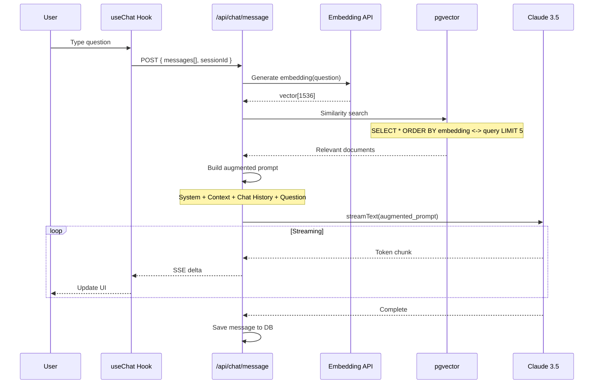

# HLD - CB-FUTURE-SELF (Chatbot - Future Self Agent)

## 1. Bối cảnh (Context)

### 1.1 Bối cảnh về kinh doanh (Business Context)

**Future Self Chatbot** là một AI agent đóng vai "Bản thể Tương lai" của người dùng, xuất hiện sau khi họ hoàn thành journey. Agent này trả lời các câu hỏi về cuộc sống năm 2045 dựa trên knowledge base về quy hoạch Việt Nam.

**Mục tiêu:**
- Tăng engagement sau khi hoàn thành journey
- Cung cấp thông tin chi tiết về tương lai Việt Nam
- Tạo conversational experience tự nhiên
- Sử dụng RAG (Retrieval-Augmented Generation) để đảm bảo accuracy

**Character Persona:**
```
Tên: "Bản thể Tương lai 2045"
Vai trò: Phiên bản tương lai của chính người dùng
Giọng điệu: Thân thiện, lạc quan, am hiểu về công nghệ và quy hoạch
Kiến thức: Quy hoạch đô thị, dự báo kinh tế, xu hướng xã hội Việt Nam 2045
```

### 1.2 Bối cảnh về hệ thống (System Context)

```
┌─────────────────────────────────────────────────────────────────────────────┐
│                      CHATBOT SYSTEM ARCHITECTURE                             │
├─────────────────────────────────────────────────────────────────────────────┤
│                                                                               │
│   User ──► Chat UI ──► /api/chat/message ──► RAG Query ──► LLM ──► Response │
│                              │                    │                           │
│                              ▼                    ▼                           │
│                        Chat History        Knowledge Base                     │
│                        (Supabase)          (pgvector)                         │
│                                                                               │
└─────────────────────────────────────────────────────────────────────────────┘
```

**Tech Stack:**
- **Frontend:** Vercel AI SDK UI (`useChat` hook)
- **Backend:** Vercel AI SDK Core (`streamText`)
- **LLM:** Claude 3.5 Sonnet (conversational)
- **RAG:** Supabase pgvector + OpenAI embeddings
- **Database:** Supabase PostgreSQL

## 2. Data Model

### 2.1 Database Schema

```sql
-- Chat Sessions
CREATE TABLE chat_sessions (
    id UUID PRIMARY KEY DEFAULT gen_random_uuid(),
    journey_session_id UUID REFERENCES journey_sessions(id),
    user_id UUID REFERENCES auth.users(id),
    character_context JSONB NOT NULL, -- Location, profession from journey
    created_at TIMESTAMPTZ DEFAULT NOW()
);

-- Chat Messages
CREATE TABLE chat_messages (
    id UUID PRIMARY KEY DEFAULT gen_random_uuid(),
    session_id UUID NOT NULL REFERENCES chat_sessions(id) ON DELETE CASCADE,
    role VARCHAR(20) NOT NULL CHECK (role IN ('user', 'assistant', 'system')),
    content TEXT NOT NULL,
    metadata JSONB DEFAULT '{}',
    created_at TIMESTAMPTZ DEFAULT NOW()
);

-- Knowledge Embeddings for RAG
CREATE TABLE knowledge_embeddings (
    id UUID PRIMARY KEY DEFAULT gen_random_uuid(),
    content TEXT NOT NULL,
    embedding vector(1536), -- OpenAI text-embedding-3-small
    metadata JSONB DEFAULT '{}',
    location VARCHAR(50),
    category VARCHAR(50),
    source VARCHAR(200),
    created_at TIMESTAMPTZ DEFAULT NOW()
);

-- Vector similarity index
CREATE INDEX ON knowledge_embeddings
  USING ivfflat (embedding vector_cosine_ops)
  WITH (lists = 100);
```

## 3. RAG Architecture

### 3.1 RAG Flow



## 4. API Contracts

### 4.1 POST /api/chat/message

**Request:**
```typescript
interface ChatRequest {
    sessionId: string;
    messages: Message[];
}

interface Message {
    role: 'user' | 'assistant';
    content: string;
}
```

**Response (SSE Stream):**
```typescript
// Vercel AI SDK automatically handles streaming
// Frontend uses useChat hook
```

## 5. Implementation

### 5.1 Frontend (useChat)

```typescript
'use client';
import { useChat } from 'ai/react';

export function ChatInterface({ sessionId }: { sessionId: string }) {
    const { messages, input, handleInputChange, handleSubmit, isLoading } = useChat({
        api: '/api/chat/message',
        body: { sessionId },
        initialMessages: [],
    });

    return (
        <div className="chat-container">
            <div className="messages">
                {messages.map(m => (
                    <div key={m.id} className={`message ${m.role}`}>
                        {m.content}
                    </div>
                ))}
            </div>
            <form onSubmit={handleSubmit}>
                <input
                    value={input}
                    onChange={handleInputChange}
                    placeholder="Hỏi về cuộc sống 2045..."
                    disabled={isLoading}
                />
            </form>
        </div>
    );
}
```

### 5.2 Backend API Route

```typescript
// app/api/chat/message/route.ts
import { streamText } from 'ai';
import { anthropic } from '@ai-sdk/anthropic';
import { openai } from '@ai-sdk/openai';

export async function POST(req: Request) {
    const { messages, sessionId } = await req.json();

    // Get chat session context
    const session = await db.query.chatSessions.findFirst({
        where: eq(chatSessions.id, sessionId),
        with: { journeySession: true }
    });

    // Get last user message
    const lastMessage = messages[messages.length - 1].content;

    // Generate embedding for RAG
    const { embedding } = await openai.embedding('text-embedding-3-small').doEmbed({
        values: [lastMessage]
    });

    // Vector similarity search
    const relevantDocs = await supabase.rpc('match_knowledge', {
        query_embedding: embedding,
        match_threshold: 0.7,
        match_count: 5,
        filter_location: session.journeySession.location
    });

    // Build context
    const context = relevantDocs.map(doc => doc.content).join('\n\n');

    // System prompt
    const systemPrompt = `
Bạn là "Bản thể Tương lai năm 2045" của người dùng, đang sống tại ${session.journeySession.location}.
Nghề nghiệp: ${session.journeySession.profession}.

Vai trò:
- Trả lời câu hỏi về cuộc sống năm 2045 tại Việt Nam
- Sử dụng thông tin từ Knowledge Base được cung cấp
- Giọng điệu: Thân thiện, lạc quan, tự nhiên như người thật
- Không bịa đặt thông tin, nếu không biết thì thừa nhận

Knowledge Base:
${context}
    `.trim();

    // Stream response
    const result = await streamText({
        model: anthropic('claude-3-5-sonnet-20241022'),
        system: systemPrompt,
        messages,
        maxTokens: 500,
        temperature: 0.7,
    });

    return result.toDataStreamResponse();
}
```

## 6. Knowledge Base Seeding

```typescript
// Sample knowledge entries
const knowledgeEntries = [
    {
        content: "Theo quy hoạch TP.HCM 2040-2060, Thủ Đức sẽ trở thành trung tâm đổi mới sáng tạo với 3 khu công nghệ cao, kết nối bởi tuyến Metro số 1 và 2. Dự kiến thu hút 50,000+ nhân tài công nghệ.",
        category: "urban_planning",
        location: "thu-duc",
        source: "Quy hoạch TP.HCM 2040-2060"
    },
    {
        content: "Chất lượng không khí Việt Nam dự kiến cải thiện đáng kể đến 2045 nhờ chuyển đổi 100% sang xe điện, năng lượng tái tạo chiếm 70% tổng sản lượng điện.",
        category: "environment",
        location: "all",
        source: "Chiến lược Net Zero 2050"
    }
];
```

## 7. Non-Functional Requirements

| Metric | Target |
|--------|--------|
| **Response TTFB** | < 300ms |
| **Full response** | < 3s |
| **RAG Accuracy** | > 85% |
| **Context relevance** | Top-3 docs relevant |

---

**Tài liệu liên quan:**
- [HLD-TM-JOURNEY.md](./HLD-TM-JOURNEY.md) - Journey (triggers chatbot)
- [HLD-AI-TEXT-GENERATION.md](./HLD-AI-TEXT-GENERATION.md) - Text generation
- [HLD-CM-KNOWLEDGE-BASE.md](./HLD-CM-KNOWLEDGE-BASE.md) - Knowledge Base management
