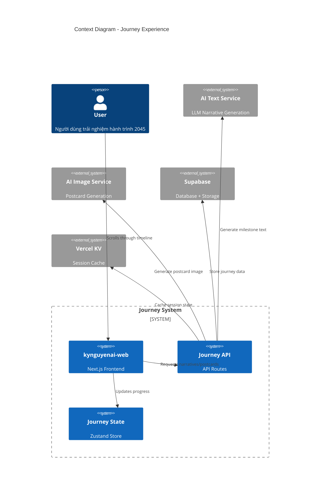
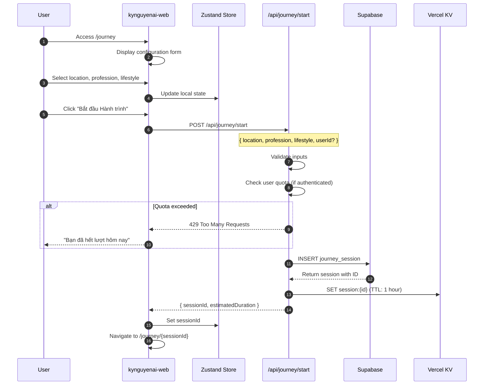
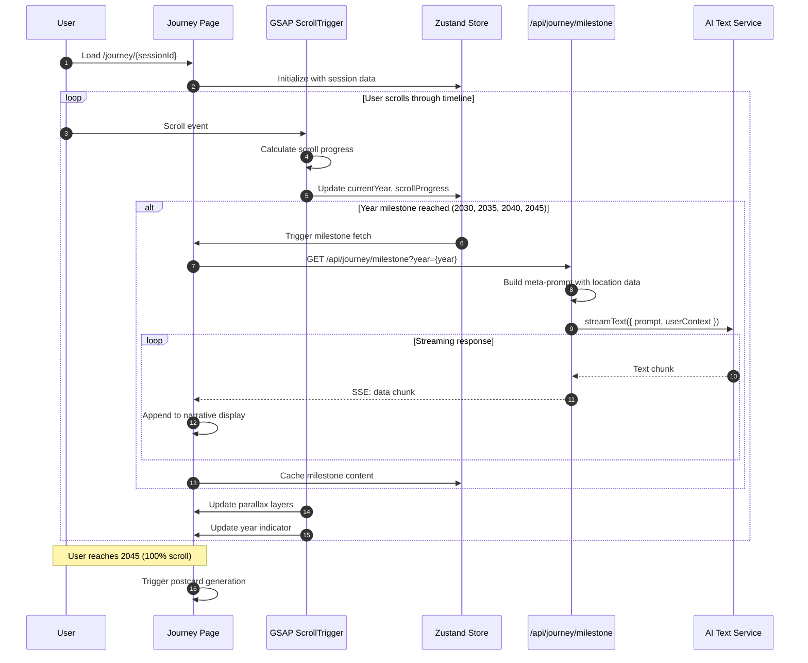
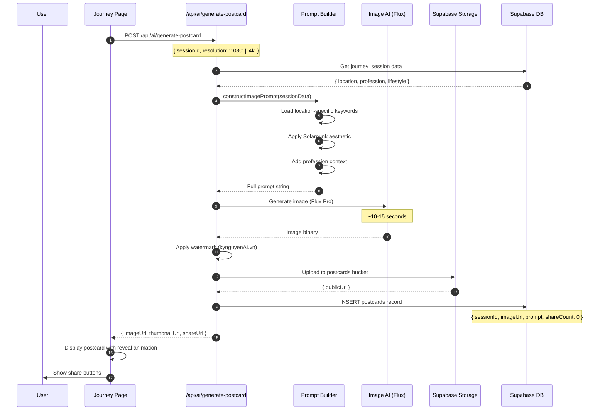
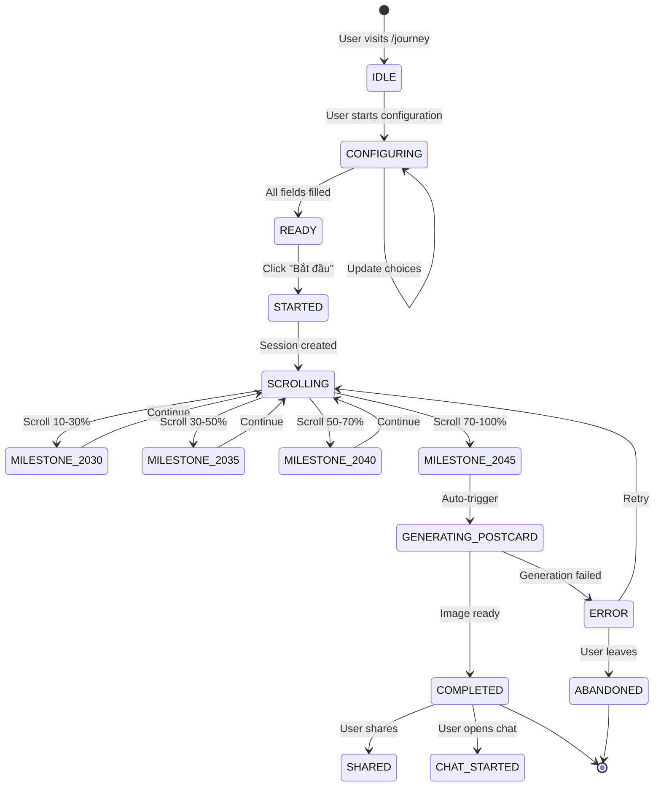
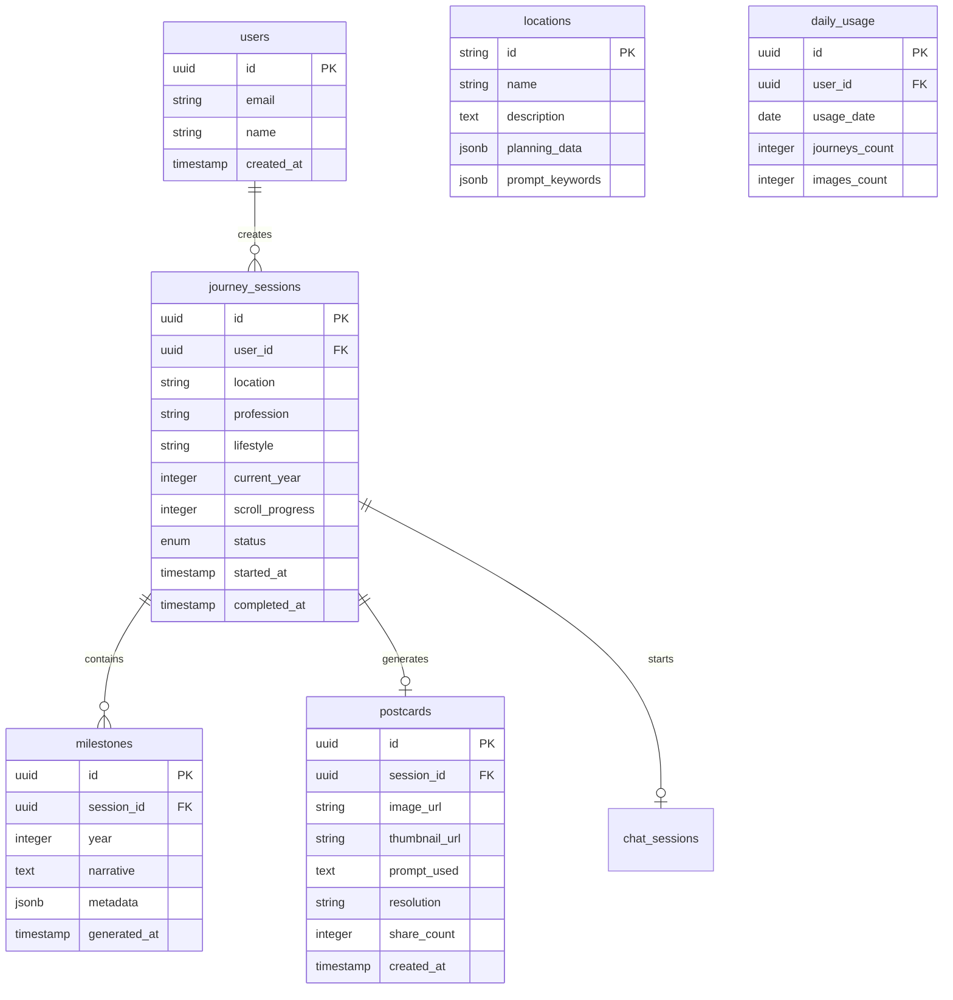

# HLD - TM-JOURNEY (Time Machine - Journey Experience)

## 1. Bối cảnh (Context)

### 1.1 Bối cảnh về kinh doanh (Business Context)

**Journey Experience** là tính năng cốt lõi của kynguyenAI.vn - một trải nghiệm web tương tác sử dụng kỹ thuật Scrollytelling để đưa người dùng xuyên qua thời gian từ năm 2026 đến 2045, hình dung tương lai của Việt Nam và của chính họ.

**Mục tiêu kinh doanh:**
- Tạo trải nghiệm "Wow Factor" độc nhất trên thị trường AI Việt Nam
- Thu hút và giữ chân người dùng thông qua storytelling immersive
- Tạo ra "Viral Asset" (Bưu thiếp 2045) để người dùng chia sẻ
- Chuyển đổi người dùng từ Free sang Premium tier

**User Journey Overview:**

```
┌─────────────────────────────────────────────────────────────────────────────┐
│                         JOURNEY USER FLOW                                    │
├─────────────────────────────────────────────────────────────────────────────┤
│                                                                               │
│   ┌─────────────┐    ┌─────────────┐    ┌─────────────┐    ┌─────────────┐  │
│   │  LANDING    │───►│  CONFIGURE  │───►│  SCROLLING  │───►│  POSTCARD   │  │
│   │  PAGE       │    │  JOURNEY    │    │  EXPERIENCE │    │  REVEAL     │  │
│   └─────────────┘    └─────────────┘    └─────────────┘    └─────────────┘  │
│                                                                               │
│   • 3D Globe         • Location         • 2026 → 2045     • AI Image Gen   │
│   • Hero CTA         • Profession       • AI Narrative    • Share buttons  │
│   • Social Proof     • Lifestyle        • Parallax FX     • Chat CTA       │
│                                                                               │
└─────────────────────────────────────────────────────────────────────────────┘
```

**Các địa điểm được hỗ trợ:**

| ID | Tên | Mô tả | Quy hoạch tham chiếu |
|----|-----|-------|---------------------|
| `can-gio` | Thành phố biển Cần Giờ | Đô thị du lịch sinh thái lấn biển | Quy hoạch TP.HCM 2040-2060 |
| `thu-duc` | Trung tâm Đổi mới Thủ Đức | Silicon Valley của Việt Nam | Thành phố Thủ Đức |
| `hanoi` | Đô thị Sông Hồng Hà Nội | Thành phố trong sông | Quy hoạch Hà Nội 2065 |

**Các nghề nghiệp/đam mê được hỗ trợ:**

| Category | Options |
|----------|---------|
| **Công nghệ** | Lập trình viên lượng tử, Kỹ sư AI, Kiến trúc sư metaverse |
| **Sáng tạo** | Nghệ nhân số, Nhà thiết kế sinh thái, Content creator |
| **Sinh thái** | Nông dân đô thị, Kỹ sư môi trường, Nhà nghiên cứu biển |
| **Giáo dục** | Giáo viên tương lai, Nhà nghiên cứu, Mentor AI |
| **Khác** | Doanh nhân xã hội, Bác sĩ telemedicine, Kiến trúc sư |

**Phong cách sống:**

| ID | Tên | Prompt modifier |
|----|-----|-----------------|
| `peaceful` | Yên bình | Serene, minimalist, garden views |
| `vibrant` | Sôi động | Bustling, neon accents, urban energy |
| `connected` | Kết nối | Community-focused, co-working, social spaces |

### 1.2 Bối cảnh về hệ thống (System Context)

#### Các thành phần Web Application:

| Layer | Component | Technology | Mô tả |
|-------|-----------|------------|-------|
| **WEB** | kynguyenai-web | Next.js 15 | Main application |
| **PAGE** | /journey | React + GSAP | Configuration page |
| **PAGE** | /journey/[sessionId] | React + GSAP ScrollTrigger | Scrollytelling experience |
| **PAGE** | /journey/[sessionId]/postcard | React | Final postcard reveal |

#### Backend Services:

| Endpoint | Method | Mô tả |
|----------|--------|-------|
| `/api/journey/start` | POST | Khởi tạo journey session |
| `/api/journey/milestone` | GET | Lấy narrative cho cột mốc (streaming) |
| `/api/journey/complete` | POST | Đánh dấu journey hoàn thành |
| `/api/ai/generate-narrative` | POST | Generate text với LLM (internal) |
| `/api/ai/generate-postcard` | POST | Generate image với Flux (internal) |

#### External Services:

| Service | Mô tả |
|---------|-------|
| **OpenAI / Anthropic** | LLM cho narrative generation |
| **Replicate / Fal.ai** | Image generation (Flux Pro) |
| **Supabase** | Database + Auth + Storage |
| **Vercel KV** | Session caching |

### 1.3 Phạm vi ngoài (Out Of Scope)

| STT | Nội dung | Lý do |
|-----|----------|-------|
| 1 | User Registration | Xem HLD-UM-AUTH |
| 2 | Payment Processing | Xem HLD-UM-SUBSCRIPTION |
| 3 | Chatbot Integration | Xem HLD-CB-FUTURE-SELF |
| 4 | 3D Globe Details | Xem HLD-UX-3D-VISUALIZATION |
| 5 | Animation Technical Details | Xem HLD-UX-SCROLLYTELLING |

### 1.4 Các chân dung (Actors)

| Actor | Mô tả | Hành động chính |
|-------|-------|-----------------|
| **Anonymous User** | Người dùng chưa đăng nhập | Trải nghiệm journey (giới hạn 3/ngày) |
| **Registered User** | Người dùng đã đăng ký | Trải nghiệm journey (theo tier) |
| **Premium User** | Người dùng trả phí | Unlimited journeys, 4K postcards |
| **System** | Background processes | Trigger AI generation, cleanup sessions |

---

## 2. Context Diagram



---

## 3. Core Business Workflow

### 3.1 Sequence Diagram - Start Journey



### 3.2 Sequence Diagram - Scrollytelling Experience



### 3.3 Sequence Diagram - Postcard Generation



---

## 4. State Machine

### 4.1 Journey Session State



### 4.2 State Transitions

| From State | To State | Trigger | Action |
|------------|----------|---------|--------|
| IDLE | CONFIGURING | User interaction | Show form |
| CONFIGURING | READY | All fields valid | Enable start button |
| READY | STARTED | Click start | API call to create session |
| STARTED | SCROLLING | Session created | Navigate to journey page |
| SCROLLING | MILESTONE_XXXX | Scroll threshold | Fetch narrative |
| MILESTONE_2045 | GENERATING_POSTCARD | Reach 100% | Auto-generate |
| GENERATING_POSTCARD | COMPLETED | Image ready | Show postcard |
| COMPLETED | SHARED | Click share | Track share event |

---

## 5. Data Model (ERD)

### 5.1 Entity Relationship Diagram



### 5.2 Table Definitions

```sql
-- Journey Sessions
CREATE TABLE journey_sessions (
    id UUID PRIMARY KEY DEFAULT gen_random_uuid(),
    user_id UUID REFERENCES auth.users(id),
    location VARCHAR(50) NOT NULL,
    profession VARCHAR(100) NOT NULL,
    lifestyle VARCHAR(50) NOT NULL,
    current_year INTEGER DEFAULT 2026 CHECK (current_year >= 2026 AND current_year <= 2045),
    scroll_progress INTEGER DEFAULT 0 CHECK (scroll_progress >= 0 AND scroll_progress <= 100),
    status VARCHAR(30) DEFAULT 'STARTED',
    started_at TIMESTAMPTZ DEFAULT NOW(),
    completed_at TIMESTAMPTZ,
    created_at TIMESTAMPTZ DEFAULT NOW(),
    updated_at TIMESTAMPTZ DEFAULT NOW()
);

-- Indexes
CREATE INDEX idx_journey_sessions_user ON journey_sessions(user_id);
CREATE INDEX idx_journey_sessions_status ON journey_sessions(status);
CREATE INDEX idx_journey_sessions_created ON journey_sessions(created_at DESC);

-- Milestones (cached narratives)
CREATE TABLE milestones (
    id UUID PRIMARY KEY DEFAULT gen_random_uuid(),
    session_id UUID NOT NULL REFERENCES journey_sessions(id) ON DELETE CASCADE,
    year INTEGER NOT NULL CHECK (year IN (2030, 2035, 2040, 2045)),
    narrative TEXT NOT NULL,
    metadata JSONB DEFAULT '{}',
    generated_at TIMESTAMPTZ DEFAULT NOW(),
    UNIQUE(session_id, year)
);

-- Postcards
CREATE TABLE postcards (
    id UUID PRIMARY KEY DEFAULT gen_random_uuid(),
    session_id UUID NOT NULL REFERENCES journey_sessions(id) ON DELETE CASCADE,
    image_url TEXT NOT NULL,
    thumbnail_url TEXT,
    prompt_used TEXT NOT NULL,
    resolution VARCHAR(10) DEFAULT '1080',
    share_count INTEGER DEFAULT 0,
    created_at TIMESTAMPTZ DEFAULT NOW()
);

-- Locations (Knowledge Base)
CREATE TABLE locations (
    id VARCHAR(50) PRIMARY KEY,
    name VARCHAR(100) NOT NULL,
    description TEXT,
    planning_data JSONB NOT NULL,
    prompt_keywords JSONB NOT NULL,
    created_at TIMESTAMPTZ DEFAULT NOW(),
    updated_at TIMESTAMPTZ DEFAULT NOW()
);

-- Daily Usage Tracking
CREATE TABLE daily_usage (
    id UUID PRIMARY KEY DEFAULT gen_random_uuid(),
    user_id UUID REFERENCES auth.users(id),
    anonymous_id VARCHAR(100),
    usage_date DATE NOT NULL DEFAULT CURRENT_DATE,
    journeys_count INTEGER DEFAULT 0,
    images_count INTEGER DEFAULT 0,
    UNIQUE(user_id, usage_date),
    UNIQUE(anonymous_id, usage_date)
);
```

### 5.3 Sample Data

```json
// journey_sessions
{
    "id": "550e8400-e29b-41d4-a716-446655440000",
    "user_id": null,
    "location": "thu-duc",
    "profession": "Lập trình viên lượng tử",
    "lifestyle": "vibrant",
    "current_year": 2045,
    "scroll_progress": 100,
    "status": "COMPLETED",
    "started_at": "2025-01-15T10:30:00Z",
    "completed_at": "2025-01-15T10:35:00Z"
}

// locations
{
    "id": "thu-duc",
    "name": "Trung tâm Đổi mới Thủ Đức",
    "description": "Silicon Valley của Việt Nam",
    "planning_data": {
        "area_km2": 211,
        "population_2045": 1500000,
        "key_projects": ["Innovation District", "Metro Lines 1-2", "AI Research Hub"],
        "green_coverage": 40
    },
    "prompt_keywords": {
        "architecture": ["gleaming skyscrapers", "vertical gardens", "smart buildings"],
        "transport": ["autonomous vehicles", "drone delivery", "monorail"],
        "atmosphere": ["innovation hub", "startup ecosystem", "tech campus"]
    }
}
```

---

## 6. Event Architecture

### 6.1 Event Catalog

| Event | Publisher | Consumers | Mô tả |
|-------|-----------|-----------|-------|
| `journey.started` | Journey API | Analytics, Usage Tracker | Journey bắt đầu |
| `journey.milestone.reached` | Journey API | Analytics | User đạt cột mốc năm |
| `journey.completed` | Journey API | Analytics, Notification | Journey hoàn thành |
| `postcard.generated` | Image API | Analytics, Storage | Postcard được tạo |
| `postcard.shared` | Frontend | Analytics, Viral Tracker | User chia sẻ postcard |

### 6.2 Event Payloads

```typescript
// journey.started
interface JourneyStartedEvent {
    eventType: 'journey.started';
    timestamp: string;
    payload: {
        sessionId: string;
        userId: string | null;
        location: string;
        profession: string;
        lifestyle: string;
        isAnonymous: boolean;
    };
}

// journey.completed
interface JourneyCompletedEvent {
    eventType: 'journey.completed';
    timestamp: string;
    payload: {
        sessionId: string;
        userId: string | null;
        durationSeconds: number;
        postcardGenerated: boolean;
    };
}

// postcard.shared
interface PostcardSharedEvent {
    eventType: 'postcard.shared';
    timestamp: string;
    payload: {
        postcardId: string;
        sessionId: string;
        platform: 'facebook' | 'twitter' | 'linkedin' | 'copy_link';
        referrer: string;
    };
}
```

---

## 7. API Contracts

### 7.1 POST /api/journey/start

**Request:**
```typescript
interface StartJourneyRequest {
    location: 'can-gio' | 'thu-duc' | 'hanoi';
    profession: string;
    lifestyle: 'peaceful' | 'vibrant' | 'connected';
}
```

**Response (201 Created):**
```typescript
interface StartJourneyResponse {
    sessionId: string;
    estimatedDuration: number; // minutes
    location: {
        id: string;
        name: string;
    };
}
```

**Error Responses:**

| Status | Code | Message |
|--------|------|---------|
| 400 | INVALID_INPUT | Missing or invalid fields |
| 429 | QUOTA_EXCEEDED | Daily limit reached |
| 500 | INTERNAL_ERROR | Server error |

### 7.2 GET /api/journey/milestone

**Request:**
```
GET /api/journey/milestone?sessionId={sessionId}&year={year}
Accept: text/event-stream
```

**Response (SSE Stream):**
```
event: start
data: {"year": 2030, "status": "generating"}

event: delta
data: {"content": "Năm 2030, "}

event: delta
data: {"content": "tuyến Metro số 2 "}

event: delta
data: {"content": "Bến Thành - Tham Lương đã hoàn thiện..."}

event: complete
data: {"year": 2030, "totalTokens": 150}
```

### 7.3 POST /api/ai/generate-postcard

**Request:**
```typescript
interface GeneratePostcardRequest {
    sessionId: string;
    resolution: '1080' | '4k';
}
```

**Response (200 OK):**
```typescript
interface GeneratePostcardResponse {
    postcardId: string;
    imageUrl: string;
    thumbnailUrl: string;
    shareUrl: string;
    prompt: string;
    generationTime: number; // seconds
}
```

---

## 8. UI Wireframes

### 8.1 Configuration Page (/journey)

```
┌─────────────────────────────────────────────────────────────────┐
│  kynguyenAI.vn                                    [Đăng nhập]   │
├─────────────────────────────────────────────────────────────────┤
│                                                                   │
│          ┌─────────────────────────────────────────┐             │
│          │                                         │             │
│          │         🌏 [3D Globe Animation]         │             │
│          │                                         │             │
│          └─────────────────────────────────────────┘             │
│                                                                   │
│     "Bạn thấy mình ở đâu khi Việt Nam kỷ niệm                   │
│      100 năm thành lập nước vào năm 2045?"                      │
│                                                                   │
│     ┌───────────────────────────────────────────────────────┐   │
│     │ 📍 Chọn địa điểm                                      │   │
│     │   ○ Thành phố biển Cần Giờ                            │   │
│     │   ● Trung tâm Đổi mới Thủ Đức                         │   │
│     │   ○ Đô thị Sông Hồng Hà Nội                           │   │
│     └───────────────────────────────────────────────────────┘   │
│                                                                   │
│     ┌───────────────────────────────────────────────────────┐   │
│     │ 💼 Nghề nghiệp / Đam mê                               │   │
│     │   [Lập trình viên lượng tử              ▼]           │   │
│     └───────────────────────────────────────────────────────┘   │
│                                                                   │
│     ┌───────────────────────────────────────────────────────┐   │
│     │ 🎨 Phong cách sống                                    │   │
│     │   ○ Yên bình    ● Sôi động    ○ Kết nối              │   │
│     └───────────────────────────────────────────────────────┘   │
│                                                                   │
│                  ┌─────────────────────────┐                     │
│                  │   🚀 Bắt đầu Hành trình  │                     │
│                  └─────────────────────────┘                     │
│                                                                   │
│                     Còn 3 lượt miễn phí hôm nay                  │
│                                                                   │
└─────────────────────────────────────────────────────────────────┘
```

### 8.2 Scrollytelling Experience (/journey/[sessionId])

```
┌─────────────────────────────────────────────────────────────────┐
│                                                                   │
│  ┌────────────────────────────────────────────────────────────┐ │
│  │                                                            │ │
│  │         [PARALLAX BACKGROUND - Thu Duc 2035]               │ │
│  │         Wireframe buildings + blueprints                   │ │
│  │                                                            │ │
│  │    ╔══════════════════════════════════════════════════╗   │ │
│  │    ║                                                  ║   │ │
│  │    ║   "Năm 2035, Trung tâm Đổi mới Thủ Đức          ║   │ │
│  │    ║   đã trở thành điểm đến của các startup         ║   │ │
│  │    ║   công nghệ hàng đầu châu Á. Bạn, với           ║   │ │
│  │    ║   vai trò Lập trình viên lượng tử, đang         ║   │ │
│  │    ║   làm việc tại một trong những quantum          ║   │ │
│  │    ║   labs tiên tiến nhất..."                       ║   │ │
│  │    ║                        [█████████░░░]           ║   │ │
│  │    ║                        (Streaming...)           ║   │ │
│  │    ╚══════════════════════════════════════════════════╝   │ │
│  │                                                            │ │
│  └────────────────────────────────────────────────────────────┘ │
│                                                                   │
│  ┌────────────────────────────────────────────────────────────┐ │
│  │  2026    2030    2035    2040    2045                      │ │
│  │   ○───────○───────●───────○───────○                        │ │
│  │                   ↑                                        │ │
│  │               Bạn đang ở đây                               │ │
│  └────────────────────────────────────────────────────────────┘ │
│                                                                   │
│          ▼ Cuộn xuống để tiếp tục hành trình ▼                  │
│                                                                   │
└─────────────────────────────────────────────────────────────────┘
```

### 8.3 Postcard Reveal

```
┌─────────────────────────────────────────────────────────────────┐
│                                                                   │
│                    🎉 CHÀO MỪNG ĐẾN NĂM 2045!                    │
│                                                                   │
│     ┌───────────────────────────────────────────────────────┐   │
│     │                                                       │   │
│     │                                                       │   │
│     │         [AI GENERATED POSTCARD IMAGE]                 │   │
│     │                                                       │   │
│     │         Solarpunk Thu Duc 2045                        │   │
│     │         Quantum Lab with vertical gardens             │   │
│     │                                                       │   │
│     │                                                       │   │
│     │                              kynguyenAI.vn           │   │
│     └───────────────────────────────────────────────────────┘   │
│                                                                   │
│                  "Bưu thiếp từ Tương lai của bạn"               │
│                                                                   │
│     ┌─────────┐  ┌─────────┐  ┌─────────┐  ┌─────────┐         │
│     │ Facebook │  │ Twitter │  │LinkedIn │  │  Copy   │         │
│     │   Share  │  │  Share  │  │  Share  │  │  Link   │         │
│     └─────────┘  └─────────┘  └─────────┘  └─────────┘         │
│                                                                   │
│     ┌───────────────────────────────────────────────────────┐   │
│     │  💬 Trò chuyện với Bản thể Tương lai của bạn →        │   │
│     └───────────────────────────────────────────────────────┘   │
│                                                                   │
│     ┌───────────────────────────────────────────────────────┐   │
│     │  🔄 Tạo hành trình mới                                │   │
│     └───────────────────────────────────────────────────────┘   │
│                                                                   │
└─────────────────────────────────────────────────────────────────┘
```

---

## 9. Integration Points

### 9.1 Internal Integrations

| Service | Integration Type | Mô tả |
|---------|-----------------|-------|
| **HLD-AI-TEXT-GENERATION** | API Call | Gọi để generate narrative tại mỗi milestone |
| **HLD-AI-IMAGE-GENERATION** | API Call | Gọi để generate postcard khi hoàn thành |
| **HLD-CB-FUTURE-SELF** | Navigation | Redirect sang chatbot sau khi xem postcard |
| **HLD-UX-SCROLLYTELLING** | Component | Sử dụng GSAP components |
| **HLD-UM-AUTH** | Middleware | Check authentication state |
| **HLD-UM-SUBSCRIPTION** | API Call | Check quota và tier |
| **HLD-AN-VIRAL-METRICS** | Event | Track share events |

### 9.2 External Integrations

| Service | Purpose | Fallback |
|---------|---------|----------|
| **OpenAI/Anthropic** | Text generation | Switch provider |
| **Replicate/Fal.ai** | Image generation | Switch provider |
| **Supabase** | Database + Auth | N/A (critical) |
| **Vercel KV** | Session cache | Use DB directly |

---

## 10. Non-Functional Requirements

### 10.1 Performance

| Metric | Target | Measurement |
|--------|--------|-------------|
| **Page Load (LCP)** | < 2.5s | Core Web Vitals |
| **Scroll FPS** | 60 fps | Chrome DevTools |
| **Text Streaming TTFB** | < 500ms | API monitoring |
| **Image Generation** | < 15s | API monitoring |
| **Total Journey Time** | 3-5 minutes | User analytics |

### 10.2 Scalability

| Aspect | Target |
|--------|--------|
| **Concurrent Users** | 1,000+ |
| **Daily Journeys** | 10,000+ |
| **Image Generations/day** | 5,000+ |
| **Database Connections** | Supabase pooling |

### 10.3 Reliability

| Metric | Target |
|--------|--------|
| **Uptime** | 99.9% |
| **Error Rate** | < 1% |
| **AI Fallback** | Auto-switch providers |

### 10.4 Security

| Aspect | Implementation |
|--------|----------------|
| **Rate Limiting** | 3 journeys/day (free), unlimited (premium) |
| **Input Validation** | Zod schema validation |
| **Content Moderation** | AI-generated content filters |
| **Session Security** | Short-lived tokens, no PII in URLs |

### 10.5 SEO & Social

| Aspect | Implementation |
|--------|----------------|
| **Server Rendering** | Next.js SSR cho metadata |
| **Open Graph** | Dynamic OG images cho shared postcards |
| **Schema.org** | WebApplication markup |
| **Sitemap** | Auto-generated |

---

## 11. Phụ lục (Appendix)

### 11.1 Prompt Template Example

```typescript
const constructNarrativePrompt = (
    location: string,
    profession: string,
    year: number,
    previousContext: string
): string => {
    const locationData = locations[location];

    return `
Bạn là một nhà tương lai học chuyên về quy hoạch đô thị Việt Nam.

## Bối cảnh
- Địa điểm: ${locationData.name}
- Nghề nghiệp của người dùng: ${profession}
- Năm hiện tại trong câu chuyện: ${year}
- Dữ liệu quy hoạch: ${JSON.stringify(locationData.planningData)}

## Nhiệm vụ
Viết một đoạn văn ngắn (3-4 câu) mô tả cuộc sống của người dùng tại ${year}.
- Sử dụng ngôi thứ hai ("Bạn")
- Phong cách: Solarpunk, lạc quan, công nghệ hài hòa thiên nhiên
- Tích hợp các từ khóa: ${locationData.promptKeywords[year]}
- Tiếp nối ngữ cảnh trước: "${previousContext}"

## Giọng văn
Truyền cảm hứng nhưng thực tế, dựa trên dữ liệu quy hoạch thực.
Không sử dụng emoji.
    `.trim();
};
```

### 11.2 Enums

```typescript
enum JourneyStatus {
    IDLE = 'IDLE',
    CONFIGURING = 'CONFIGURING',
    READY = 'READY',
    STARTED = 'STARTED',
    SCROLLING = 'SCROLLING',
    MILESTONE_2030 = 'MILESTONE_2030',
    MILESTONE_2035 = 'MILESTONE_2035',
    MILESTONE_2040 = 'MILESTONE_2040',
    MILESTONE_2045 = 'MILESTONE_2045',
    GENERATING_POSTCARD = 'GENERATING_POSTCARD',
    COMPLETED = 'COMPLETED',
    SHARED = 'SHARED',
    ERROR = 'ERROR',
    ABANDONED = 'ABANDONED'
}

enum Location {
    CAN_GIO = 'can-gio',
    THU_DUC = 'thu-duc',
    HANOI = 'hanoi'
}

enum Lifestyle {
    PEACEFUL = 'peaceful',
    VIBRANT = 'vibrant',
    CONNECTED = 'connected'
}
```

---

**Tài liệu liên quan:**
- [HLD-AI-TEXT-GENERATION.md](./HLD-AI-TEXT-GENERATION.md) - Chi tiết AI Text Generation
- [HLD-AI-IMAGE-GENERATION.md](./HLD-AI-IMAGE-GENERATION.md) - Chi tiết AI Image Generation
- [HLD-UX-SCROLLYTELLING.md](./HLD-UX-SCROLLYTELLING.md) - Chi tiết Animation System
- [HLD-CB-FUTURE-SELF.md](./HLD-CB-FUTURE-SELF.md) - Chi tiết Chatbot
