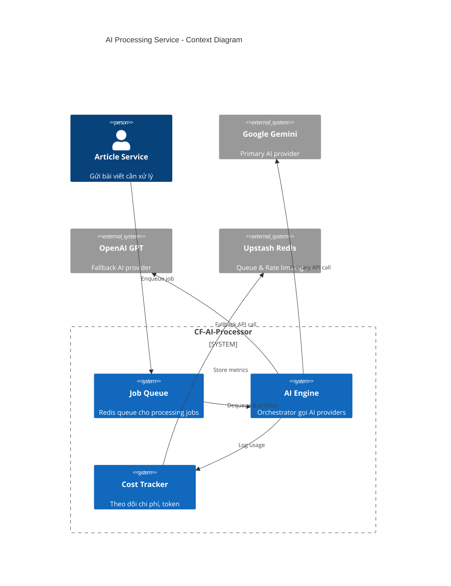
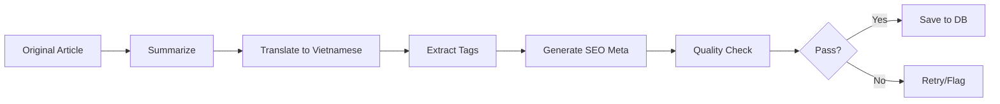
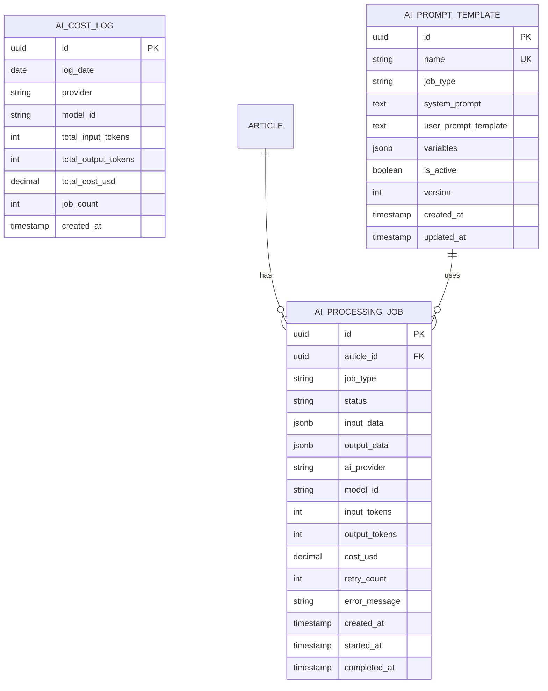
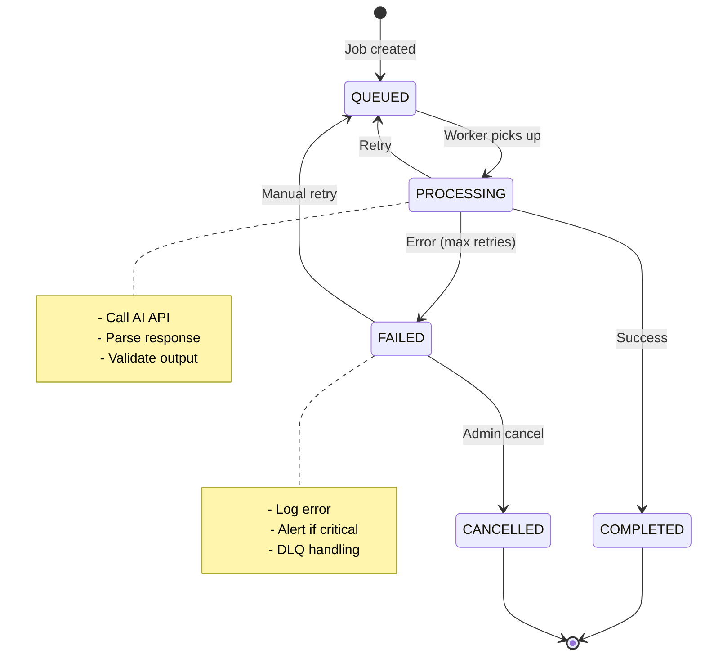
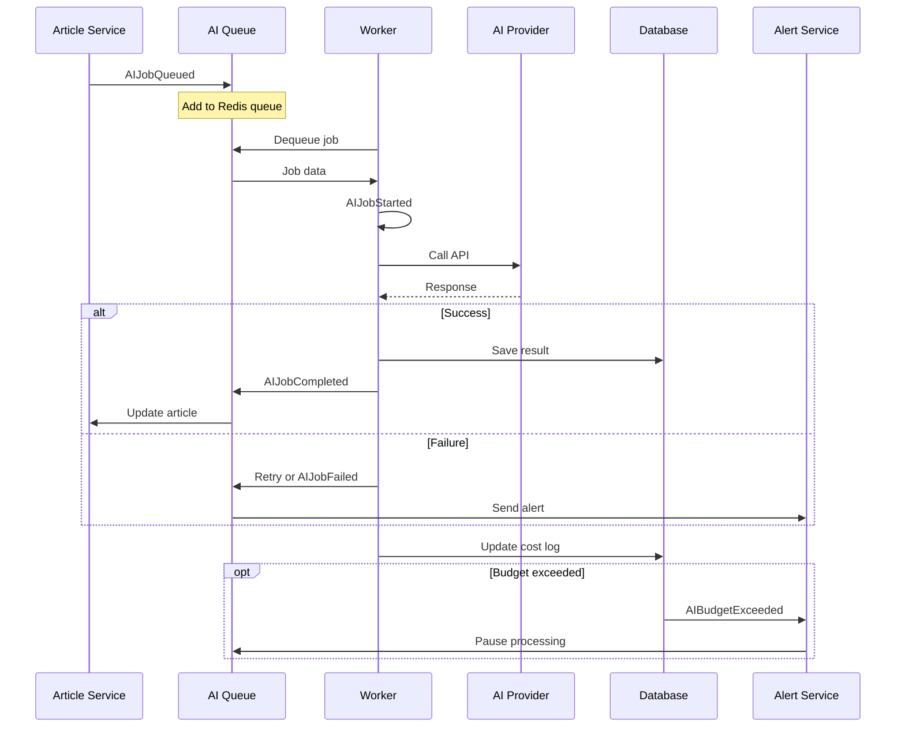

# HLD-CF-AI-PROCESSING - Xử lý AI (Tóm tắt & Dịch thuật)

## 1. Bối cảnh

### 1.1 Bối cảnh Nghiệp vụ

**Vấn đề cần giải quyết:**
- Tin tức công nghệ quốc tế chủ yếu bằng tiếng Anh
- Lập trình viên Việt Nam cần nội dung Việt hóa chất lượng cao
- Bản dịch tự động thường không giữ được thuật ngữ kỹ thuật
- Cần tóm tắt ngắn gọn để tiết kiệm thời gian đọc

**Giải pháp:**
- Sử dụng AI (Gemini/GPT) để tóm tắt và Việt hóa nội dung
- Prompt engineering để bảo toàn thuật ngữ kỹ thuật
- Pipeline xử lý tự động với fallback strategy

### 1.2 Bối cảnh Hệ thống

```
┌─────────────────────────────────────────────────────────────────────┐
│                    CF-AI-PROCESSOR SERVICE                          │
├─────────────────────────────────────────────────────────────────────┤
│                                                                      │
│   ┌──────────────┐    ┌──────────────┐    ┌──────────────┐         │
│   │   Job Queue  │───►│  AI Engine   │───►│   Output     │         │
│   │   (Redis)    │    │              │    │   Handler    │         │
│   └──────────────┘    └──────────────┘    └──────────────┘         │
│                              │                                      │
│                              ▼                                      │
│                    ┌──────────────────┐                            │
│                    │  Cost Tracker    │                            │
│                    │  Token Counter   │                            │
│                    └──────────────────┘                            │
│                                                                      │
└─────────────────────────────────────────────────────────────────────┘
```

---

## 2. Context Diagram



---

## 3. Xử lý AI Chi tiết

### 3.1 Pipeline Xử lý



### 3.2 Job Types

| Job Type | Mô tả | Token ước tính | Priority |
|----------|-------|----------------|----------|
| `SUMMARIZE` | Tóm tắt bài viết gốc | 500-1000 | HIGH |
| `TRANSLATE` | Dịch sang tiếng Việt | 1000-2000 | HIGH |
| `EXTRACT_TAGS` | Trích xuất tags/keywords | 200-400 | MEDIUM |
| `GENERATE_SEO` | Tạo meta description, title | 300-500 | LOW |
| `FULL_PROCESS` | Tất cả các bước trên | 2000-4000 | HIGH |

---

## 4. Data Model (ERD)



### 4.1 SQL Schema

```sql
-- AI Processing Jobs
CREATE TABLE ai_processing_job (
    id UUID PRIMARY KEY DEFAULT gen_random_uuid(),
    article_id UUID NOT NULL REFERENCES article(id) ON DELETE CASCADE,
    job_type VARCHAR(50) NOT NULL,
    status VARCHAR(20) NOT NULL DEFAULT 'QUEUED',
    input_data JSONB,
    output_data JSONB,
    ai_provider VARCHAR(20), -- 'gemini', 'openai'
    model_id VARCHAR(50), -- 'gemini-1.5-flash', 'gpt-4o-mini'
    input_tokens INTEGER DEFAULT 0,
    output_tokens INTEGER DEFAULT 0,
    cost_usd DECIMAL(10, 6) DEFAULT 0,
    retry_count INTEGER DEFAULT 0,
    error_message TEXT,
    created_at TIMESTAMPTZ DEFAULT NOW(),
    started_at TIMESTAMPTZ,
    completed_at TIMESTAMPTZ,

    CONSTRAINT chk_job_type CHECK (job_type IN ('SUMMARIZE', 'TRANSLATE', 'EXTRACT_TAGS', 'GENERATE_SEO', 'FULL_PROCESS')),
    CONSTRAINT chk_status CHECK (status IN ('QUEUED', 'PROCESSING', 'COMPLETED', 'FAILED', 'CANCELLED'))
);

CREATE INDEX idx_ai_job_status ON ai_processing_job(status);
CREATE INDEX idx_ai_job_article ON ai_processing_job(article_id);
CREATE INDEX idx_ai_job_created ON ai_processing_job(created_at);

-- Daily Cost Aggregation
CREATE TABLE ai_cost_log (
    id UUID PRIMARY KEY DEFAULT gen_random_uuid(),
    log_date DATE NOT NULL,
    provider VARCHAR(20) NOT NULL,
    model_id VARCHAR(50) NOT NULL,
    total_input_tokens INTEGER DEFAULT 0,
    total_output_tokens INTEGER DEFAULT 0,
    total_cost_usd DECIMAL(10, 4) DEFAULT 0,
    job_count INTEGER DEFAULT 0,
    created_at TIMESTAMPTZ DEFAULT NOW(),

    UNIQUE(log_date, provider, model_id)
);

-- Prompt Templates
CREATE TABLE ai_prompt_template (
    id UUID PRIMARY KEY DEFAULT gen_random_uuid(),
    name VARCHAR(100) UNIQUE NOT NULL,
    job_type VARCHAR(50) NOT NULL,
    system_prompt TEXT NOT NULL,
    user_prompt_template TEXT NOT NULL,
    variables JSONB DEFAULT '[]',
    is_active BOOLEAN DEFAULT true,
    version INTEGER DEFAULT 1,
    created_at TIMESTAMPTZ DEFAULT NOW(),
    updated_at TIMESTAMPTZ DEFAULT NOW()
);
```

---

## 5. State Machine



### 5.1 State Transitions

| From | To | Trigger | Action |
|------|-----|---------|--------|
| `QUEUED` | `PROCESSING` | Worker dequeue | Set `started_at`, update status |
| `PROCESSING` | `COMPLETED` | AI response valid | Save output, calculate cost |
| `PROCESSING` | `FAILED` | Error + max retries | Log error, send alert |
| `PROCESSING` | `QUEUED` | Error + retries left | Increment `retry_count`, re-enqueue |
| `FAILED` | `QUEUED` | Admin action | Reset `retry_count` |
| `FAILED` | `CANCELLED` | Admin action | Mark as cancelled |

---

## 6. Prompt Engineering

### 6.1 Summarization Prompt

```typescript
const SUMMARIZE_PROMPT = {
  system: `Bạn là chuyên gia tóm tắt tin tức công nghệ. Nhiệm vụ:
1. Tóm tắt bài viết trong 2-3 câu (tối đa 150 từ tiếng Việt)
2. Giữ nguyên các thuật ngữ kỹ thuật tiếng Anh (React, API, TypeScript, etc.)
3. Tập trung vào thông tin quan trọng nhất
4. Giọng văn chuyên nghiệp, trung lập
5. Không thêm ý kiến cá nhân`,

  user: `Tóm tắt bài viết sau bằng tiếng Việt:

---
Tiêu đề: {title}
Nội dung: {content}
---

Yêu cầu:
- Tóm tắt trong 2-3 câu
- Giữ nguyên thuật ngữ kỹ thuật tiếng Anh
- Trả về JSON format: { "summary": "..." }`
};
```

### 6.2 Translation Prompt

```typescript
const TRANSLATE_PROMPT = {
  system: `Bạn là dịch giả chuyên ngành công nghệ thông tin. Quy tắc:

1. KHÔNG dịch các thuật ngữ sau:
   - Framework/Library names: React, Vue, Angular, Next.js, Node.js
   - Concepts: API, REST, GraphQL, OAuth, JWT, CRUD
   - Tools: Docker, Kubernetes, Git, GitHub, VS Code
   - Languages: TypeScript, JavaScript, Python, Rust, Go

2. Giữ format code blocks nguyên vẹn
3. Dịch tự nhiên, không dịch máy móc
4. Sử dụng thuật ngữ phổ biến trong cộng đồng dev Việt`,

  user: `Dịch bài viết sau sang tiếng Việt:

---
Title: {title}
Content: {content}
---

Trả về JSON:
{
  "title_vi": "Tiêu đề tiếng Việt",
  "content_vi": "Nội dung tiếng Việt"
}`
};
```

### 6.3 Tag Extraction Prompt

```typescript
const EXTRACT_TAGS_PROMPT = {
  system: `Bạn là chuyên gia phân loại nội dung công nghệ.
Trích xuất 3-5 tags phù hợp nhất cho bài viết.`,

  user: `Phân tích bài viết và trích xuất tags:

---
{title}
{summary}
---

Tags hợp lệ: frontend, backend, devops, ai-ml, web3, security, mobile, database, cloud, tools

Trả về JSON: { "tags": ["tag1", "tag2", ...] }`
};
```

---

## 7. AI Provider Integration

### 7.1 Provider Configuration

```typescript
// lib/ai/config.ts

export const AI_PROVIDERS = {
  gemini: {
    name: 'Google Gemini',
    baseUrl: 'https://generativelanguage.googleapis.com/v1beta',
    models: {
      flash: {
        id: 'gemini-1.5-flash',
        inputCostPer1M: 0.075,  // $0.075 per 1M tokens
        outputCostPer1M: 0.30,
        maxTokens: 8192,
        rateLimit: 60, // requests per minute
      },
      pro: {
        id: 'gemini-1.5-pro',
        inputCostPer1M: 1.25,
        outputCostPer1M: 5.00,
        maxTokens: 8192,
        rateLimit: 60,
      }
    },
    priority: 1, // Primary provider
  },

  openai: {
    name: 'OpenAI',
    baseUrl: 'https://api.openai.com/v1',
    models: {
      mini: {
        id: 'gpt-4o-mini',
        inputCostPer1M: 0.15,
        outputCostPer1M: 0.60,
        maxTokens: 4096,
        rateLimit: 500,
      },
      gpt4: {
        id: 'gpt-4o',
        inputCostPer1M: 2.50,
        outputCostPer1M: 10.00,
        maxTokens: 4096,
        rateLimit: 500,
      }
    },
    priority: 2, // Fallback provider
  }
} as const;
```

### 7.2 AI Client Implementation

```typescript
// lib/ai/client.ts

import { GoogleGenerativeAI } from '@google/generative-ai';
import OpenAI from 'openai';

export class AIClient {
  private gemini: GoogleGenerativeAI;
  private openai: OpenAI;

  constructor() {
    this.gemini = new GoogleGenerativeAI(process.env.GEMINI_API_KEY!);
    this.openai = new OpenAI({ apiKey: process.env.OPENAI_API_KEY });
  }

  async process(
    prompt: { system: string; user: string },
    options: ProcessOptions = {}
  ): Promise<AIResponse> {
    const { provider = 'gemini', model = 'flash' } = options;

    try {
      if (provider === 'gemini') {
        return await this.callGemini(prompt, model);
      } else {
        return await this.callOpenAI(prompt, model);
      }
    } catch (error) {
      // Fallback to OpenAI if Gemini fails
      if (provider === 'gemini' && options.enableFallback !== false) {
        console.log('Gemini failed, falling back to OpenAI');
        return await this.callOpenAI(prompt, 'mini');
      }
      throw error;
    }
  }

  private async callGemini(
    prompt: { system: string; user: string },
    model: string
  ): Promise<AIResponse> {
    const modelConfig = AI_PROVIDERS.gemini.models[model as keyof typeof AI_PROVIDERS.gemini.models];
    const genModel = this.gemini.getGenerativeModel({
      model: modelConfig.id,
      systemInstruction: prompt.system,
    });

    const result = await genModel.generateContent(prompt.user);
    const response = result.response;
    const text = response.text();

    // Extract token counts
    const usage = response.usageMetadata;

    return {
      content: text,
      provider: 'gemini',
      model: modelConfig.id,
      inputTokens: usage?.promptTokenCount || 0,
      outputTokens: usage?.candidatesTokenCount || 0,
      cost: this.calculateCost('gemini', model, usage),
    };
  }

  private async callOpenAI(
    prompt: { system: string; user: string },
    model: string
  ): Promise<AIResponse> {
    const modelConfig = AI_PROVIDERS.openai.models[model as keyof typeof AI_PROVIDERS.openai.models];

    const completion = await this.openai.chat.completions.create({
      model: modelConfig.id,
      messages: [
        { role: 'system', content: prompt.system },
        { role: 'user', content: prompt.user },
      ],
      response_format: { type: 'json_object' },
    });

    const usage = completion.usage;

    return {
      content: completion.choices[0].message.content || '',
      provider: 'openai',
      model: modelConfig.id,
      inputTokens: usage?.prompt_tokens || 0,
      outputTokens: usage?.completion_tokens || 0,
      cost: this.calculateCost('openai', model, usage),
    };
  }

  private calculateCost(
    provider: string,
    model: string,
    usage: any
  ): number {
    const config = AI_PROVIDERS[provider as keyof typeof AI_PROVIDERS];
    const modelConfig = config.models[model as keyof typeof config.models];

    const inputCost = (usage?.promptTokenCount || usage?.prompt_tokens || 0)
      * modelConfig.inputCostPer1M / 1_000_000;
    const outputCost = (usage?.candidatesTokenCount || usage?.completion_tokens || 0)
      * modelConfig.outputCostPer1M / 1_000_000;

    return inputCost + outputCost;
  }
}

interface ProcessOptions {
  provider?: 'gemini' | 'openai';
  model?: string;
  enableFallback?: boolean;
}

interface AIResponse {
  content: string;
  provider: string;
  model: string;
  inputTokens: number;
  outputTokens: number;
  cost: number;
}
```

---

## 8. Job Processing

### 8.1 Job Queue (Redis)

```typescript
// lib/ai/queue.ts

import { Redis } from '@upstash/redis';

const redis = new Redis({
  url: process.env.UPSTASH_REDIS_URL!,
  token: process.env.UPSTASH_REDIS_TOKEN!,
});

const QUEUE_KEY = 'ai:jobs:queue';
const PROCESSING_KEY = 'ai:jobs:processing';
const DLQ_KEY = 'ai:jobs:dlq'; // Dead Letter Queue

export class AIJobQueue {
  async enqueue(job: AIJob): Promise<string> {
    const jobId = crypto.randomUUID();
    const jobData: QueuedJob = {
      ...job,
      id: jobId,
      status: 'QUEUED',
      createdAt: new Date().toISOString(),
      retryCount: 0,
    };

    // Add to queue (LPUSH for FIFO with RPOP)
    await redis.lpush(QUEUE_KEY, JSON.stringify(jobData));

    // Also save job state
    await redis.set(`ai:job:${jobId}`, JSON.stringify(jobData), { ex: 86400 });

    return jobId;
  }

  async dequeue(): Promise<QueuedJob | null> {
    // Move from queue to processing set (atomic operation)
    const jobJson = await redis.rpoplpush(QUEUE_KEY, PROCESSING_KEY);
    if (!jobJson) return null;

    const job = JSON.parse(jobJson as string) as QueuedJob;
    job.status = 'PROCESSING';
    job.startedAt = new Date().toISOString();

    await redis.set(`ai:job:${job.id}`, JSON.stringify(job), { ex: 86400 });

    return job;
  }

  async complete(jobId: string, result: AIResult): Promise<void> {
    const job = await this.getJob(jobId);
    if (!job) throw new Error(`Job ${jobId} not found`);

    job.status = 'COMPLETED';
    job.completedAt = new Date().toISOString();
    job.result = result;

    // Remove from processing
    await redis.lrem(PROCESSING_KEY, 1, JSON.stringify(job));

    // Update job state
    await redis.set(`ai:job:${jobId}`, JSON.stringify(job), { ex: 86400 * 7 });
  }

  async fail(jobId: string, error: string): Promise<void> {
    const job = await this.getJob(jobId);
    if (!job) throw new Error(`Job ${jobId} not found`);

    job.retryCount++;
    job.lastError = error;

    if (job.retryCount >= 3) {
      // Max retries reached - move to DLQ
      job.status = 'FAILED';
      await redis.lpush(DLQ_KEY, JSON.stringify(job));
    } else {
      // Retry - add back to queue with delay
      job.status = 'QUEUED';
      const delay = Math.pow(2, job.retryCount) * 1000; // Exponential backoff

      setTimeout(async () => {
        await redis.lpush(QUEUE_KEY, JSON.stringify(job));
      }, delay);
    }

    // Remove from processing
    await redis.lrem(PROCESSING_KEY, 1, JSON.stringify(job));
    await redis.set(`ai:job:${jobId}`, JSON.stringify(job), { ex: 86400 });
  }

  async getJob(jobId: string): Promise<QueuedJob | null> {
    const data = await redis.get(`ai:job:${jobId}`);
    return data ? JSON.parse(data as string) : null;
  }

  async getQueueStats(): Promise<QueueStats> {
    const [queueLen, processingLen, dlqLen] = await Promise.all([
      redis.llen(QUEUE_KEY),
      redis.llen(PROCESSING_KEY),
      redis.llen(DLQ_KEY),
    ]);

    return {
      queued: queueLen,
      processing: processingLen,
      failed: dlqLen,
    };
  }
}

interface AIJob {
  articleId: string;
  jobType: 'SUMMARIZE' | 'TRANSLATE' | 'EXTRACT_TAGS' | 'GENERATE_SEO' | 'FULL_PROCESS';
  priority?: 'HIGH' | 'MEDIUM' | 'LOW';
  input: {
    title: string;
    content: string;
    sourceUrl?: string;
  };
}

interface QueuedJob extends AIJob {
  id: string;
  status: 'QUEUED' | 'PROCESSING' | 'COMPLETED' | 'FAILED';
  createdAt: string;
  startedAt?: string;
  completedAt?: string;
  retryCount: number;
  lastError?: string;
  result?: AIResult;
}

interface AIResult {
  summary_vi?: string;
  title_vi?: string;
  content_vi?: string;
  tags?: string[];
  seoMeta?: { title: string; description: string };
  provider: string;
  model: string;
  cost: number;
}

interface QueueStats {
  queued: number;
  processing: number;
  failed: number;
}
```

### 8.2 Job Worker

```typescript
// lib/ai/worker.ts

import { AIClient } from './client';
import { AIJobQueue } from './queue';
import { supabase } from '@/lib/supabase';
import {
  SUMMARIZE_PROMPT,
  TRANSLATE_PROMPT,
  EXTRACT_TAGS_PROMPT
} from './prompts';

const aiClient = new AIClient();
const jobQueue = new AIJobQueue();

export async function processNextJob(): Promise<boolean> {
  const job = await jobQueue.dequeue();
  if (!job) return false;

  console.log(`Processing job ${job.id} - ${job.jobType}`);

  try {
    let result: any;

    switch (job.jobType) {
      case 'SUMMARIZE':
        result = await processSummarize(job);
        break;
      case 'TRANSLATE':
        result = await processTranslate(job);
        break;
      case 'EXTRACT_TAGS':
        result = await processExtractTags(job);
        break;
      case 'FULL_PROCESS':
        result = await processFullPipeline(job);
        break;
      default:
        throw new Error(`Unknown job type: ${job.jobType}`);
    }

    // Save result to database
    await saveJobResult(job, result);

    // Mark job as completed
    await jobQueue.complete(job.id, result);

    console.log(`Job ${job.id} completed successfully`);
    return true;

  } catch (error) {
    console.error(`Job ${job.id} failed:`, error);
    await jobQueue.fail(job.id, (error as Error).message);
    return false;
  }
}

async function processSummarize(job: QueuedJob) {
  const prompt = {
    system: SUMMARIZE_PROMPT.system,
    user: SUMMARIZE_PROMPT.user
      .replace('{title}', job.input.title)
      .replace('{content}', job.input.content),
  };

  const response = await aiClient.process(prompt);
  const parsed = JSON.parse(response.content);

  return {
    summary_vi: parsed.summary,
    provider: response.provider,
    model: response.model,
    cost: response.cost,
  };
}

async function processTranslate(job: QueuedJob) {
  const prompt = {
    system: TRANSLATE_PROMPT.system,
    user: TRANSLATE_PROMPT.user
      .replace('{title}', job.input.title)
      .replace('{content}', job.input.content),
  };

  const response = await aiClient.process(prompt);
  const parsed = JSON.parse(response.content);

  return {
    title_vi: parsed.title_vi,
    content_vi: parsed.content_vi,
    provider: response.provider,
    model: response.model,
    cost: response.cost,
  };
}

async function processExtractTags(job: QueuedJob) {
  const prompt = {
    system: EXTRACT_TAGS_PROMPT.system,
    user: EXTRACT_TAGS_PROMPT.user
      .replace('{title}', job.input.title)
      .replace('{summary}', job.input.content.slice(0, 500)),
  };

  const response = await aiClient.process(prompt);
  const parsed = JSON.parse(response.content);

  return {
    tags: parsed.tags,
    provider: response.provider,
    model: response.model,
    cost: response.cost,
  };
}

async function processFullPipeline(job: QueuedJob) {
  // Step 1: Summarize
  const summaryResult = await processSummarize(job);

  // Step 2: Translate (if content is long enough)
  const translateResult = job.input.content.length > 500
    ? await processTranslate(job)
    : { title_vi: job.input.title, content_vi: '', cost: 0 };

  // Step 3: Extract tags
  const tagsResult = await processExtractTags({
    ...job,
    input: { ...job.input, content: summaryResult.summary_vi },
  });

  const totalCost = summaryResult.cost + translateResult.cost + tagsResult.cost;

  return {
    summary_vi: summaryResult.summary_vi,
    title_vi: translateResult.title_vi,
    tags: tagsResult.tags,
    provider: summaryResult.provider,
    model: summaryResult.model,
    cost: totalCost,
  };
}

async function saveJobResult(job: QueuedJob, result: any) {
  // Save to ai_processing_job table
  await supabase.from('ai_processing_job').insert({
    article_id: job.articleId,
    job_type: job.jobType,
    status: 'COMPLETED',
    input_data: job.input,
    output_data: result,
    ai_provider: result.provider,
    model_id: result.model,
    cost_usd: result.cost,
    created_at: job.createdAt,
    completed_at: new Date().toISOString(),
  });

  // Update article with AI results
  const updateData: any = {};
  if (result.summary_vi) updateData.summary_vi = result.summary_vi;
  if (result.title_vi) updateData.title_vi = result.title_vi;
  if (result.tags) {
    // Link tags to article
    for (const tagName of result.tags) {
      const { data: tag } = await supabase
        .from('tag')
        .select('id')
        .eq('name', tagName)
        .single();

      if (tag) {
        await supabase.from('article_tag').upsert({
          article_id: job.articleId,
          tag_id: tag.id,
        });
      }
    }
  }

  if (Object.keys(updateData).length > 0) {
    await supabase
      .from('article')
      .update(updateData)
      .eq('id', job.articleId);
  }

  // Update daily cost log
  await updateCostLog(result.provider, result.model, result.cost);
}

async function updateCostLog(provider: string, model: string, cost: number) {
  const today = new Date().toISOString().split('T')[0];

  await supabase.rpc('upsert_ai_cost_log', {
    p_log_date: today,
    p_provider: provider,
    p_model_id: model,
    p_cost: cost,
  });
}
```

---

## 9. Cost Management

### 9.1 Budget Configuration

```typescript
// lib/ai/budget.ts

export const AI_BUDGET = {
  daily: {
    limit: 10.00, // $10/day
    warning: 8.00, // Alert at 80%
  },
  monthly: {
    limit: 200.00, // $200/month
    warning: 160.00,
  },
  perArticle: {
    max: 0.05, // Max $0.05 per article
  },
};

export async function checkBudget(): Promise<BudgetStatus> {
  const today = new Date().toISOString().split('T')[0];
  const monthStart = today.slice(0, 7) + '-01';

  // Get daily spend
  const { data: dailyCost } = await supabase
    .from('ai_cost_log')
    .select('total_cost_usd')
    .eq('log_date', today);

  const dailySpend = dailyCost?.reduce((sum, row) => sum + row.total_cost_usd, 0) || 0;

  // Get monthly spend
  const { data: monthlyCost } = await supabase
    .from('ai_cost_log')
    .select('total_cost_usd')
    .gte('log_date', monthStart);

  const monthlySpend = monthlyCost?.reduce((sum, row) => sum + row.total_cost_usd, 0) || 0;

  return {
    daily: {
      spent: dailySpend,
      limit: AI_BUDGET.daily.limit,
      remaining: AI_BUDGET.daily.limit - dailySpend,
      isOverBudget: dailySpend >= AI_BUDGET.daily.limit,
      isWarning: dailySpend >= AI_BUDGET.daily.warning,
    },
    monthly: {
      spent: monthlySpend,
      limit: AI_BUDGET.monthly.limit,
      remaining: AI_BUDGET.monthly.limit - monthlySpend,
      isOverBudget: monthlySpend >= AI_BUDGET.monthly.limit,
      isWarning: monthlySpend >= AI_BUDGET.monthly.warning,
    },
  };
}

export async function shouldProcessJob(): Promise<boolean> {
  const budget = await checkBudget();

  if (budget.daily.isOverBudget) {
    console.warn('Daily AI budget exceeded!');
    return false;
  }

  if (budget.monthly.isOverBudget) {
    console.warn('Monthly AI budget exceeded!');
    return false;
  }

  return true;
}
```

### 9.2 Cost Estimation

```typescript
// lib/ai/cost-estimator.ts

export function estimateCost(
  text: string,
  jobType: string,
  provider: 'gemini' | 'openai' = 'gemini'
): CostEstimate {
  // Rough token estimation (1 token ≈ 4 characters for English)
  const inputTokens = Math.ceil(text.length / 4);

  // Output token estimates by job type
  const outputMultiplier: Record<string, number> = {
    SUMMARIZE: 0.2,    // Output ~20% of input
    TRANSLATE: 1.2,    // Output ~120% of input (Vietnamese longer)
    EXTRACT_TAGS: 0.05, // Very short output
    FULL_PROCESS: 1.5,  // Combined output
  };

  const outputTokens = Math.ceil(inputTokens * (outputMultiplier[jobType] || 0.5));

  const config = AI_PROVIDERS[provider].models.flash;
  const cost = (inputTokens * config.inputCostPer1M + outputTokens * config.outputCostPer1M) / 1_000_000;

  return {
    inputTokens,
    outputTokens,
    estimatedCost: cost,
    provider,
    model: config.id,
  };
}
```

---

## 10. API Endpoints

### 10.1 REST API

```typescript
// app/api/ai/process/route.ts

import { NextRequest, NextResponse } from 'next/server';
import { AIJobQueue } from '@/lib/ai/queue';
import { shouldProcessJob } from '@/lib/ai/budget';

const jobQueue = new AIJobQueue();

export async function POST(request: NextRequest) {
  try {
    // Check budget
    if (!(await shouldProcessJob())) {
      return NextResponse.json(
        { error: 'AI budget exceeded' },
        { status: 429 }
      );
    }

    const body = await request.json();
    const { articleId, jobType, input } = body;

    // Validate input
    if (!articleId || !jobType || !input) {
      return NextResponse.json(
        { error: 'Missing required fields' },
        { status: 400 }
      );
    }

    // Enqueue job
    const jobId = await jobQueue.enqueue({
      articleId,
      jobType,
      input,
      priority: 'HIGH',
    });

    return NextResponse.json({
      success: true,
      jobId,
      message: 'Job queued successfully',
    });
  } catch (error) {
    console.error('AI process error:', error);
    return NextResponse.json(
      { error: 'Internal server error' },
      { status: 500 }
    );
  }
}

// GET /api/ai/process?jobId=xxx
export async function GET(request: NextRequest) {
  const jobId = request.nextUrl.searchParams.get('jobId');

  if (!jobId) {
    return NextResponse.json(
      { error: 'jobId is required' },
      { status: 400 }
    );
  }

  const job = await jobQueue.getJob(jobId);

  if (!job) {
    return NextResponse.json(
      { error: 'Job not found' },
      { status: 404 }
    );
  }

  return NextResponse.json(job);
}
```

### 10.2 Queue Stats API

```typescript
// app/api/ai/stats/route.ts

import { NextResponse } from 'next/server';
import { AIJobQueue } from '@/lib/ai/queue';
import { checkBudget } from '@/lib/ai/budget';

const jobQueue = new AIJobQueue();

export async function GET() {
  const [queueStats, budget] = await Promise.all([
    jobQueue.getQueueStats(),
    checkBudget(),
  ]);

  return NextResponse.json({
    queue: queueStats,
    budget: {
      daily: {
        spent: budget.daily.spent.toFixed(4),
        limit: budget.daily.limit,
        percentage: ((budget.daily.spent / budget.daily.limit) * 100).toFixed(1),
      },
      monthly: {
        spent: budget.monthly.spent.toFixed(4),
        limit: budget.monthly.limit,
        percentage: ((budget.monthly.spent / budget.monthly.limit) * 100).toFixed(1),
      },
    },
  });
}
```

---

## 11. Event Architecture

### 11.1 Events

| Event | Trigger | Payload | Consumers |
|-------|---------|---------|-----------|
| `AIJobQueued` | Job được thêm vào queue | `{ jobId, articleId, jobType }` | Worker, Metrics |
| `AIJobStarted` | Worker bắt đầu xử lý | `{ jobId, provider, model }` | Metrics |
| `AIJobCompleted` | Xử lý thành công | `{ jobId, result, cost }` | Article Service, Analytics |
| `AIJobFailed` | Xử lý thất bại (sau retries) | `{ jobId, error, retryCount }` | Alert Service |
| `AIBudgetWarning` | Chi phí vượt ngưỡng cảnh báo | `{ type, spent, limit }` | Admin Alert |
| `AIBudgetExceeded` | Chi phí vượt giới hạn | `{ type, spent, limit }` | Admin Alert, Job Queue (pause) |

### 11.2 Event Flow



---

## 12. Monitoring & Alerting

### 12.1 Metrics

```typescript
// lib/ai/metrics.ts

export const AI_METRICS = {
  // Job metrics
  'ai.jobs.queued': 'gauge',
  'ai.jobs.processing': 'gauge',
  'ai.jobs.completed': 'counter',
  'ai.jobs.failed': 'counter',
  'ai.jobs.latency_ms': 'histogram',

  // Cost metrics
  'ai.cost.daily_usd': 'gauge',
  'ai.cost.monthly_usd': 'gauge',
  'ai.tokens.input': 'counter',
  'ai.tokens.output': 'counter',

  // Provider metrics
  'ai.provider.gemini.requests': 'counter',
  'ai.provider.openai.requests': 'counter',
  'ai.provider.fallback_count': 'counter',
};
```

### 12.2 Alert Rules

| Metric | Condition | Severity | Action |
|--------|-----------|----------|--------|
| `ai.jobs.failed` | > 5/hour | Warning | Notify Slack |
| `ai.jobs.failed` | > 20/hour | Critical | Page on-call |
| `ai.cost.daily_usd` | > 80% limit | Warning | Notify admin |
| `ai.cost.daily_usd` | > 100% limit | Critical | Pause queue |
| `ai.provider.fallback_count` | > 10/hour | Warning | Check Gemini status |
| `ai.jobs.latency_ms` | p95 > 30s | Warning | Scale workers |

---

## 13. Error Handling

### 13.1 Error Types

```typescript
// lib/ai/errors.ts

export class AIError extends Error {
  constructor(
    message: string,
    public readonly code: string,
    public readonly retryable: boolean = true,
    public readonly provider?: string
  ) {
    super(message);
    this.name = 'AIError';
  }
}

export const AI_ERROR_CODES = {
  RATE_LIMITED: { code: 'RATE_LIMITED', retryable: true },
  QUOTA_EXCEEDED: { code: 'QUOTA_EXCEEDED', retryable: false },
  INVALID_RESPONSE: { code: 'INVALID_RESPONSE', retryable: true },
  TIMEOUT: { code: 'TIMEOUT', retryable: true },
  API_ERROR: { code: 'API_ERROR', retryable: true },
  BUDGET_EXCEEDED: { code: 'BUDGET_EXCEEDED', retryable: false },
  CONTENT_FILTERED: { code: 'CONTENT_FILTERED', retryable: false },
};
```

### 13.2 Retry Strategy

```typescript
// lib/ai/retry.ts

export const RETRY_CONFIG = {
  maxRetries: 3,
  baseDelay: 1000, // 1 second
  maxDelay: 30000, // 30 seconds
  backoffMultiplier: 2,

  // Per-error retry behavior
  retryableErrors: [
    'RATE_LIMITED',
    'TIMEOUT',
    'API_ERROR',
    'INVALID_RESPONSE',
  ],

  nonRetryableErrors: [
    'QUOTA_EXCEEDED',
    'BUDGET_EXCEEDED',
    'CONTENT_FILTERED',
  ],
};

export function calculateRetryDelay(retryCount: number): number {
  const delay = RETRY_CONFIG.baseDelay * Math.pow(RETRY_CONFIG.backoffMultiplier, retryCount);
  return Math.min(delay, RETRY_CONFIG.maxDelay);
}
```

---

## 14. Fallback Strategy

```
┌─────────────────────────────────────────────────────────────────────┐
│                    AI PROVIDER FALLBACK STRATEGY                    │
├─────────────────────────────────────────────────────────────────────┤
│                                                                      │
│   ┌──────────────┐                                                  │
│   │   Request    │                                                  │
│   └──────┬───────┘                                                  │
│          │                                                          │
│          ▼                                                          │
│   ┌──────────────┐     ┌──────────────┐     ┌──────────────┐       │
│   │   Gemini     │────►│   OpenAI     │────►│    Skip      │       │
│   │   Flash      │fail │   GPT-4o-mini│fail │  (log error) │       │
│   └──────────────┘     └──────────────┘     └──────────────┘       │
│                                                                      │
│   Priority: 1 (Cheapest)   Priority: 2      Priority: 3 (Last)     │
│   Cost: ~$0.075/1M         Cost: ~$0.15/1M  Cost: $0              │
│                                                                      │
└─────────────────────────────────────────────────────────────────────┘
```

```typescript
// lib/ai/fallback.ts

export const FALLBACK_CHAIN = [
  { provider: 'gemini', model: 'flash', priority: 1 },
  { provider: 'openai', model: 'mini', priority: 2 },
];

export async function processWithFallback(
  prompt: { system: string; user: string },
  options: { timeout?: number } = {}
): Promise<AIResponse> {
  let lastError: Error | null = null;

  for (const config of FALLBACK_CHAIN) {
    try {
      const result = await aiClient.process(prompt, {
        provider: config.provider as any,
        model: config.model,
        enableFallback: false, // We handle fallback manually
      });

      return result;
    } catch (error) {
      lastError = error as Error;
      console.warn(`${config.provider} failed, trying next...`, error);
      continue;
    }
  }

  // All providers failed
  throw new AIError(
    `All AI providers failed: ${lastError?.message}`,
    'ALL_PROVIDERS_FAILED',
    false
  );
}
```

---

## 15. Quality Assurance

### 15.1 Output Validation

```typescript
// lib/ai/validation.ts

import { z } from 'zod';

export const SummarySchema = z.object({
  summary: z.string()
    .min(50, 'Summary too short')
    .max(500, 'Summary too long'),
});

export const TranslationSchema = z.object({
  title_vi: z.string().min(10).max(200),
  content_vi: z.string().min(100),
});

export const TagsSchema = z.object({
  tags: z.array(z.string()).min(1).max(5),
});

export function validateAIOutput(
  jobType: string,
  output: unknown
): { valid: boolean; errors?: string[] } {
  try {
    switch (jobType) {
      case 'SUMMARIZE':
        SummarySchema.parse(output);
        break;
      case 'TRANSLATE':
        TranslationSchema.parse(output);
        break;
      case 'EXTRACT_TAGS':
        TagsSchema.parse(output);
        break;
      default:
        return { valid: true };
    }

    return { valid: true };
  } catch (error) {
    if (error instanceof z.ZodError) {
      return {
        valid: false,
        errors: error.errors.map(e => e.message),
      };
    }
    return { valid: false, errors: ['Unknown validation error'] };
  }
}
```

### 15.2 Human Review Sampling

```typescript
// lib/ai/review.ts

export const REVIEW_CONFIG = {
  sampleRate: 0.05, // Review 5% of outputs
  flagThreshold: 0.8, // Flag if confidence < 80%
};

export function shouldTriggerReview(result: AIResult): boolean {
  // Random sampling
  if (Math.random() < REVIEW_CONFIG.sampleRate) {
    return true;
  }

  // Flag short summaries
  if (result.summary_vi && result.summary_vi.length < 80) {
    return true;
  }

  // Flag if no tags extracted
  if (result.tags && result.tags.length === 0) {
    return true;
  }

  return false;
}
```

---

## 16. Appendix

### A. Environment Variables

```bash
# AI Providers
GEMINI_API_KEY=your_gemini_api_key
OPENAI_API_KEY=your_openai_api_key

# Redis (for job queue)
UPSTASH_REDIS_URL=your_redis_url
UPSTASH_REDIS_TOKEN=your_redis_token

# Budget Config
AI_DAILY_BUDGET_USD=10
AI_MONTHLY_BUDGET_USD=200

# Feature Flags
AI_FALLBACK_ENABLED=true
AI_REVIEW_ENABLED=true
```

### B. Estimated Costs

| Scenario | Articles/Day | Est. Monthly Cost |
|----------|--------------|-------------------|
| MVP | 50 | ~$10 |
| Growth | 200 | ~$40 |
| Scale | 500 | ~$100 |

### C. Performance Targets

| Metric | Target | Current |
|--------|--------|---------|
| Summarization latency | < 3s | - |
| Translation latency | < 5s | - |
| Queue processing rate | 100/hour | - |
| Success rate | > 95% | - |
