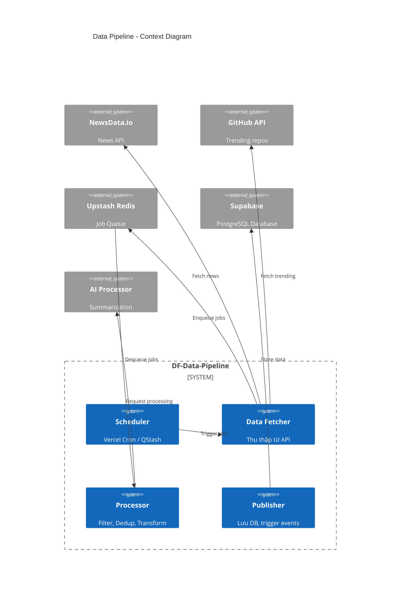
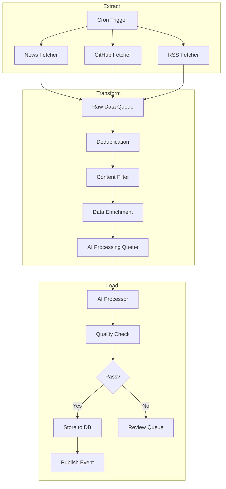
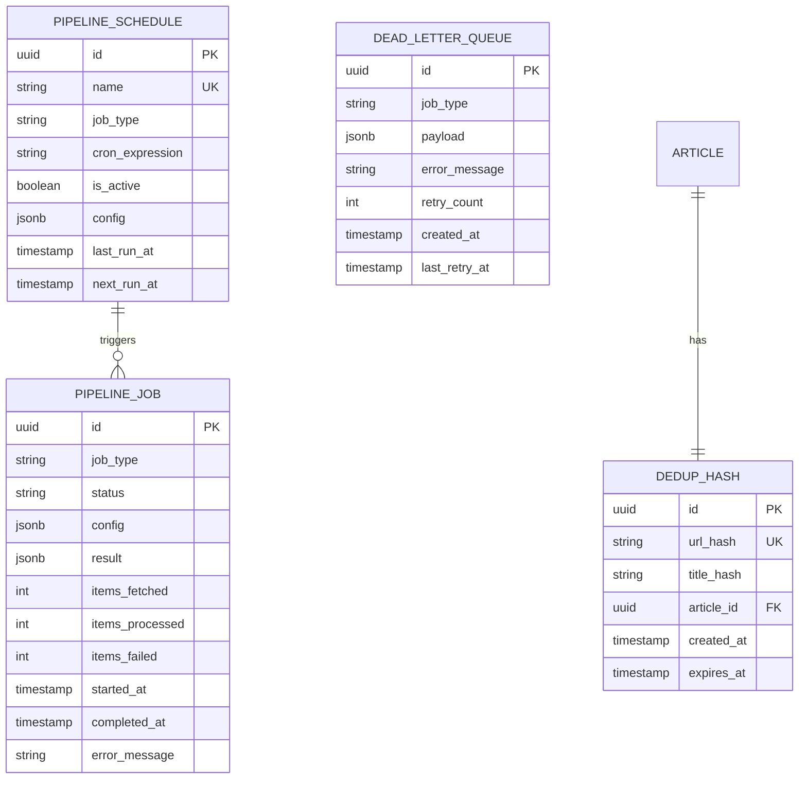
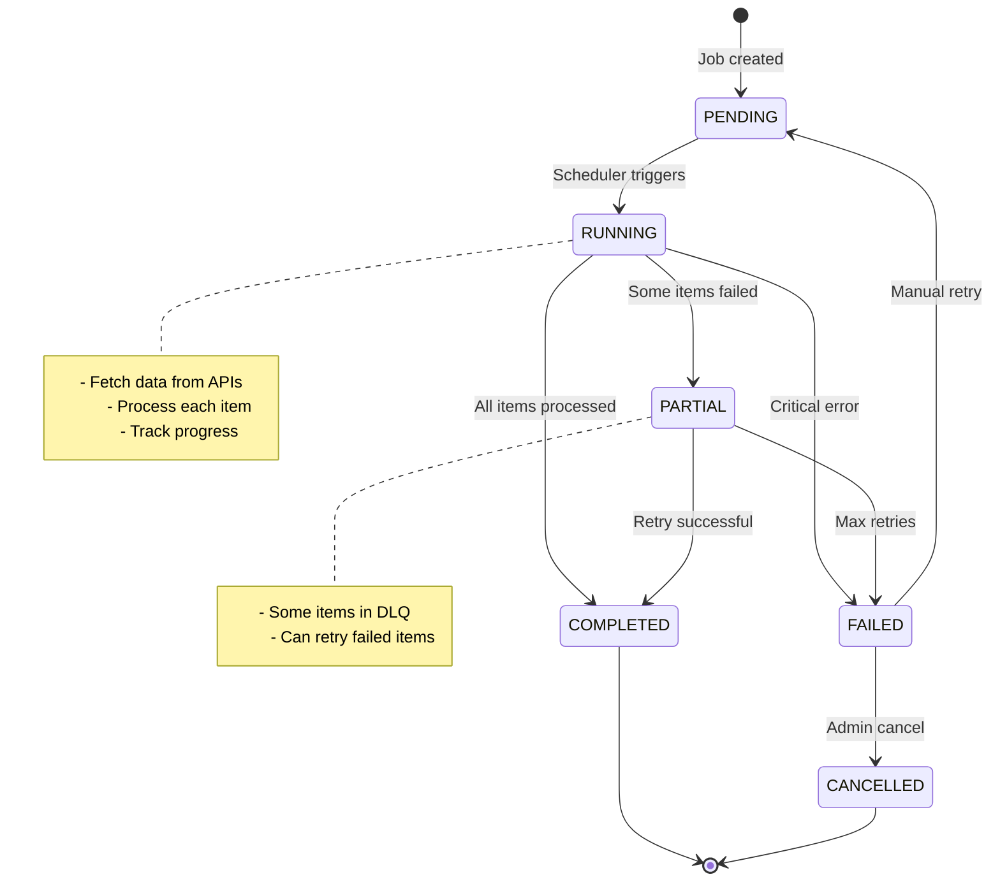
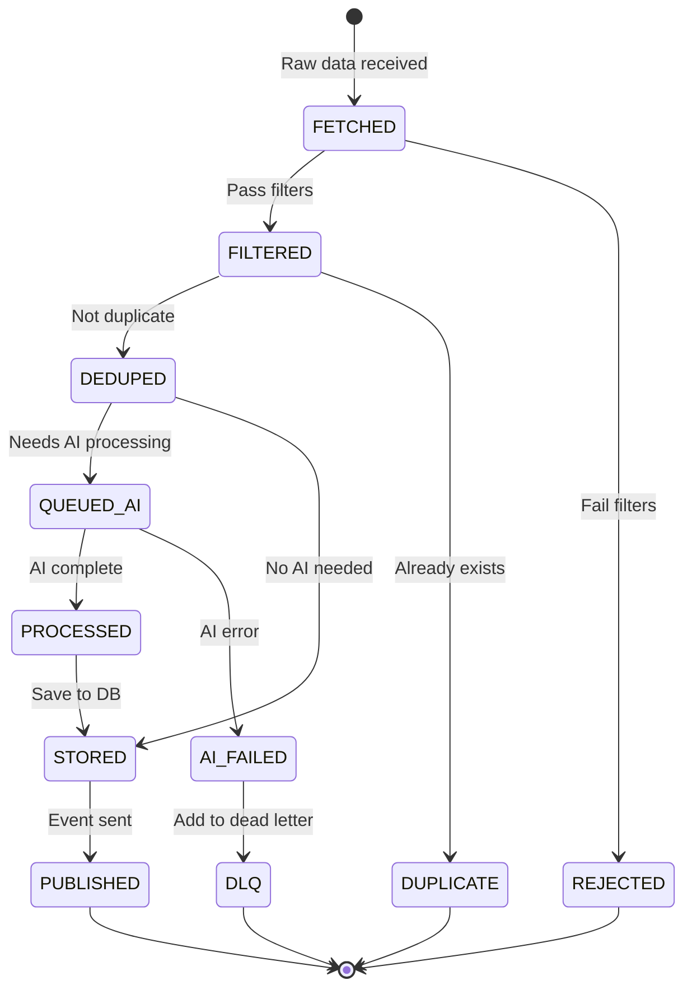
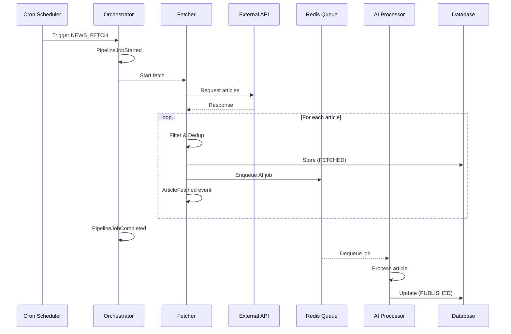

# HLD-DF-DATA-PIPELINE - Pipeline Xử lý Dữ liệu

## 1. Bối cảnh

### 1.1 Bối cảnh Nghiệp vụ

**Vấn đề cần giải quyết:**
- Cần thu thập tin tức từ nhiều nguồn một cách tự động
- Đảm bảo dữ liệu được xử lý liên tục, không bị gián đoạn
- Quản lý quota API của các nhà cung cấp bên ngoài
- Loại bỏ tin trùng lặp (deduplication)
- Xử lý lỗi và retry một cách thông minh

**Giải pháp:**
- ETL Pipeline tự động hóa hoàn toàn
- Cron jobs chạy định kỳ (mỗi 15 phút)
- Redis queue cho job management
- Dead Letter Queue cho error handling

### 1.2 Bối cảnh Hệ thống

```
┌─────────────────────────────────────────────────────────────────────┐
│                    DF-DATA-PIPELINE SERVICE                         │
├─────────────────────────────────────────────────────────────────────┤
│                                                                      │
│   ┌──────────────────────────────────────────────────────────────┐ │
│   │                      SCHEDULER (Cron)                         │ │
│   └──────────────────────────────────────────────────────────────┘ │
│                               │                                     │
│          ┌────────────────────┼────────────────────┐               │
│          ▼                    ▼                    ▼               │
│   ┌──────────────┐    ┌──────────────┐    ┌──────────────┐        │
│   │  News Fetch  │    │ GitHub Fetch │    │  RSS Fetch   │        │
│   │    Job       │    │     Job      │    │    Job       │        │
│   └──────────────┘    └──────────────┘    └──────────────┘        │
│          │                    │                    │               │
│          └────────────────────┼────────────────────┘               │
│                               ▼                                     │
│                    ┌──────────────────┐                            │
│                    │   Processing     │                            │
│                    │     Queue        │                            │
│                    └──────────────────┘                            │
│                               │                                     │
│          ┌────────────────────┼────────────────────┐               │
│          ▼                    ▼                    ▼               │
│   ┌──────────────┐    ┌──────────────┐    ┌──────────────┐        │
│   │   Filter     │───►│   AI Proc    │───►│   Publish    │        │
│   │   + Dedup    │    │   (Summary)  │    │   + Store    │        │
│   └──────────────┘    └──────────────┘    └──────────────┘        │
│                                                                      │
└─────────────────────────────────────────────────────────────────────┘
```

---

## 2. Context Diagram



---

## 3. Pipeline Architecture

### 3.1 ETL Workflow



### 3.2 Pipeline Stages

| Stage | Mô tả | Input | Output | SLA |
|-------|-------|-------|--------|-----|
| **Extract** | Thu thập dữ liệu thô | API Response | Raw Articles | < 30s |
| **Dedup** | Loại bỏ trùng lặp | Raw Articles | Unique Articles | < 1s |
| **Filter** | Lọc theo tiêu chí | Unique Articles | Filtered Articles | < 1s |
| **Enrich** | Bổ sung metadata | Filtered Articles | Enriched Articles | < 2s |
| **AI Process** | Tóm tắt, dịch thuật | Enriched Articles | Processed Articles | < 10s |
| **Store** | Lưu vào database | Processed Articles | DB Records | < 1s |
| **Publish** | Phát sự kiện | DB Records | Events | < 100ms |

---

## 4. Data Model (ERD)



### 4.1 SQL Schema

```sql
-- Pipeline Jobs (execution history)
CREATE TABLE pipeline_job (
    id UUID PRIMARY KEY DEFAULT gen_random_uuid(),
    job_type VARCHAR(50) NOT NULL,
    status VARCHAR(20) NOT NULL DEFAULT 'PENDING',
    config JSONB DEFAULT '{}',
    result JSONB,
    items_fetched INTEGER DEFAULT 0,
    items_processed INTEGER DEFAULT 0,
    items_failed INTEGER DEFAULT 0,
    started_at TIMESTAMPTZ,
    completed_at TIMESTAMPTZ,
    error_message TEXT,
    created_at TIMESTAMPTZ DEFAULT NOW(),

    CONSTRAINT chk_job_type CHECK (job_type IN (
        'NEWS_FETCH', 'GITHUB_FETCH', 'RSS_FETCH',
        'PROCESS_BATCH', 'CLEANUP', 'REINDEX'
    )),
    CONSTRAINT chk_status CHECK (status IN (
        'PENDING', 'RUNNING', 'COMPLETED', 'FAILED', 'CANCELLED'
    ))
);

CREATE INDEX idx_pipeline_job_status ON pipeline_job(status);
CREATE INDEX idx_pipeline_job_type ON pipeline_job(job_type);
CREATE INDEX idx_pipeline_job_created ON pipeline_job(created_at DESC);

-- Pipeline Schedules (cron configuration)
CREATE TABLE pipeline_schedule (
    id UUID PRIMARY KEY DEFAULT gen_random_uuid(),
    name VARCHAR(100) UNIQUE NOT NULL,
    job_type VARCHAR(50) NOT NULL,
    cron_expression VARCHAR(100) NOT NULL,
    is_active BOOLEAN DEFAULT true,
    config JSONB DEFAULT '{}',
    last_run_at TIMESTAMPTZ,
    next_run_at TIMESTAMPTZ,
    created_at TIMESTAMPTZ DEFAULT NOW(),
    updated_at TIMESTAMPTZ DEFAULT NOW()
);

-- Deduplication hashes
CREATE TABLE dedup_hash (
    id UUID PRIMARY KEY DEFAULT gen_random_uuid(),
    url_hash VARCHAR(64) UNIQUE NOT NULL,
    title_hash VARCHAR(64),
    article_id UUID REFERENCES article(id) ON DELETE CASCADE,
    created_at TIMESTAMPTZ DEFAULT NOW(),
    expires_at TIMESTAMPTZ DEFAULT NOW() + INTERVAL '30 days'
);

CREATE INDEX idx_dedup_url ON dedup_hash(url_hash);
CREATE INDEX idx_dedup_expires ON dedup_hash(expires_at);

-- Dead Letter Queue
CREATE TABLE dead_letter_queue (
    id UUID PRIMARY KEY DEFAULT gen_random_uuid(),
    job_type VARCHAR(50) NOT NULL,
    payload JSONB NOT NULL,
    error_message TEXT,
    retry_count INTEGER DEFAULT 0,
    max_retries INTEGER DEFAULT 3,
    created_at TIMESTAMPTZ DEFAULT NOW(),
    last_retry_at TIMESTAMPTZ
);

CREATE INDEX idx_dlq_job_type ON dead_letter_queue(job_type);
CREATE INDEX idx_dlq_retry ON dead_letter_queue(retry_count);
```

---

## 5. State Machine

### 5.1 Pipeline Job States



### 5.2 Item Processing States



---

## 6. Scheduling

### 6.1 Cron Configuration

```typescript
// lib/pipeline/schedules.ts

export const PIPELINE_SCHEDULES = {
  // News fetching - every 15 minutes
  NEWS_FETCH: {
    cron: '*/15 * * * *',
    jobType: 'NEWS_FETCH',
    config: {
      sources: ['newsdata'],
      categories: ['technology', 'science'],
      languages: ['en'],
      maxItems: 50,
    },
  },

  // GitHub trending - every 6 hours
  GITHUB_FETCH: {
    cron: '0 */6 * * *',
    jobType: 'GITHUB_FETCH',
    config: {
      languages: ['javascript', 'typescript', 'python', 'rust', 'go'],
      since: 'daily',
      maxItems: 25,
    },
  },

  // Batch AI processing - every 5 minutes
  PROCESS_BATCH: {
    cron: '*/5 * * * *',
    jobType: 'PROCESS_BATCH',
    config: {
      batchSize: 10,
      priority: 'HIGH',
    },
  },

  // Cleanup old data - daily at 3 AM
  CLEANUP: {
    cron: '0 3 * * *',
    jobType: 'CLEANUP',
    config: {
      dedupRetentionDays: 30,
      archivedRetentionDays: 90,
      dlqRetentionDays: 7,
    },
  },

  // Reindex search - weekly on Sunday at 4 AM
  REINDEX: {
    cron: '0 4 * * 0',
    jobType: 'REINDEX',
    config: {
      fullReindex: false,
      sinceDays: 7,
    },
  },
};
```

### 6.2 Vercel Cron Setup

```typescript
// vercel.json

{
  "crons": [
    {
      "path": "/api/cron/news-fetch",
      "schedule": "*/15 * * * *"
    },
    {
      "path": "/api/cron/github-fetch",
      "schedule": "0 */6 * * *"
    },
    {
      "path": "/api/cron/process-batch",
      "schedule": "*/5 * * * *"
    },
    {
      "path": "/api/cron/cleanup",
      "schedule": "0 3 * * *"
    }
  ]
}
```

### 6.3 Cron Handler

```typescript
// app/api/cron/news-fetch/route.ts

import { NextRequest, NextResponse } from 'next/server';
import { PipelineOrchestrator } from '@/lib/pipeline/orchestrator';

export const runtime = 'edge';
export const maxDuration = 60; // 60 seconds max for Vercel

export async function GET(request: NextRequest) {
  // Verify cron secret (Vercel adds this header)
  const authHeader = request.headers.get('authorization');
  if (authHeader !== `Bearer ${process.env.CRON_SECRET}`) {
    return NextResponse.json({ error: 'Unauthorized' }, { status: 401 });
  }

  try {
    const orchestrator = new PipelineOrchestrator();
    const result = await orchestrator.runNewsFetch();

    return NextResponse.json({
      success: true,
      jobId: result.jobId,
      itemsFetched: result.itemsFetched,
      itemsProcessed: result.itemsProcessed,
    });
  } catch (error) {
    console.error('News fetch cron failed:', error);
    return NextResponse.json(
      { error: 'Pipeline failed', message: (error as Error).message },
      { status: 500 }
    );
  }
}
```

---

## 7. Pipeline Implementation

### 7.1 Orchestrator

```typescript
// lib/pipeline/orchestrator.ts

import { supabase } from '@/lib/supabase';
import { NewsFetcher } from './fetchers/news';
import { GitHubFetcher } from './fetchers/github';
import { Deduplicator } from './deduplicator';
import { ContentFilter } from './filter';
import { AIJobQueue } from '@/lib/ai/queue';

export class PipelineOrchestrator {
  private newsFetcher: NewsFetcher;
  private githubFetcher: GitHubFetcher;
  private deduplicator: Deduplicator;
  private filter: ContentFilter;
  private aiQueue: AIJobQueue;

  constructor() {
    this.newsFetcher = new NewsFetcher();
    this.githubFetcher = new GitHubFetcher();
    this.deduplicator = new Deduplicator();
    this.filter = new ContentFilter();
    this.aiQueue = new AIJobQueue();
  }

  async runNewsFetch(): Promise<PipelineResult> {
    const jobId = await this.createJob('NEWS_FETCH');

    try {
      await this.updateJobStatus(jobId, 'RUNNING');

      // Step 1: Fetch raw data
      const rawArticles = await this.newsFetcher.fetch({
        categories: ['technology', 'science'],
        languages: ['en'],
        maxItems: 50,
      });

      await this.updateJobProgress(jobId, { itemsFetched: rawArticles.length });

      // Step 2: Deduplicate
      const uniqueArticles = await this.deduplicator.process(rawArticles);

      // Step 3: Filter
      const filteredArticles = await this.filter.process(uniqueArticles);

      // Step 4: Store and queue for AI
      let processed = 0;
      let failed = 0;

      for (const article of filteredArticles) {
        try {
          // Store article with FETCHED status
          const savedArticle = await this.storeArticle(article);

          // Queue for AI processing
          await this.aiQueue.enqueue({
            articleId: savedArticle.id,
            jobType: 'FULL_PROCESS',
            input: {
              title: article.title,
              content: article.description || article.content,
              sourceUrl: article.link,
            },
          });

          processed++;
        } catch (error) {
          failed++;
          await this.addToDeadLetter('NEWS_FETCH', article, error);
        }
      }

      await this.updateJobProgress(jobId, {
        itemsProcessed: processed,
        itemsFailed: failed,
      });

      await this.updateJobStatus(jobId, failed > 0 ? 'PARTIAL' : 'COMPLETED');

      return {
        jobId,
        itemsFetched: rawArticles.length,
        itemsProcessed: processed,
        itemsFailed: failed,
      };

    } catch (error) {
      await this.updateJobStatus(jobId, 'FAILED', (error as Error).message);
      throw error;
    }
  }

  async runGitHubFetch(): Promise<PipelineResult> {
    const jobId = await this.createJob('GITHUB_FETCH');

    try {
      await this.updateJobStatus(jobId, 'RUNNING');

      const trendingRepos = await this.githubFetcher.fetch({
        languages: ['javascript', 'typescript', 'python'],
        since: 'daily',
      });

      await this.updateJobProgress(jobId, { itemsFetched: trendingRepos.length });

      let processed = 0;
      for (const repo of trendingRepos) {
        const exists = await this.deduplicator.checkGitHubRepo(repo.fullName);
        if (!exists) {
          await this.storeGitHubRepo(repo);
          processed++;
        }
      }

      await this.updateJobProgress(jobId, { itemsProcessed: processed });
      await this.updateJobStatus(jobId, 'COMPLETED');

      return {
        jobId,
        itemsFetched: trendingRepos.length,
        itemsProcessed: processed,
        itemsFailed: 0,
      };

    } catch (error) {
      await this.updateJobStatus(jobId, 'FAILED', (error as Error).message);
      throw error;
    }
  }

  private async createJob(jobType: string): Promise<string> {
    const { data, error } = await supabase
      .from('pipeline_job')
      .insert({
        job_type: jobType,
        status: 'PENDING',
        started_at: new Date().toISOString(),
      })
      .select('id')
      .single();

    if (error) throw error;
    return data.id;
  }

  private async updateJobStatus(
    jobId: string,
    status: string,
    errorMessage?: string
  ): Promise<void> {
    const update: any = { status };
    if (status === 'COMPLETED' || status === 'FAILED') {
      update.completed_at = new Date().toISOString();
    }
    if (errorMessage) {
      update.error_message = errorMessage;
    }

    await supabase.from('pipeline_job').update(update).eq('id', jobId);
  }

  private async updateJobProgress(
    jobId: string,
    progress: Partial<{
      itemsFetched: number;
      itemsProcessed: number;
      itemsFailed: number;
    }>
  ): Promise<void> {
    const update: any = {};
    if (progress.itemsFetched !== undefined) {
      update.items_fetched = progress.itemsFetched;
    }
    if (progress.itemsProcessed !== undefined) {
      update.items_processed = progress.itemsProcessed;
    }
    if (progress.itemsFailed !== undefined) {
      update.items_failed = progress.itemsFailed;
    }

    await supabase.from('pipeline_job').update(update).eq('id', jobId);
  }

  private async storeArticle(article: RawArticle): Promise<{ id: string }> {
    const { data, error } = await supabase
      .from('article')
      .insert({
        source_id: article.sourceId,
        original_title: article.title,
        original_url: article.link,
        original_description: article.description,
        original_content: article.content,
        original_image_url: article.imageUrl,
        published_at: article.pubDate,
        status: 'FETCHED',
      })
      .select('id')
      .single();

    if (error) throw error;

    // Store dedup hash
    await this.deduplicator.storeHash(article.link, data.id);

    return data;
  }

  private async storeGitHubRepo(repo: TrendingRepo): Promise<void> {
    await supabase.from('github_trending').upsert({
      repo_name: repo.fullName,
      description: repo.description,
      stars: repo.stars,
      forks: repo.forks,
      language: repo.language,
      url: repo.url,
      today_stars: repo.todayStars,
      fetched_at: new Date().toISOString(),
    });
  }

  private async addToDeadLetter(
    jobType: string,
    payload: any,
    error: unknown
  ): Promise<void> {
    await supabase.from('dead_letter_queue').insert({
      job_type: jobType,
      payload,
      error_message: (error as Error).message,
    });
  }
}

interface PipelineResult {
  jobId: string;
  itemsFetched: number;
  itemsProcessed: number;
  itemsFailed: number;
}

interface RawArticle {
  sourceId?: string;
  title: string;
  link: string;
  description?: string;
  content?: string;
  imageUrl?: string;
  pubDate?: string;
}

interface TrendingRepo {
  fullName: string;
  description: string;
  stars: number;
  forks: number;
  language: string;
  url: string;
  todayStars: number;
}
```

### 7.2 Deduplicator

```typescript
// lib/pipeline/deduplicator.ts

import { createHash } from 'crypto';
import { supabase } from '@/lib/supabase';
import { Redis } from '@upstash/redis';

const redis = new Redis({
  url: process.env.UPSTASH_REDIS_URL!,
  token: process.env.UPSTASH_REDIS_TOKEN!,
});

export class Deduplicator {
  private cachePrefix = 'dedup:';
  private cacheTTL = 60 * 60 * 24 * 7; // 7 days in Redis

  /**
   * Generate hash from URL
   */
  private hashUrl(url: string): string {
    return createHash('sha256').update(url.toLowerCase().trim()).digest('hex');
  }

  /**
   * Generate hash from title (for fuzzy matching)
   */
  private hashTitle(title: string): string {
    // Normalize: lowercase, remove special chars, collapse spaces
    const normalized = title
      .toLowerCase()
      .replace(/[^a-z0-9\s]/g, '')
      .replace(/\s+/g, ' ')
      .trim();
    return createHash('sha256').update(normalized).digest('hex');
  }

  /**
   * Check if article already exists
   */
  async isDuplicate(url: string, title?: string): Promise<boolean> {
    const urlHash = this.hashUrl(url);

    // Check Redis cache first (fast path)
    const cached = await redis.get(`${this.cachePrefix}${urlHash}`);
    if (cached) return true;

    // Check database
    const { data } = await supabase
      .from('dedup_hash')
      .select('id')
      .eq('url_hash', urlHash)
      .single();

    if (data) {
      // Cache for future checks
      await redis.set(`${this.cachePrefix}${urlHash}`, '1', { ex: this.cacheTTL });
      return true;
    }

    // Optional: fuzzy title matching
    if (title) {
      const titleHash = this.hashTitle(title);
      const { data: titleMatch } = await supabase
        .from('dedup_hash')
        .select('id')
        .eq('title_hash', titleHash)
        .single();

      if (titleMatch) return true;
    }

    return false;
  }

  /**
   * Process array of articles, return only unique ones
   */
  async process(articles: RawArticle[]): Promise<RawArticle[]> {
    const unique: RawArticle[] = [];
    const seen = new Set<string>();

    for (const article of articles) {
      const urlHash = this.hashUrl(article.link);

      // Skip if already seen in this batch
      if (seen.has(urlHash)) continue;
      seen.add(urlHash);

      // Skip if exists in database
      const exists = await this.isDuplicate(article.link, article.title);
      if (exists) continue;

      unique.push(article);
    }

    return unique;
  }

  /**
   * Store hash after article is saved
   */
  async storeHash(url: string, articleId: string, title?: string): Promise<void> {
    const urlHash = this.hashUrl(url);
    const titleHash = title ? this.hashTitle(title) : null;

    await supabase.from('dedup_hash').insert({
      url_hash: urlHash,
      title_hash: titleHash,
      article_id: articleId,
      expires_at: new Date(Date.now() + 30 * 24 * 60 * 60 * 1000).toISOString(), // 30 days
    });

    // Cache in Redis
    await redis.set(`${this.cachePrefix}${urlHash}`, articleId, { ex: this.cacheTTL });
  }

  /**
   * Check if GitHub repo already tracked
   */
  async checkGitHubRepo(repoName: string): Promise<boolean> {
    const { data } = await supabase
      .from('github_trending')
      .select('id')
      .eq('repo_name', repoName)
      .single();

    return !!data;
  }

  /**
   * Cleanup expired hashes
   */
  async cleanup(): Promise<number> {
    const { data, error } = await supabase
      .from('dedup_hash')
      .delete()
      .lt('expires_at', new Date().toISOString())
      .select('id');

    return data?.length || 0;
  }
}

interface RawArticle {
  title: string;
  link: string;
  description?: string;
  content?: string;
}
```

### 7.3 Content Filter

```typescript
// lib/pipeline/filter.ts

export class ContentFilter {
  private spamPatterns = [
    /\b(buy now|limited offer|act fast|exclusive deal)\b/i,
    /\b(click here|subscribe now|sign up free)\b/i,
    /\b(casino|gambling|lottery|bitcoin mining)\b/i,
  ];

  private requiredFields = ['title', 'link'];
  private minTitleLength = 10;
  private maxTitleLength = 300;
  private minDescriptionLength = 50;

  /**
   * Filter array of articles
   */
  async process(articles: RawArticle[]): Promise<RawArticle[]> {
    return articles.filter(article => this.isValid(article));
  }

  /**
   * Validate single article
   */
  isValid(article: RawArticle): boolean {
    // Check required fields
    for (const field of this.requiredFields) {
      if (!article[field as keyof RawArticle]) {
        return false;
      }
    }

    // Check title length
    if (article.title.length < this.minTitleLength) {
      return false;
    }
    if (article.title.length > this.maxTitleLength) {
      return false;
    }

    // Check description (if present)
    if (article.description && article.description.length < this.minDescriptionLength) {
      return false;
    }

    // Check for spam patterns
    const textToCheck = `${article.title} ${article.description || ''}`;
    for (const pattern of this.spamPatterns) {
      if (pattern.test(textToCheck)) {
        return false;
      }
    }

    // Check URL validity
    try {
      new URL(article.link);
    } catch {
      return false;
    }

    return true;
  }

  /**
   * Calculate relevance score (0-100)
   */
  calculateRelevance(article: RawArticle): number {
    let score = 50; // Base score

    // Tech-related keywords boost
    const techKeywords = [
      'javascript', 'typescript', 'react', 'vue', 'angular',
      'node.js', 'python', 'rust', 'go', 'api', 'database',
      'ai', 'machine learning', 'cloud', 'devops', 'kubernetes',
      'frontend', 'backend', 'developer', 'programming',
    ];

    const text = `${article.title} ${article.description || ''}`.toLowerCase();

    for (const keyword of techKeywords) {
      if (text.includes(keyword)) {
        score += 5;
      }
    }

    // Penalize if too short
    if ((article.description?.length || 0) < 100) {
      score -= 10;
    }

    // Boost if has image
    if (article.imageUrl) {
      score += 5;
    }

    return Math.min(100, Math.max(0, score));
  }
}

interface RawArticle {
  title: string;
  link: string;
  description?: string;
  content?: string;
  imageUrl?: string;
}
```

---

## 8. Rate Limiting & Quota Management

### 8.1 Quota Configuration

```typescript
// lib/pipeline/quota.ts

export const API_QUOTAS = {
  newsdata: {
    name: 'NewsData.io',
    dailyLimit: 200, // Free tier
    requestsPerMinute: 30,
    resetTime: '00:00 UTC',
  },
  github: {
    name: 'GitHub API',
    hourlyLimit: 60, // Unauthenticated
    authenticatedLimit: 5000, // With token
    resetTime: 'hourly',
  },
};

export class QuotaManager {
  private redis: Redis;
  private keyPrefix = 'quota:';

  constructor() {
    this.redis = new Redis({
      url: process.env.UPSTASH_REDIS_URL!,
      token: process.env.UPSTASH_REDIS_TOKEN!,
    });
  }

  /**
   * Check if we can make an API request
   */
  async canRequest(api: keyof typeof API_QUOTAS): Promise<boolean> {
    const quota = API_QUOTAS[api];
    const key = `${this.keyPrefix}${api}:count`;

    const current = await this.redis.get(key);
    const count = parseInt(current as string) || 0;

    return count < quota.dailyLimit;
  }

  /**
   * Record an API request
   */
  async recordRequest(api: keyof typeof API_QUOTAS): Promise<void> {
    const key = `${this.keyPrefix}${api}:count`;

    // Get TTL based on reset time
    const ttl = this.getTTL(api);

    await this.redis.incr(key);
    await this.redis.expire(key, ttl);
  }

  /**
   * Get remaining quota
   */
  async getRemainingQuota(api: keyof typeof API_QUOTAS): Promise<number> {
    const quota = API_QUOTAS[api];
    const key = `${this.keyPrefix}${api}:count`;

    const current = await this.redis.get(key);
    const count = parseInt(current as string) || 0;

    return Math.max(0, quota.dailyLimit - count);
  }

  /**
   * Get all quota stats
   */
  async getAllStats(): Promise<QuotaStats[]> {
    const stats: QuotaStats[] = [];

    for (const [api, config] of Object.entries(API_QUOTAS)) {
      const remaining = await this.getRemainingQuota(api as keyof typeof API_QUOTAS);
      stats.push({
        api,
        name: config.name,
        limit: config.dailyLimit,
        used: config.dailyLimit - remaining,
        remaining,
        percentUsed: ((config.dailyLimit - remaining) / config.dailyLimit) * 100,
      });
    }

    return stats;
  }

  private getTTL(api: keyof typeof API_QUOTAS): number {
    const quota = API_QUOTAS[api];

    if (quota.resetTime === 'hourly') {
      // Seconds until next hour
      const now = new Date();
      const nextHour = new Date(now);
      nextHour.setHours(nextHour.getHours() + 1, 0, 0, 0);
      return Math.ceil((nextHour.getTime() - now.getTime()) / 1000);
    }

    // Daily reset at midnight UTC
    const now = new Date();
    const tomorrow = new Date(now);
    tomorrow.setUTCDate(tomorrow.getUTCDate() + 1);
    tomorrow.setUTCHours(0, 0, 0, 0);
    return Math.ceil((tomorrow.getTime() - now.getTime()) / 1000);
  }
}

interface QuotaStats {
  api: string;
  name: string;
  limit: number;
  used: number;
  remaining: number;
  percentUsed: number;
}
```

### 8.2 Rate Limiter

```typescript
// lib/pipeline/rate-limiter.ts

import { Ratelimit } from '@upstash/ratelimit';
import { Redis } from '@upstash/redis';

const redis = new Redis({
  url: process.env.UPSTASH_REDIS_URL!,
  token: process.env.UPSTASH_REDIS_TOKEN!,
});

// Rate limiters for different APIs
export const rateLimiters = {
  newsdata: new Ratelimit({
    redis,
    limiter: Ratelimit.slidingWindow(30, '1 m'), // 30 requests per minute
    prefix: 'ratelimit:newsdata',
  }),

  github: new Ratelimit({
    redis,
    limiter: Ratelimit.slidingWindow(60, '1 h'), // 60 requests per hour (unauthenticated)
    prefix: 'ratelimit:github',
  }),

  ai: new Ratelimit({
    redis,
    limiter: Ratelimit.slidingWindow(100, '1 m'), // 100 AI requests per minute
    prefix: 'ratelimit:ai',
  }),
};

export async function checkRateLimit(
  api: keyof typeof rateLimiters
): Promise<{ success: boolean; remaining: number; reset: number }> {
  const limiter = rateLimiters[api];
  const result = await limiter.limit('global');

  return {
    success: result.success,
    remaining: result.remaining,
    reset: result.reset,
  };
}
```

---

## 9. Dead Letter Queue (DLQ)

### 9.1 DLQ Handler

```typescript
// lib/pipeline/dlq.ts

import { supabase } from '@/lib/supabase';

export class DeadLetterQueue {
  private maxRetries = 3;
  private retryDelays = [60, 300, 900]; // 1min, 5min, 15min

  /**
   * Add failed item to DLQ
   */
  async add(
    jobType: string,
    payload: any,
    error: Error
  ): Promise<string> {
    const { data, error: dbError } = await supabase
      .from('dead_letter_queue')
      .insert({
        job_type: jobType,
        payload,
        error_message: error.message,
        max_retries: this.maxRetries,
      })
      .select('id')
      .single();

    if (dbError) throw dbError;

    console.error(`Added to DLQ: ${jobType}`, { id: data.id, error: error.message });

    return data.id;
  }

  /**
   * Get items ready for retry
   */
  async getRetryable(): Promise<DLQItem[]> {
    const { data, error } = await supabase
      .from('dead_letter_queue')
      .select('*')
      .lt('retry_count', this.maxRetries)
      .order('created_at', { ascending: true })
      .limit(10);

    if (error) throw error;

    // Filter by retry delay
    return (data || []).filter(item => {
      if (!item.last_retry_at) return true;

      const delay = this.retryDelays[item.retry_count] || this.retryDelays[this.retryDelays.length - 1];
      const retryAfter = new Date(item.last_retry_at).getTime() + delay * 1000;

      return Date.now() >= retryAfter;
    });
  }

  /**
   * Process retry for DLQ item
   */
  async retry(item: DLQItem, processor: (payload: any) => Promise<void>): Promise<boolean> {
    try {
      await processor(item.payload);

      // Success - remove from DLQ
      await supabase.from('dead_letter_queue').delete().eq('id', item.id);

      console.log(`DLQ retry successful: ${item.id}`);
      return true;

    } catch (error) {
      // Update retry count
      await supabase
        .from('dead_letter_queue')
        .update({
          retry_count: item.retry_count + 1,
          last_retry_at: new Date().toISOString(),
          error_message: (error as Error).message,
        })
        .eq('id', item.id);

      console.error(`DLQ retry failed: ${item.id}`, error);
      return false;
    }
  }

  /**
   * Get DLQ statistics
   */
  async getStats(): Promise<DLQStats> {
    const { data, error } = await supabase
      .from('dead_letter_queue')
      .select('job_type, retry_count');

    if (error) throw error;

    const total = data?.length || 0;
    const byJobType: Record<string, number> = {};
    let retriable = 0;
    let exhausted = 0;

    for (const item of data || []) {
      byJobType[item.job_type] = (byJobType[item.job_type] || 0) + 1;

      if (item.retry_count >= this.maxRetries) {
        exhausted++;
      } else {
        retriable++;
      }
    }

    return { total, retriable, exhausted, byJobType };
  }

  /**
   * Cleanup old DLQ items
   */
  async cleanup(retentionDays: number = 7): Promise<number> {
    const cutoff = new Date();
    cutoff.setDate(cutoff.getDate() - retentionDays);

    const { data, error } = await supabase
      .from('dead_letter_queue')
      .delete()
      .lt('created_at', cutoff.toISOString())
      .select('id');

    return data?.length || 0;
  }
}

interface DLQItem {
  id: string;
  job_type: string;
  payload: any;
  error_message: string;
  retry_count: number;
  max_retries: number;
  created_at: string;
  last_retry_at: string | null;
}

interface DLQStats {
  total: number;
  retriable: number;
  exhausted: number;
  byJobType: Record<string, number>;
}
```

---

## 10. Cleanup Jobs

### 10.1 Cleanup Service

```typescript
// lib/pipeline/cleanup.ts

import { supabase } from '@/lib/supabase';
import { Deduplicator } from './deduplicator';
import { DeadLetterQueue } from './dlq';

export class CleanupService {
  private deduplicator: Deduplicator;
  private dlq: DeadLetterQueue;

  constructor() {
    this.deduplicator = new Deduplicator();
    this.dlq = new DeadLetterQueue();
  }

  async runFullCleanup(config: CleanupConfig): Promise<CleanupResult> {
    const result: CleanupResult = {
      dedupHashes: 0,
      archivedArticles: 0,
      dlqItems: 0,
      pipelineJobs: 0,
    };

    // 1. Cleanup dedup hashes
    result.dedupHashes = await this.deduplicator.cleanup();

    // 2. Archive old articles
    result.archivedArticles = await this.archiveOldArticles(config.archiveAfterDays);

    // 3. Cleanup DLQ
    result.dlqItems = await this.dlq.cleanup(config.dlqRetentionDays);

    // 4. Cleanup old pipeline jobs
    result.pipelineJobs = await this.cleanupPipelineJobs(config.jobRetentionDays);

    console.log('Cleanup completed:', result);

    return result;
  }

  private async archiveOldArticles(daysOld: number): Promise<number> {
    const cutoff = new Date();
    cutoff.setDate(cutoff.getDate() - daysOld);

    const { data, error } = await supabase
      .from('article')
      .update({ status: 'ARCHIVED' })
      .eq('status', 'PUBLISHED')
      .lt('published_at', cutoff.toISOString())
      .select('id');

    return data?.length || 0;
  }

  private async cleanupPipelineJobs(daysOld: number): Promise<number> {
    const cutoff = new Date();
    cutoff.setDate(cutoff.getDate() - daysOld);

    const { data, error } = await supabase
      .from('pipeline_job')
      .delete()
      .in('status', ['COMPLETED', 'CANCELLED'])
      .lt('completed_at', cutoff.toISOString())
      .select('id');

    return data?.length || 0;
  }
}

interface CleanupConfig {
  archiveAfterDays: number;
  dlqRetentionDays: number;
  jobRetentionDays: number;
}

interface CleanupResult {
  dedupHashes: number;
  archivedArticles: number;
  dlqItems: number;
  pipelineJobs: number;
}
```

---

## 11. Monitoring & Metrics

### 11.1 Pipeline Metrics

```typescript
// lib/pipeline/metrics.ts

export const PIPELINE_METRICS = {
  // Job metrics
  'pipeline.jobs.started': 'counter',
  'pipeline.jobs.completed': 'counter',
  'pipeline.jobs.failed': 'counter',
  'pipeline.jobs.duration_ms': 'histogram',

  // Item metrics
  'pipeline.items.fetched': 'counter',
  'pipeline.items.processed': 'counter',
  'pipeline.items.filtered': 'counter',
  'pipeline.items.duplicates': 'counter',

  // Queue metrics
  'pipeline.queue.size': 'gauge',
  'pipeline.dlq.size': 'gauge',

  // API metrics
  'pipeline.api.newsdata.requests': 'counter',
  'pipeline.api.github.requests': 'counter',
  'pipeline.api.quota.remaining': 'gauge',
};

export async function recordPipelineMetrics(result: PipelineResult): Promise<void> {
  // Log to console (replace with actual metrics service)
  console.log('Pipeline metrics:', {
    jobId: result.jobId,
    fetched: result.itemsFetched,
    processed: result.itemsProcessed,
    failed: result.itemsFailed,
    successRate: result.itemsProcessed / result.itemsFetched * 100,
  });
}
```

### 11.2 Health Check

```typescript
// app/api/health/pipeline/route.ts

import { NextResponse } from 'next/server';
import { QuotaManager } from '@/lib/pipeline/quota';
import { DeadLetterQueue } from '@/lib/pipeline/dlq';
import { supabase } from '@/lib/supabase';

export async function GET() {
  const quotaManager = new QuotaManager();
  const dlq = new DeadLetterQueue();

  // Check recent pipeline jobs
  const { data: recentJobs } = await supabase
    .from('pipeline_job')
    .select('status, job_type, completed_at')
    .order('created_at', { ascending: false })
    .limit(10);

  const failedRecently = recentJobs?.filter(j => j.status === 'FAILED').length || 0;

  // Get quota stats
  const quotaStats = await quotaManager.getAllStats();

  // Get DLQ stats
  const dlqStats = await dlq.getStats();

  // Determine health status
  const isHealthy = failedRecently < 3 && dlqStats.total < 50;

  return NextResponse.json({
    status: isHealthy ? 'healthy' : 'degraded',
    timestamp: new Date().toISOString(),
    pipeline: {
      recentJobs: recentJobs?.length || 0,
      failedRecently,
    },
    quotas: quotaStats,
    dlq: dlqStats,
  });
}
```

---

## 12. API Endpoints

### 12.1 Pipeline Status API

```typescript
// app/api/pipeline/status/route.ts

import { NextResponse } from 'next/server';
import { supabase } from '@/lib/supabase';
import { QuotaManager } from '@/lib/pipeline/quota';

export async function GET() {
  // Get recent jobs
  const { data: jobs } = await supabase
    .from('pipeline_job')
    .select('*')
    .order('created_at', { ascending: false })
    .limit(20);

  // Get quota status
  const quotaManager = new QuotaManager();
  const quotas = await quotaManager.getAllStats();

  // Get schedule status
  const { data: schedules } = await supabase
    .from('pipeline_schedule')
    .select('*')
    .eq('is_active', true);

  return NextResponse.json({
    jobs,
    quotas,
    schedules,
  });
}
```

### 12.2 Manual Trigger API

```typescript
// app/api/pipeline/trigger/route.ts

import { NextRequest, NextResponse } from 'next/server';
import { PipelineOrchestrator } from '@/lib/pipeline/orchestrator';

export async function POST(request: NextRequest) {
  const { jobType } = await request.json();

  const orchestrator = new PipelineOrchestrator();

  let result;
  switch (jobType) {
    case 'NEWS_FETCH':
      result = await orchestrator.runNewsFetch();
      break;
    case 'GITHUB_FETCH':
      result = await orchestrator.runGitHubFetch();
      break;
    default:
      return NextResponse.json(
        { error: 'Invalid job type' },
        { status: 400 }
      );
  }

  return NextResponse.json(result);
}
```

---

## 13. Event Architecture

### 13.1 Events

| Event | Trigger | Payload | Consumers |
|-------|---------|---------|-----------|
| `PipelineJobStarted` | Job bắt đầu | `{ jobId, jobType, config }` | Metrics, Logging |
| `PipelineJobCompleted` | Job hoàn thành | `{ jobId, result }` | Metrics, Dashboard |
| `PipelineJobFailed` | Job thất bại | `{ jobId, error }` | Alert Service |
| `ArticleFetched` | Bài viết được fetch | `{ articleId, source }` | AI Processor |
| `QuotaWarning` | Quota gần hết | `{ api, remaining, limit }` | Admin Alert |
| `DLQThresholdExceeded` | DLQ quá nhiều items | `{ count, threshold }` | Admin Alert |

### 13.2 Event Flow



---

## 14. Error Handling

### 14.1 Error Types

```typescript
// lib/pipeline/errors.ts

export class PipelineError extends Error {
  constructor(
    message: string,
    public readonly code: string,
    public readonly retryable: boolean = true,
    public readonly context?: Record<string, any>
  ) {
    super(message);
    this.name = 'PipelineError';
  }
}

export const PIPELINE_ERROR_CODES = {
  // API errors
  API_RATE_LIMITED: { code: 'API_RATE_LIMITED', retryable: true },
  API_QUOTA_EXCEEDED: { code: 'API_QUOTA_EXCEEDED', retryable: false },
  API_UNAVAILABLE: { code: 'API_UNAVAILABLE', retryable: true },
  API_INVALID_RESPONSE: { code: 'API_INVALID_RESPONSE', retryable: true },

  // Data errors
  DUPLICATE_ARTICLE: { code: 'DUPLICATE_ARTICLE', retryable: false },
  INVALID_DATA: { code: 'INVALID_DATA', retryable: false },
  FILTER_REJECTED: { code: 'FILTER_REJECTED', retryable: false },

  // System errors
  DB_ERROR: { code: 'DB_ERROR', retryable: true },
  QUEUE_ERROR: { code: 'QUEUE_ERROR', retryable: true },
  TIMEOUT: { code: 'TIMEOUT', retryable: true },
};
```

---

## 15. Appendix

### A. Environment Variables

```bash
# External APIs
NEWSDATA_API_KEY=your_newsdata_api_key
GITHUB_TOKEN=your_github_token

# Redis
UPSTASH_REDIS_URL=your_redis_url
UPSTASH_REDIS_TOKEN=your_redis_token

# Cron
CRON_SECRET=your_cron_secret

# Feature Flags
PIPELINE_DRY_RUN=false
PIPELINE_MAX_ITEMS_PER_RUN=50
```

### B. Cron Schedule Reference

| Schedule | Description |
|----------|-------------|
| `*/15 * * * *` | Every 15 minutes |
| `0 */6 * * *` | Every 6 hours |
| `*/5 * * * *` | Every 5 minutes |
| `0 3 * * *` | Daily at 3 AM |
| `0 4 * * 0` | Weekly on Sunday at 4 AM |

### C. Performance Targets

| Metric | Target |
|--------|--------|
| News fetch latency | < 30s |
| Items processed/hour | 200+ |
| Dedup check latency | < 10ms |
| Success rate | > 95% |
| DLQ items | < 20 |
