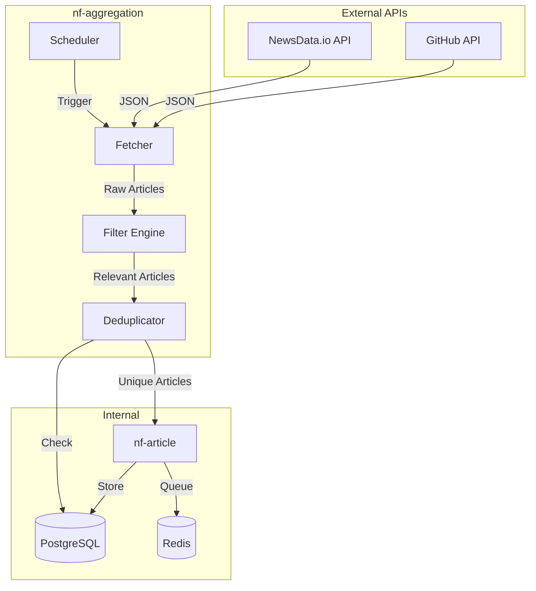
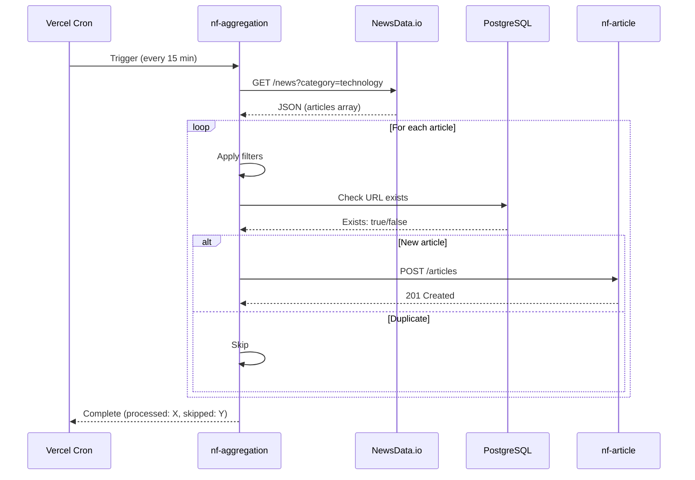
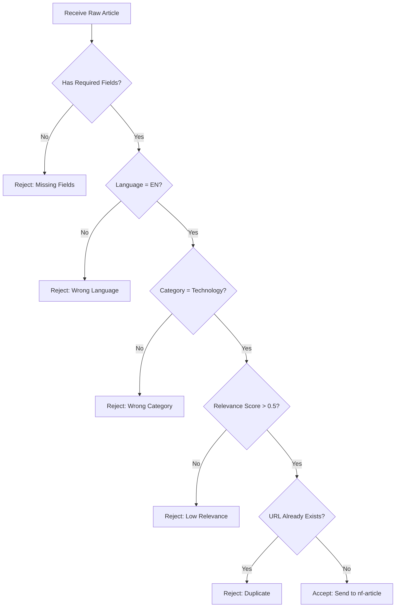

# HLD - Thu thập Tin tức (News Aggregation)

## 1. Bối cảnh

### 1.1 Bối cảnh Kinh doanh

Service `nf-aggregation` chịu trách nhiệm thu thập tin tức AI từ các nguồn bên ngoài (NewsData.io, GitHub API) một cách tự động và liên tục. Đây là "đầu vào" của toàn bộ pipeline xử lý tin tức AI.

**Mục tiêu:**
- Thu thập tin tức AI mới nhất mỗi 15 phút
- Lọc bỏ tin không liên quan đến AI hoặc spam
- Tránh trùng lặp (deduplication)
- Đảm bảo chất lượng nguồn tin AI đầu vào

### 1.2 Bối cảnh Hệ thống

```
┌─────────────────────────────────────────────────────────────────────┐
│                    NF-AGGREGATION CONTEXT                            │
├─────────────────────────────────────────────────────────────────────┤
│                                                                      │
│   ┌─────────────┐         ┌─────────────┐         ┌─────────────┐   │
│   │NewsData.io  │         │ GitHub API  │         │  (Future)   │   │
│   │    API      │         │  Trending   │         │ HackerNews  │   │
│   └──────┬──────┘         └──────┬──────┘         └──────┬──────┘   │
│          │                       │                       │          │
│          └───────────────┬───────┴───────────────────────┘          │
│                          │                                          │
│                          ▼                                          │
│                 ┌─────────────────┐                                 │
│                 │  nf-aggregation │                                 │
│                 │    (Fetcher)    │                                 │
│                 └────────┬────────┘                                 │
│                          │                                          │
│          ┌───────────────┼───────────────┐                          │
│          │               │               │                          │
│          ▼               ▼               ▼                          │
│   ┌─────────────┐ ┌─────────────┐ ┌─────────────┐                  │
│   │  Filtering  │ │   Dedup     │ │  nf-article │                  │
│   │   Engine    │ │   Check     │ │   (Store)   │                  │
│   └─────────────┘ └─────────────┘ └─────────────┘                  │
│                                                                      │
└─────────────────────────────────────────────────────────────────────┘
```

### 1.3 Phạm vi

**Trong phạm vi:**
- Kết nối và fetch dữ liệu từ NewsData.io API
- Kết nối và fetch GitHub Trending
- Lọc tin theo relevance và chất lượng
- Kiểm tra trùng lặp (URL hash)
- Gửi tin hợp lệ đến nf-article

**Ngoài phạm vi:**
- Lưu trữ tin tức (xem HLD-NF-ARTICLE)
- Xử lý AI (xem HLD-CF-AI-PROCESSING)
- Orchestration pipeline (xem HLD-DF-DATA-PIPELINE)

### 1.4 Data Sources

| Source | API | Rate Limit | Content |
|--------|-----|------------|---------|
| **NewsData.io** | REST | 200 req/day (free) | AI news articles |
| **GitHub** | REST | 5000 req/hour | AI/ML trending repositories |
| **HackerNews** | REST | Unlimited | AI top stories (future) |
| **ProductHunt** | REST | 1000 req/day | AI tools launches (future) |

---

## 2. Context Diagram



---

## 3. Core Business Workflow

### 3.1 Sequence Diagram - News Fetching



### 3.2 Activity Diagram - Filtering Pipeline



### 3.3 Filtering Rules

| Rule | Field | Condition | Action |
|------|-------|-----------|--------|
| Required Fields | title, url | Missing | Reject |
| Language | language | != 'en' | Reject |
| Content Length | content | < 100 chars | Reject |
| Spam Detection | title | Contains spam words | Reject |
| Duplicate | url | Exists in DB | Skip |
| Rate Limit | source | Exceeded quota | Pause |

---

## 4. Data Sources Integration

### 4.1 NewsData.io Provider

**Endpoint:** `https://newsdata.io/api/1/news`

**Parameters:**

| Param | Value | Description |
|-------|-------|-------------|
| apikey | env.NEWSDATA_API_KEY | API authentication |
| category | technology,science | Filter by tech & science news |
| language | en | English articles |
| q | AI OR ChatGPT OR "machine learning" | Filter by AI keywords |
| full_content | 1 | Include full text (paid) |
| size | 50 | Articles per request |

**Response Schema:**

```typescript
interface NewsDataResponse {
  status: 'success' | 'error'
  totalResults: number
  results: NewsDataArticle[]
  nextPage?: string
}

interface NewsDataArticle {
  article_id: string
  title: string
  link: string
  description: string
  content?: string // Paid feature
  pubDate: string
  image_url?: string
  source_id: string
  source_name: string
  source_url: string
  category: string[]
  country: string[]
  language: string
  creator?: string[]
  keywords?: string[]
  ai_tag?: string[]
}
```

**Implementation:**

```typescript
// providers/newsdata.provider.ts
export class NewsDataProvider implements NewsProvider {
  private readonly apiUrl = 'https://newsdata.io/api/1/news'

  // Default AI keywords for filtering
  private readonly defaultAIKeywords = [
    'AI', 'artificial intelligence', 'ChatGPT', 'GPT', 'LLM',
    'machine learning', 'deep learning', 'OpenAI', 'Anthropic', 'Gemini'
  ]

  async fetch(params: FetchParams): Promise<RawArticle[]> {
    const keywords = params.keywords || this.defaultAIKeywords

    const searchParams = new URLSearchParams({
      apikey: process.env.NEWSDATA_API_KEY!,
      category: 'technology,science',
      language: 'en',
      size: '50',
      q: keywords.join(' OR '),
    })

    const response = await fetch(`${this.apiUrl}?${searchParams}`)
    const data: NewsDataResponse = await response.json()

    if (data.status !== 'success') {
      throw new Error('NewsData API error')
    }

    return data.results.map(this.mapToRawArticle)
  }

  private mapToRawArticle(article: NewsDataArticle): RawArticle {
    return {
      externalId: article.article_id,
      originalTitle: article.title,
      originalContent: article.content || article.description,
      originalUrl: article.link,
      author: article.creator?.[0] || article.source_name,
      publishedAt: new Date(article.pubDate),
      thumbnailUrl: article.image_url,
      sourceName: 'NewsData.io',
      tags: article.keywords || article.ai_tag || [],
    }
  }
}
```

### 4.2 GitHub Provider

**Endpoint:** `https://api.github.com/search/repositories`

**Strategy:** GitHub không có official Trending API, sử dụng search với filter tập trung vào AI/ML.

```typescript
// providers/github.provider.ts
export class GitHubProvider implements NewsProvider {
  private readonly apiUrl = 'https://api.github.com'

  // AI/ML topics to filter
  private readonly aiTopics = [
    'machine-learning', 'deep-learning', 'llm', 'ai',
    'gpt', 'transformers', 'nlp', 'computer-vision',
    'langchain', 'llama', 'chatgpt', 'generative-ai'
  ]

  async fetchAITrending(language?: string): Promise<GitHubRepo[]> {
    const date = new Date()
    date.setDate(date.getDate() - 7)
    const since = date.toISOString().split('T')[0]

    // Build topic filter query
    const topicQuery = this.aiTopics.map(t => `topic:${t}`).join(' OR ')
    const query = language
      ? `language:${language} (${topicQuery}) created:>${since} stars:>50`
      : `(${topicQuery}) created:>${since} stars:>100`

    const response = await fetch(
      `${this.apiUrl}/search/repositories?q=${encodeURIComponent(query)}&sort=stars&order=desc&per_page=20`,
      {
        headers: {
          Authorization: `Bearer ${process.env.GITHUB_TOKEN}`,
          Accept: 'application/vnd.github.v3+json',
        },
      }
    )

    const data = await response.json()
    return data.items.map(this.mapToGitHubRepo)
  }

  private mapToGitHubRepo(repo: any): GitHubRepo {
    return {
      fullName: repo.full_name,
      url: repo.html_url,
      description: repo.description,
      language: repo.language,
      starsCount: repo.stargazers_count,
      forksCount: repo.forks_count,
      topics: repo.topics || [],
    }
  }
}
```

---

## 5. Filtering Engine

### 5.1 Filter Chain Architecture

```
┌─────────────────────────────────────────────────────────────────────┐
│                        FILTER CHAIN                                  │
├─────────────────────────────────────────────────────────────────────┤
│                                                                      │
│   Raw Article                                                        │
│        │                                                            │
│        ▼                                                            │
│   ┌─────────────┐                                                   │
│   │  Required   │──► Missing fields? ──► REJECT                    │
│   │   Fields    │                                                   │
│   └──────┬──────┘                                                   │
│          │                                                          │
│          ▼                                                          │
│   ┌─────────────┐                                                   │
│   │  Language   │──► Not English? ──► REJECT                       │
│   │   Filter    │                                                   │
│   └──────┬──────┘                                                   │
│          │                                                          │
│          ▼                                                          │
│   ┌─────────────┐                                                   │
│   │   Spam      │──► Spam detected? ──► REJECT                     │
│   │  Detector   │                                                   │
│   └──────┬──────┘                                                   │
│          │                                                          │
│          ▼                                                          │
│   ┌─────────────┐                                                   │
│   │ Relevance   │──► Score < 0.5? ──► REJECT                       │
│   │   Scorer    │                                                   │
│   └──────┬──────┘                                                   │
│          │                                                          │
│          ▼                                                          │
│   ┌─────────────┐                                                   │
│   │   Dedup     │──► URL exists? ──► SKIP                          │
│   │   Check     │                                                   │
│   └──────┬──────┘                                                   │
│          │                                                          │
│          ▼                                                          │
│      ACCEPTED                                                       │
│                                                                      │
└─────────────────────────────────────────────────────────────────────┘
```

### 5.2 Filter Implementations

```typescript
// filters/required-fields.filter.ts
export class RequiredFieldsFilter implements ArticleFilter {
  private readonly requiredFields = ['title', 'url']

  filter(article: RawArticle): FilterResult {
    for (const field of this.requiredFields) {
      if (!article[field]) {
        return { accepted: false, reason: `Missing field: ${field}` }
      }
    }
    return { accepted: true }
  }
}

// filters/spam.filter.ts
export class SpamFilter implements ArticleFilter {
  private readonly spamPatterns = [
    /\b(free|win|prize|click here|subscribe now)\b/i,
    /\b(crypto|bitcoin|nft).*\b(giveaway|airdrop)\b/i,
    /\b(discount|sale|offer).*\b(\d+%\s*off)\b/i,
  ]

  filter(article: RawArticle): FilterResult {
    const text = `${article.originalTitle} ${article.originalContent}`
    for (const pattern of this.spamPatterns) {
      if (pattern.test(text)) {
        return { accepted: false, reason: 'Spam detected' }
      }
    }
    return { accepted: true }
  }
}

// filters/relevance.filter.ts
export class RelevanceFilter implements ArticleFilter {
  private readonly aiKeywords = [
    // Core AI terms
    'ai', 'artificial intelligence', 'machine learning', 'deep learning',
    'neural network', 'llm', 'large language model', 'generative ai',
    // Major AI products/companies
    'chatgpt', 'gpt-4', 'gpt-5', 'openai', 'anthropic', 'claude',
    'gemini', 'bard', 'copilot', 'midjourney', 'stable diffusion', 'dall-e',
    // AI techniques
    'transformer', 'fine-tuning', 'prompt engineering', 'rag', 'embeddings',
    'reinforcement learning', 'nlp', 'computer vision', 'speech recognition',
    // AI frameworks/tools
    'pytorch', 'tensorflow', 'huggingface', 'langchain', 'llamaindex',
    // AI applications
    'ai assistant', 'ai agent', 'ai chatbot', 'ai automation',
  ]

  filter(article: RawArticle): FilterResult {
    const text = `${article.originalTitle} ${article.originalContent}`.toLowerCase()
    let matchCount = 0

    for (const keyword of this.aiKeywords) {
      if (text.includes(keyword)) {
        matchCount++
      }
    }

    const score = matchCount / this.aiKeywords.length

    if (score < 0.03) { // At least 3% AI keywords (lower threshold for more coverage)
      return { accepted: false, reason: 'Low AI relevance score', score }
    }

    return { accepted: true, score }
  }
}
```

### 5.3 Deduplication Strategy

```typescript
// services/deduplication.service.ts
export class DeduplicationService {
  constructor(
    private readonly supabase: SupabaseClient,
    private readonly redis: Redis
  ) {}

  async isDuplicate(url: string): Promise<boolean> {
    // 1. Check Redis cache first (fast)
    const urlHash = this.hashUrl(url)
    const cached = await this.redis.get(`url:${urlHash}`)
    if (cached) return true

    // 2. Check PostgreSQL (slow but accurate)
    const { data } = await this.supabase
      .from('article')
      .select('id')
      .eq('original_url', url)
      .single()

    if (data) {
      // Cache for future checks
      await this.redis.set(`url:${urlHash}`, '1', { ex: 86400 }) // 24h
      return true
    }

    return false
  }

  private hashUrl(url: string): string {
    return createHash('md5').update(url).digest('hex')
  }
}
```

---

## 6. Scheduling

### 6.1 Cron Configuration

```typescript
// Vercel Cron Configuration
// vercel.json
{
  "crons": [
    {
      "path": "/api/cron/fetch-news",
      "schedule": "*/15 * * * *"  // Every 15 minutes
    },
    {
      "path": "/api/cron/fetch-github",
      "schedule": "0 */2 * * *"   // Every 2 hours
    }
  ]
}
```

### 6.2 Cron Handler

```typescript
// app/api/cron/fetch-news/route.ts
import { NextRequest, NextResponse } from 'next/server'

export async function GET(request: NextRequest) {
  // Verify cron secret
  const authHeader = request.headers.get('authorization')
  if (authHeader !== `Bearer ${process.env.CRON_SECRET}`) {
    return NextResponse.json({ error: 'Unauthorized' }, { status: 401 })
  }

  const aggregationService = new AggregationService()

  try {
    const result = await aggregationService.fetchAndProcess({
      sources: ['newsdata', 'github'],
      keywords: ['AI', 'ChatGPT', 'GPT', 'LLM', 'OpenAI', 'Anthropic', 'Gemini', 'machine learning'],
    })

    return NextResponse.json({
      success: true,
      processed: result.processed,
      skipped: result.skipped,
      errors: result.errors,
    })
  } catch (error) {
    console.error('Cron job failed:', error)
    return NextResponse.json(
      { success: false, error: error.message },
      { status: 500 }
    )
  }
}
```

---

## 7. Error Handling & Monitoring

### 7.1 Error Types

| Error Type | Handling | Retry |
|------------|----------|-------|
| API Rate Limit | Wait & retry | Yes, with backoff |
| Network Error | Retry | Yes, 3 times |
| Invalid Response | Log & skip | No |
| Duplicate Article | Skip silently | No |
| Validation Error | Log & skip | No |

### 7.2 Monitoring Metrics

| Metric | Description | Alert Threshold |
|--------|-------------|-----------------|
| fetch_success_rate | % of successful fetches | < 90% |
| articles_processed | Articles processed per run | - |
| articles_skipped | Articles skipped (dedup/filter) | - |
| api_quota_remaining | NewsData.io quota remaining | < 20% |
| fetch_duration_ms | Time to complete fetch | > 30s |

### 7.3 Logging

```typescript
// Structured logging
const logger = {
  info: (message: string, meta?: object) => {
    console.log(JSON.stringify({
      level: 'info',
      message,
      timestamp: new Date().toISOString(),
      service: 'nf-aggregation',
      ...meta,
    }))
  },
  error: (message: string, error: Error, meta?: object) => {
    console.error(JSON.stringify({
      level: 'error',
      message,
      error: error.message,
      stack: error.stack,
      timestamp: new Date().toISOString(),
      service: 'nf-aggregation',
      ...meta,
    }))
  },
}
```

---

## 8. Rate Limiting

### 8.1 API Quota Management

```typescript
// services/quota.service.ts
export class QuotaService {
  private readonly quotaKey = 'quota:newsdata'
  private readonly dailyLimit = 200 // Free tier

  async checkQuota(): Promise<{ remaining: number; canFetch: boolean }> {
    const today = new Date().toISOString().split('T')[0]
    const key = `${this.quotaKey}:${today}`

    const used = parseInt(await this.redis.get(key) || '0')
    const remaining = this.dailyLimit - used

    return {
      remaining,
      canFetch: remaining > 0,
    }
  }

  async incrementQuota(): Promise<void> {
    const today = new Date().toISOString().split('T')[0]
    const key = `${this.quotaKey}:${today}`

    await this.redis.incr(key)
    await this.redis.expire(key, 86400) // 24h TTL
  }
}
```
