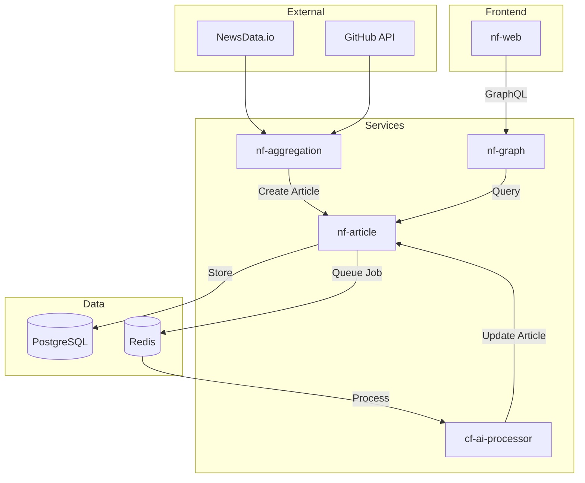
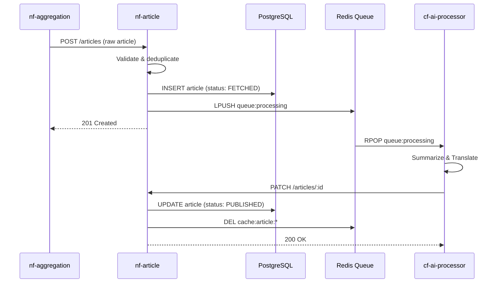
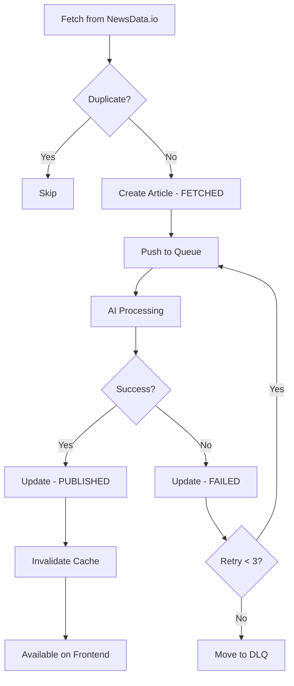
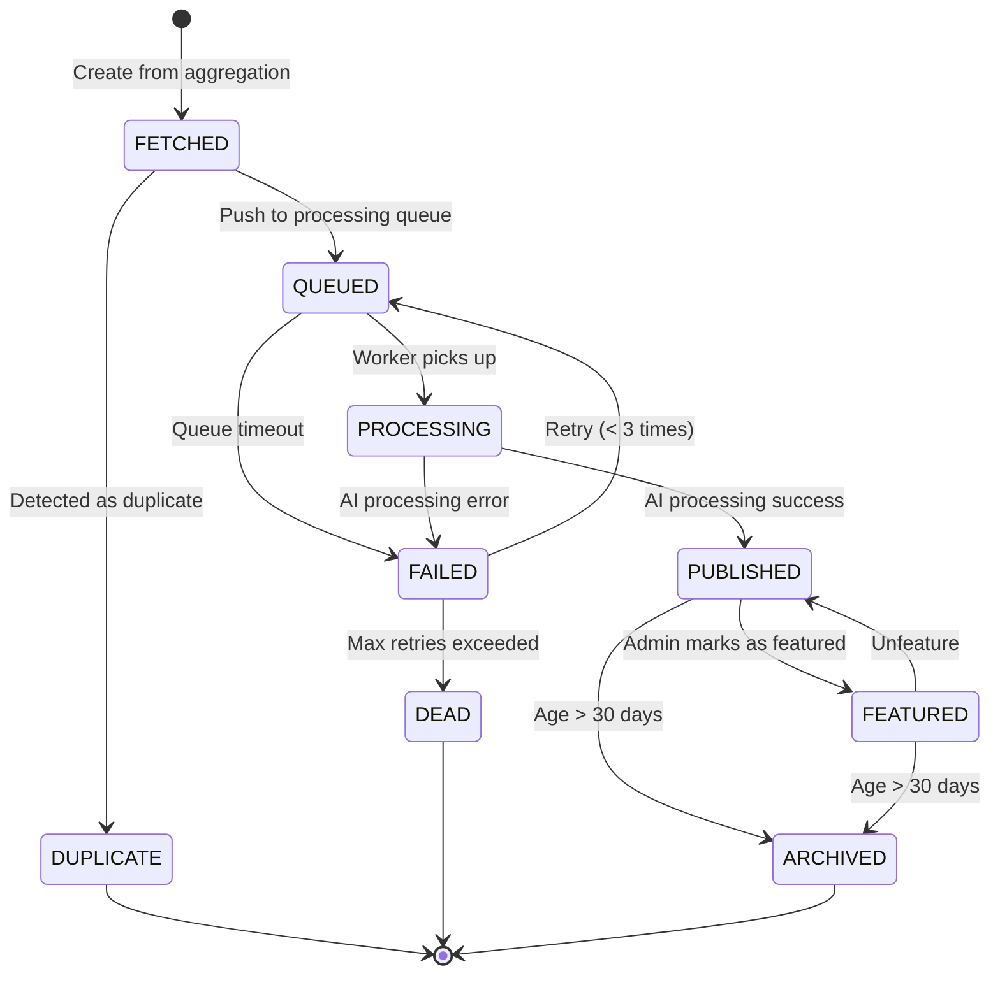
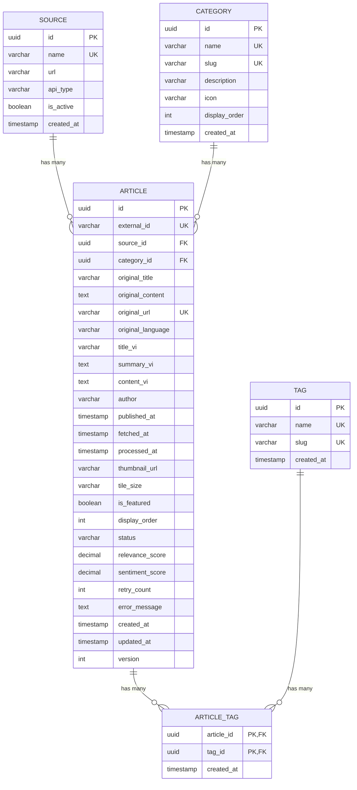

# HLD - Quản lý Bài viết (Article Management)

## 1. Bối cảnh

### 1.1 Bối cảnh Kinh doanh

Service `nf-article` chịu trách nhiệm quản lý toàn bộ vòng đời của bài viết tin tức trên KynguyenAI.vn. Đây là service cốt lõi của hệ thống, lưu trữ và cung cấp nội dung đã được xử lý AI cho người dùng.

**Chức năng chính:**
- Lưu trữ bài viết đã được tóm tắt và Việt hóa
- Phân loại bài viết theo danh mục (Frontend, Backend, AI/ML, DevOps...)
- Quản lý tags và metadata
- Cung cấp API cho frontend hiển thị Bento Grid
- Theo dõi trạng thái bài viết trong pipeline

### 1.2 Bối cảnh Hệ thống

```
┌─────────────────────────────────────────────────────────────────────┐
│                      NF-ARTICLE CONTEXT                              │
├─────────────────────────────────────────────────────────────────────┤
│                                                                      │
│   ┌─────────────┐         ┌─────────────┐         ┌─────────────┐   │
│   │    nf-web   │         │  nf-graph   │         │nf-aggreg.   │   │
│   │  (Frontend) │◄───────►│  (GraphQL)  │◄───────►│ (Fetcher)   │   │
│   └─────────────┘         └──────┬──────┘         └──────┬──────┘   │
│                                  │                       │          │
│                                  ▼                       │          │
│                         ┌─────────────┐                  │          │
│                         │ nf-article  │◄─────────────────┘          │
│                         │  (Service)  │                             │
│                         └──────┬──────┘                             │
│                                │                                     │
│              ┌─────────────────┼─────────────────┐                  │
│              │                 │                 │                  │
│              ▼                 ▼                 ▼                  │
│   ┌─────────────┐    ┌─────────────┐    ┌─────────────┐            │
│   │  PostgreSQL │    │    Redis    │    │cf-ai-proc   │            │
│   │  (Supabase) │    │   (Cache)   │    │ (Consumer)  │            │
│   └─────────────┘    └─────────────┘    └─────────────┘            │
│                                                                      │
└─────────────────────────────────────────────────────────────────────┘
```

### 1.3 Phạm vi

**Trong phạm vi:**
- CRUD operations cho Article, Category, Tag, Source
- Quản lý trạng thái bài viết
- Caching và invalidation
- Events cho các service khác

**Ngoài phạm vi:**
- Thu thập dữ liệu (xem HLD-NF-AGGREGATION)
- Xử lý AI (xem HLD-CF-AI-PROCESSING)
- Hiển thị UI (xem ComponentView)

### 1.4 Actors

| Actor | Mô tả | Hành động |
|-------|-------|-----------|
| **nf-aggregation** | Service thu thập tin | Tạo article mới với status FETCHED |
| **cf-ai-processor** | Service xử lý AI | Cập nhật article với nội dung đã xử lý |
| **nf-graph** | GraphQL gateway | Query articles cho frontend |
| **Admin** | Quản trị viên | Manual curation, feature articles |

---

## 2. Context Diagram



---

## 3. Core Business Workflow

### 3.1 Sequence Diagram - Tạo và Xử lý Bài viết



### 3.2 Activity Diagram - Article Lifecycle



### 3.3 Workflow Description

| Bước | Activity | Actor | Mô tả |
|------|----------|-------|-------|
| 1 | Fetch raw article | nf-aggregation | Lấy tin từ NewsData.io |
| 2 | Check duplicate | nf-article | Kiểm tra URL đã tồn tại chưa |
| 3 | Create article | nf-article | Tạo record với status FETCHED |
| 4 | Queue for processing | nf-article | Push job vào Redis queue |
| 5 | AI summarization | cf-ai-processor | Tóm tắt bằng Gemini |
| 6 | AI translation | cf-ai-processor | Dịch sang tiếng Việt |
| 7 | Update article | nf-article | Cập nhật nội dung và status |
| 8 | Cache invalidation | nf-article | Xóa cache cũ |
| 9 | Serve to frontend | nf-graph | Trả về qua GraphQL |

---

## 4. State Machine

### 4.1 Article State Diagram



### 4.2 State Transition Table

| Current State | Event | Next State | Conditions | Actions |
|---------------|-------|------------|------------|---------|
| - | CREATE | FETCHED | Valid payload | Insert to DB |
| FETCHED | DUPLICATE_FOUND | DUPLICATE | URL exists | Log & skip |
| FETCHED | QUEUE | QUEUED | - | Push to Redis |
| QUEUED | PROCESS_START | PROCESSING | Worker available | Update status |
| PROCESSING | PROCESS_SUCCESS | PUBLISHED | AI output valid | Update content |
| PROCESSING | PROCESS_ERROR | FAILED | Error occurred | Increment retry |
| FAILED | RETRY | QUEUED | retry_count < 3 | Re-queue |
| FAILED | MAX_RETRY | DEAD | retry_count >= 3 | Move to DLQ |
| PUBLISHED | FEATURE | FEATURED | Admin action | Set is_featured |
| PUBLISHED | ARCHIVE | ARCHIVED | published_at > 30d | Soft delete |

---

## 5. Mô hình Dữ liệu (ERD)

### 5.1 Entity Relationship Diagram



### 5.2 Table Definitions

#### 5.2.1 source

```sql
CREATE TABLE source (
    id UUID PRIMARY KEY DEFAULT gen_random_uuid(),
    name VARCHAR(255) NOT NULL UNIQUE,
    url VARCHAR(2000),
    api_type VARCHAR(50) NOT NULL, -- NEWSDATA, GITHUB, HACKERNEWS
    is_active BOOLEAN DEFAULT true,
    created_at TIMESTAMP WITH TIME ZONE DEFAULT NOW()
);

-- Seed data
INSERT INTO source (name, url, api_type) VALUES
('NewsData.io', 'https://newsdata.io', 'NEWSDATA'),
('GitHub', 'https://github.com', 'GITHUB');
```

#### 5.2.2 category

```sql
CREATE TABLE category (
    id UUID PRIMARY KEY DEFAULT gen_random_uuid(),
    name VARCHAR(100) NOT NULL UNIQUE,
    slug VARCHAR(100) NOT NULL UNIQUE,
    description TEXT,
    icon VARCHAR(50),
    display_order INT DEFAULT 0,
    created_at TIMESTAMP WITH TIME ZONE DEFAULT NOW()
);

-- Seed data
INSERT INTO category (name, slug, icon, display_order) VALUES
('Frontend', 'frontend', 'layout', 1),
('Backend', 'backend', 'server', 2),
('AI/ML', 'ai-ml', 'brain', 3),
('DevOps', 'devops', 'cloud', 4),
('Mobile', 'mobile', 'smartphone', 5),
('Database', 'database', 'database', 6),
('Security', 'security', 'shield', 7),
('Career', 'career', 'briefcase', 8);
```

#### 5.2.3 article

```sql
CREATE TABLE article (
    id UUID PRIMARY KEY DEFAULT gen_random_uuid(),
    external_id VARCHAR(255) UNIQUE,
    source_id UUID NOT NULL REFERENCES source(id),
    category_id UUID REFERENCES category(id),

    -- Original content (English)
    original_title VARCHAR(500) NOT NULL,
    original_content TEXT,
    original_url VARCHAR(2000) NOT NULL UNIQUE,
    original_language VARCHAR(10) DEFAULT 'en',

    -- Processed content (Vietnamese)
    title_vi VARCHAR(500),
    summary_vi TEXT,
    content_vi TEXT,

    -- Metadata
    author VARCHAR(255),
    published_at TIMESTAMP WITH TIME ZONE,
    fetched_at TIMESTAMP WITH TIME ZONE DEFAULT NOW(),
    processed_at TIMESTAMP WITH TIME ZONE,

    -- Display
    thumbnail_url VARCHAR(2000),
    tile_size VARCHAR(20) DEFAULT 'STANDARD', -- HERO, TALL, STANDARD, WIDE
    is_featured BOOLEAN DEFAULT FALSE,
    display_order INT DEFAULT 0,

    -- Status & Processing
    status VARCHAR(50) DEFAULT 'FETCHED',
    relevance_score DECIMAL(5,2),
    sentiment_score DECIMAL(5,2),
    retry_count INT DEFAULT 0,
    error_message TEXT,

    -- Audit
    created_at TIMESTAMP WITH TIME ZONE DEFAULT NOW(),
    updated_at TIMESTAMP WITH TIME ZONE DEFAULT NOW(),
    version INT DEFAULT 1,

    -- Constraints
    CONSTRAINT chk_status CHECK (status IN (
        'FETCHED', 'QUEUED', 'PROCESSING', 'PUBLISHED',
        'FEATURED', 'ARCHIVED', 'FAILED', 'DEAD', 'DUPLICATE'
    )),
    CONSTRAINT chk_tile_size CHECK (tile_size IN ('HERO', 'TALL', 'STANDARD', 'WIDE'))
);

-- Indexes
CREATE INDEX idx_article_status ON article(status);
CREATE INDEX idx_article_category ON article(category_id);
CREATE INDEX idx_article_published_at ON article(published_at DESC);
CREATE INDEX idx_article_is_featured ON article(is_featured) WHERE is_featured = true;
CREATE INDEX idx_article_source ON article(source_id);
```

#### 5.2.4 tag & article_tag

```sql
CREATE TABLE tag (
    id UUID PRIMARY KEY DEFAULT gen_random_uuid(),
    name VARCHAR(100) NOT NULL UNIQUE,
    slug VARCHAR(100) NOT NULL UNIQUE,
    created_at TIMESTAMP WITH TIME ZONE DEFAULT NOW()
);

CREATE TABLE article_tag (
    article_id UUID NOT NULL REFERENCES article(id) ON DELETE CASCADE,
    tag_id UUID NOT NULL REFERENCES tag(id) ON DELETE CASCADE,
    created_at TIMESTAMP WITH TIME ZONE DEFAULT NOW(),
    PRIMARY KEY (article_id, tag_id)
);

CREATE INDEX idx_article_tag_article ON article_tag(article_id);
CREATE INDEX idx_article_tag_tag ON article_tag(tag_id);
```

---

## 6. Kiến trúc Sự kiện (Event Architecture)

### 6.1 Danh sách Events

| Event Name | Producer | Consumer(s) | Trigger | Topic |
|------------|----------|-------------|---------|-------|
| ArticleCreated | nf-article | cf-ai-processor | New article inserted | nf.article.events |
| ArticleUpdated | nf-article | nf-graph | Article content updated | nf.article.events |
| ArticlePublished | nf-article | nf-graph, uf-subscription | Status → PUBLISHED | nf.article.events |
| ArticleFeatured | nf-article | nf-graph | is_featured → true | nf.article.events |
| ArticleFailed | nf-article | df-pipeline | Processing failed | nf.article.events |

### 6.2 Event Schema

```json
{
  "eventId": "uuid",
  "eventType": "ArticleCreated | ArticleUpdated | ArticlePublished | ArticleFeatured | ArticleFailed",
  "eventVersion": "1.0.0",
  "timestamp": "2024-01-15T10:30:00Z",
  "source": {
    "service": "nf-article"
  },
  "correlationId": "uuid",
  "payload": {
    "articleId": "uuid",
    "status": "string",
    "categoryId": "uuid",
    "originalUrl": "string",
    "titleVi": "string",
    "publishedAt": "timestamp"
  }
}
```

### 6.3 Sample Events

**ArticleCreated:**
```json
{
  "eventId": "a1b2c3d4-e5f6-7890-abcd-ef1234567890",
  "eventType": "ArticleCreated",
  "eventVersion": "1.0.0",
  "timestamp": "2024-01-15T10:30:00Z",
  "source": { "service": "nf-article" },
  "correlationId": "job-123456",
  "payload": {
    "articleId": "art-001",
    "status": "FETCHED",
    "originalUrl": "https://example.com/article-1",
    "originalTitle": "Next.js 15 Released"
  }
}
```

**ArticlePublished:**
```json
{
  "eventId": "b2c3d4e5-f6a7-8901-bcde-f23456789012",
  "eventType": "ArticlePublished",
  "eventVersion": "1.0.0",
  "timestamp": "2024-01-15T10:35:00Z",
  "source": { "service": "nf-article" },
  "correlationId": "job-123456",
  "payload": {
    "articleId": "art-001",
    "status": "PUBLISHED",
    "categoryId": "cat-frontend",
    "titleVi": "Next.js 15 Chính thức Ra mắt",
    "summaryVi": "Phiên bản Next.js 15 mang đến nhiều cải tiến về hiệu suất...",
    "publishedAt": "2024-01-15T10:35:00Z"
  }
}
```

---

## 7. API Design

### 7.1 REST API Endpoints

| Method | Endpoint | Description | Auth |
|--------|----------|-------------|------|
| POST | /articles | Create new article | Internal |
| GET | /articles | List articles | Public |
| GET | /articles/:id | Get article by ID | Public |
| PATCH | /articles/:id | Update article | Internal |
| DELETE | /articles/:id | Soft delete article | Admin |
| POST | /articles/:id/feature | Feature article | Admin |
| POST | /articles/:id/unfeature | Unfeature article | Admin |
| GET | /categories | List categories | Public |
| GET | /tags | List tags | Public |

### 7.2 Request/Response Examples

**POST /articles**
```json
// Request
{
  "externalId": "newsdata-12345",
  "sourceId": "source-newsdata",
  "originalTitle": "Next.js 15 Released with Major Performance Improvements",
  "originalContent": "The Next.js team announced...",
  "originalUrl": "https://nextjs.org/blog/next-15",
  "author": "Vercel Team",
  "publishedAt": "2024-01-15T08:00:00Z",
  "thumbnailUrl": "https://nextjs.org/og.png"
}

// Response 201
{
  "id": "art-001",
  "status": "FETCHED",
  "createdAt": "2024-01-15T10:30:00Z"
}
```

**GET /articles?status=PUBLISHED&limit=10**
```json
// Response 200
{
  "data": [
    {
      "id": "art-001",
      "titleVi": "Next.js 15 Chính thức Ra mắt",
      "summaryVi": "Phiên bản mới với nhiều cải tiến...",
      "originalUrl": "https://nextjs.org/blog/next-15",
      "thumbnailUrl": "https://nextjs.org/og.png",
      "category": { "id": "cat-frontend", "name": "Frontend", "slug": "frontend" },
      "tags": [
        { "id": "tag-nextjs", "name": "Next.js", "slug": "nextjs" },
        { "id": "tag-react", "name": "React", "slug": "react" }
      ],
      "source": { "id": "source-newsdata", "name": "NewsData.io" },
      "publishedAt": "2024-01-15T10:35:00Z",
      "tileSize": "HERO",
      "isFeatured": true
    }
  ],
  "pagination": {
    "total": 150,
    "limit": 10,
    "offset": 0,
    "hasMore": true
  }
}
```

**PATCH /articles/:id**
```json
// Request (from cf-ai-processor)
{
  "titleVi": "Next.js 15 Chính thức Ra mắt với Nhiều Cải tiến Hiệu suất",
  "summaryVi": "- Hỗ trợ React 19\n- Cải thiện tốc độ build 50%\n- Turbopack stable",
  "contentVi": "Đội ngũ Next.js vừa công bố phiên bản 15...",
  "categoryId": "cat-frontend",
  "tags": ["nextjs", "react", "vercel"],
  "status": "PUBLISHED",
  "relevanceScore": 0.95,
  "sentimentScore": 0.8
}

// Response 200
{
  "id": "art-001",
  "status": "PUBLISHED",
  "updatedAt": "2024-01-15T10:35:00Z"
}
```

---

## 8. Caching Strategy

### 8.1 Cache Keys

| Key Pattern | Data | TTL |
|-------------|------|-----|
| `article:{id}` | Single article | 5 minutes |
| `articles:featured` | Featured articles list | 1 minute |
| `articles:category:{slug}` | Articles by category | 5 minutes |
| `articles:latest` | Latest articles | 1 minute |
| `categories:all` | All categories | 1 hour |

### 8.2 Cache Invalidation

```typescript
// On ArticlePublished event
async function invalidateCache(articleId: string, categorySlug: string) {
  await redis.del(`article:${articleId}`)
  await redis.del(`articles:category:${categorySlug}`)
  await redis.del('articles:latest')
  await redis.del('articles:featured')
}
```

---

## 9. Error Handling

### 9.1 Error Codes

| Code | HTTP Status | Description |
|------|-------------|-------------|
| ARTICLE_NOT_FOUND | 404 | Article không tồn tại |
| ARTICLE_DUPLICATE | 409 | URL đã tồn tại |
| INVALID_STATUS_TRANSITION | 400 | Chuyển trạng thái không hợp lệ |
| CATEGORY_NOT_FOUND | 404 | Category không tồn tại |
| VALIDATION_ERROR | 400 | Dữ liệu không hợp lệ |

### 9.2 Retry Policy

```typescript
const retryPolicy = {
  maxRetries: 3,
  initialDelay: 1000, // 1 second
  backoffMultiplier: 2,
  maxDelay: 30000, // 30 seconds
}
```
