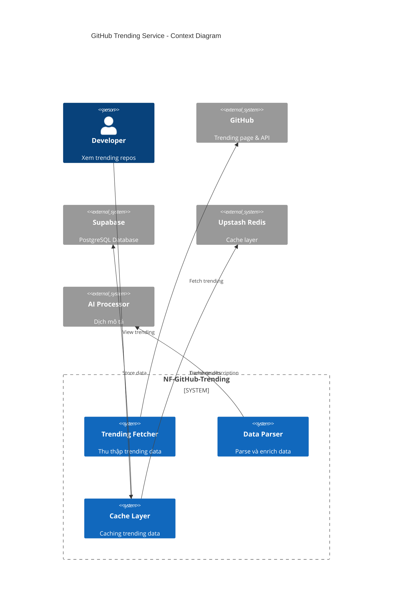
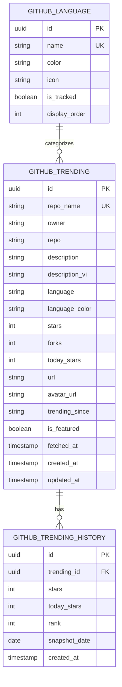
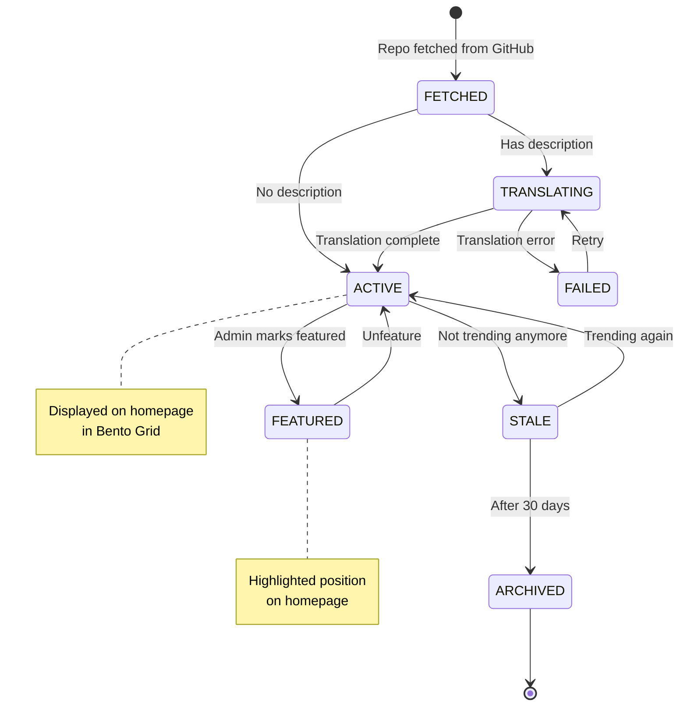

# HLD-NF-GITHUB-TRENDING - Tích hợp GitHub Trending

## 1. Bối cảnh

### 1.1 Bối cảnh Nghiệp vụ

**Vấn đề cần giải quyết:**
- Lập trình viên muốn cập nhật các repo đang hot trên GitHub
- Khó theo dõi trending repos theo ngôn ngữ yêu thích
- Thông tin trending thay đổi nhanh, cần cập nhật thường xuyên
- Muốn có mô tả tiếng Việt cho các repo quốc tế

**Giải pháp:**
- Tự động thu thập GitHub Trending mỗi 6 giờ
- Phân loại theo ngôn ngữ lập trình
- Dịch mô tả repo sang tiếng Việt
- Hiển thị trên Bento Grid với star count và language badge

### 1.2 Bối cảnh Hệ thống

```
┌─────────────────────────────────────────────────────────────────────┐
│                    NF-GITHUB-TRENDING SERVICE                       │
├─────────────────────────────────────────────────────────────────────┤
│                                                                      │
│   ┌──────────────┐    ┌──────────────┐    ┌──────────────┐         │
│   │   GitHub     │───►│   Parser &   │───►│   Storage    │         │
│   │   Fetcher    │    │   Enricher   │    │   & Cache    │         │
│   └──────────────┘    └──────────────┘    └──────────────┘         │
│          │                   │                    │                 │
│          ▼                   ▼                    ▼                 │
│   ┌──────────────┐    ┌──────────────┐    ┌──────────────┐         │
│   │  GitHub API  │    │  AI Service  │    │  PostgreSQL  │         │
│   │  (REST v3)   │    │  (Translate) │    │   + Redis    │         │
│   └──────────────┘    └──────────────┘    └──────────────┘         │
│                                                                      │
└─────────────────────────────────────────────────────────────────────┘
```

---

## 2. Context Diagram



---

## 3. Data Model (ERD)



### 3.1 SQL Schema

```sql
-- GitHub Trending Repositories
CREATE TABLE github_trending (
    id UUID PRIMARY KEY DEFAULT gen_random_uuid(),
    repo_name VARCHAR(255) UNIQUE NOT NULL, -- owner/repo
    owner VARCHAR(100) NOT NULL,
    repo VARCHAR(100) NOT NULL,
    description TEXT,
    description_vi TEXT,
    language VARCHAR(50),
    language_color VARCHAR(7), -- hex color
    stars INTEGER DEFAULT 0,
    forks INTEGER DEFAULT 0,
    today_stars INTEGER DEFAULT 0,
    url VARCHAR(500) NOT NULL,
    avatar_url VARCHAR(500),
    trending_since VARCHAR(20), -- 'daily', 'weekly', 'monthly'
    is_featured BOOLEAN DEFAULT false,
    fetched_at TIMESTAMPTZ NOT NULL,
    created_at TIMESTAMPTZ DEFAULT NOW(),
    updated_at TIMESTAMPTZ DEFAULT NOW()
);

CREATE INDEX idx_github_language ON github_trending(language);
CREATE INDEX idx_github_stars ON github_trending(stars DESC);
CREATE INDEX idx_github_today_stars ON github_trending(today_stars DESC);
CREATE INDEX idx_github_fetched ON github_trending(fetched_at DESC);

-- Historical data for trend analysis
CREATE TABLE github_trending_history (
    id UUID PRIMARY KEY DEFAULT gen_random_uuid(),
    trending_id UUID NOT NULL REFERENCES github_trending(id) ON DELETE CASCADE,
    stars INTEGER NOT NULL,
    today_stars INTEGER NOT NULL,
    rank INTEGER,
    snapshot_date DATE NOT NULL,
    created_at TIMESTAMPTZ DEFAULT NOW(),

    UNIQUE(trending_id, snapshot_date)
);

CREATE INDEX idx_history_date ON github_trending_history(snapshot_date DESC);

-- Languages we track
CREATE TABLE github_language (
    id UUID PRIMARY KEY DEFAULT gen_random_uuid(),
    name VARCHAR(50) UNIQUE NOT NULL,
    color VARCHAR(7), -- hex color
    icon VARCHAR(50), -- icon name
    is_tracked BOOLEAN DEFAULT true,
    display_order INTEGER DEFAULT 999,
    created_at TIMESTAMPTZ DEFAULT NOW()
);

-- Seed common languages
INSERT INTO github_language (name, color, icon, is_tracked, display_order) VALUES
('JavaScript', '#f1e05a', 'javascript', true, 1),
('TypeScript', '#3178c6', 'typescript', true, 2),
('Python', '#3572A5', 'python', true, 3),
('Rust', '#dea584', 'rust', true, 4),
('Go', '#00ADD8', 'go', true, 5),
('Java', '#b07219', 'java', true, 6),
('C++', '#f34b7d', 'cplusplus', true, 7),
('C#', '#178600', 'csharp', true, 8),
('PHP', '#4F5D95', 'php', true, 9),
('Ruby', '#701516', 'ruby', true, 10);
```

---

## 4. GitHub Data Fetching

### 4.1 Fetching Strategy

```
┌─────────────────────────────────────────────────────────────────────┐
│                    GITHUB TRENDING FETCH FLOW                       │
├─────────────────────────────────────────────────────────────────────┤
│                                                                      │
│   ┌──────────────┐                                                  │
│   │   Cron Job   │  Every 6 hours                                   │
│   │  (0 */6 * *) │                                                  │
│   └──────┬───────┘                                                  │
│          │                                                          │
│          ▼                                                          │
│   ┌──────────────┐    ┌──────────────┐    ┌──────────────┐         │
│   │   Fetch      │    │   Fetch      │    │   Fetch      │         │
│   │   Daily      │    │   Weekly     │    │   Monthly    │         │
│   │   Trending   │    │   Trending   │    │   Trending   │         │
│   └──────┬───────┘    └──────┬───────┘    └──────┬───────┘         │
│          │                   │                   │                  │
│          └───────────────────┼───────────────────┘                  │
│                              ▼                                      │
│                    ┌──────────────────┐                            │
│                    │   Merge & Dedup  │                            │
│                    └────────┬─────────┘                            │
│                              │                                      │
│          ┌───────────────────┼───────────────────┐                 │
│          ▼                   ▼                   ▼                 │
│   ┌──────────────┐    ┌──────────────┐    ┌──────────────┐        │
│   │  Translate   │    │   Upsert     │    │   Update     │        │
│   │  Description │    │   Database   │    │   Cache      │        │
│   └──────────────┘    └──────────────┘    └──────────────┘        │
│                                                                      │
└─────────────────────────────────────────────────────────────────────┘
```

### 4.2 GitHub Scraper

GitHub không có API chính thức cho Trending, nên cần parse HTML hoặc sử dụng unofficial API.

```typescript
// lib/github/fetcher.ts

import * as cheerio from 'cheerio';

export class GitHubTrendingFetcher {
  private baseUrl = 'https://github.com/trending';

  /**
   * Fetch trending repositories
   */
  async fetch(options: FetchOptions = {}): Promise<TrendingRepo[]> {
    const { language, since = 'daily' } = options;

    let url = this.baseUrl;
    if (language) {
      url += `/${encodeURIComponent(language)}`;
    }
    url += `?since=${since}`;

    const response = await fetch(url, {
      headers: {
        'User-Agent': 'KynguyenAI-Bot/1.0',
        'Accept': 'text/html',
      },
    });

    if (!response.ok) {
      throw new Error(`GitHub fetch failed: ${response.status}`);
    }

    const html = await response.text();
    return this.parseHtml(html, since);
  }

  /**
   * Parse trending page HTML
   */
  private parseHtml(html: string, since: string): TrendingRepo[] {
    const $ = cheerio.load(html);
    const repos: TrendingRepo[] = [];

    $('article.Box-row').each((index, element) => {
      const $el = $(element);

      // Repository name
      const repoPath = $el.find('h2 a').attr('href')?.slice(1) || '';
      const [owner, repo] = repoPath.split('/');

      // Description
      const description = $el.find('p.col-9').text().trim();

      // Language
      const language = $el.find('[itemprop="programmingLanguage"]').text().trim();
      const languageColor = $el.find('.repo-language-color')
        .css('background-color') || '';

      // Stars
      const starsText = $el.find('a[href$="/stargazers"]').text().trim();
      const stars = this.parseNumber(starsText);

      // Forks
      const forksText = $el.find('a[href$="/forks"]').text().trim();
      const forks = this.parseNumber(forksText);

      // Today's stars
      const todayText = $el.find('.float-sm-right').text().trim();
      const todayStars = this.parseTodayStars(todayText);

      // Avatar
      const avatarUrl = $el.find('img.avatar').attr('src') || '';

      repos.push({
        fullName: repoPath,
        owner,
        repo,
        description,
        language: language || null,
        languageColor: languageColor || null,
        stars,
        forks,
        todayStars,
        url: `https://github.com/${repoPath}`,
        avatarUrl,
        trendingSince: since,
        rank: index + 1,
      });
    });

    return repos;
  }

  private parseNumber(text: string): number {
    if (!text) return 0;
    const clean = text.replace(/,/g, '').trim();

    if (clean.endsWith('k')) {
      return Math.round(parseFloat(clean) * 1000);
    }
    return parseInt(clean) || 0;
  }

  private parseTodayStars(text: string): number {
    const match = text.match(/(\d[\d,]*)\s+stars?\s+(today|this week|this month)/i);
    if (!match) return 0;
    return this.parseNumber(match[1]);
  }

  /**
   * Fetch trending for multiple languages
   */
  async fetchMultiLanguage(languages: string[], since = 'daily'): Promise<TrendingRepo[]> {
    const allRepos: TrendingRepo[] = [];
    const seen = new Set<string>();

    // Fetch all languages (general trending)
    const generalRepos = await this.fetch({ since });
    for (const repo of generalRepos) {
      if (!seen.has(repo.fullName)) {
        seen.add(repo.fullName);
        allRepos.push(repo);
      }
    }

    // Fetch per language
    for (const language of languages) {
      try {
        const repos = await this.fetch({ language, since });
        for (const repo of repos) {
          if (!seen.has(repo.fullName)) {
            seen.add(repo.fullName);
            allRepos.push(repo);
          }
        }

        // Rate limiting
        await new Promise(resolve => setTimeout(resolve, 500));
      } catch (error) {
        console.error(`Failed to fetch ${language} trending:`, error);
      }
    }

    return allRepos;
  }
}

interface FetchOptions {
  language?: string;
  since?: 'daily' | 'weekly' | 'monthly';
}

interface TrendingRepo {
  fullName: string;
  owner: string;
  repo: string;
  description: string;
  language: string | null;
  languageColor: string | null;
  stars: number;
  forks: number;
  todayStars: number;
  url: string;
  avatarUrl: string;
  trendingSince: string;
  rank: number;
}
```

### 4.3 Alternative: GitHub REST API

```typescript
// lib/github/api-fetcher.ts

import { Octokit } from '@octokit/rest';

export class GitHubAPIFetcher {
  private octokit: Octokit;

  constructor() {
    this.octokit = new Octokit({
      auth: process.env.GITHUB_TOKEN,
    });
  }

  /**
   * Search trending repos using GitHub Search API
   * Note: This is an approximation, not exact trending
   */
  async fetchTrending(options: SearchOptions = {}): Promise<SearchResult[]> {
    const { language, daysAgo = 7, perPage = 25 } = options;

    // Calculate date filter
    const date = new Date();
    date.setDate(date.getDate() - daysAgo);
    const dateStr = date.toISOString().split('T')[0];

    // Build search query
    let query = `created:>${dateStr} stars:>100`;
    if (language) {
      query += ` language:${language}`;
    }

    const response = await this.octokit.search.repos({
      q: query,
      sort: 'stars',
      order: 'desc',
      per_page: perPage,
    });

    return response.data.items.map((repo, index) => ({
      fullName: repo.full_name,
      owner: repo.owner?.login || '',
      repo: repo.name,
      description: repo.description || '',
      language: repo.language || null,
      stars: repo.stargazers_count,
      forks: repo.forks_count,
      url: repo.html_url,
      avatarUrl: repo.owner?.avatar_url || '',
      createdAt: repo.created_at,
      updatedAt: repo.updated_at,
      rank: index + 1,
    }));
  }

  /**
   * Get repository details
   */
  async getRepoDetails(owner: string, repo: string): Promise<RepoDetails> {
    const response = await this.octokit.repos.get({ owner, repo });
    const { data } = response;

    return {
      fullName: data.full_name,
      description: data.description || '',
      language: data.language || null,
      stars: data.stargazers_count,
      forks: data.forks_count,
      watchers: data.watchers_count,
      openIssues: data.open_issues_count,
      topics: data.topics || [],
      license: data.license?.name || null,
      homepage: data.homepage || null,
      defaultBranch: data.default_branch,
    };
  }

  /**
   * Get README content
   */
  async getReadme(owner: string, repo: string): Promise<string | null> {
    try {
      const response = await this.octokit.repos.getReadme({
        owner,
        repo,
        mediaType: { format: 'raw' },
      });

      return response.data as unknown as string;
    } catch {
      return null;
    }
  }
}

interface SearchOptions {
  language?: string;
  daysAgo?: number;
  perPage?: number;
}

interface SearchResult {
  fullName: string;
  owner: string;
  repo: string;
  description: string;
  language: string | null;
  stars: number;
  forks: number;
  url: string;
  avatarUrl: string;
  createdAt: string;
  updatedAt: string;
  rank: number;
}

interface RepoDetails {
  fullName: string;
  description: string;
  language: string | null;
  stars: number;
  forks: number;
  watchers: number;
  openIssues: number;
  topics: string[];
  license: string | null;
  homepage: string | null;
  defaultBranch: string;
}
```

---

## 5. State Machine



---

## 6. Translation Integration

### 6.1 Description Translation

```typescript
// lib/github/translator.ts

import { AIClient } from '@/lib/ai/client';

const TRANSLATE_PROMPT = {
  system: `Bạn là dịch giả chuyên ngành công nghệ. Dịch mô tả repository sang tiếng Việt.
Quy tắc:
1. Giữ nguyên tên riêng, tên thư viện, framework
2. Dịch ngắn gọn, súc tích (tối đa 200 ký tự)
3. Giữ nghĩa kỹ thuật chính xác`,

  user: `Dịch mô tả repo sau sang tiếng Việt:

"{description}"

Trả về JSON: { "description_vi": "..." }`
};

export class GitHubTranslator {
  private aiClient: AIClient;

  constructor() {
    this.aiClient = new AIClient();
  }

  async translateDescription(description: string): Promise<string> {
    if (!description || description.length < 10) {
      return '';
    }

    try {
      const response = await this.aiClient.process({
        system: TRANSLATE_PROMPT.system,
        user: TRANSLATE_PROMPT.user.replace('{description}', description),
      });

      const parsed = JSON.parse(response.content);
      return parsed.description_vi || '';
    } catch (error) {
      console.error('Translation failed:', error);
      return '';
    }
  }

  async translateBatch(repos: Array<{ id: string; description: string }>): Promise<Map<string, string>> {
    const results = new Map<string, string>();

    for (const repo of repos) {
      if (repo.description) {
        const translated = await this.translateDescription(repo.description);
        results.set(repo.id, translated);

        // Rate limiting
        await new Promise(resolve => setTimeout(resolve, 100));
      }
    }

    return results;
  }
}
```

---

## 7. Caching Strategy

### 7.1 Multi-layer Cache

```typescript
// lib/github/cache.ts

import { Redis } from '@upstash/redis';

const redis = new Redis({
  url: process.env.UPSTASH_REDIS_URL!,
  token: process.env.UPSTASH_REDIS_TOKEN!,
});

export class GitHubTrendingCache {
  private keyPrefix = 'github:trending:';
  private ttl = 60 * 60; // 1 hour

  /**
   * Get cached trending repos
   */
  async get(language?: string, since = 'daily'): Promise<TrendingRepo[] | null> {
    const key = this.buildKey(language, since);
    const cached = await redis.get(key);

    if (!cached) return null;

    return JSON.parse(cached as string);
  }

  /**
   * Cache trending repos
   */
  async set(repos: TrendingRepo[], language?: string, since = 'daily'): Promise<void> {
    const key = this.buildKey(language, since);
    await redis.set(key, JSON.stringify(repos), { ex: this.ttl });
  }

  /**
   * Get all cached languages
   */
  async getAllCached(): Promise<Map<string, TrendingRepo[]>> {
    const pattern = `${this.keyPrefix}*`;
    const keys = await redis.keys(pattern);

    const result = new Map<string, TrendingRepo[]>();

    for (const key of keys) {
      const data = await redis.get(key);
      if (data) {
        const suffix = key.replace(this.keyPrefix, '');
        result.set(suffix, JSON.parse(data as string));
      }
    }

    return result;
  }

  /**
   * Invalidate cache
   */
  async invalidate(language?: string, since?: string): Promise<void> {
    if (language && since) {
      const key = this.buildKey(language, since);
      await redis.del(key);
    } else {
      // Invalidate all
      const pattern = `${this.keyPrefix}*`;
      const keys = await redis.keys(pattern);
      if (keys.length > 0) {
        await redis.del(...keys);
      }
    }
  }

  private buildKey(language?: string, since = 'daily'): string {
    const lang = language || 'all';
    return `${this.keyPrefix}${lang}:${since}`;
  }
}

interface TrendingRepo {
  fullName: string;
  owner: string;
  repo: string;
  description: string;
  descriptionVi?: string;
  language: string | null;
  stars: number;
  forks: number;
  todayStars: number;
  url: string;
  avatarUrl: string;
}
```

---

## 8. API Endpoints

### 8.1 GraphQL Schema

```graphql
type GitHubTrendingRepo {
  id: ID!
  fullName: String!
  owner: String!
  repo: String!
  description: String
  descriptionVi: String
  language: String
  languageColor: String
  stars: Int!
  forks: Int!
  todayStars: Int!
  url: String!
  avatarUrl: String
  trendingSince: String
  isFeatured: Boolean!
  fetchedAt: DateTime!
}

type GitHubLanguage {
  name: String!
  color: String
  repoCount: Int!
}

type Query {
  # Get trending repos
  githubTrending(
    language: String
    since: TrendingSince = DAILY
    limit: Int = 25
  ): [GitHubTrendingRepo!]!

  # Get featured repos
  githubFeatured(limit: Int = 5): [GitHubTrendingRepo!]!

  # Get available languages
  githubLanguages: [GitHubLanguage!]!

  # Get single repo details
  githubRepo(fullName: String!): GitHubTrendingRepo
}

enum TrendingSince {
  DAILY
  WEEKLY
  MONTHLY
}
```

### 8.2 REST API

```typescript
// app/api/github/trending/route.ts

import { NextRequest, NextResponse } from 'next/server';
import { supabase } from '@/lib/supabase';
import { GitHubTrendingCache } from '@/lib/github/cache';

const cache = new GitHubTrendingCache();

export async function GET(request: NextRequest) {
  const searchParams = request.nextUrl.searchParams;
  const language = searchParams.get('language') || undefined;
  const since = searchParams.get('since') || 'daily';
  const limit = parseInt(searchParams.get('limit') || '25');

  // Try cache first
  const cached = await cache.get(language, since);
  if (cached) {
    return NextResponse.json({
      data: cached.slice(0, limit),
      source: 'cache',
    });
  }

  // Fallback to database
  let query = supabase
    .from('github_trending')
    .select('*')
    .eq('trending_since', since)
    .order('today_stars', { ascending: false })
    .limit(limit);

  if (language) {
    query = query.eq('language', language);
  }

  const { data, error } = await query;

  if (error) {
    return NextResponse.json({ error: error.message }, { status: 500 });
  }

  // Cache result
  if (data) {
    await cache.set(data, language, since);
  }

  return NextResponse.json({
    data,
    source: 'database',
  });
}
```

### 8.3 Featured Repos API

```typescript
// app/api/github/featured/route.ts

import { NextRequest, NextResponse } from 'next/server';
import { supabase } from '@/lib/supabase';

export async function GET(request: NextRequest) {
  const limit = parseInt(request.nextUrl.searchParams.get('limit') || '5');

  const { data, error } = await supabase
    .from('github_trending')
    .select('*')
    .eq('is_featured', true)
    .order('stars', { ascending: false })
    .limit(limit);

  if (error) {
    return NextResponse.json({ error: error.message }, { status: 500 });
  }

  return NextResponse.json({ data });
}

// PATCH - Toggle featured status
export async function PATCH(request: NextRequest) {
  const { repoName, isFeatured } = await request.json();

  const { data, error } = await supabase
    .from('github_trending')
    .update({ is_featured: isFeatured })
    .eq('repo_name', repoName)
    .select()
    .single();

  if (error) {
    return NextResponse.json({ error: error.message }, { status: 500 });
  }

  return NextResponse.json({ data });
}
```

---

## 9. Cron Job Implementation

### 9.1 Fetch Job

```typescript
// app/api/cron/github-fetch/route.ts

import { NextRequest, NextResponse } from 'next/server';
import { GitHubTrendingFetcher } from '@/lib/github/fetcher';
import { GitHubTranslator } from '@/lib/github/translator';
import { GitHubTrendingCache } from '@/lib/github/cache';
import { supabase } from '@/lib/supabase';

const fetcher = new GitHubTrendingFetcher();
const translator = new GitHubTranslator();
const cache = new GitHubTrendingCache();

const TRACKED_LANGUAGES = [
  'javascript',
  'typescript',
  'python',
  'rust',
  'go',
];

export async function GET(request: NextRequest) {
  // Verify cron secret
  const authHeader = request.headers.get('authorization');
  if (authHeader !== `Bearer ${process.env.CRON_SECRET}`) {
    return NextResponse.json({ error: 'Unauthorized' }, { status: 401 });
  }

  try {
    // Fetch trending for all tracked languages
    const repos = await fetcher.fetchMultiLanguage(TRACKED_LANGUAGES, 'daily');

    let upserted = 0;
    let translated = 0;

    for (const repo of repos) {
      // Translate description if not empty
      let descriptionVi = '';
      if (repo.description && repo.description.length > 10) {
        descriptionVi = await translator.translateDescription(repo.description);
        if (descriptionVi) translated++;
      }

      // Upsert to database
      const { error } = await supabase
        .from('github_trending')
        .upsert({
          repo_name: repo.fullName,
          owner: repo.owner,
          repo: repo.repo,
          description: repo.description,
          description_vi: descriptionVi,
          language: repo.language,
          language_color: repo.languageColor,
          stars: repo.stars,
          forks: repo.forks,
          today_stars: repo.todayStars,
          url: repo.url,
          avatar_url: repo.avatarUrl,
          trending_since: repo.trendingSince,
          fetched_at: new Date().toISOString(),
        }, {
          onConflict: 'repo_name',
        });

      if (!error) upserted++;

      // Rate limiting
      await new Promise(resolve => setTimeout(resolve, 100));
    }

    // Save history snapshot
    await saveHistorySnapshot();

    // Invalidate cache
    await cache.invalidate();

    return NextResponse.json({
      success: true,
      fetched: repos.length,
      upserted,
      translated,
    });

  } catch (error) {
    console.error('GitHub fetch failed:', error);
    return NextResponse.json(
      { error: (error as Error).message },
      { status: 500 }
    );
  }
}

async function saveHistorySnapshot(): Promise<void> {
  const today = new Date().toISOString().split('T')[0];

  // Get all current trending
  const { data: trending } = await supabase
    .from('github_trending')
    .select('id, stars, today_stars')
    .order('today_stars', { ascending: false });

  if (!trending) return;

  // Insert history records
  const historyRecords = trending.map((repo, index) => ({
    trending_id: repo.id,
    stars: repo.stars,
    today_stars: repo.today_stars,
    rank: index + 1,
    snapshot_date: today,
  }));

  await supabase
    .from('github_trending_history')
    .upsert(historyRecords, {
      onConflict: 'trending_id,snapshot_date',
    });
}
```

---

## 10. Frontend Integration

### 10.1 Bento Grid Tile

```typescript
// components/github-trending-tile.tsx

import { Star, GitFork, TrendingUp } from 'lucide-react';

interface GitHubTrendingTileProps {
  repo: {
    fullName: string;
    description: string;
    descriptionVi?: string;
    language: string | null;
    languageColor: string | null;
    stars: number;
    todayStars: number;
    url: string;
    avatarUrl: string;
  };
  size?: 'small' | 'medium' | 'large';
}

export function GitHubTrendingTile({ repo, size = 'medium' }: GitHubTrendingTileProps) {
  return (
    <a
      href={repo.url}
      target="_blank"
      rel="noopener noreferrer"
      className={`
        block rounded-xl border bg-card p-4 transition-all
        hover:shadow-lg hover:border-primary/50
        ${size === 'large' ? 'col-span-2 row-span-2' : ''}
        ${size === 'small' ? 'p-3' : ''}
      `}
    >
      {/* Header */}
      <div className="flex items-start gap-3 mb-3">
        
        <div className="flex-1 min-w-0">
          <h3 className="font-semibold text-sm truncate">{repo.fullName}</h3>
          {repo.language && (
            <div className="flex items-center gap-1 mt-1">
              <span
                className="w-3 h-3 rounded-full"
                style={{ backgroundColor: repo.languageColor || '#ccc' }}
              />
              <span className="text-xs text-muted-foreground">
                {repo.language}
              </span>
            </div>
          )}
        </div>
      </div>

      {/* Description */}
      <p className="text-sm text-muted-foreground line-clamp-2 mb-3">
        {repo.descriptionVi || repo.description}
      </p>

      {/* Stats */}
      <div className="flex items-center gap-4 text-sm">
        <div className="flex items-center gap-1 text-yellow-500">
          <Star className="w-4 h-4" />
          <span>{formatNumber(repo.stars)}</span>
        </div>

        {repo.todayStars > 0 && (
          <div className="flex items-center gap-1 text-green-500">
            <TrendingUp className="w-4 h-4" />
            <span>+{repo.todayStars} today</span>
          </div>
        )}
      </div>
    </a>
  );
}

function formatNumber(num: number): string {
  if (num >= 1000) {
    return (num / 1000).toFixed(1) + 'k';
  }
  return num.toString();
}
```

### 10.2 Trending Section

```typescript
// components/github-trending-section.tsx

'use client';

import { useState } from 'react';
import { GitHubTrendingTile } from './github-trending-tile';
import { Tabs, TabsList, TabsTrigger } from '@/components/ui/tabs';

const LANGUAGES = [
  { value: 'all', label: 'Tất cả' },
  { value: 'javascript', label: 'JavaScript' },
  { value: 'typescript', label: 'TypeScript' },
  { value: 'python', label: 'Python' },
  { value: 'rust', label: 'Rust' },
  { value: 'go', label: 'Go' },
];

interface Props {
  initialRepos: TrendingRepo[];
}

export function GitHubTrendingSection({ initialRepos }: Props) {
  const [language, setLanguage] = useState('all');
  const [repos, setRepos] = useState(initialRepos);
  const [loading, setLoading] = useState(false);

  async function fetchRepos(lang: string) {
    setLoading(true);
    try {
      const params = new URLSearchParams({ since: 'daily' });
      if (lang !== 'all') {
        params.set('language', lang);
      }

      const res = await fetch(`/api/github/trending?${params}`);
      const { data } = await res.json();
      setRepos(data);
    } catch (error) {
      console.error('Failed to fetch:', error);
    } finally {
      setLoading(false);
    }
  }

  return (
    <section className="py-8">
      <div className="flex items-center justify-between mb-6">
        <h2 className="text-2xl font-bold">GitHub Trending</h2>

        <Tabs value={language} onValueChange={(v) => {
          setLanguage(v);
          fetchRepos(v);
        }}>
          <TabsList>
            {LANGUAGES.map((lang) => (
              <TabsTrigger key={lang.value} value={lang.value}>
                {lang.label}
              </TabsTrigger>
            ))}
          </TabsList>
        </Tabs>
      </div>

      <div className="grid grid-cols-1 md:grid-cols-2 lg:grid-cols-3 gap-4">
        {loading ? (
          <div className="col-span-full text-center py-8">Loading...</div>
        ) : (
          repos.map((repo, index) => (
            <GitHubTrendingTile
              key={repo.fullName}
              repo={repo}
              size={index === 0 ? 'large' : 'medium'}
            />
          ))
        )}
      </div>
    </section>
  );
}
```

---

## 11. Event Architecture

### 11.1 Events

| Event | Trigger | Payload | Consumers |
|-------|---------|---------|-----------|
| `GitHubFetchCompleted` | Cron job hoàn thành | `{ count, translated }` | Dashboard, Metrics |
| `GitHubRepoFeatured` | Admin đánh dấu featured | `{ repoName }` | Homepage |
| `GitHubNewTrending` | Repo mới vào trending | `{ repo }` | Newsletter, Push |
| `GitHubStarMilestone` | Repo đạt mốc stars | `{ repoName, stars }` | Notification |

---

## 12. Monitoring

### 12.1 Health Check

```typescript
// app/api/health/github/route.ts

import { NextResponse } from 'next/server';
import { supabase } from '@/lib/supabase';
import { GitHubTrendingCache } from '@/lib/github/cache';

const cache = new GitHubTrendingCache();

export async function GET() {
  // Check latest fetch
  const { data: latestFetch } = await supabase
    .from('github_trending')
    .select('fetched_at')
    .order('fetched_at', { ascending: false })
    .limit(1)
    .single();

  const lastFetchAge = latestFetch
    ? Date.now() - new Date(latestFetch.fetched_at).getTime()
    : Infinity;

  // Check repo count
  const { count } = await supabase
    .from('github_trending')
    .select('*', { count: 'exact', head: true });

  // Check cache
  const cached = await cache.get();
  const cacheStatus = cached ? 'hit' : 'miss';

  // Determine health
  const isHealthy = lastFetchAge < 7 * 60 * 60 * 1000; // < 7 hours

  return NextResponse.json({
    status: isHealthy ? 'healthy' : 'degraded',
    lastFetch: latestFetch?.fetched_at,
    lastFetchAgeMinutes: Math.round(lastFetchAge / 60000),
    repoCount: count,
    cacheStatus,
  });
}
```

---

## 13. Appendix

### A. Environment Variables

```bash
# GitHub
GITHUB_TOKEN=your_github_token  # Optional, for higher rate limits

# Redis Cache
UPSTASH_REDIS_URL=your_redis_url
UPSTASH_REDIS_TOKEN=your_redis_token

# Cron
CRON_SECRET=your_cron_secret
```

### B. Tracked Languages

| Language | Priority | Notes |
|----------|----------|-------|
| JavaScript | P0 | Most popular |
| TypeScript | P0 | Growing fast |
| Python | P0 | AI/ML heavy |
| Rust | P1 | Systems programming |
| Go | P1 | Backend/DevOps |
| Java | P2 | Enterprise |
| C++ | P2 | Systems |

### C. Performance Targets

| Metric | Target |
|--------|--------|
| Fetch latency | < 30s |
| Cache hit rate | > 80% |
| Translation rate | 100% repos with description |
| Data freshness | < 6 hours |
