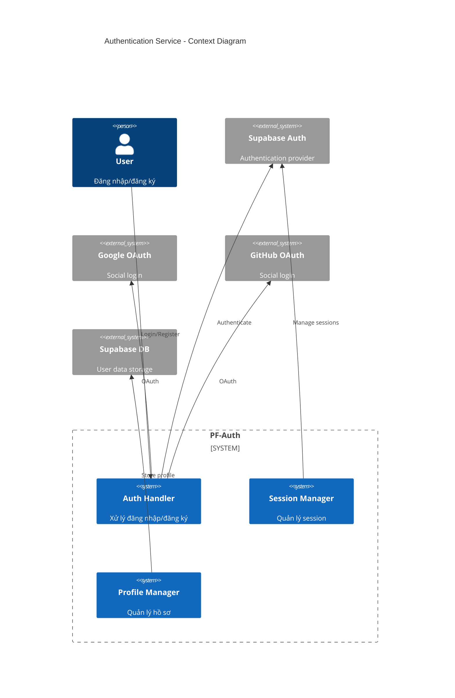
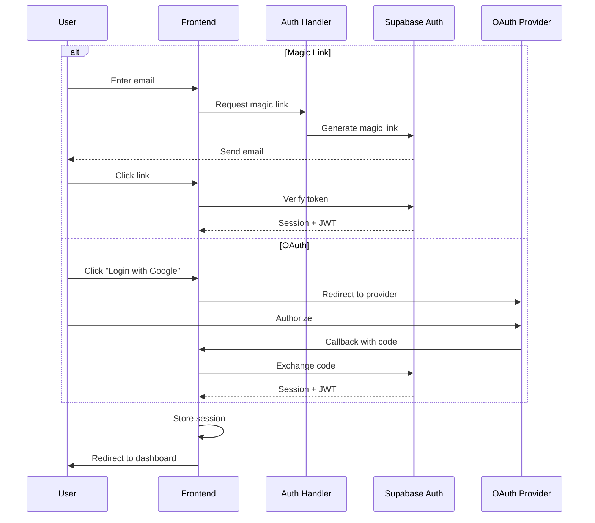
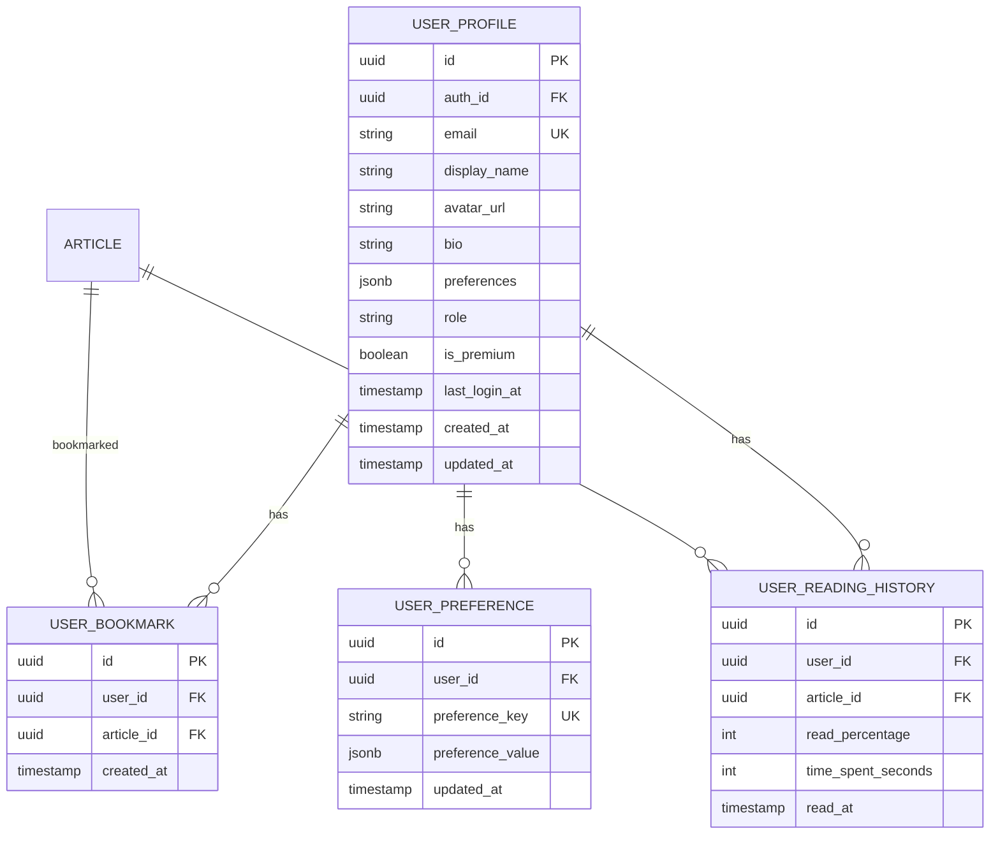
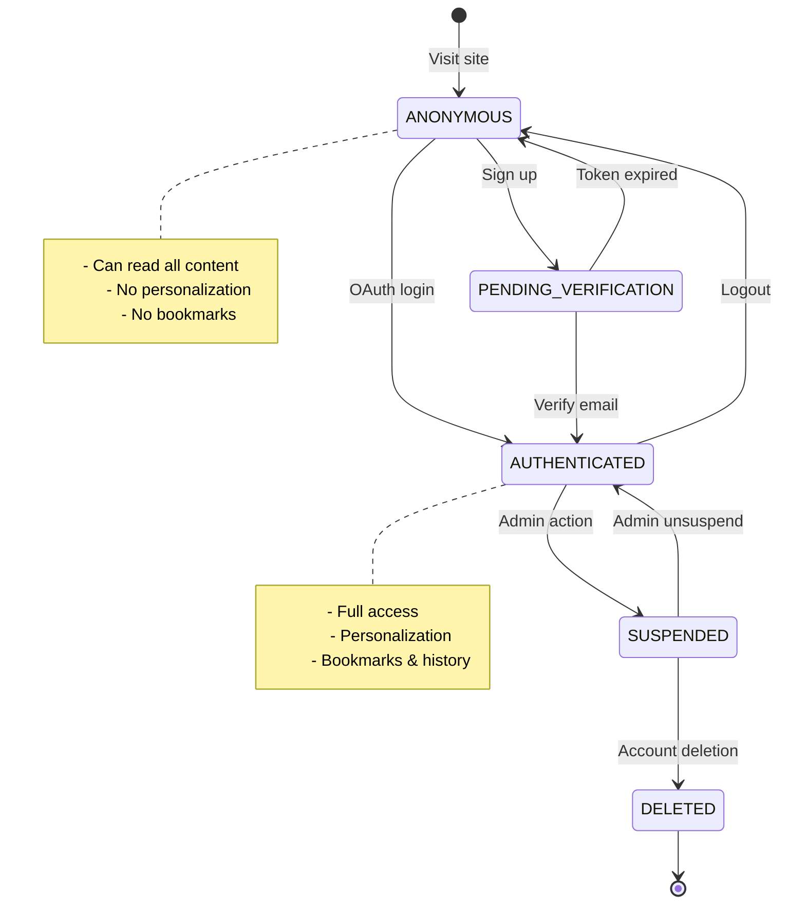

# HLD-PF-AUTH - Xác thực Người dùng

## 1. Bối cảnh

### 1.1 Bối cảnh Nghiệp vụ

**Vấn đề cần giải quyết:**
- Cá nhân hóa trải nghiệm cho người dùng
- Lưu lịch sử đọc và preferences
- Quản lý subscription và bookmarks
- Hỗ trợ tính năng premium trong tương lai

**Lưu ý quan trọng:**
- Authentication là tính năng **tùy chọn** cho MVP
- Website vẫn hoạt động hoàn chỉnh cho anonymous users
- Chỉ bắt buộc cho một số tính năng nâng cao

### 1.2 Bối cảnh Hệ thống

```
┌─────────────────────────────────────────────────────────────────────┐
│                    PF-AUTH SERVICE                                  │
├─────────────────────────────────────────────────────────────────────┤
│                                                                      │
│   ┌──────────────┐    ┌──────────────┐    ┌──────────────┐         │
│   │   Auth       │    │   Session    │    │   Profile    │         │
│   │   Handler    │    │   Manager    │    │   Manager    │         │
│   └──────────────┘    └──────────────┘    └──────────────┘         │
│          │                   │                    │                 │
│          ▼                   ▼                    ▼                 │
│   ┌──────────────┐    ┌──────────────┐    ┌──────────────┐         │
│   │   Supabase   │    │    JWT       │    │  PostgreSQL  │         │
│   │   Auth       │    │   Tokens     │    │   Users      │         │
│   └──────────────┘    └──────────────┘    └──────────────┘         │
│                                                                      │
└─────────────────────────────────────────────────────────────────────┘
```

---

## 2. Context Diagram



---

## 3. Authentication Methods

### 3.1 Supported Methods

| Method | Priority | Use Case |
|--------|----------|----------|
| **Magic Link** | P0 | Primary - passwordless |
| **Google OAuth** | P0 | Quick social login |
| **GitHub OAuth** | P0 | Developer-friendly |
| **Email/Password** | P1 | Traditional fallback |

### 3.2 Authentication Flow



---

## 4. Data Model (ERD)



### 4.1 SQL Schema

```sql
-- User Profiles (extends Supabase auth.users)
CREATE TABLE user_profile (
    id UUID PRIMARY KEY DEFAULT gen_random_uuid(),
    auth_id UUID UNIQUE NOT NULL, -- References auth.users
    email VARCHAR(255) UNIQUE NOT NULL,
    display_name VARCHAR(100),
    avatar_url VARCHAR(500),
    bio TEXT,
    preferences JSONB DEFAULT '{}',
    role VARCHAR(20) DEFAULT 'user', -- user, admin, moderator
    is_premium BOOLEAN DEFAULT false,
    last_login_at TIMESTAMPTZ,
    created_at TIMESTAMPTZ DEFAULT NOW(),
    updated_at TIMESTAMPTZ DEFAULT NOW(),

    CONSTRAINT chk_role CHECK (role IN ('user', 'admin', 'moderator'))
);

CREATE INDEX idx_profile_auth ON user_profile(auth_id);
CREATE INDEX idx_profile_email ON user_profile(email);

-- User Bookmarks
CREATE TABLE user_bookmark (
    id UUID PRIMARY KEY DEFAULT gen_random_uuid(),
    user_id UUID NOT NULL REFERENCES user_profile(id) ON DELETE CASCADE,
    article_id UUID NOT NULL REFERENCES article(id) ON DELETE CASCADE,
    created_at TIMESTAMPTZ DEFAULT NOW(),

    UNIQUE(user_id, article_id)
);

CREATE INDEX idx_bookmark_user ON user_bookmark(user_id);

-- Reading History
CREATE TABLE user_reading_history (
    id UUID PRIMARY KEY DEFAULT gen_random_uuid(),
    user_id UUID NOT NULL REFERENCES user_profile(id) ON DELETE CASCADE,
    article_id UUID NOT NULL REFERENCES article(id) ON DELETE CASCADE,
    read_percentage INTEGER DEFAULT 0,
    time_spent_seconds INTEGER DEFAULT 0,
    read_at TIMESTAMPTZ DEFAULT NOW(),

    UNIQUE(user_id, article_id)
);

CREATE INDEX idx_history_user ON user_reading_history(user_id);
CREATE INDEX idx_history_date ON user_reading_history(read_at DESC);

-- User Preferences
CREATE TABLE user_preference (
    id UUID PRIMARY KEY DEFAULT gen_random_uuid(),
    user_id UUID NOT NULL REFERENCES user_profile(id) ON DELETE CASCADE,
    preference_key VARCHAR(50) NOT NULL,
    preference_value JSONB NOT NULL,
    updated_at TIMESTAMPTZ DEFAULT NOW(),

    UNIQUE(user_id, preference_key)
);

-- RLS Policies
ALTER TABLE user_profile ENABLE ROW LEVEL SECURITY;
ALTER TABLE user_bookmark ENABLE ROW LEVEL SECURITY;
ALTER TABLE user_reading_history ENABLE ROW LEVEL SECURITY;
ALTER TABLE user_preference ENABLE ROW LEVEL SECURITY;

-- Users can only access their own data
CREATE POLICY "Users can view own profile"
    ON user_profile FOR SELECT
    USING (auth.uid() = auth_id);

CREATE POLICY "Users can update own profile"
    ON user_profile FOR UPDATE
    USING (auth.uid() = auth_id);

CREATE POLICY "Users can view own bookmarks"
    ON user_bookmark FOR ALL
    USING (user_id IN (
        SELECT id FROM user_profile WHERE auth_id = auth.uid()
    ));

CREATE POLICY "Users can view own history"
    ON user_reading_history FOR ALL
    USING (user_id IN (
        SELECT id FROM user_profile WHERE auth_id = auth.uid()
    ));
```

---

## 5. State Machine

### 5.1 User States



---

## 6. Authentication Implementation

### 6.1 Supabase Auth Configuration

```typescript
// lib/supabase/client.ts

import { createBrowserClient } from '@supabase/ssr';

export function createClient() {
  return createBrowserClient(
    process.env.NEXT_PUBLIC_SUPABASE_URL!,
    process.env.NEXT_PUBLIC_SUPABASE_ANON_KEY!
  );
}
```

```typescript
// lib/supabase/server.ts

import { createServerClient, type CookieOptions } from '@supabase/ssr';
import { cookies } from 'next/headers';

export function createClient() {
  const cookieStore = cookies();

  return createServerClient(
    process.env.NEXT_PUBLIC_SUPABASE_URL!,
    process.env.NEXT_PUBLIC_SUPABASE_ANON_KEY!,
    {
      cookies: {
        get(name: string) {
          return cookieStore.get(name)?.value;
        },
        set(name: string, value: string, options: CookieOptions) {
          try {
            cookieStore.set({ name, value, ...options });
          } catch (error) {
            // Handle in middleware
          }
        },
        remove(name: string, options: CookieOptions) {
          try {
            cookieStore.set({ name, value: '', ...options });
          } catch (error) {
            // Handle in middleware
          }
        },
      },
    }
  );
}
```

### 6.2 Auth Handler

```typescript
// lib/auth/handler.ts

import { createClient } from '@/lib/supabase/client';

export class AuthHandler {
  private supabase = createClient();

  /**
   * Sign up with magic link
   */
  async signUpWithMagicLink(email: string): Promise<AuthResult> {
    const { error } = await this.supabase.auth.signInWithOtp({
      email,
      options: {
        emailRedirectTo: `${window.location.origin}/auth/callback`,
      },
    });

    if (error) {
      return { success: false, error: error.message };
    }

    return {
      success: true,
      message: 'Check your email for the login link',
    };
  }

  /**
   * Sign in with Google OAuth
   */
  async signInWithGoogle(): Promise<void> {
    await this.supabase.auth.signInWithOAuth({
      provider: 'google',
      options: {
        redirectTo: `${window.location.origin}/auth/callback`,
      },
    });
  }

  /**
   * Sign in with GitHub OAuth
   */
  async signInWithGitHub(): Promise<void> {
    await this.supabase.auth.signInWithOAuth({
      provider: 'github',
      options: {
        redirectTo: `${window.location.origin}/auth/callback`,
        scopes: 'read:user user:email',
      },
    });
  }

  /**
   * Sign in with email and password
   */
  async signInWithPassword(
    email: string,
    password: string
  ): Promise<AuthResult> {
    const { data, error } = await this.supabase.auth.signInWithPassword({
      email,
      password,
    });

    if (error) {
      return { success: false, error: error.message };
    }

    return { success: true, user: data.user };
  }

  /**
   * Sign up with email and password
   */
  async signUpWithPassword(
    email: string,
    password: string,
    displayName?: string
  ): Promise<AuthResult> {
    const { data, error } = await this.supabase.auth.signUp({
      email,
      password,
      options: {
        emailRedirectTo: `${window.location.origin}/auth/callback`,
        data: {
          display_name: displayName,
        },
      },
    });

    if (error) {
      return { success: false, error: error.message };
    }

    return {
      success: true,
      user: data.user,
      message: 'Please check your email to verify your account',
    };
  }

  /**
   * Sign out
   */
  async signOut(): Promise<void> {
    await this.supabase.auth.signOut();
  }

  /**
   * Get current user
   */
  async getUser() {
    const { data: { user } } = await this.supabase.auth.getUser();
    return user;
  }

  /**
   * Get session
   */
  async getSession() {
    const { data: { session } } = await this.supabase.auth.getSession();
    return session;
  }

  /**
   * Refresh session
   */
  async refreshSession() {
    const { data, error } = await this.supabase.auth.refreshSession();
    return { session: data.session, error };
  }
}

interface AuthResult {
  success: boolean;
  user?: any;
  message?: string;
  error?: string;
}
```

### 6.3 Auth Callback Handler

```typescript
// app/auth/callback/route.ts

import { NextResponse } from 'next/server';
import { createClient } from '@/lib/supabase/server';

export async function GET(request: Request) {
  const { searchParams, origin } = new URL(request.url);
  const code = searchParams.get('code');
  const next = searchParams.get('next') ?? '/';

  if (code) {
    const supabase = createClient();
    const { error } = await supabase.auth.exchangeCodeForSession(code);

    if (!error) {
      // Create or update user profile
      const { data: { user } } = await supabase.auth.getUser();

      if (user) {
        await supabase.from('user_profile').upsert({
          auth_id: user.id,
          email: user.email!,
          display_name: user.user_metadata.full_name || user.user_metadata.name,
          avatar_url: user.user_metadata.avatar_url,
          last_login_at: new Date().toISOString(),
        }, {
          onConflict: 'auth_id',
        });
      }

      return NextResponse.redirect(`${origin}${next}`);
    }
  }

  // Return the user to an error page with instructions
  return NextResponse.redirect(`${origin}/auth/error`);
}
```

### 6.4 Middleware for Protected Routes

```typescript
// middleware.ts

import { createServerClient, type CookieOptions } from '@supabase/ssr';
import { NextResponse, type NextRequest } from 'next/server';

export async function middleware(request: NextRequest) {
  let response = NextResponse.next({
    request: {
      headers: request.headers,
    },
  });

  const supabase = createServerClient(
    process.env.NEXT_PUBLIC_SUPABASE_URL!,
    process.env.NEXT_PUBLIC_SUPABASE_ANON_KEY!,
    {
      cookies: {
        get(name: string) {
          return request.cookies.get(name)?.value;
        },
        set(name: string, value: string, options: CookieOptions) {
          request.cookies.set({ name, value, ...options });
          response = NextResponse.next({
            request: { headers: request.headers },
          });
          response.cookies.set({ name, value, ...options });
        },
        remove(name: string, options: CookieOptions) {
          request.cookies.set({ name, value: '', ...options });
          response = NextResponse.next({
            request: { headers: request.headers },
          });
          response.cookies.set({ name, value: '', ...options });
        },
      },
    }
  );

  const { data: { user } } = await supabase.auth.getUser();

  // Protected routes
  const protectedPaths = ['/dashboard', '/bookmarks', '/settings'];
  const isProtectedPath = protectedPaths.some(path =>
    request.nextUrl.pathname.startsWith(path)
  );

  if (isProtectedPath && !user) {
    const redirectUrl = new URL('/auth/login', request.url);
    redirectUrl.searchParams.set('next', request.nextUrl.pathname);
    return NextResponse.redirect(redirectUrl);
  }

  // Admin routes
  if (request.nextUrl.pathname.startsWith('/admin')) {
    if (!user) {
      return NextResponse.redirect(new URL('/auth/login', request.url));
    }

    // Check admin role
    const { data: profile } = await supabase
      .from('user_profile')
      .select('role')
      .eq('auth_id', user.id)
      .single();

    if (profile?.role !== 'admin') {
      return NextResponse.redirect(new URL('/', request.url));
    }
  }

  return response;
}

export const config = {
  matcher: [
    '/dashboard/:path*',
    '/bookmarks/:path*',
    '/settings/:path*',
    '/admin/:path*',
  ],
};
```

---

## 7. Profile Management

### 7.1 Profile Service

```typescript
// lib/auth/profile.ts

import { createClient } from '@/lib/supabase/client';

export class ProfileService {
  private supabase = createClient();

  /**
   * Get user profile
   */
  async getProfile(userId: string): Promise<UserProfile | null> {
    const { data } = await this.supabase
      .from('user_profile')
      .select('*')
      .eq('auth_id', userId)
      .single();

    return data;
  }

  /**
   * Update profile
   */
  async updateProfile(
    userId: string,
    updates: ProfileUpdate
  ): Promise<UserProfile> {
    const { data, error } = await this.supabase
      .from('user_profile')
      .update({
        display_name: updates.displayName,
        bio: updates.bio,
        avatar_url: updates.avatarUrl,
        updated_at: new Date().toISOString(),
      })
      .eq('auth_id', userId)
      .select()
      .single();

    if (error) throw error;

    return data;
  }

  /**
   * Update preferences
   */
  async updatePreference(
    userId: string,
    key: string,
    value: any
  ): Promise<void> {
    const { data: profile } = await this.supabase
      .from('user_profile')
      .select('id')
      .eq('auth_id', userId)
      .single();

    if (!profile) throw new Error('Profile not found');

    await this.supabase
      .from('user_preference')
      .upsert({
        user_id: profile.id,
        preference_key: key,
        preference_value: value,
        updated_at: new Date().toISOString(),
      }, {
        onConflict: 'user_id,preference_key',
      });
  }

  /**
   * Get all preferences
   */
  async getPreferences(userId: string): Promise<Record<string, any>> {
    const { data: profile } = await this.supabase
      .from('user_profile')
      .select('id')
      .eq('auth_id', userId)
      .single();

    if (!profile) return {};

    const { data } = await this.supabase
      .from('user_preference')
      .select('preference_key, preference_value')
      .eq('user_id', profile.id);

    const prefs: Record<string, any> = {};
    for (const pref of data || []) {
      prefs[pref.preference_key] = pref.preference_value;
    }

    return prefs;
  }

  /**
   * Delete account
   */
  async deleteAccount(userId: string): Promise<void> {
    // Delete profile (cascades to related tables)
    await this.supabase
      .from('user_profile')
      .delete()
      .eq('auth_id', userId);

    // Note: Supabase auth user deletion should be handled separately
    // via admin API or user self-deletion
  }
}

interface UserProfile {
  id: string;
  auth_id: string;
  email: string;
  display_name: string | null;
  avatar_url: string | null;
  bio: string | null;
  preferences: Record<string, any>;
  role: string;
  is_premium: boolean;
  created_at: string;
}

interface ProfileUpdate {
  displayName?: string;
  bio?: string;
  avatarUrl?: string;
}
```

---

## 8. Bookmarks & Reading History

### 8.1 Bookmark Service

```typescript
// lib/auth/bookmarks.ts

import { createClient } from '@/lib/supabase/client';

export class BookmarkService {
  private supabase = createClient();

  /**
   * Toggle bookmark
   */
  async toggleBookmark(userId: string, articleId: string): Promise<boolean> {
    const { data: profile } = await this.supabase
      .from('user_profile')
      .select('id')
      .eq('auth_id', userId)
      .single();

    if (!profile) throw new Error('Profile not found');

    // Check if already bookmarked
    const { data: existing } = await this.supabase
      .from('user_bookmark')
      .select('id')
      .eq('user_id', profile.id)
      .eq('article_id', articleId)
      .single();

    if (existing) {
      // Remove bookmark
      await this.supabase
        .from('user_bookmark')
        .delete()
        .eq('id', existing.id);

      return false;
    } else {
      // Add bookmark
      await this.supabase
        .from('user_bookmark')
        .insert({
          user_id: profile.id,
          article_id: articleId,
        });

      return true;
    }
  }

  /**
   * Get user bookmarks
   */
  async getBookmarks(
    userId: string,
    options: { limit?: number; offset?: number } = {}
  ): Promise<BookmarkedArticle[]> {
    const { limit = 20, offset = 0 } = options;

    const { data: profile } = await this.supabase
      .from('user_profile')
      .select('id')
      .eq('auth_id', userId)
      .single();

    if (!profile) return [];

    const { data } = await this.supabase
      .from('user_bookmark')
      .select(`
        created_at,
        article:article_id (
          id,
          title_vi,
          summary_vi,
          original_image_url,
          published_at,
          category:category_id (name)
        )
      `)
      .eq('user_id', profile.id)
      .order('created_at', { ascending: false })
      .range(offset, offset + limit - 1);

    return data || [];
  }

  /**
   * Check if article is bookmarked
   */
  async isBookmarked(userId: string, articleId: string): Promise<boolean> {
    const { data: profile } = await this.supabase
      .from('user_profile')
      .select('id')
      .eq('auth_id', userId)
      .single();

    if (!profile) return false;

    const { count } = await this.supabase
      .from('user_bookmark')
      .select('*', { count: 'exact', head: true })
      .eq('user_id', profile.id)
      .eq('article_id', articleId);

    return (count || 0) > 0;
  }
}

interface BookmarkedArticle {
  created_at: string;
  article: {
    id: string;
    title_vi: string;
    summary_vi: string;
    original_image_url: string;
    published_at: string;
    category: { name: string };
  };
}
```

### 8.2 Reading History Service

```typescript
// lib/auth/reading-history.ts

import { createClient } from '@/lib/supabase/client';

export class ReadingHistoryService {
  private supabase = createClient();

  /**
   * Record reading progress
   */
  async recordProgress(
    userId: string,
    articleId: string,
    progress: ReadingProgress
  ): Promise<void> {
    const { data: profile } = await this.supabase
      .from('user_profile')
      .select('id')
      .eq('auth_id', userId)
      .single();

    if (!profile) return;

    await this.supabase
      .from('user_reading_history')
      .upsert({
        user_id: profile.id,
        article_id: articleId,
        read_percentage: progress.percentage,
        time_spent_seconds: progress.timeSpent,
        read_at: new Date().toISOString(),
      }, {
        onConflict: 'user_id,article_id',
      });
  }

  /**
   * Get reading history
   */
  async getHistory(
    userId: string,
    options: { limit?: number; offset?: number } = {}
  ): Promise<ReadingHistoryItem[]> {
    const { limit = 20, offset = 0 } = options;

    const { data: profile } = await this.supabase
      .from('user_profile')
      .select('id')
      .eq('auth_id', userId)
      .single();

    if (!profile) return [];

    const { data } = await this.supabase
      .from('user_reading_history')
      .select(`
        read_at,
        read_percentage,
        time_spent_seconds,
        article:article_id (
          id,
          title_vi,
          summary_vi,
          original_image_url
        )
      `)
      .eq('user_id', profile.id)
      .order('read_at', { ascending: false })
      .range(offset, offset + limit - 1);

    return data || [];
  }

  /**
   * Clear reading history
   */
  async clearHistory(userId: string): Promise<void> {
    const { data: profile } = await this.supabase
      .from('user_profile')
      .select('id')
      .eq('auth_id', userId)
      .single();

    if (!profile) return;

    await this.supabase
      .from('user_reading_history')
      .delete()
      .eq('user_id', profile.id);
  }
}

interface ReadingProgress {
  percentage: number;
  timeSpent: number;
}

interface ReadingHistoryItem {
  read_at: string;
  read_percentage: number;
  time_spent_seconds: number;
  article: {
    id: string;
    title_vi: string;
    summary_vi: string;
    original_image_url: string;
  };
}
```

---

## 9. Frontend Components

### 9.1 Login Form

```typescript
// components/auth/login-form.tsx

'use client';

import { useState } from 'react';
import { AuthHandler } from '@/lib/auth/handler';
import { Button } from '@/components/ui/button';
import { Input } from '@/components/ui/input';
import { Icons } from '@/components/icons';

const authHandler = new AuthHandler();

export function LoginForm() {
  const [email, setEmail] = useState('');
  const [loading, setLoading] = useState(false);
  const [message, setMessage] = useState('');

  async function handleMagicLink(e: React.FormEvent) {
    e.preventDefault();
    setLoading(true);

    const result = await authHandler.signUpWithMagicLink(email);

    if (result.success) {
      setMessage(result.message || 'Check your email!');
    } else {
      setMessage(result.error || 'Something went wrong');
    }

    setLoading(false);
  }

  return (
    <div className="space-y-6">
      <div className="space-y-2 text-center">
        <h1 className="text-2xl font-bold">Đăng nhập</h1>
        <p className="text-muted-foreground">
          Chọn phương thức đăng nhập
        </p>
      </div>

      {/* Social Login */}
      <div className="grid gap-2">
        <Button
          variant="outline"
          onClick={() => authHandler.signInWithGoogle()}
          className="w-full"
        >
          <Icons.google className="mr-2 h-4 w-4" />
          Đăng nhập với Google
        </Button>

        <Button
          variant="outline"
          onClick={() => authHandler.signInWithGitHub()}
          className="w-full"
        >
          <Icons.gitHub className="mr-2 h-4 w-4" />
          Đăng nhập với GitHub
        </Button>
      </div>

      <div className="relative">
        <div className="absolute inset-0 flex items-center">
          <span className="w-full border-t" />
        </div>
        <div className="relative flex justify-center text-xs uppercase">
          <span className="bg-background px-2 text-muted-foreground">
            Hoặc
          </span>
        </div>
      </div>

      {/* Magic Link */}
      <form onSubmit={handleMagicLink} className="space-y-4">
        <Input
          type="email"
          placeholder="Email của bạn"
          value={email}
          onChange={(e) => setEmail(e.target.value)}
          required
        />

        <Button type="submit" className="w-full" disabled={loading}>
          {loading ? 'Đang gửi...' : 'Gửi link đăng nhập'}
        </Button>
      </form>

      {message && (
        <p className="text-center text-sm text-muted-foreground">
          {message}
        </p>
      )}
    </div>
  );
}
```

### 9.2 User Menu

```typescript
// components/auth/user-menu.tsx

'use client';

import { useEffect, useState } from 'react';
import { User } from '@supabase/supabase-js';
import { AuthHandler } from '@/lib/auth/handler';
import {
  DropdownMenu,
  DropdownMenuContent,
  DropdownMenuItem,
  DropdownMenuSeparator,
  DropdownMenuTrigger,
} from '@/components/ui/dropdown-menu';
import { Avatar, AvatarFallback, AvatarImage } from '@/components/ui/avatar';
import { Button } from '@/components/ui/button';
import Link from 'next/link';

const authHandler = new AuthHandler();

export function UserMenu() {
  const [user, setUser] = useState<User | null>(null);
  const [loading, setLoading] = useState(true);

  useEffect(() => {
    authHandler.getUser().then(setUser).finally(() => setLoading(false));
  }, []);

  if (loading) {
    return <div className="w-8 h-8 rounded-full bg-muted animate-pulse" />;
  }

  if (!user) {
    return (
      <Link href="/auth/login">
        <Button variant="outline" size="sm">
          Đăng nhập
        </Button>
      </Link>
    );
  }

  const initials = user.user_metadata?.full_name
    ?.split(' ')
    .map((n: string) => n[0])
    .join('')
    .toUpperCase() || user.email?.[0].toUpperCase();

  return (
    <DropdownMenu>
      <DropdownMenuTrigger asChild>
        <Button variant="ghost" className="relative h-8 w-8 rounded-full">
          <Avatar className="h-8 w-8">
            <AvatarImage
              src={user.user_metadata?.avatar_url}
              alt={user.user_metadata?.full_name}
            />
            <AvatarFallback>{initials}</AvatarFallback>
          </Avatar>
        </Button>
      </DropdownMenuTrigger>

      <DropdownMenuContent className="w-56" align="end">
        <div className="flex items-center justify-start gap-2 p-2">
          <div className="flex flex-col space-y-1 leading-none">
            <p className="font-medium">
              {user.user_metadata?.full_name || 'User'}
            </p>
            <p className="text-xs text-muted-foreground">
              {user.email}
            </p>
          </div>
        </div>

        <DropdownMenuSeparator />

        <DropdownMenuItem asChild>
          <Link href="/bookmarks">Bài đã lưu</Link>
        </DropdownMenuItem>

        <DropdownMenuItem asChild>
          <Link href="/settings">Cài đặt</Link>
        </DropdownMenuItem>

        <DropdownMenuSeparator />

        <DropdownMenuItem
          className="text-red-600"
          onClick={() => authHandler.signOut()}
        >
          Đăng xuất
        </DropdownMenuItem>
      </DropdownMenuContent>
    </DropdownMenu>
  );
}
```

---

## 10. Event Architecture

### 10.1 Events

| Event | Trigger | Payload | Consumers |
|-------|---------|---------|-----------|
| `UserSignedUp` | Đăng ký mới | `{ userId, email, method }` | Welcome email, Analytics |
| `UserLoggedIn` | Đăng nhập | `{ userId, method }` | Session, Analytics |
| `UserLoggedOut` | Đăng xuất | `{ userId }` | Session cleanup |
| `ProfileUpdated` | Cập nhật profile | `{ userId, changes }` | Cache invalidation |
| `ArticleBookmarked` | Lưu bài viết | `{ userId, articleId }` | Recommendations |
| `ArticleRead` | Đọc bài viết | `{ userId, articleId }` | History, Recommendations |

---

## 11. Security Considerations

### 11.1 Best Practices

```typescript
// Security measures implemented:

// 1. Row Level Security (RLS) - Users can only access their own data
// 2. JWT validation via Supabase middleware
// 3. PKCE flow for OAuth (prevents CSRF)
// 4. Secure cookie handling (httpOnly, sameSite, secure)
// 5. Rate limiting on auth endpoints

// Rate limiting configuration
export const AUTH_RATE_LIMITS = {
  login: { requests: 5, window: '15 minutes' },
  signup: { requests: 3, window: '1 hour' },
  passwordReset: { requests: 3, window: '1 hour' },
  magicLink: { requests: 5, window: '15 minutes' },
};
```

### 11.2 Session Management

```typescript
// Session configuration
export const SESSION_CONFIG = {
  // Session expires after 7 days of inactivity
  maxAge: 7 * 24 * 60 * 60, // 7 days in seconds

  // Refresh session if less than 1 day remaining
  refreshThreshold: 24 * 60 * 60, // 1 day in seconds

  // Secure cookie settings
  cookie: {
    httpOnly: true,
    secure: process.env.NODE_ENV === 'production',
    sameSite: 'lax' as const,
    path: '/',
  },
};
```

---

## 12. Appendix

### A. Environment Variables

```bash
# Supabase
NEXT_PUBLIC_SUPABASE_URL=https://xxx.supabase.co
NEXT_PUBLIC_SUPABASE_ANON_KEY=eyJxxx
SUPABASE_SERVICE_ROLE_KEY=eyJxxx  # Server-side only

# OAuth Providers (configured in Supabase Dashboard)
# GOOGLE_CLIENT_ID and GITHUB_CLIENT_ID are set in Supabase
```

### B. Supabase Dashboard Configuration

1. **Authentication > Providers**
   - Enable Email (Magic Link)
   - Enable Google OAuth
   - Enable GitHub OAuth

2. **Authentication > URL Configuration**
   - Site URL: `https://kynguyenai.vn`
   - Redirect URLs: `https://kynguyenai.vn/auth/callback`

3. **Authentication > Email Templates**
   - Customize magic link email with KynguyenAI branding

### C. Protected vs Public Routes

| Route | Auth Required | Description |
|-------|---------------|-------------|
| `/` | No | Homepage - công khai |
| `/article/*` | No | Đọc bài viết - công khai |
| `/auth/*` | No | Đăng nhập/đăng ký |
| `/bookmarks` | Yes | Bài đã lưu |
| `/settings` | Yes | Cài đặt tài khoản |
| `/admin/*` | Yes (Admin) | Quản trị |
