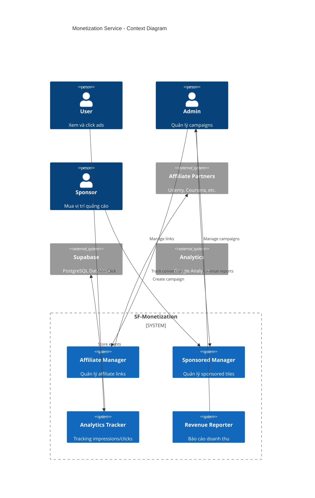
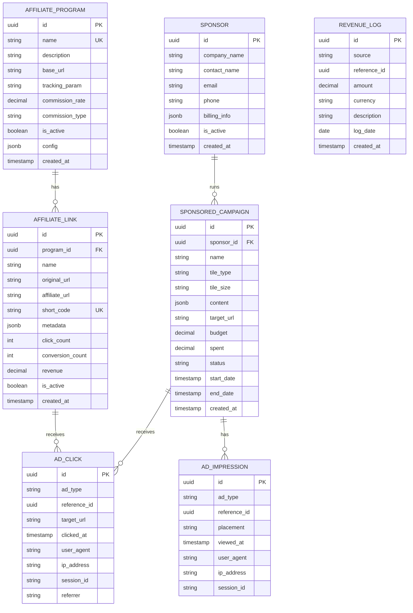
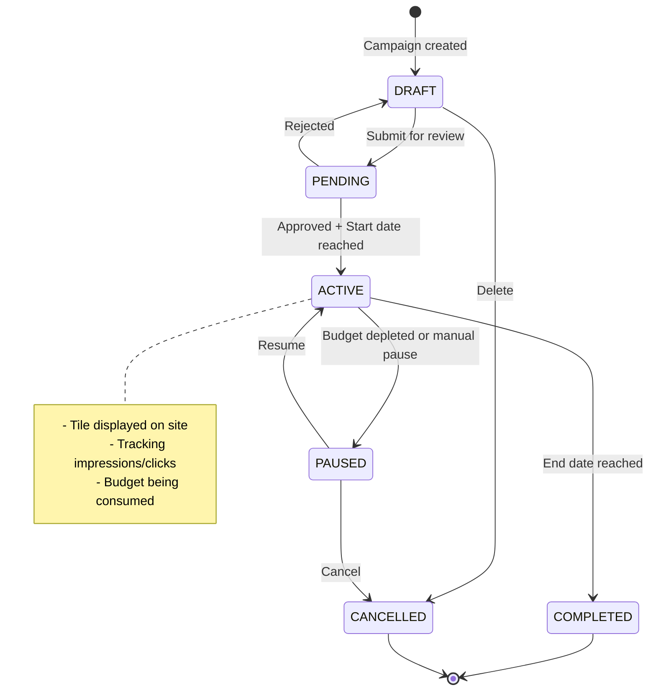

# HLD-SF-MONETIZATION - Kiếm tiền (Affiliate & Sponsored)

## 1. Bối cảnh

### 1.1 Bối cảnh Nghiệp vụ

**Mô hình kinh doanh của KynguyenAI.vn:**
- **Affiliate Marketing (40%)**: Liên kết tiếp thị khóa học, công cụ
- **Sponsored Tiles (35%)**: Bán vị trí trên Bento Grid
- **Data-as-a-Service (25%)**: API tin tức cho doanh nghiệp (tương lai)

**Nguyên tắc:**
- Native Ads: Quảng cáo hòa nhập với nội dung
- Không intrusive: Không popup, không video tự phát
- Minh bạch: Luôn đánh dấu nội dung tài trợ

### 1.2 Bối cảnh Hệ thống

```
┌─────────────────────────────────────────────────────────────────────┐
│                    SF-MONETIZATION SERVICE                          │
├─────────────────────────────────────────────────────────────────────┤
│                                                                      │
│   ┌──────────────┐    ┌──────────────┐    ┌──────────────┐         │
│   │  Affiliate   │    │  Sponsored   │    │  Analytics   │         │
│   │   Manager    │    │   Manager    │    │   Tracker    │         │
│   └──────────────┘    └──────────────┘    └──────────────┘         │
│          │                   │                    │                 │
│          ▼                   ▼                    ▼                 │
│   ┌──────────────┐    ┌──────────────┐    ┌──────────────┐         │
│   │  Affiliate   │    │  Sponsors    │    │  Revenue     │         │
│   │  Programs    │    │  Campaigns   │    │  Reports     │         │
│   └──────────────┘    └──────────────┘    └──────────────┘         │
│                                                                      │
└─────────────────────────────────────────────────────────────────────┘
```

---

## 2. Context Diagram



---

## 3. Data Model (ERD)



### 3.1 SQL Schema

```sql
-- Affiliate Programs (partners like Udemy, Coursera)
CREATE TABLE affiliate_program (
    id UUID PRIMARY KEY DEFAULT gen_random_uuid(),
    name VARCHAR(100) UNIQUE NOT NULL,
    description TEXT,
    base_url VARCHAR(500),
    tracking_param VARCHAR(50) DEFAULT 'ref',
    commission_rate DECIMAL(5, 2) DEFAULT 0, -- e.g., 10.00 for 10%
    commission_type VARCHAR(20) DEFAULT 'PERCENTAGE', -- PERCENTAGE, FIXED
    is_active BOOLEAN DEFAULT true,
    config JSONB DEFAULT '{}',
    created_at TIMESTAMPTZ DEFAULT NOW(),
    updated_at TIMESTAMPTZ DEFAULT NOW()
);

-- Affiliate Links
CREATE TABLE affiliate_link (
    id UUID PRIMARY KEY DEFAULT gen_random_uuid(),
    program_id UUID NOT NULL REFERENCES affiliate_program(id),
    name VARCHAR(200) NOT NULL,
    original_url VARCHAR(1000) NOT NULL,
    affiliate_url VARCHAR(1000) NOT NULL,
    short_code VARCHAR(20) UNIQUE NOT NULL,
    metadata JSONB DEFAULT '{}', -- related article, category, etc.
    click_count INTEGER DEFAULT 0,
    conversion_count INTEGER DEFAULT 0,
    revenue DECIMAL(10, 2) DEFAULT 0,
    is_active BOOLEAN DEFAULT true,
    created_at TIMESTAMPTZ DEFAULT NOW(),
    updated_at TIMESTAMPTZ DEFAULT NOW()
);

CREATE INDEX idx_affiliate_link_code ON affiliate_link(short_code);
CREATE INDEX idx_affiliate_link_program ON affiliate_link(program_id);

-- Sponsors
CREATE TABLE sponsor (
    id UUID PRIMARY KEY DEFAULT gen_random_uuid(),
    company_name VARCHAR(200) NOT NULL,
    contact_name VARCHAR(100),
    email VARCHAR(255) NOT NULL,
    phone VARCHAR(20),
    billing_info JSONB DEFAULT '{}',
    is_active BOOLEAN DEFAULT true,
    created_at TIMESTAMPTZ DEFAULT NOW(),
    updated_at TIMESTAMPTZ DEFAULT NOW()
);

-- Sponsored Campaigns
CREATE TABLE sponsored_campaign (
    id UUID PRIMARY KEY DEFAULT gen_random_uuid(),
    sponsor_id UUID NOT NULL REFERENCES sponsor(id),
    name VARCHAR(200) NOT NULL,
    tile_type VARCHAR(50) NOT NULL, -- 'job', 'course', 'product', 'banner'
    tile_size VARCHAR(20) DEFAULT 'medium', -- 'small', 'medium', 'large'
    content JSONB NOT NULL, -- title, description, image, cta
    target_url VARCHAR(1000) NOT NULL,
    budget DECIMAL(10, 2) DEFAULT 0,
    spent DECIMAL(10, 2) DEFAULT 0,
    status VARCHAR(20) DEFAULT 'DRAFT',
    start_date TIMESTAMPTZ,
    end_date TIMESTAMPTZ,
    created_at TIMESTAMPTZ DEFAULT NOW(),
    updated_at TIMESTAMPTZ DEFAULT NOW(),

    CONSTRAINT chk_campaign_status CHECK (status IN (
        'DRAFT', 'PENDING', 'ACTIVE', 'PAUSED', 'COMPLETED', 'CANCELLED'
    ))
);

CREATE INDEX idx_campaign_status ON sponsored_campaign(status);
CREATE INDEX idx_campaign_dates ON sponsored_campaign(start_date, end_date);

-- Ad Impressions
CREATE TABLE ad_impression (
    id UUID PRIMARY KEY DEFAULT gen_random_uuid(),
    ad_type VARCHAR(20) NOT NULL, -- 'affiliate', 'sponsored'
    reference_id UUID NOT NULL,
    placement VARCHAR(50), -- 'homepage', 'article', 'sidebar'
    viewed_at TIMESTAMPTZ DEFAULT NOW(),
    user_agent TEXT,
    ip_address INET,
    session_id VARCHAR(64)
);

CREATE INDEX idx_impression_type ON ad_impression(ad_type, reference_id);
CREATE INDEX idx_impression_date ON ad_impression(viewed_at);

-- Ad Clicks
CREATE TABLE ad_click (
    id UUID PRIMARY KEY DEFAULT gen_random_uuid(),
    ad_type VARCHAR(20) NOT NULL,
    reference_id UUID NOT NULL,
    target_url VARCHAR(1000),
    clicked_at TIMESTAMPTZ DEFAULT NOW(),
    user_agent TEXT,
    ip_address INET,
    session_id VARCHAR(64),
    referrer VARCHAR(1000)
);

CREATE INDEX idx_click_type ON ad_click(ad_type, reference_id);
CREATE INDEX idx_click_date ON ad_click(clicked_at);

-- Revenue Log
CREATE TABLE revenue_log (
    id UUID PRIMARY KEY DEFAULT gen_random_uuid(),
    source VARCHAR(50) NOT NULL, -- 'affiliate', 'sponsored', 'api'
    reference_id UUID,
    amount DECIMAL(10, 2) NOT NULL,
    currency VARCHAR(3) DEFAULT 'USD',
    description TEXT,
    log_date DATE NOT NULL,
    created_at TIMESTAMPTZ DEFAULT NOW()
);

CREATE INDEX idx_revenue_source ON revenue_log(source);
CREATE INDEX idx_revenue_date ON revenue_log(log_date);
```

---

## 4. Affiliate Marketing

### 4.1 Affiliate Programs Configuration

```typescript
// lib/monetization/affiliate-programs.ts

export const AFFILIATE_PROGRAMS = {
  udemy: {
    name: 'Udemy',
    baseUrl: 'https://www.udemy.com',
    trackingParam: 'referralCode',
    affiliateId: process.env.UDEMY_AFFILIATE_ID,
    commissionRate: 15, // 15%
    commissionType: 'PERCENTAGE',
    categories: ['programming', 'web-development', 'data-science'],
  },

  coursera: {
    name: 'Coursera',
    baseUrl: 'https://www.coursera.org',
    trackingParam: 'utm_source',
    affiliateId: process.env.COURSERA_AFFILIATE_ID,
    commissionRate: 10,
    commissionType: 'PERCENTAGE',
    categories: ['ai-ml', 'cloud', 'devops'],
  },

  digitalocean: {
    name: 'DigitalOcean',
    baseUrl: 'https://www.digitalocean.com',
    trackingParam: 'refcode',
    affiliateId: process.env.DO_AFFILIATE_ID,
    commissionRate: 200, // $200 per signup
    commissionType: 'FIXED',
    categories: ['cloud', 'hosting', 'devops'],
  },

  vercel: {
    name: 'Vercel',
    baseUrl: 'https://vercel.com',
    trackingParam: 'ref',
    affiliateId: process.env.VERCEL_AFFILIATE_ID,
    commissionRate: 50,
    commissionType: 'FIXED',
    categories: ['hosting', 'frontend', 'nextjs'],
  },
};

export type AffiliateProgramKey = keyof typeof AFFILIATE_PROGRAMS;
```

### 4.2 Affiliate Link Manager

```typescript
// lib/monetization/affiliate-manager.ts

import { supabase } from '@/lib/supabase';
import { AFFILIATE_PROGRAMS, AffiliateProgramKey } from './affiliate-programs';
import { nanoid } from 'nanoid';

export class AffiliateManager {
  /**
   * Create affiliate link
   */
  async createLink(
    programKey: AffiliateProgramKey,
    originalUrl: string,
    name: string,
    metadata?: Record<string, any>
  ): Promise<AffiliateLink> {
    const program = AFFILIATE_PROGRAMS[programKey];
    if (!program) {
      throw new Error(`Unknown affiliate program: ${programKey}`);
    }

    // Build affiliate URL
    const url = new URL(originalUrl);
    url.searchParams.set(program.trackingParam, program.affiliateId!);
    const affiliateUrl = url.toString();

    // Generate short code
    const shortCode = nanoid(8);

    // Get or create program in DB
    const { data: dbProgram } = await supabase
      .from('affiliate_program')
      .upsert({
        name: program.name,
        base_url: program.baseUrl,
        tracking_param: program.trackingParam,
        commission_rate: program.commissionRate,
        commission_type: program.commissionType,
      }, { onConflict: 'name' })
      .select('id')
      .single();

    // Create link
    const { data: link, error } = await supabase
      .from('affiliate_link')
      .insert({
        program_id: dbProgram!.id,
        name,
        original_url: originalUrl,
        affiliate_url: affiliateUrl,
        short_code: shortCode,
        metadata: metadata || {},
      })
      .select('*')
      .single();

    if (error) throw error;

    return link;
  }

  /**
   * Get link by short code
   */
  async getLinkByCode(shortCode: string): Promise<AffiliateLink | null> {
    const { data } = await supabase
      .from('affiliate_link')
      .select('*, affiliate_program(*)')
      .eq('short_code', shortCode)
      .eq('is_active', true)
      .single();

    return data;
  }

  /**
   * Track click
   */
  async trackClick(
    shortCode: string,
    context: ClickContext
  ): Promise<string | null> {
    const link = await this.getLinkByCode(shortCode);
    if (!link) return null;

    // Record click
    await supabase.from('ad_click').insert({
      ad_type: 'affiliate',
      reference_id: link.id,
      target_url: link.affiliate_url,
      user_agent: context.userAgent,
      ip_address: context.ipAddress,
      session_id: context.sessionId,
      referrer: context.referrer,
    });

    // Increment click count
    await supabase.rpc('increment_affiliate_clicks', {
      p_link_id: link.id,
    });

    return link.affiliate_url;
  }

  /**
   * Get recommended affiliate links for an article
   */
  async getRecommendedLinks(
    category: string,
    limit: number = 3
  ): Promise<AffiliateLink[]> {
    // Find links that match the category
    const { data } = await supabase
      .from('affiliate_link')
      .select('*, affiliate_program(*)')
      .eq('is_active', true)
      .contains('metadata', { category })
      .order('click_count', { ascending: false })
      .limit(limit);

    return data || [];
  }

  /**
   * Record conversion (called by webhook from affiliate partner)
   */
  async recordConversion(
    shortCode: string,
    amount: number,
    orderId?: string
  ): Promise<void> {
    const link = await this.getLinkByCode(shortCode);
    if (!link) return;

    // Calculate commission
    const program = link.affiliate_program;
    let commission = 0;

    if (program.commission_type === 'PERCENTAGE') {
      commission = amount * (program.commission_rate / 100);
    } else {
      commission = program.commission_rate;
    }

    // Update link stats
    await supabase.rpc('record_affiliate_conversion', {
      p_link_id: link.id,
      p_revenue: commission,
    });

    // Log revenue
    await supabase.from('revenue_log').insert({
      source: 'affiliate',
      reference_id: link.id,
      amount: commission,
      description: `Affiliate conversion: ${program.name} - Order: ${orderId || 'N/A'}`,
      log_date: new Date().toISOString().split('T')[0],
    });
  }
}

interface AffiliateLink {
  id: string;
  program_id: string;
  name: string;
  original_url: string;
  affiliate_url: string;
  short_code: string;
  metadata: Record<string, any>;
  click_count: number;
  conversion_count: number;
  revenue: number;
  affiliate_program?: {
    name: string;
    commission_rate: number;
    commission_type: string;
  };
}

interface ClickContext {
  userAgent?: string;
  ipAddress?: string;
  sessionId?: string;
  referrer?: string;
}
```

### 4.3 Affiliate Link Redirect API

```typescript
// app/api/go/[code]/route.ts

import { NextRequest, NextResponse } from 'next/server';
import { AffiliateManager } from '@/lib/monetization/affiliate-manager';

const affiliateManager = new AffiliateManager();

export async function GET(
  request: NextRequest,
  { params }: { params: { code: string } }
) {
  const { code } = params;

  const targetUrl = await affiliateManager.trackClick(code, {
    userAgent: request.headers.get('user-agent') || undefined,
    ipAddress: request.headers.get('x-forwarded-for') || undefined,
    sessionId: request.cookies.get('session_id')?.value,
    referrer: request.headers.get('referer') || undefined,
  });

  if (!targetUrl) {
    return NextResponse.redirect(new URL('/', request.url));
  }

  return NextResponse.redirect(targetUrl);
}
```

---

## 5. Sponsored Tiles

### 5.1 State Machine



### 5.2 Sponsored Campaign Manager

```typescript
// lib/monetization/sponsored-manager.ts

import { supabase } from '@/lib/supabase';

export class SponsoredManager {
  /**
   * Create sponsored campaign
   */
  async createCampaign(
    sponsorId: string,
    data: CreateCampaignData
  ): Promise<SponsoredCampaign> {
    const { data: campaign, error } = await supabase
      .from('sponsored_campaign')
      .insert({
        sponsor_id: sponsorId,
        name: data.name,
        tile_type: data.tileType,
        tile_size: data.tileSize,
        content: data.content,
        target_url: data.targetUrl,
        budget: data.budget,
        start_date: data.startDate,
        end_date: data.endDate,
        status: 'DRAFT',
      })
      .select('*')
      .single();

    if (error) throw error;

    return campaign;
  }

  /**
   * Get active campaigns for display
   */
  async getActiveCampaigns(
    options: GetCampaignsOptions = {}
  ): Promise<SponsoredCampaign[]> {
    const { tileType, placement, limit = 5 } = options;

    let query = supabase
      .from('sponsored_campaign')
      .select('*')
      .eq('status', 'ACTIVE')
      .lte('start_date', new Date().toISOString())
      .gte('end_date', new Date().toISOString())
      .gt('budget', supabase.raw('spent')); // Has remaining budget

    if (tileType) {
      query = query.eq('tile_type', tileType);
    }

    const { data } = await query.limit(limit);

    return data || [];
  }

  /**
   * Track impression
   */
  async trackImpression(
    campaignId: string,
    context: TrackingContext
  ): Promise<void> {
    // Deduplicate impressions per session
    const { count } = await supabase
      .from('ad_impression')
      .select('*', { count: 'exact', head: true })
      .eq('reference_id', campaignId)
      .eq('session_id', context.sessionId)
      .gte('viewed_at', new Date(Date.now() - 3600000).toISOString()); // 1 hour

    if (count && count > 0) return; // Already tracked

    await supabase.from('ad_impression').insert({
      ad_type: 'sponsored',
      reference_id: campaignId,
      placement: context.placement,
      user_agent: context.userAgent,
      ip_address: context.ipAddress,
      session_id: context.sessionId,
    });
  }

  /**
   * Track click
   */
  async trackClick(
    campaignId: string,
    context: TrackingContext
  ): Promise<string | null> {
    const { data: campaign } = await supabase
      .from('sponsored_campaign')
      .select('target_url, content')
      .eq('id', campaignId)
      .eq('status', 'ACTIVE')
      .single();

    if (!campaign) return null;

    // Record click
    await supabase.from('ad_click').insert({
      ad_type: 'sponsored',
      reference_id: campaignId,
      target_url: campaign.target_url,
      user_agent: context.userAgent,
      ip_address: context.ipAddress,
      session_id: context.sessionId,
      referrer: context.referrer,
    });

    // Calculate and charge CPC
    await this.chargeClick(campaignId);

    return campaign.target_url;
  }

  /**
   * Charge for click (CPC model)
   */
  private async chargeClick(campaignId: string): Promise<void> {
    const CPC = 0.10; // $0.10 per click

    const { data: campaign } = await supabase
      .from('sponsored_campaign')
      .select('spent, budget')
      .eq('id', campaignId)
      .single();

    if (!campaign) return;

    const newSpent = campaign.spent + CPC;

    // Update spent amount
    await supabase
      .from('sponsored_campaign')
      .update({ spent: newSpent })
      .eq('id', campaignId);

    // Pause if budget depleted
    if (newSpent >= campaign.budget) {
      await supabase
        .from('sponsored_campaign')
        .update({ status: 'PAUSED' })
        .eq('id', campaignId);
    }
  }

  /**
   * Get campaign stats
   */
  async getCampaignStats(campaignId: string): Promise<CampaignStats> {
    const { data: campaign } = await supabase
      .from('sponsored_campaign')
      .select('*')
      .eq('id', campaignId)
      .single();

    if (!campaign) throw new Error('Campaign not found');

    const { count: impressions } = await supabase
      .from('ad_impression')
      .select('*', { count: 'exact', head: true })
      .eq('reference_id', campaignId);

    const { count: clicks } = await supabase
      .from('ad_click')
      .select('*', { count: 'exact', head: true })
      .eq('reference_id', campaignId);

    const ctr = impressions && impressions > 0
      ? ((clicks || 0) / impressions) * 100
      : 0;

    return {
      ...campaign,
      impressions: impressions || 0,
      clicks: clicks || 0,
      ctr: Math.round(ctr * 100) / 100,
      remainingBudget: campaign.budget - campaign.spent,
    };
  }
}

interface CreateCampaignData {
  name: string;
  tileType: 'job' | 'course' | 'product' | 'banner';
  tileSize: 'small' | 'medium' | 'large';
  content: {
    title: string;
    description?: string;
    image?: string;
    cta?: string;
    company?: string;
    logo?: string;
  };
  targetUrl: string;
  budget: number;
  startDate: string;
  endDate: string;
}

interface GetCampaignsOptions {
  tileType?: string;
  placement?: string;
  limit?: number;
}

interface TrackingContext {
  placement?: string;
  userAgent?: string;
  ipAddress?: string;
  sessionId?: string;
  referrer?: string;
}

interface SponsoredCampaign {
  id: string;
  sponsor_id: string;
  name: string;
  tile_type: string;
  tile_size: string;
  content: Record<string, any>;
  target_url: string;
  budget: number;
  spent: number;
  status: string;
  start_date: string;
  end_date: string;
}

interface CampaignStats extends SponsoredCampaign {
  impressions: number;
  clicks: number;
  ctr: number;
  remainingBudget: number;
}
```

---

## 6. Bento Grid Integration

### 6.1 Sponsored Tile Component

```typescript
// components/sponsored-tile.tsx

'use client';

import { useEffect, useRef } from 'react';
import { ExternalLink } from 'lucide-react';

interface SponsoredTileProps {
  campaign: {
    id: string;
    tile_type: string;
    tile_size: string;
    content: {
      title: string;
      description?: string;
      image?: string;
      cta?: string;
      company?: string;
      logo?: string;
    };
    target_url: string;
  };
  placement?: string;
}

export function SponsoredTile({ campaign, placement = 'homepage' }: SponsoredTileProps) {
  const tileRef = useRef<HTMLAnchorElement>(null);
  const tracked = useRef(false);

  // Track impression when tile is visible
  useEffect(() => {
    if (tracked.current) return;

    const observer = new IntersectionObserver(
      (entries) => {
        if (entries[0].isIntersecting) {
          tracked.current = true;
          trackImpression(campaign.id, placement);
          observer.disconnect();
        }
      },
      { threshold: 0.5 }
    );

    if (tileRef.current) {
      observer.observe(tileRef.current);
    }

    return () => observer.disconnect();
  }, [campaign.id, placement]);

  const handleClick = () => {
    // Track click
    trackClick(campaign.id);
  };

  const { content, tile_size } = campaign;

  return (
    <a
      ref={tileRef}
      href={`/api/sponsored/click/${campaign.id}`}
      onClick={handleClick}
      target="_blank"
      rel="noopener sponsored"
      className={`
        relative block rounded-xl border bg-gradient-to-br from-primary/5 to-primary/10
        p-4 transition-all hover:shadow-lg hover:border-primary/50
        ${tile_size === 'large' ? 'col-span-2 row-span-2' : ''}
        ${tile_size === 'small' ? 'p-3' : ''}
      `}
    >
      {/* Sponsored badge */}
      <div className="absolute top-2 right-2">
        <span className="text-[10px] px-1.5 py-0.5 bg-muted rounded text-muted-foreground">
          Tài trợ
        </span>
      </div>

      {/* Logo */}
      {content.logo && (
        <div className="mb-3">
          
        </div>
      )}

      {/* Image */}
      {content.image && tile_size !== 'small' && (
        <div className="mb-3 rounded-lg overflow-hidden">
          
        </div>
      )}

      {/* Content */}
      <h3 className="font-semibold text-sm mb-1 line-clamp-2">
        {content.title}
      </h3>

      {content.description && tile_size !== 'small' && (
        <p className="text-sm text-muted-foreground line-clamp-2 mb-3">
          {content.description}
        </p>
      )}

      {/* CTA */}
      <div className="flex items-center gap-1 text-sm text-primary font-medium">
        <span>{content.cta || 'Tìm hiểu thêm'}</span>
        <ExternalLink className="w-3 h-3" />
      </div>
    </a>
  );
}

async function trackImpression(campaignId: string, placement: string) {
  try {
    await fetch('/api/sponsored/impression', {
      method: 'POST',
      headers: { 'Content-Type': 'application/json' },
      body: JSON.stringify({ campaignId, placement }),
    });
  } catch (error) {
    console.error('Failed to track impression:', error);
  }
}

async function trackClick(campaignId: string) {
  // Click tracking is handled by the redirect endpoint
}
```

### 6.2 Affiliate Tile Component

```typescript
// components/affiliate-tile.tsx

import { ExternalLink, GraduationCap, Cloud, Code } from 'lucide-react';

interface AffiliateTileProps {
  link: {
    short_code: string;
    name: string;
    metadata: {
      title: string;
      description?: string;
      image?: string;
      provider?: string;
      category?: string;
      price?: string;
      originalPrice?: string;
    };
  };
  size?: 'small' | 'medium';
}

const CATEGORY_ICONS: Record<string, any> = {
  course: GraduationCap,
  cloud: Cloud,
  tools: Code,
};

export function AffiliateTile({ link, size = 'medium' }: AffiliateTileProps) {
  const { metadata } = link;
  const Icon = CATEGORY_ICONS[metadata.category || 'course'] || GraduationCap;

  return (
    <a
      href={`/go/${link.short_code}`}
      target="_blank"
      rel="noopener sponsored"
      className={`
        block rounded-xl border bg-card p-4 transition-all
        hover:shadow-lg hover:border-primary/50
        ${size === 'small' ? 'p-3' : ''}
      `}
    >
      {/* Header */}
      <div className="flex items-start gap-3 mb-3">
        <div className="p-2 rounded-lg bg-primary/10">
          <Icon className="w-5 h-5 text-primary" />
        </div>
        <div className="flex-1 min-w-0">
          <span className="text-xs text-muted-foreground">
            {metadata.provider}
          </span>
          <h3 className="font-semibold text-sm line-clamp-2">
            {metadata.title}
          </h3>
        </div>
      </div>

      {/* Image */}
      {metadata.image && size !== 'small' && (
        <div className="mb-3 rounded-lg overflow-hidden">
          
        </div>
      )}

      {/* Description */}
      {metadata.description && size !== 'small' && (
        <p className="text-sm text-muted-foreground line-clamp-2 mb-3">
          {metadata.description}
        </p>
      )}

      {/* Price */}
      {metadata.price && (
        <div className="flex items-center gap-2 mb-3">
          <span className="font-bold text-primary">{metadata.price}</span>
          {metadata.originalPrice && (
            <span className="text-sm text-muted-foreground line-through">
              {metadata.originalPrice}
            </span>
          )}
        </div>
      )}

      {/* CTA */}
      <div className="flex items-center gap-1 text-sm text-primary font-medium">
        <span>Xem chi tiết</span>
        <ExternalLink className="w-3 h-3" />
      </div>
    </a>
  );
}
```

---

## 7. API Endpoints

### 7.1 Sponsored Click API

```typescript
// app/api/sponsored/click/[id]/route.ts

import { NextRequest, NextResponse } from 'next/server';
import { SponsoredManager } from '@/lib/monetization/sponsored-manager';

const sponsoredManager = new SponsoredManager();

export async function GET(
  request: NextRequest,
  { params }: { params: { id: string } }
) {
  const { id } = params;

  const targetUrl = await sponsoredManager.trackClick(id, {
    userAgent: request.headers.get('user-agent') || undefined,
    ipAddress: request.headers.get('x-forwarded-for') || undefined,
    sessionId: request.cookies.get('session_id')?.value,
    referrer: request.headers.get('referer') || undefined,
  });

  if (!targetUrl) {
    return NextResponse.redirect(new URL('/', request.url));
  }

  return NextResponse.redirect(targetUrl);
}
```

### 7.2 Impression Tracking API

```typescript
// app/api/sponsored/impression/route.ts

import { NextRequest, NextResponse } from 'next/server';
import { SponsoredManager } from '@/lib/monetization/sponsored-manager';

const sponsoredManager = new SponsoredManager();

export async function POST(request: NextRequest) {
  try {
    const { campaignId, placement } = await request.json();

    await sponsoredManager.trackImpression(campaignId, {
      placement,
      userAgent: request.headers.get('user-agent') || undefined,
      ipAddress: request.headers.get('x-forwarded-for') || undefined,
      sessionId: request.cookies.get('session_id')?.value,
    });

    return NextResponse.json({ success: true });
  } catch (error) {
    return NextResponse.json(
      { error: 'Failed to track impression' },
      { status: 500 }
    );
  }
}
```

### 7.3 Revenue Dashboard API

```typescript
// app/api/admin/revenue/route.ts

import { NextRequest, NextResponse } from 'next/server';
import { supabase } from '@/lib/supabase';

export async function GET(request: NextRequest) {
  const period = request.nextUrl.searchParams.get('period') || '30d';

  const days = parseInt(period) || 30;
  const startDate = new Date();
  startDate.setDate(startDate.getDate() - days);

  // Get revenue by source
  const { data: revenueBySource } = await supabase
    .from('revenue_log')
    .select('source, amount')
    .gte('log_date', startDate.toISOString().split('T')[0]);

  const bySource: Record<string, number> = {};
  for (const log of revenueBySource || []) {
    bySource[log.source] = (bySource[log.source] || 0) + log.amount;
  }

  // Get daily revenue
  const { data: dailyRevenue } = await supabase
    .from('revenue_log')
    .select('log_date, amount')
    .gte('log_date', startDate.toISOString().split('T')[0])
    .order('log_date');

  const byDate: Record<string, number> = {};
  for (const log of dailyRevenue || []) {
    byDate[log.log_date] = (byDate[log.log_date] || 0) + log.amount;
  }

  // Get top performing affiliate links
  const { data: topAffiliates } = await supabase
    .from('affiliate_link')
    .select('name, click_count, conversion_count, revenue')
    .order('revenue', { ascending: false })
    .limit(10);

  // Get campaign stats
  const { data: campaigns } = await supabase
    .from('sponsored_campaign')
    .select('name, status, budget, spent')
    .in('status', ['ACTIVE', 'COMPLETED'])
    .order('spent', { ascending: false })
    .limit(10);

  const totalRevenue = Object.values(bySource).reduce((a, b) => a + b, 0);

  return NextResponse.json({
    totalRevenue,
    bySource,
    byDate: Object.entries(byDate).map(([date, amount]) => ({ date, amount })),
    topAffiliates,
    campaigns,
  });
}
```

---

## 8. Analytics & Reporting

### 8.1 Revenue Analytics

```typescript
// lib/monetization/analytics.ts

import { supabase } from '@/lib/supabase';

export class MonetizationAnalytics {
  /**
   * Get overall monetization stats
   */
  async getOverview(days: number = 30): Promise<MonetizationOverview> {
    const startDate = new Date();
    startDate.setDate(startDate.getDate() - days);
    const startDateStr = startDate.toISOString().split('T')[0];

    // Total revenue
    const { data: revenueData } = await supabase
      .from('revenue_log')
      .select('amount')
      .gte('log_date', startDateStr);

    const totalRevenue = revenueData?.reduce((sum, r) => sum + r.amount, 0) || 0;

    // Affiliate stats
    const { data: affiliateStats } = await supabase
      .from('affiliate_link')
      .select('click_count, conversion_count, revenue');

    const affiliateClicks = affiliateStats?.reduce((sum, a) => sum + a.click_count, 0) || 0;
    const affiliateConversions = affiliateStats?.reduce((sum, a) => sum + a.conversion_count, 0) || 0;
    const affiliateRevenue = affiliateStats?.reduce((sum, a) => sum + a.revenue, 0) || 0;

    // Sponsored stats
    const { data: sponsoredStats } = await supabase
      .from('sponsored_campaign')
      .select('spent')
      .in('status', ['ACTIVE', 'COMPLETED', 'PAUSED']);

    const sponsoredRevenue = sponsoredStats?.reduce((sum, s) => sum + s.spent, 0) || 0;

    // Click-through rates
    const { count: totalImpressions } = await supabase
      .from('ad_impression')
      .select('*', { count: 'exact', head: true })
      .gte('viewed_at', startDate.toISOString());

    const { count: totalClicks } = await supabase
      .from('ad_click')
      .select('*', { count: 'exact', head: true })
      .gte('clicked_at', startDate.toISOString());

    const overallCTR = totalImpressions && totalImpressions > 0
      ? ((totalClicks || 0) / totalImpressions) * 100
      : 0;

    return {
      totalRevenue,
      affiliateRevenue,
      sponsoredRevenue,
      affiliateClicks,
      affiliateConversions,
      affiliateConversionRate: affiliateClicks > 0
        ? (affiliateConversions / affiliateClicks) * 100
        : 0,
      totalImpressions: totalImpressions || 0,
      totalClicks: totalClicks || 0,
      overallCTR: Math.round(overallCTR * 100) / 100,
    };
  }

  /**
   * Get affiliate performance
   */
  async getAffiliatePerformance(): Promise<AffiliatePerformance[]> {
    const { data } = await supabase
      .from('affiliate_link')
      .select(`
        id,
        name,
        short_code,
        click_count,
        conversion_count,
        revenue,
        affiliate_program (name)
      `)
      .order('revenue', { ascending: false })
      .limit(20);

    return (data || []).map((link) => ({
      id: link.id,
      name: link.name,
      shortCode: link.short_code,
      program: link.affiliate_program?.name || 'Unknown',
      clicks: link.click_count,
      conversions: link.conversion_count,
      revenue: link.revenue,
      conversionRate: link.click_count > 0
        ? (link.conversion_count / link.click_count) * 100
        : 0,
    }));
  }

  /**
   * Get revenue trend
   */
  async getRevenueTrend(days: number = 30): Promise<RevenueTrend[]> {
    const startDate = new Date();
    startDate.setDate(startDate.getDate() - days);

    const { data } = await supabase
      .from('revenue_log')
      .select('log_date, source, amount')
      .gte('log_date', startDate.toISOString().split('T')[0])
      .order('log_date');

    // Group by date and source
    const byDate = new Map<string, { affiliate: number; sponsored: number }>();

    for (const log of data || []) {
      const existing = byDate.get(log.log_date) || { affiliate: 0, sponsored: 0 };
      if (log.source === 'affiliate') {
        existing.affiliate += log.amount;
      } else {
        existing.sponsored += log.amount;
      }
      byDate.set(log.log_date, existing);
    }

    // Fill in missing dates
    const result: RevenueTrend[] = [];
    const current = new Date(startDate);

    while (current <= new Date()) {
      const dateStr = current.toISOString().split('T')[0];
      const data = byDate.get(dateStr) || { affiliate: 0, sponsored: 0 };
      result.push({
        date: dateStr,
        affiliate: data.affiliate,
        sponsored: data.sponsored,
        total: data.affiliate + data.sponsored,
      });
      current.setDate(current.getDate() + 1);
    }

    return result;
  }
}

interface MonetizationOverview {
  totalRevenue: number;
  affiliateRevenue: number;
  sponsoredRevenue: number;
  affiliateClicks: number;
  affiliateConversions: number;
  affiliateConversionRate: number;
  totalImpressions: number;
  totalClicks: number;
  overallCTR: number;
}

interface AffiliatePerformance {
  id: string;
  name: string;
  shortCode: string;
  program: string;
  clicks: number;
  conversions: number;
  revenue: number;
  conversionRate: number;
}

interface RevenueTrend {
  date: string;
  affiliate: number;
  sponsored: number;
  total: number;
}
```

---

## 9. Event Architecture

### 9.1 Events

| Event | Trigger | Payload | Consumers |
|-------|---------|---------|-----------|
| `AffiliateClicked` | User click link | `{ linkId, sessionId }` | Analytics |
| `AffiliateConverted` | Conversion webhook | `{ linkId, amount }` | Revenue, Alert |
| `SponsoredImpression` | Tile viewed | `{ campaignId }` | Analytics |
| `SponsoredClicked` | Tile clicked | `{ campaignId }` | Analytics, Billing |
| `CampaignBudgetDepleted` | Budget = 0 | `{ campaignId }` | Admin Alert |
| `RevenueGoalReached` | Daily goal met | `{ amount, goal }` | Dashboard |

---

## 10. Fraud Prevention

### 10.1 Click Fraud Detection

```typescript
// lib/monetization/fraud-detection.ts

import { Redis } from '@upstash/redis';

const redis = new Redis({
  url: process.env.UPSTASH_REDIS_URL!,
  token: process.env.UPSTASH_REDIS_TOKEN!,
});

export class FraudDetector {
  private readonly CLICK_LIMIT_PER_IP = 10; // per hour
  private readonly CLICK_LIMIT_PER_SESSION = 5; // per hour

  async isClickFraudulent(context: ClickContext): Promise<boolean> {
    const { ipAddress, sessionId, referenceId } = context;

    // Check IP rate limit
    if (ipAddress) {
      const ipKey = `fraud:ip:${ipAddress}:${referenceId}`;
      const ipCount = await redis.incr(ipKey);
      await redis.expire(ipKey, 3600); // 1 hour

      if (ipCount > this.CLICK_LIMIT_PER_IP) {
        await this.logFraudAttempt('ip_rate_limit', context);
        return true;
      }
    }

    // Check session rate limit
    if (sessionId) {
      const sessionKey = `fraud:session:${sessionId}:${referenceId}`;
      const sessionCount = await redis.incr(sessionKey);
      await redis.expire(sessionKey, 3600);

      if (sessionCount > this.CLICK_LIMIT_PER_SESSION) {
        await this.logFraudAttempt('session_rate_limit', context);
        return true;
      }
    }

    // Check for suspicious patterns
    if (this.isSuspiciousUserAgent(context.userAgent)) {
      await this.logFraudAttempt('suspicious_ua', context);
      return true;
    }

    return false;
  }

  private isSuspiciousUserAgent(userAgent?: string): boolean {
    if (!userAgent) return true;

    const suspiciousPatterns = [
      /bot/i,
      /crawler/i,
      /spider/i,
      /curl/i,
      /wget/i,
      /python-requests/i,
    ];

    return suspiciousPatterns.some(pattern => pattern.test(userAgent));
  }

  private async logFraudAttempt(
    type: string,
    context: ClickContext
  ): Promise<void> {
    console.warn('Fraud attempt detected:', { type, ...context });

    // Could also store in database for analysis
  }
}

interface ClickContext {
  referenceId: string;
  ipAddress?: string;
  sessionId?: string;
  userAgent?: string;
}
```

---

## 11. Appendix

### A. Environment Variables

```bash
# Affiliate Programs
UDEMY_AFFILIATE_ID=your_udemy_id
COURSERA_AFFILIATE_ID=your_coursera_id
DO_AFFILIATE_ID=your_digitalocean_id
VERCEL_AFFILIATE_ID=your_vercel_id

# Redis (for fraud detection)
UPSTASH_REDIS_URL=your_redis_url
UPSTASH_REDIS_TOKEN=your_redis_token
```

### B. Pricing Model

| Ad Type | Model | Price |
|---------|-------|-------|
| Sponsored Tile (Small) | CPC | $0.05 |
| Sponsored Tile (Medium) | CPC | $0.10 |
| Sponsored Tile (Large) | CPC | $0.20 |
| Featured Position | CPM | $2.00 |
| Newsletter Sponsor | Flat | $50/issue |

### C. Revenue Targets

| Month | Target | Source Breakdown |
|-------|--------|------------------|
| M1 | $100 | 100% Affiliate |
| M3 | $500 | 60% Affiliate, 40% Sponsored |
| M6 | $2,000 | 50% Affiliate, 45% Sponsored, 5% API |
| M12 | $5,000 | 40% Affiliate, 35% Sponsored, 25% API |
