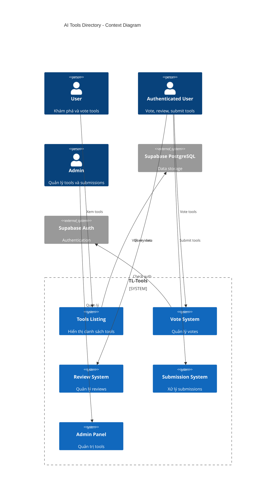
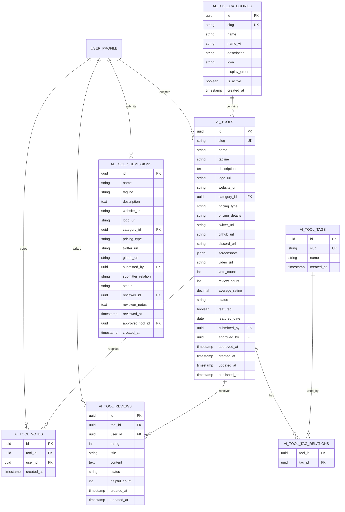
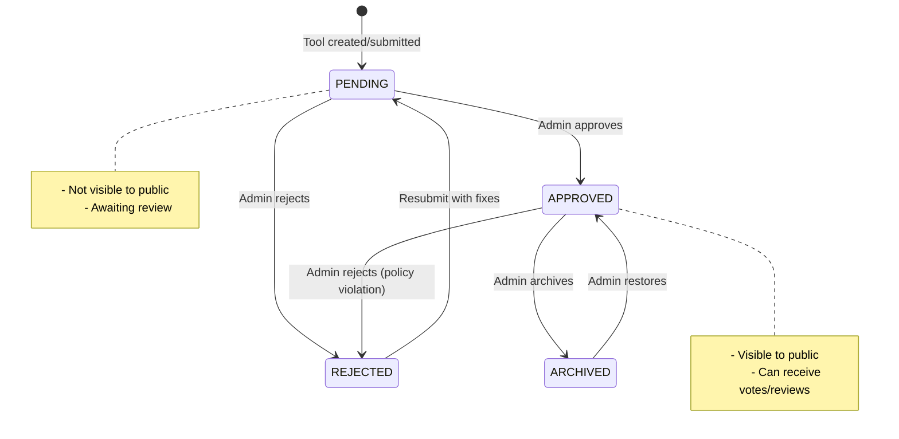
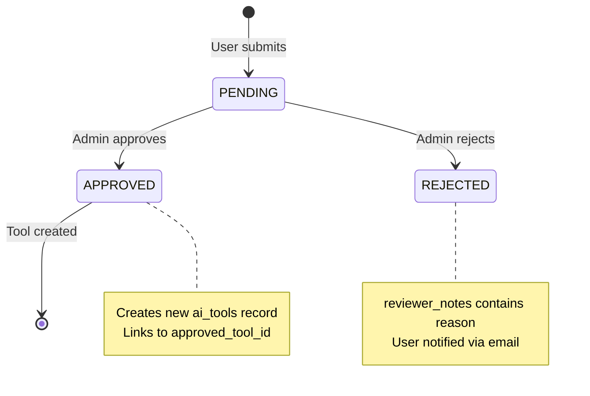
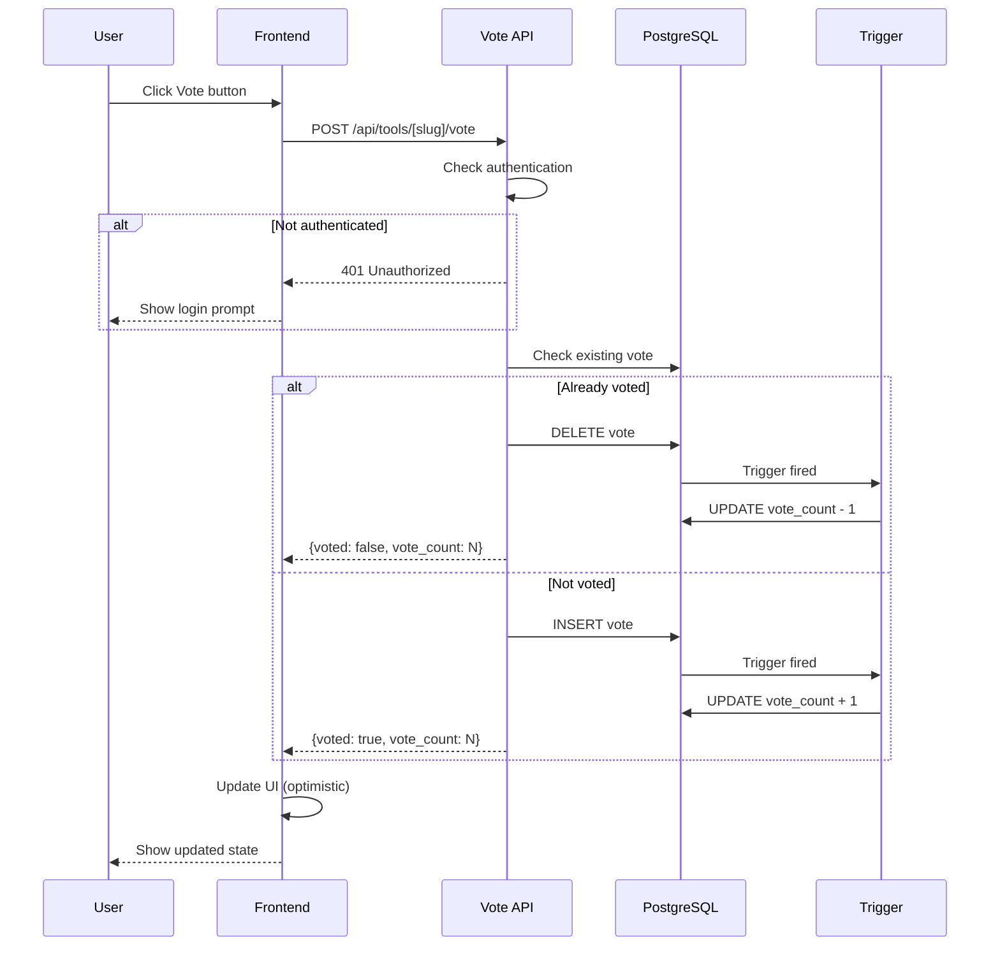
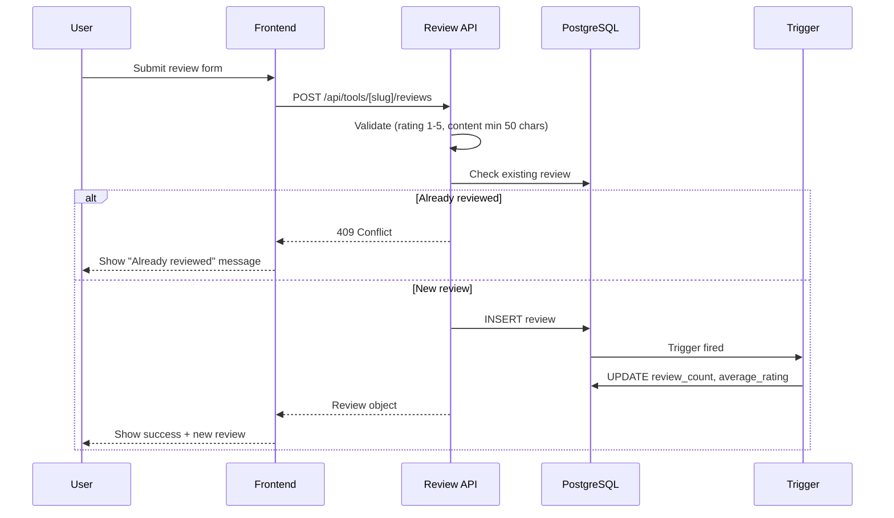
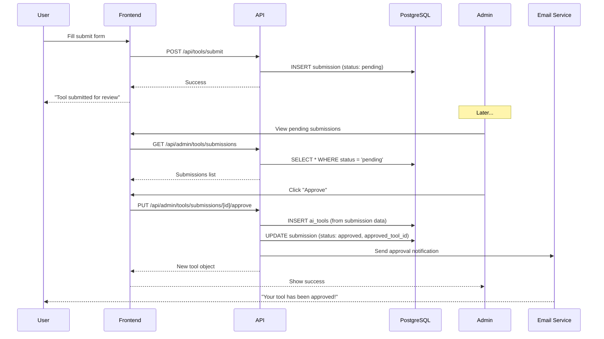

# HLD-TL-TOOLS - AI Tools Directory

## 1. Bối cảnh

### 1.1 Bối cảnh Nghiệp vụ

**Vấn đề cần giải quyết:**
- Người dùng cần một nơi để khám phá các công cụ AI tốt nhất cho từng lĩnh vực
- Cộng đồng muốn chia sẻ và đánh giá các công cụ AI họ đã sử dụng
- Cần hệ thống vote để xác định độ phổ biến và chất lượng của tools
- Cho phép người dùng submit công cụ mới để mở rộng database

**Tính năng chính:**
- Listing tất cả AI tools theo danh mục
- Hệ thống vote (upvote) cho mỗi tool
- Hệ thống review với rating 1-5 sao
- User submit công cụ mới (cần admin duyệt)
- Admin quản lý và moderate nội dung

### 1.2 Bối cảnh Hệ thống

```
┌─────────────────────────────────────────────────────────────────────┐
│                    TL-TOOLS SERVICE                                  │
├─────────────────────────────────────────────────────────────────────┤
│                                                                      │
│   ┌──────────────┐    ┌──────────────┐    ┌──────────────┐         │
│   │   Tools      │    │   Vote       │    │   Review     │         │
│   │   Listing    │    │   System     │    │   System     │         │
│   └──────────────┘    └──────────────┘    └──────────────┘         │
│          │                   │                    │                 │
│          ▼                   ▼                    ▼                 │
│   ┌──────────────┐    ┌──────────────┐    ┌──────────────┐         │
│   │   Supabase   │    │   User       │    │   Admin      │         │
│   │   PostgreSQL │    │   Auth       │    │   Panel      │         │
│   └──────────────┘    └──────────────┘    └──────────────┘         │
│                                                                      │
└─────────────────────────────────────────────────────────────────────┘
```

---

## 2. Context Diagram



---

## 3. Features Overview

### 3.1 Feature Matrix

| Feature | Anonymous | Authenticated | Admin |
|---------|-----------|---------------|-------|
| Xem danh sách tools | ✅ | ✅ | ✅ |
| Xem chi tiết tool | ✅ | ✅ | ✅ |
| Tìm kiếm & filter | ✅ | ✅ | ✅ |
| Vote cho tool | ❌ | ✅ | ✅ |
| Viết review | ❌ | ✅ | ✅ |
| Submit tool mới | ❌ | ✅ | ✅ |
| Quản lý tools | ❌ | ❌ | ✅ |
| Duyệt submissions | ❌ | ❌ | ✅ |

### 3.2 Tool Categories

| Slug | Name (EN) | Name (VI) | Icon |
|------|-----------|-----------|------|
| text-generation | Text Generation | Tạo văn bản | pen-tool |
| image-generation | Image Generation | Tạo hình ảnh | image |
| video-generation | Video Generation | Tạo video | video |
| audio-generation | Audio Generation | Tạo âm thanh | music |
| code-assistant | Code Assistant | Hỗ trợ lập trình | code |
| chatbot | Chatbot | Chatbot | message-circle |
| productivity | Productivity | Năng suất | zap |
| research | Research | Nghiên cứu | search |
| marketing | Marketing | Marketing | megaphone |
| design | Design | Thiết kế | palette |
| data-analysis | Data Analysis | Phân tích dữ liệu | bar-chart |
| automation | Automation | Tự động hóa | settings |
| other | Other | Khác | grid |

---

## 4. Data Model (ERD)



---

## 5. SQL Schema

```sql
-- =============================================
-- AI Tool Categories Table
-- =============================================
CREATE TABLE ai_tool_categories (
    id UUID PRIMARY KEY DEFAULT gen_random_uuid(),
    slug VARCHAR(100) UNIQUE NOT NULL,
    name VARCHAR(100) NOT NULL,
    name_vi VARCHAR(100) NOT NULL,
    description VARCHAR(500),
    icon VARCHAR(50),
    display_order INTEGER DEFAULT 0,
    is_active BOOLEAN DEFAULT true,
    created_at TIMESTAMPTZ DEFAULT NOW()
);

CREATE INDEX idx_categories_active ON ai_tool_categories(is_active, display_order);

-- =============================================
-- AI Tools Main Table
-- =============================================
CREATE TABLE ai_tools (
    id UUID PRIMARY KEY DEFAULT gen_random_uuid(),
    slug VARCHAR(200) UNIQUE NOT NULL,
    name VARCHAR(200) NOT NULL,
    tagline VARCHAR(300) NOT NULL,
    description TEXT NOT NULL,
    logo_url VARCHAR(500),
    website_url VARCHAR(500) NOT NULL,
    category_id UUID REFERENCES ai_tool_categories(id) ON DELETE SET NULL,

    -- Pricing
    pricing_type VARCHAR(50) NOT NULL DEFAULT 'free',
    pricing_details VARCHAR(200),

    -- Social Links
    twitter_url VARCHAR(500),
    github_url VARCHAR(500),
    discord_url VARCHAR(500),

    -- Media
    screenshots JSONB DEFAULT '[]',
    video_url VARCHAR(500),

    -- Stats (denormalized)
    vote_count INTEGER DEFAULT 0,
    review_count INTEGER DEFAULT 0,
    average_rating DECIMAL(3,2) DEFAULT 0,

    -- Status
    status VARCHAR(20) DEFAULT 'pending',
    featured BOOLEAN DEFAULT false,
    featured_date DATE,

    -- Ownership
    submitted_by UUID REFERENCES user_profile(id) ON DELETE SET NULL,
    approved_by UUID REFERENCES user_profile(id) ON DELETE SET NULL,
    approved_at TIMESTAMPTZ,

    -- Timestamps
    created_at TIMESTAMPTZ DEFAULT NOW(),
    updated_at TIMESTAMPTZ DEFAULT NOW(),
    published_at TIMESTAMPTZ,

    -- Constraints
    CONSTRAINT valid_pricing_type CHECK (pricing_type IN ('free', 'freemium', 'paid', 'enterprise')),
    CONSTRAINT valid_status CHECK (status IN ('pending', 'approved', 'rejected', 'archived'))
);

CREATE INDEX idx_tools_status ON ai_tools(status);
CREATE INDEX idx_tools_category ON ai_tools(category_id);
CREATE INDEX idx_tools_votes ON ai_tools(vote_count DESC);
CREATE INDEX idx_tools_rating ON ai_tools(average_rating DESC);
CREATE INDEX idx_tools_featured ON ai_tools(featured, featured_date DESC);

-- =============================================
-- AI Tool Tags
-- =============================================
CREATE TABLE ai_tool_tags (
    id UUID PRIMARY KEY DEFAULT gen_random_uuid(),
    slug VARCHAR(100) UNIQUE NOT NULL,
    name VARCHAR(100) NOT NULL,
    created_at TIMESTAMPTZ DEFAULT NOW()
);

CREATE TABLE ai_tool_tag_relations (
    tool_id UUID NOT NULL REFERENCES ai_tools(id) ON DELETE CASCADE,
    tag_id UUID NOT NULL REFERENCES ai_tool_tags(id) ON DELETE CASCADE,
    PRIMARY KEY (tool_id, tag_id)
);

-- =============================================
-- AI Tool Votes (1 vote per user per tool)
-- =============================================
CREATE TABLE ai_tool_votes (
    id UUID PRIMARY KEY DEFAULT gen_random_uuid(),
    tool_id UUID NOT NULL REFERENCES ai_tools(id) ON DELETE CASCADE,
    user_id UUID NOT NULL REFERENCES user_profile(id) ON DELETE CASCADE,
    created_at TIMESTAMPTZ DEFAULT NOW(),
    UNIQUE(tool_id, user_id)
);

CREATE INDEX idx_votes_tool ON ai_tool_votes(tool_id);
CREATE INDEX idx_votes_user ON ai_tool_votes(user_id);

-- =============================================
-- AI Tool Reviews (1 review per user per tool)
-- =============================================
CREATE TABLE ai_tool_reviews (
    id UUID PRIMARY KEY DEFAULT gen_random_uuid(),
    tool_id UUID NOT NULL REFERENCES ai_tools(id) ON DELETE CASCADE,
    user_id UUID NOT NULL REFERENCES user_profile(id) ON DELETE CASCADE,
    rating INTEGER NOT NULL CHECK (rating >= 1 AND rating <= 5),
    title VARCHAR(200),
    content TEXT NOT NULL,
    status VARCHAR(20) DEFAULT 'published',
    helpful_count INTEGER DEFAULT 0,
    created_at TIMESTAMPTZ DEFAULT NOW(),
    updated_at TIMESTAMPTZ DEFAULT NOW(),
    UNIQUE(tool_id, user_id),
    CONSTRAINT valid_review_status CHECK (status IN ('published', 'hidden', 'flagged'))
);

CREATE INDEX idx_reviews_tool ON ai_tool_reviews(tool_id);
CREATE INDEX idx_reviews_user ON ai_tool_reviews(user_id);

-- =============================================
-- AI Tool Submissions
-- =============================================
CREATE TABLE ai_tool_submissions (
    id UUID PRIMARY KEY DEFAULT gen_random_uuid(),
    name VARCHAR(200) NOT NULL,
    tagline VARCHAR(300) NOT NULL,
    description TEXT NOT NULL,
    website_url VARCHAR(500) NOT NULL,
    logo_url VARCHAR(500),
    category_id UUID REFERENCES ai_tool_categories(id) ON DELETE SET NULL,
    pricing_type VARCHAR(50) DEFAULT 'free',
    pricing_details VARCHAR(200),
    twitter_url VARCHAR(500),
    github_url VARCHAR(500),
    submitted_by UUID NOT NULL REFERENCES user_profile(id) ON DELETE CASCADE,
    submitter_relation VARCHAR(50),
    status VARCHAR(20) DEFAULT 'pending',
    reviewer_id UUID REFERENCES user_profile(id) ON DELETE SET NULL,
    reviewer_notes TEXT,
    reviewed_at TIMESTAMPTZ,
    approved_tool_id UUID REFERENCES ai_tools(id) ON DELETE SET NULL,
    created_at TIMESTAMPTZ DEFAULT NOW(),
    CONSTRAINT valid_submission_status CHECK (status IN ('pending', 'approved', 'rejected')),
    CONSTRAINT valid_submitter_relation CHECK (submitter_relation IN ('maker', 'user', 'other'))
);

CREATE INDEX idx_submissions_status ON ai_tool_submissions(status);
CREATE INDEX idx_submissions_user ON ai_tool_submissions(submitted_by);
```

---

## 6. Triggers

### 6.1 Vote Count Trigger

```sql
CREATE OR REPLACE FUNCTION update_tool_vote_count()
RETURNS TRIGGER AS $$
BEGIN
    IF TG_OP = 'INSERT' THEN
        UPDATE ai_tools
        SET vote_count = vote_count + 1, updated_at = NOW()
        WHERE id = NEW.tool_id;
    ELSIF TG_OP = 'DELETE' THEN
        UPDATE ai_tools
        SET vote_count = GREATEST(vote_count - 1, 0), updated_at = NOW()
        WHERE id = OLD.tool_id;
    END IF;
    RETURN NULL;
END;
$$ LANGUAGE plpgsql;

CREATE TRIGGER trigger_vote_count
AFTER INSERT OR DELETE ON ai_tool_votes
FOR EACH ROW EXECUTE FUNCTION update_tool_vote_count();
```

### 6.2 Review Stats Trigger

```sql
CREATE OR REPLACE FUNCTION update_tool_review_stats()
RETURNS TRIGGER AS $$
DECLARE
    target_tool_id UUID;
BEGIN
    target_tool_id := COALESCE(NEW.tool_id, OLD.tool_id);

    UPDATE ai_tools
    SET
        review_count = (
            SELECT COUNT(*) FROM ai_tool_reviews
            WHERE tool_id = target_tool_id AND status = 'published'
        ),
        average_rating = (
            SELECT COALESCE(ROUND(AVG(rating)::numeric, 2), 0)
            FROM ai_tool_reviews
            WHERE tool_id = target_tool_id AND status = 'published'
        ),
        updated_at = NOW()
    WHERE id = target_tool_id;

    RETURN NULL;
END;
$$ LANGUAGE plpgsql;

CREATE TRIGGER trigger_review_stats
AFTER INSERT OR UPDATE OR DELETE ON ai_tool_reviews
FOR EACH ROW EXECUTE FUNCTION update_tool_review_stats();
```

---

## 7. Row Level Security (RLS)

```sql
-- Enable RLS
ALTER TABLE ai_tools ENABLE ROW LEVEL SECURITY;
ALTER TABLE ai_tool_votes ENABLE ROW LEVEL SECURITY;
ALTER TABLE ai_tool_reviews ENABLE ROW LEVEL SECURITY;
ALTER TABLE ai_tool_submissions ENABLE ROW LEVEL SECURITY;

-- Tools: Public read for approved
CREATE POLICY "Public can view approved tools"
    ON ai_tools FOR SELECT
    USING (status = 'approved');

CREATE POLICY "Admins can manage all tools"
    ON ai_tools FOR ALL
    USING (
        EXISTS (
            SELECT 1 FROM user_profile
            WHERE auth_id = auth.uid() AND role = 'admin'
        )
    );

-- Votes: Public read, authenticated write own
CREATE POLICY "Public can view votes"
    ON ai_tool_votes FOR SELECT USING (true);

CREATE POLICY "Authenticated users can manage own votes"
    ON ai_tool_votes FOR ALL
    USING (
        user_id IN (SELECT id FROM user_profile WHERE auth_id = auth.uid())
    );

-- Reviews: Public read published, authenticated write own
CREATE POLICY "Public can view published reviews"
    ON ai_tool_reviews FOR SELECT
    USING (status = 'published');

CREATE POLICY "Users can manage own reviews"
    ON ai_tool_reviews FOR ALL
    USING (
        user_id IN (SELECT id FROM user_profile WHERE auth_id = auth.uid())
    );

-- Submissions: Users manage own, admins manage all
CREATE POLICY "Users can view own submissions"
    ON ai_tool_submissions FOR SELECT
    USING (
        submitted_by IN (SELECT id FROM user_profile WHERE auth_id = auth.uid())
    );

CREATE POLICY "Authenticated users can create submissions"
    ON ai_tool_submissions FOR INSERT
    WITH CHECK (
        submitted_by IN (SELECT id FROM user_profile WHERE auth_id = auth.uid())
    );

CREATE POLICY "Admins can manage all submissions"
    ON ai_tool_submissions FOR ALL
    USING (
        EXISTS (
            SELECT 1 FROM user_profile
            WHERE auth_id = auth.uid() AND role = 'admin'
        )
    );
```

---

## 8. API Endpoints

### 8.1 Public Endpoints

| Method | Endpoint | Description |
|--------|----------|-------------|
| GET | `/api/tools` | List approved tools (pagination, filter, sort) |
| GET | `/api/tools/[slug]` | Tool detail |
| GET | `/api/tools/categories` | List categories |
| GET | `/api/tools/featured` | Featured tools |
| GET | `/api/tools/[slug]/reviews` | Tool reviews |

### 8.2 Protected Endpoints (Auth Required)

| Method | Endpoint | Description |
|--------|----------|-------------|
| POST | `/api/tools/[slug]/vote` | Toggle vote |
| GET | `/api/tools/[slug]/vote` | Check vote status |
| POST | `/api/tools/[slug]/reviews` | Create review |
| PUT | `/api/tools/[slug]/reviews/[id]` | Update review |
| DELETE | `/api/tools/[slug]/reviews/[id]` | Delete review |
| POST | `/api/tools/submit` | Submit new tool |
| GET | `/api/user/submissions` | User's submissions |

### 8.3 Admin Endpoints

| Method | Endpoint | Description |
|--------|----------|-------------|
| GET | `/api/admin/tools` | List all tools |
| POST | `/api/admin/tools` | Create tool |
| PUT | `/api/admin/tools/[id]` | Update tool |
| DELETE | `/api/admin/tools/[id]` | Delete tool |
| PUT | `/api/admin/tools/[id]/status` | Change status |
| PUT | `/api/admin/tools/[id]/featured` | Toggle featured |
| GET | `/api/admin/tools/submissions` | List submissions |
| PUT | `/api/admin/tools/submissions/[id]/approve` | Approve |
| PUT | `/api/admin/tools/submissions/[id]/reject` | Reject |

---

## 9. State Machines

### 9.1 Tool Status



### 9.2 Submission Status



---

## 10. Component Architecture

### 10.1 Page Structure

```
app/
├── tools/
│   ├── page.tsx                    # /tools - Listing page
│   ├── [slug]/
│   │   └── page.tsx                # /tools/[slug] - Detail page
│   └── submit/
│       └── page.tsx                # /tools/submit - Submit form
├── admin/
│   └── tools/
│       ├── page.tsx                # Admin list
│       ├── [id]/
│       │   └── page.tsx            # Edit tool
│       └── submissions/
│           └── page.tsx            # Review submissions
```

### 10.2 Components

```
components/tools/
├── ToolCard.tsx                    # Card trong listing
├── ToolGrid.tsx                    # Grid layout
├── ToolDetail.tsx                  # Chi tiết tool
├── ToolVoteButton.tsx              # Nút vote
├── ToolCategoryFilter.tsx          # Filter category
├── ToolSearchInput.tsx             # Ô tìm kiếm
├── ToolSortSelect.tsx              # Dropdown sắp xếp
├── ToolPricingBadge.tsx            # Badge giá
├── ToolRatingStars.tsx             # Rating sao
├── ToolReviewForm.tsx              # Form viết review
├── ToolReviewCard.tsx              # Card review
├── ToolReviewList.tsx              # List reviews
├── ToolSubmitForm.tsx              # Form submit
└── ToolScreenshots.tsx             # Gallery screenshots
```

---

## 11. Vote System Flow



---

## 12. Review System Flow



---

## 13. Submission & Approval Flow



---

## 14. Caching Strategy

### 14.1 ISR Configuration

```typescript
// app/tools/page.tsx
export const revalidate = 300; // 5 minutes

// app/tools/[slug]/page.tsx
export const revalidate = 300; // 5 minutes
```

### 14.2 On-Demand Revalidation

- Khi vote count thay đổi đáng kể
- Khi có tool mới được approve
- Khi admin update tool

---

## 15. Business Rules

| Code | Rule | Description |
|------|------|-------------|
| BR_TL_01 | Status Filter | Chỉ hiển thị tools có status = 'approved' |
| BR_TL_02 | Vote Limit | Mỗi user chỉ được 1 vote cho mỗi tool |
| BR_TL_03 | Vote Toggle | Vote có thể toggle (thêm/xóa) |
| BR_TL_04 | Review Limit | Mỗi user chỉ được 1 review cho mỗi tool |
| BR_TL_05 | Rating Range | Rating từ 1 đến 5 sao |
| BR_TL_06 | Review Min | Nội dung review tối thiểu 50 ký tự |
| BR_TL_07 | Auth Required | Vote/Review/Submit yêu cầu đăng nhập |
| BR_TL_08 | Admin Only | Quản lý tools yêu cầu role = 'admin' |
| BR_TL_09 | Slug Unique | Slug tool phải unique |
| BR_TL_10 | Featured Limit | Tối đa 10 tools featured cùng lúc |

---

## 16. Security Considerations

### 16.1 Input Validation

```typescript
const toolSubmitSchema = z.object({
  name: z.string().min(1).max(200),
  tagline: z.string().min(1).max(300),
  description: z.string().min(100).max(5000),
  website_url: z.string().url(),
  logo_url: z.string().url().optional(),
  category_id: z.string().uuid(),
  pricing_type: z.enum(['free', 'freemium', 'paid', 'enterprise']),
  submitter_relation: z.enum(['maker', 'user', 'other']),
});

const reviewSchema = z.object({
  rating: z.number().int().min(1).max(5),
  title: z.string().max(200).optional(),
  content: z.string().min(50).max(2000),
});
```

### 16.2 Rate Limiting

```typescript
const RATE_LIMITS = {
  vote: { requests: 30, window: '1 minute' },
  review: { requests: 5, window: '1 hour' },
  submit: { requests: 3, window: '1 hour' },
};
```

---

## 17. Metrics & Success Criteria

| Metric | Target |
|--------|--------|
| Số AI Tools trong database | >= 50 |
| Tỷ lệ user vote | >= 10% users đăng nhập |
| Submissions/tuần | >= 5 |
| Tỷ lệ approval | >= 60% |
| Thời gian duyệt submission | <= 24h |
| Time to Interactive (listing) | <= 2s |
| Lighthouse Performance | >= 90 |

---

## 18. Dependencies

### 18.1 Internal Dependencies

| Dependency | Description |
|------------|-------------|
| US-PF-AUTH | Authentication system (votes, reviews cần auth) |
| user_profile table | Lưu thông tin user cho votes/reviews |

### 18.2 External Dependencies

| Dependency | Description |
|------------|-------------|
| Supabase PostgreSQL | Database |
| Supabase Auth | Authentication |
| Vercel | Deployment & ISR |

---

## 19. Appendix

### A. Seed Categories

```sql
INSERT INTO ai_tool_categories (slug, name, name_vi, icon, display_order) VALUES
    ('text-generation', 'Text Generation', 'Tạo văn bản', 'pen-tool', 1),
    ('image-generation', 'Image Generation', 'Tạo hình ảnh', 'image', 2),
    ('video-generation', 'Video Generation', 'Tạo video', 'video', 3),
    ('audio-generation', 'Audio Generation', 'Tạo âm thanh', 'music', 4),
    ('code-assistant', 'Code Assistant', 'Hỗ trợ lập trình', 'code', 5),
    ('chatbot', 'Chatbot', 'Chatbot', 'message-circle', 6),
    ('productivity', 'Productivity', 'Năng suất', 'zap', 7),
    ('research', 'Research', 'Nghiên cứu', 'search', 8),
    ('marketing', 'Marketing', 'Marketing', 'megaphone', 9),
    ('design', 'Design', 'Thiết kế', 'palette', 10),
    ('data-analysis', 'Data Analysis', 'Phân tích dữ liệu', 'bar-chart', 11),
    ('automation', 'Automation', 'Tự động hóa', 'settings', 12),
    ('other', 'Other', 'Khác', 'grid', 99);
```

### B. Sample Tool Data

```sql
INSERT INTO ai_tools (slug, name, tagline, description, website_url, category_id, pricing_type, status)
VALUES (
    'chatgpt',
    'ChatGPT',
    'AI chatbot powered by GPT-4',
    'ChatGPT is an AI-powered chatbot developed by OpenAI...',
    'https://chat.openai.com',
    (SELECT id FROM ai_tool_categories WHERE slug = 'chatbot'),
    'freemium',
    'approved'
);
```
