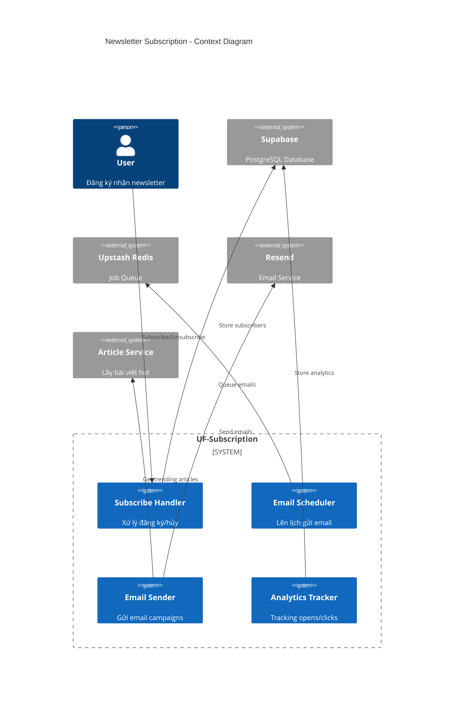
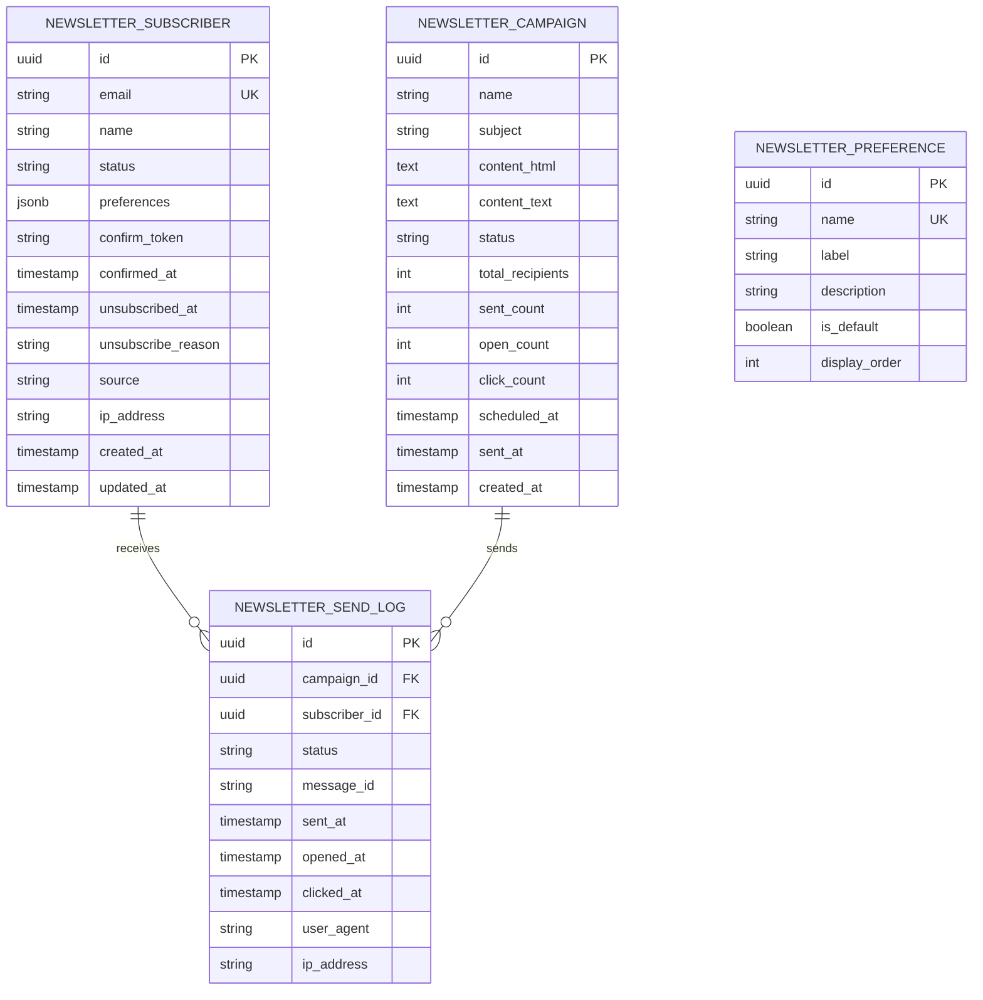
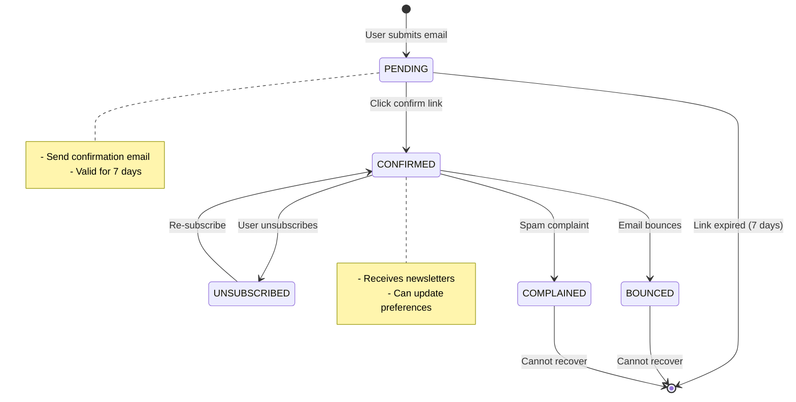
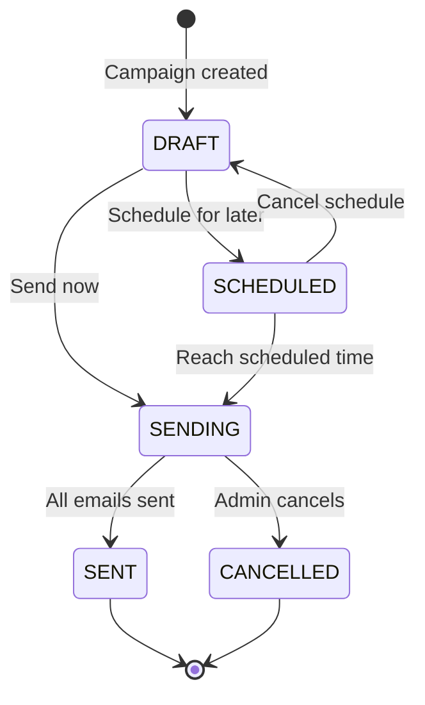
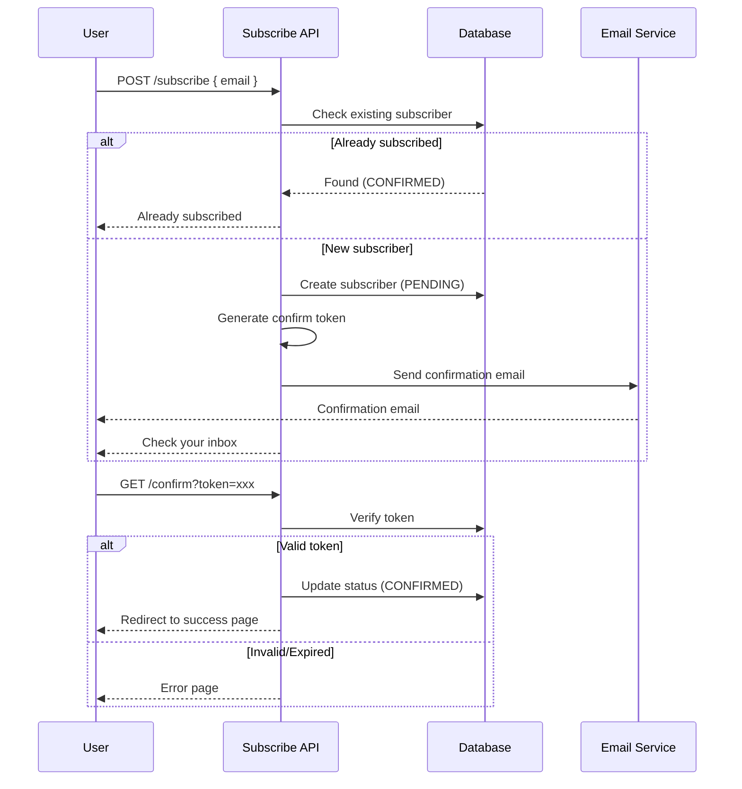

# HLD-UF-SUBSCRIPTION - Đăng ký Newsletter

## 1. Bối cảnh

### 1.1 Bối cảnh Nghiệp vụ

**Vấn đề cần giải quyết:**
- Người dùng muốn nhận tin tức công nghệ định kỳ qua email
- Cần xây dựng kênh giao tiếp trực tiếp với người dùng
- Tạo traffic ổn định quay lại website
- Thu thập dữ liệu người dùng để cải thiện nội dung

**Giải pháp:**
- Newsletter tự động gửi hàng tuần
- Cho phép người dùng chọn chủ đề quan tâm
- Tích hợp với Resend/SendGrid để gửi email
- Tracking mở email và click để đo lường

### 1.2 Bối cảnh Hệ thống

```
┌─────────────────────────────────────────────────────────────────────┐
│                    UF-SUBSCRIPTION SERVICE                          │
├─────────────────────────────────────────────────────────────────────┤
│                                                                      │
│   ┌──────────────┐    ┌──────────────┐    ┌──────────────┐         │
│   │  Subscribe   │───►│   Queue &    │───►│    Email     │         │
│   │   Handler    │    │   Scheduler  │    │    Sender    │         │
│   └──────────────┘    └──────────────┘    └──────────────┘         │
│          │                   │                    │                 │
│          ▼                   ▼                    ▼                 │
│   ┌──────────────┐    ┌──────────────┐    ┌──────────────┐         │
│   │  PostgreSQL  │    │    Redis     │    │   Resend/    │         │
│   │  Subscribers │    │    Queue     │    │  SendGrid    │         │
│   └──────────────┘    └──────────────┘    └──────────────┘         │
│                                                                      │
└─────────────────────────────────────────────────────────────────────┘
```

---

## 2. Context Diagram



---

## 3. Data Model (ERD)



### 3.1 SQL Schema

```sql
-- Newsletter Subscribers
CREATE TABLE newsletter_subscriber (
    id UUID PRIMARY KEY DEFAULT gen_random_uuid(),
    email VARCHAR(255) UNIQUE NOT NULL,
    name VARCHAR(100),
    status VARCHAR(20) NOT NULL DEFAULT 'PENDING',
    preferences JSONB DEFAULT '["tech-news", "github-trending"]',
    confirm_token VARCHAR(64),
    confirmed_at TIMESTAMPTZ,
    unsubscribed_at TIMESTAMPTZ,
    unsubscribe_reason TEXT,
    source VARCHAR(50), -- 'homepage', 'article', 'popup'
    ip_address INET,
    created_at TIMESTAMPTZ DEFAULT NOW(),
    updated_at TIMESTAMPTZ DEFAULT NOW(),

    CONSTRAINT chk_status CHECK (status IN (
        'PENDING', 'CONFIRMED', 'UNSUBSCRIBED', 'BOUNCED', 'COMPLAINED'
    ))
);

CREATE INDEX idx_subscriber_status ON newsletter_subscriber(status);
CREATE INDEX idx_subscriber_email ON newsletter_subscriber(email);

-- Newsletter Campaigns
CREATE TABLE newsletter_campaign (
    id UUID PRIMARY KEY DEFAULT gen_random_uuid(),
    name VARCHAR(200) NOT NULL,
    subject VARCHAR(200) NOT NULL,
    content_html TEXT NOT NULL,
    content_text TEXT,
    status VARCHAR(20) NOT NULL DEFAULT 'DRAFT',
    total_recipients INTEGER DEFAULT 0,
    sent_count INTEGER DEFAULT 0,
    open_count INTEGER DEFAULT 0,
    click_count INTEGER DEFAULT 0,
    scheduled_at TIMESTAMPTZ,
    sent_at TIMESTAMPTZ,
    created_at TIMESTAMPTZ DEFAULT NOW(),
    updated_at TIMESTAMPTZ DEFAULT NOW(),

    CONSTRAINT chk_campaign_status CHECK (status IN (
        'DRAFT', 'SCHEDULED', 'SENDING', 'SENT', 'CANCELLED'
    ))
);

CREATE INDEX idx_campaign_status ON newsletter_campaign(status);
CREATE INDEX idx_campaign_scheduled ON newsletter_campaign(scheduled_at);

-- Send Logs (for tracking)
CREATE TABLE newsletter_send_log (
    id UUID PRIMARY KEY DEFAULT gen_random_uuid(),
    campaign_id UUID NOT NULL REFERENCES newsletter_campaign(id) ON DELETE CASCADE,
    subscriber_id UUID NOT NULL REFERENCES newsletter_subscriber(id) ON DELETE CASCADE,
    status VARCHAR(20) NOT NULL DEFAULT 'QUEUED',
    message_id VARCHAR(100), -- External email service ID
    sent_at TIMESTAMPTZ,
    opened_at TIMESTAMPTZ,
    clicked_at TIMESTAMPTZ,
    user_agent TEXT,
    ip_address INET,

    CONSTRAINT chk_send_status CHECK (status IN (
        'QUEUED', 'SENT', 'DELIVERED', 'OPENED', 'CLICKED', 'BOUNCED', 'FAILED'
    ))
);

CREATE INDEX idx_send_log_campaign ON newsletter_send_log(campaign_id);
CREATE INDEX idx_send_log_subscriber ON newsletter_send_log(subscriber_id);

-- Newsletter Preferences (topics)
CREATE TABLE newsletter_preference (
    id UUID PRIMARY KEY DEFAULT gen_random_uuid(),
    name VARCHAR(50) UNIQUE NOT NULL,
    label VARCHAR(100) NOT NULL,
    description TEXT,
    is_default BOOLEAN DEFAULT false,
    display_order INTEGER DEFAULT 999,
    created_at TIMESTAMPTZ DEFAULT NOW()
);

-- Seed default preferences
INSERT INTO newsletter_preference (name, label, description, is_default, display_order) VALUES
('tech-news', 'Tin tức Công nghệ', 'Tin tức mới nhất về frontend, backend, AI', true, 1),
('github-trending', 'GitHub Trending', 'Repo đang hot trên GitHub', true, 2),
('tutorials', 'Hướng dẫn', 'Tutorials và best practices', false, 3),
('jobs', 'Tuyển dụng', 'Cơ hội việc làm công nghệ', false, 4);
```

---

## 4. State Machine

### 4.1 Subscriber States



### 4.2 Campaign States



---

## 5. Subscription Flow

### 5.1 Double Opt-in Flow



### 5.2 Subscribe Handler

```typescript
// lib/newsletter/subscribe.ts

import { supabase } from '@/lib/supabase';
import { sendConfirmationEmail } from './email';
import crypto from 'crypto';

export class SubscriptionService {
  /**
   * Subscribe new email
   */
  async subscribe(
    email: string,
    options: SubscribeOptions = {}
  ): Promise<SubscribeResult> {
    const { name, preferences, source = 'homepage', ipAddress } = options;

    // Validate email format
    if (!this.isValidEmail(email)) {
      return { success: false, error: 'Invalid email format' };
    }

    // Check existing subscriber
    const { data: existing } = await supabase
      .from('newsletter_subscriber')
      .select('id, status')
      .eq('email', email.toLowerCase())
      .single();

    if (existing) {
      if (existing.status === 'CONFIRMED') {
        return { success: false, error: 'Email already subscribed' };
      }
      if (existing.status === 'PENDING') {
        // Resend confirmation
        await this.resendConfirmation(existing.id);
        return { success: true, message: 'Confirmation email resent' };
      }
      if (existing.status === 'UNSUBSCRIBED') {
        // Re-subscribe
        return await this.resubscribe(existing.id);
      }
    }

    // Generate confirmation token
    const confirmToken = crypto.randomBytes(32).toString('hex');

    // Create subscriber
    const { data: subscriber, error } = await supabase
      .from('newsletter_subscriber')
      .insert({
        email: email.toLowerCase(),
        name,
        preferences: preferences || ['tech-news', 'github-trending'],
        confirm_token: confirmToken,
        source,
        ip_address: ipAddress,
      })
      .select('id')
      .single();

    if (error) {
      console.error('Subscribe error:', error);
      return { success: false, error: 'Failed to subscribe' };
    }

    // Send confirmation email
    await sendConfirmationEmail(email, confirmToken, name);

    return {
      success: true,
      message: 'Please check your email to confirm subscription',
      subscriberId: subscriber.id,
    };
  }

  /**
   * Confirm subscription
   */
  async confirm(token: string): Promise<ConfirmResult> {
    const { data: subscriber, error } = await supabase
      .from('newsletter_subscriber')
      .update({
        status: 'CONFIRMED',
        confirmed_at: new Date().toISOString(),
        confirm_token: null,
      })
      .eq('confirm_token', token)
      .eq('status', 'PENDING')
      .select('id, email')
      .single();

    if (error || !subscriber) {
      return { success: false, error: 'Invalid or expired token' };
    }

    return {
      success: true,
      email: subscriber.email,
    };
  }

  /**
   * Unsubscribe
   */
  async unsubscribe(
    email: string,
    reason?: string
  ): Promise<UnsubscribeResult> {
    const { data, error } = await supabase
      .from('newsletter_subscriber')
      .update({
        status: 'UNSUBSCRIBED',
        unsubscribed_at: new Date().toISOString(),
        unsubscribe_reason: reason,
      })
      .eq('email', email.toLowerCase())
      .eq('status', 'CONFIRMED')
      .select('id')
      .single();

    if (error || !data) {
      return { success: false, error: 'Subscriber not found' };
    }

    return { success: true };
  }

  /**
   * Update preferences
   */
  async updatePreferences(
    email: string,
    preferences: string[]
  ): Promise<boolean> {
    const { error } = await supabase
      .from('newsletter_subscriber')
      .update({ preferences })
      .eq('email', email.toLowerCase())
      .eq('status', 'CONFIRMED');

    return !error;
  }

  private isValidEmail(email: string): boolean {
    const emailRegex = /^[^\s@]+@[^\s@]+\.[^\s@]+$/;
    return emailRegex.test(email);
  }

  private async resendConfirmation(subscriberId: string): Promise<void> {
    const confirmToken = crypto.randomBytes(32).toString('hex');

    const { data } = await supabase
      .from('newsletter_subscriber')
      .update({ confirm_token: confirmToken })
      .eq('id', subscriberId)
      .select('email, name')
      .single();

    if (data) {
      await sendConfirmationEmail(data.email, confirmToken, data.name);
    }
  }

  private async resubscribe(subscriberId: string): Promise<SubscribeResult> {
    const confirmToken = crypto.randomBytes(32).toString('hex');

    const { data, error } = await supabase
      .from('newsletter_subscriber')
      .update({
        status: 'PENDING',
        confirm_token: confirmToken,
        unsubscribed_at: null,
        unsubscribe_reason: null,
      })
      .eq('id', subscriberId)
      .select('email, name')
      .single();

    if (error || !data) {
      return { success: false, error: 'Failed to re-subscribe' };
    }

    await sendConfirmationEmail(data.email, confirmToken, data.name);

    return {
      success: true,
      message: 'Please check your email to confirm subscription',
    };
  }
}

interface SubscribeOptions {
  name?: string;
  preferences?: string[];
  source?: string;
  ipAddress?: string;
}

interface SubscribeResult {
  success: boolean;
  message?: string;
  error?: string;
  subscriberId?: string;
}

interface ConfirmResult {
  success: boolean;
  email?: string;
  error?: string;
}

interface UnsubscribeResult {
  success: boolean;
  error?: string;
}
```

---

## 6. Email Templates

### 6.1 Confirmation Email

```typescript
// lib/newsletter/templates/confirmation.tsx

import {
  Html,
  Head,
  Body,
  Container,
  Section,
  Text,
  Button,
  Link,
} from '@react-email/components';

interface ConfirmationEmailProps {
  confirmUrl: string;
  name?: string;
}

export function ConfirmationEmail({ confirmUrl, name }: ConfirmationEmailProps) {
  return (
    <Html>
      <Head />
      <Body style={main}>
        <Container style={container}>
          <Section style={logoSection}>
            <Text style={logo}>KynguyenAI.vn</Text>
          </Section>

          <Section style={contentSection}>
            <Text style={heading}>
              Xác nhận đăng ký Newsletter
            </Text>

            <Text style={paragraph}>
              {name ? `Xin chào ${name},` : 'Xin chào,'}
            </Text>

            <Text style={paragraph}>
              Cảm ơn bạn đã đăng ký nhận Newsletter từ KynguyenAI.vn!
              Vui lòng click vào nút bên dưới để xác nhận đăng ký.
            </Text>

            <Button href={confirmUrl} style={button}>
              Xác nhận đăng ký
            </Button>

            <Text style={smallText}>
              Nếu bạn không đăng ký, vui lòng bỏ qua email này.
              Link xác nhận sẽ hết hạn sau 7 ngày.
            </Text>
          </Section>

          <Section style={footer}>
            <Text style={footerText}>
              © 2024 KynguyenAI.vn - Trang chủ của giới công nghệ Việt Nam
            </Text>
          </Section>
        </Container>
      </Body>
    </Html>
  );
}

const main = {
  backgroundColor: '#f6f9fc',
  fontFamily: '-apple-system,BlinkMacSystemFont,"Segoe UI",Roboto,sans-serif',
};

const container = {
  backgroundColor: '#ffffff',
  margin: '0 auto',
  padding: '20px 0 48px',
  marginBottom: '64px',
};

const logoSection = {
  padding: '32px 20px',
  textAlign: 'center' as const,
};

const logo = {
  fontSize: '24px',
  fontWeight: 'bold',
  color: '#6366f1',
};

const contentSection = {
  padding: '0 48px',
};

const heading = {
  fontSize: '24px',
  fontWeight: 'bold',
  textAlign: 'center' as const,
  margin: '0 0 24px',
};

const paragraph = {
  fontSize: '16px',
  lineHeight: '24px',
  color: '#525f7f',
};

const button = {
  backgroundColor: '#6366f1',
  borderRadius: '8px',
  color: '#fff',
  fontSize: '16px',
  fontWeight: 'bold',
  textDecoration: 'none',
  textAlign: 'center' as const,
  display: 'block',
  padding: '12px 24px',
  margin: '24px 0',
};

const smallText = {
  fontSize: '14px',
  color: '#8898aa',
};

const footer = {
  padding: '32px 20px',
  textAlign: 'center' as const,
};

const footerText = {
  fontSize: '12px',
  color: '#8898aa',
};
```

### 6.2 Weekly Newsletter Template

```typescript
// lib/newsletter/templates/weekly.tsx

import {
  Html,
  Head,
  Body,
  Container,
  Section,
  Text,
  Button,
  Link,
  Hr,
  Img,
} from '@react-email/components';

interface WeeklyNewsletterProps {
  articles: Article[];
  githubRepos: GitHubRepo[];
  unsubscribeUrl: string;
  preferencesUrl: string;
}

export function WeeklyNewsletter({
  articles,
  githubRepos,
  unsubscribeUrl,
  preferencesUrl,
}: WeeklyNewsletterProps) {
  return (
    <Html>
      <Head />
      <Body style={main}>
        <Container style={container}>
          {/* Header */}
          <Section style={header}>
            <Text style={logo}>KynguyenAI.vn</Text>
            <Text style={tagline}>Bản tin Công nghệ Tuần này</Text>
          </Section>

          {/* Intro */}
          <Section style={intro}>
            <Text style={paragraph}>
              Xin chào! Đây là những tin tức và trending repos nổi bật nhất tuần qua.
            </Text>
          </Section>

          {/* Top Articles */}
          <Section style={section}>
            <Text style={sectionTitle}>📰 Tin tức nổi bật</Text>
            {articles.slice(0, 5).map((article, index) => (
              <div key={index} style={articleCard}>
                {article.imageUrl && (
                  
                )}
                <Text style={articleTitle}>
                  <Link href={article.url} style={articleLink}>
                    {article.titleVi || article.title}
                  </Link>
                </Text>
                <Text style={articleSummary}>
                  {article.summaryVi}
                </Text>
                <Text style={articleMeta}>
                  {article.source} • {article.category}
                </Text>
              </div>
            ))}
            <Button href="https://kynguyenai.vn" style={button}>
              Xem tất cả tin tức
            </Button>
          </Section>

          <Hr style={divider} />

          {/* GitHub Trending */}
          <Section style={section}>
            <Text style={sectionTitle}>🔥 GitHub Trending</Text>
            {githubRepos.slice(0, 5).map((repo, index) => (
              <div key={index} style={repoCard}>
                <Text style={repoName}>
                  <Link href={repo.url} style={articleLink}>
                    {repo.fullName}
                  </Link>
                </Text>
                <Text style={repoDescription}>
                  {repo.descriptionVi || repo.description}
                </Text>
                <Text style={repoMeta}>
                  ⭐ {repo.stars.toLocaleString()} •
                  {repo.language && ` ${repo.language} •`}
                  +{repo.todayStars} today
                </Text>
              </div>
            ))}
          </Section>

          <Hr style={divider} />

          {/* Footer */}
          <Section style={footer}>
            <Text style={footerText}>
              Bạn nhận được email này vì đã đăng ký Newsletter của KynguyenAI.vn
            </Text>
            <Text style={footerLinks}>
              <Link href={preferencesUrl} style={footerLink}>
                Cài đặt
              </Link>
              {' • '}
              <Link href={unsubscribeUrl} style={footerLink}>
                Hủy đăng ký
              </Link>
            </Text>
            <Text style={copyright}>
              © 2024 KynguyenAI.vn - Trang chủ của giới công nghệ Việt Nam
            </Text>
          </Section>
        </Container>
      </Body>
    </Html>
  );
}

// ... styles similar to confirmation email
```

---

## 7. Email Sending

### 7.1 Email Service Integration

```typescript
// lib/newsletter/email.ts

import { Resend } from 'resend';
import { render } from '@react-email/render';
import { ConfirmationEmail } from './templates/confirmation';
import { WeeklyNewsletter } from './templates/weekly';

const resend = new Resend(process.env.RESEND_API_KEY);

const FROM_EMAIL = 'newsletter@kynguyenai.vn';
const FROM_NAME = 'KynguyenAI.vn';

/**
 * Send confirmation email
 */
export async function sendConfirmationEmail(
  email: string,
  token: string,
  name?: string
): Promise<void> {
  const confirmUrl = `${process.env.NEXT_PUBLIC_APP_URL}/newsletter/confirm?token=${token}`;

  const html = render(ConfirmationEmail({ confirmUrl, name }));

  await resend.emails.send({
    from: `${FROM_NAME} <${FROM_EMAIL}>`,
    to: email,
    subject: 'Xác nhận đăng ký Newsletter - KynguyenAI.vn',
    html,
  });
}

/**
 * Send weekly newsletter
 */
export async function sendWeeklyNewsletter(
  subscriber: Subscriber,
  content: NewsletterContent
): Promise<SendResult> {
  const unsubscribeUrl = `${process.env.NEXT_PUBLIC_APP_URL}/newsletter/unsubscribe?email=${encodeURIComponent(subscriber.email)}`;
  const preferencesUrl = `${process.env.NEXT_PUBLIC_APP_URL}/newsletter/preferences?email=${encodeURIComponent(subscriber.email)}`;

  const html = render(WeeklyNewsletter({
    articles: content.articles,
    githubRepos: content.githubRepos,
    unsubscribeUrl,
    preferencesUrl,
  }));

  try {
    const result = await resend.emails.send({
      from: `${FROM_NAME} <${FROM_EMAIL}>`,
      to: subscriber.email,
      subject: content.subject,
      html,
      headers: {
        'List-Unsubscribe': `<${unsubscribeUrl}>`,
      },
    });

    return {
      success: true,
      messageId: result.data?.id,
    };
  } catch (error) {
    return {
      success: false,
      error: (error as Error).message,
    };
  }
}

/**
 * Send campaign to all subscribers
 */
export async function sendCampaign(
  campaignId: string,
  content: NewsletterContent
): Promise<CampaignResult> {
  // Get confirmed subscribers
  const { data: subscribers } = await supabase
    .from('newsletter_subscriber')
    .select('id, email, name, preferences')
    .eq('status', 'CONFIRMED');

  if (!subscribers || subscribers.length === 0) {
    return { sent: 0, failed: 0 };
  }

  let sent = 0;
  let failed = 0;

  for (const subscriber of subscribers) {
    // Check if subscriber wants this content
    const prefs = subscriber.preferences as string[];
    const wantsTechNews = prefs.includes('tech-news');
    const wantsGithub = prefs.includes('github-trending');

    // Filter content based on preferences
    const filteredContent = {
      ...content,
      articles: wantsTechNews ? content.articles : [],
      githubRepos: wantsGithub ? content.githubRepos : [],
    };

    // Skip if no content for this subscriber
    if (filteredContent.articles.length === 0 && filteredContent.githubRepos.length === 0) {
      continue;
    }

    const result = await sendWeeklyNewsletter(subscriber, filteredContent);

    // Log send attempt
    await supabase.from('newsletter_send_log').insert({
      campaign_id: campaignId,
      subscriber_id: subscriber.id,
      status: result.success ? 'SENT' : 'FAILED',
      message_id: result.messageId,
      sent_at: new Date().toISOString(),
    });

    if (result.success) {
      sent++;
    } else {
      failed++;
    }

    // Rate limiting (Resend has rate limits)
    await new Promise(resolve => setTimeout(resolve, 100));
  }

  // Update campaign stats
  await supabase
    .from('newsletter_campaign')
    .update({
      sent_count: sent,
      status: 'SENT',
      sent_at: new Date().toISOString(),
    })
    .eq('id', campaignId);

  return { sent, failed };
}

interface Subscriber {
  id: string;
  email: string;
  name?: string;
  preferences: string[];
}

interface NewsletterContent {
  subject: string;
  articles: Article[];
  githubRepos: GitHubRepo[];
}

interface SendResult {
  success: boolean;
  messageId?: string;
  error?: string;
}

interface CampaignResult {
  sent: number;
  failed: number;
}
```

### 7.2 Campaign Scheduler

```typescript
// lib/newsletter/scheduler.ts

import { supabase } from '@/lib/supabase';
import { sendCampaign } from './email';

export class NewsletterScheduler {
  /**
   * Create weekly newsletter campaign
   */
  async createWeeklyCampaign(): Promise<string> {
    // Get top articles from last week
    const weekAgo = new Date();
    weekAgo.setDate(weekAgo.getDate() - 7);

    const { data: articles } = await supabase
      .from('article')
      .select('*')
      .eq('status', 'PUBLISHED')
      .gte('published_at', weekAgo.toISOString())
      .order('view_count', { ascending: false })
      .limit(10);

    // Get trending GitHub repos
    const { data: repos } = await supabase
      .from('github_trending')
      .select('*')
      .order('today_stars', { ascending: false })
      .limit(5);

    // Get subscriber count
    const { count } = await supabase
      .from('newsletter_subscriber')
      .select('*', { count: 'exact', head: true })
      .eq('status', 'CONFIRMED');

    // Create campaign
    const weekNumber = this.getWeekNumber();
    const { data: campaign, error } = await supabase
      .from('newsletter_campaign')
      .insert({
        name: `Weekly Newsletter - Week ${weekNumber}`,
        subject: `[KynguyenAI] Tin tức Công nghệ tuần ${weekNumber}`,
        content_html: '', // Will be generated during send
        total_recipients: count || 0,
        status: 'DRAFT',
      })
      .select('id')
      .single();

    if (error) throw error;

    return campaign.id;
  }

  /**
   * Schedule campaign
   */
  async scheduleCampaign(
    campaignId: string,
    scheduledAt: Date
  ): Promise<void> {
    await supabase
      .from('newsletter_campaign')
      .update({
        status: 'SCHEDULED',
        scheduled_at: scheduledAt.toISOString(),
      })
      .eq('id', campaignId);
  }

  /**
   * Process scheduled campaigns
   */
  async processScheduled(): Promise<void> {
    const now = new Date();

    const { data: campaigns } = await supabase
      .from('newsletter_campaign')
      .select('*')
      .eq('status', 'SCHEDULED')
      .lte('scheduled_at', now.toISOString());

    for (const campaign of campaigns || []) {
      await this.sendCampaignNow(campaign.id);
    }
  }

  /**
   * Send campaign immediately
   */
  async sendCampaignNow(campaignId: string): Promise<void> {
    // Update status to SENDING
    await supabase
      .from('newsletter_campaign')
      .update({ status: 'SENDING' })
      .eq('id', campaignId);

    try {
      // Get content
      const content = await this.buildCampaignContent();

      // Send to all subscribers
      await sendCampaign(campaignId, content);
    } catch (error) {
      console.error('Campaign send failed:', error);
      await supabase
        .from('newsletter_campaign')
        .update({ status: 'DRAFT' })
        .eq('id', campaignId);
    }
  }

  private async buildCampaignContent(): Promise<NewsletterContent> {
    const weekAgo = new Date();
    weekAgo.setDate(weekAgo.getDate() - 7);

    const { data: articles } = await supabase
      .from('article')
      .select('*')
      .eq('status', 'PUBLISHED')
      .gte('published_at', weekAgo.toISOString())
      .order('view_count', { ascending: false })
      .limit(10);

    const { data: repos } = await supabase
      .from('github_trending')
      .select('*')
      .order('today_stars', { ascending: false })
      .limit(5);

    const weekNumber = this.getWeekNumber();

    return {
      subject: `[KynguyenAI] Tin tức Công nghệ tuần ${weekNumber}`,
      articles: articles || [],
      githubRepos: repos || [],
    };
  }

  private getWeekNumber(): number {
    const now = new Date();
    const start = new Date(now.getFullYear(), 0, 1);
    const diff = now.getTime() - start.getTime();
    const oneWeek = 1000 * 60 * 60 * 24 * 7;
    return Math.ceil(diff / oneWeek);
  }
}
```

---

## 8. API Endpoints

### 8.1 Subscribe API

```typescript
// app/api/newsletter/subscribe/route.ts

import { NextRequest, NextResponse } from 'next/server';
import { SubscriptionService } from '@/lib/newsletter/subscribe';

const subscriptionService = new SubscriptionService();

export async function POST(request: NextRequest) {
  try {
    const { email, name, preferences } = await request.json();

    if (!email) {
      return NextResponse.json(
        { error: 'Email is required' },
        { status: 400 }
      );
    }

    // Get IP for rate limiting
    const ipAddress = request.headers.get('x-forwarded-for') ||
      request.headers.get('x-real-ip');

    const result = await subscriptionService.subscribe(email, {
      name,
      preferences,
      source: 'api',
      ipAddress: ipAddress || undefined,
    });

    if (!result.success) {
      return NextResponse.json(
        { error: result.error },
        { status: 400 }
      );
    }

    return NextResponse.json({
      success: true,
      message: result.message,
    });
  } catch (error) {
    console.error('Subscribe error:', error);
    return NextResponse.json(
      { error: 'Internal server error' },
      { status: 500 }
    );
  }
}
```

### 8.2 Confirm API

```typescript
// app/api/newsletter/confirm/route.ts

import { NextRequest, NextResponse } from 'next/server';
import { SubscriptionService } from '@/lib/newsletter/subscribe';

const subscriptionService = new SubscriptionService();

export async function GET(request: NextRequest) {
  const token = request.nextUrl.searchParams.get('token');

  if (!token) {
    return NextResponse.redirect(
      new URL('/newsletter/error?reason=missing-token', request.url)
    );
  }

  const result = await subscriptionService.confirm(token);

  if (!result.success) {
    return NextResponse.redirect(
      new URL('/newsletter/error?reason=invalid-token', request.url)
    );
  }

  return NextResponse.redirect(
    new URL('/newsletter/success', request.url)
  );
}
```

### 8.3 Unsubscribe API

```typescript
// app/api/newsletter/unsubscribe/route.ts

import { NextRequest, NextResponse } from 'next/server';
import { SubscriptionService } from '@/lib/newsletter/subscribe';

const subscriptionService = new SubscriptionService();

export async function POST(request: NextRequest) {
  const { email, reason } = await request.json();

  if (!email) {
    return NextResponse.json(
      { error: 'Email is required' },
      { status: 400 }
    );
  }

  const result = await subscriptionService.unsubscribe(email, reason);

  if (!result.success) {
    return NextResponse.json(
      { error: result.error },
      { status: 400 }
    );
  }

  return NextResponse.json({ success: true });
}

// GET for one-click unsubscribe
export async function GET(request: NextRequest) {
  const email = request.nextUrl.searchParams.get('email');

  if (!email) {
    return NextResponse.redirect(
      new URL('/newsletter/error?reason=missing-email', request.url)
    );
  }

  await subscriptionService.unsubscribe(email);

  return NextResponse.redirect(
    new URL('/newsletter/unsubscribed', request.url)
  );
}
```

---

## 9. Tracking & Analytics

### 9.1 Open Tracking

```typescript
// app/api/newsletter/track/open/route.ts

import { NextRequest, NextResponse } from 'next/server';
import { supabase } from '@/lib/supabase';

// 1x1 transparent GIF
const TRACKING_PIXEL = Buffer.from(
  'R0lGODlhAQABAIAAAAAAAP///yH5BAEAAAAALAAAAAABAAEAAAIBRAA7',
  'base64'
);

export async function GET(request: NextRequest) {
  const logId = request.nextUrl.searchParams.get('id');

  if (logId) {
    // Update open timestamp
    await supabase
      .from('newsletter_send_log')
      .update({
        status: 'OPENED',
        opened_at: new Date().toISOString(),
        user_agent: request.headers.get('user-agent'),
        ip_address: request.headers.get('x-forwarded-for'),
      })
      .eq('id', logId)
      .is('opened_at', null); // Only update if not already opened

    // Increment campaign open count
    const { data: log } = await supabase
      .from('newsletter_send_log')
      .select('campaign_id')
      .eq('id', logId)
      .single();

    if (log) {
      await supabase.rpc('increment_campaign_opens', {
        p_campaign_id: log.campaign_id,
      });
    }
  }

  return new NextResponse(TRACKING_PIXEL, {
    headers: {
      'Content-Type': 'image/gif',
      'Cache-Control': 'no-store, no-cache, must-revalidate',
    },
  });
}
```

### 9.2 Click Tracking

```typescript
// app/api/newsletter/track/click/route.ts

import { NextRequest, NextResponse } from 'next/server';
import { supabase } from '@/lib/supabase';

export async function GET(request: NextRequest) {
  const logId = request.nextUrl.searchParams.get('id');
  const url = request.nextUrl.searchParams.get('url');

  if (!url) {
    return NextResponse.redirect(new URL('/', request.url));
  }

  if (logId) {
    // Update click timestamp
    await supabase
      .from('newsletter_send_log')
      .update({
        status: 'CLICKED',
        clicked_at: new Date().toISOString(),
      })
      .eq('id', logId);

    // Increment campaign click count
    const { data: log } = await supabase
      .from('newsletter_send_log')
      .select('campaign_id')
      .eq('id', logId)
      .single();

    if (log) {
      await supabase.rpc('increment_campaign_clicks', {
        p_campaign_id: log.campaign_id,
      });
    }
  }

  // Redirect to actual URL
  return NextResponse.redirect(url);
}
```

### 9.3 Analytics Dashboard Data

```typescript
// lib/newsletter/analytics.ts

import { supabase } from '@/lib/supabase';

export class NewsletterAnalytics {
  async getOverview(): Promise<OverviewStats> {
    const { count: totalSubscribers } = await supabase
      .from('newsletter_subscriber')
      .select('*', { count: 'exact', head: true })
      .eq('status', 'CONFIRMED');

    const { count: pendingSubscribers } = await supabase
      .from('newsletter_subscriber')
      .select('*', { count: 'exact', head: true })
      .eq('status', 'PENDING');

    const { data: recentCampaigns } = await supabase
      .from('newsletter_campaign')
      .select('*')
      .eq('status', 'SENT')
      .order('sent_at', { ascending: false })
      .limit(5);

    // Calculate average open/click rates
    let avgOpenRate = 0;
    let avgClickRate = 0;

    if (recentCampaigns && recentCampaigns.length > 0) {
      const totalOpens = recentCampaigns.reduce((sum, c) => sum + c.open_count, 0);
      const totalClicks = recentCampaigns.reduce((sum, c) => sum + c.click_count, 0);
      const totalSent = recentCampaigns.reduce((sum, c) => sum + c.sent_count, 0);

      avgOpenRate = totalSent > 0 ? (totalOpens / totalSent) * 100 : 0;
      avgClickRate = totalOpens > 0 ? (totalClicks / totalOpens) * 100 : 0;
    }

    return {
      totalSubscribers: totalSubscribers || 0,
      pendingSubscribers: pendingSubscribers || 0,
      avgOpenRate: Math.round(avgOpenRate * 10) / 10,
      avgClickRate: Math.round(avgClickRate * 10) / 10,
      recentCampaigns: recentCampaigns || [],
    };
  }

  async getCampaignStats(campaignId: string): Promise<CampaignStats> {
    const { data: campaign } = await supabase
      .from('newsletter_campaign')
      .select('*')
      .eq('id', campaignId)
      .single();

    if (!campaign) {
      throw new Error('Campaign not found');
    }

    const openRate = campaign.sent_count > 0
      ? (campaign.open_count / campaign.sent_count) * 100
      : 0;

    const clickRate = campaign.open_count > 0
      ? (campaign.click_count / campaign.open_count) * 100
      : 0;

    return {
      ...campaign,
      openRate: Math.round(openRate * 10) / 10,
      clickRate: Math.round(clickRate * 10) / 10,
    };
  }

  async getGrowthData(days: number = 30): Promise<GrowthData[]> {
    const startDate = new Date();
    startDate.setDate(startDate.getDate() - days);

    const { data } = await supabase
      .from('newsletter_subscriber')
      .select('created_at')
      .eq('status', 'CONFIRMED')
      .gte('created_at', startDate.toISOString());

    // Group by date
    const byDate = new Map<string, number>();

    for (const subscriber of data || []) {
      const date = subscriber.created_at.split('T')[0];
      byDate.set(date, (byDate.get(date) || 0) + 1);
    }

    // Fill in missing dates
    const result: GrowthData[] = [];
    const current = new Date(startDate);

    while (current <= new Date()) {
      const dateStr = current.toISOString().split('T')[0];
      result.push({
        date: dateStr,
        newSubscribers: byDate.get(dateStr) || 0,
      });
      current.setDate(current.getDate() + 1);
    }

    return result;
  }
}

interface OverviewStats {
  totalSubscribers: number;
  pendingSubscribers: number;
  avgOpenRate: number;
  avgClickRate: number;
  recentCampaigns: any[];
}

interface CampaignStats {
  id: string;
  name: string;
  subject: string;
  sent_count: number;
  open_count: number;
  click_count: number;
  openRate: number;
  clickRate: number;
}

interface GrowthData {
  date: string;
  newSubscribers: number;
}
```

---

## 10. Event Architecture

### 10.1 Events

| Event | Trigger | Payload | Consumers |
|-------|---------|---------|-----------|
| `SubscriberCreated` | Đăng ký mới | `{ email, source }` | Metrics, Welcome flow |
| `SubscriberConfirmed` | Xác nhận email | `{ email }` | CRM, Analytics |
| `SubscriberUnsubscribed` | Hủy đăng ký | `{ email, reason }` | Analytics, Feedback |
| `CampaignSent` | Gửi campaign | `{ campaignId, count }` | Dashboard, Metrics |
| `EmailOpened` | Mở email | `{ logId }` | Analytics |
| `EmailClicked` | Click link | `{ logId, url }` | Analytics |

---

## 11. Cron Jobs

### 11.1 Weekly Newsletter Cron

```typescript
// app/api/cron/newsletter-weekly/route.ts

import { NextRequest, NextResponse } from 'next/server';
import { NewsletterScheduler } from '@/lib/newsletter/scheduler';

export async function GET(request: NextRequest) {
  const authHeader = request.headers.get('authorization');
  if (authHeader !== `Bearer ${process.env.CRON_SECRET}`) {
    return NextResponse.json({ error: 'Unauthorized' }, { status: 401 });
  }

  try {
    const scheduler = new NewsletterScheduler();

    // Create and send weekly campaign
    const campaignId = await scheduler.createWeeklyCampaign();
    await scheduler.sendCampaignNow(campaignId);

    return NextResponse.json({
      success: true,
      campaignId,
    });
  } catch (error) {
    console.error('Weekly newsletter failed:', error);
    return NextResponse.json(
      { error: (error as Error).message },
      { status: 500 }
    );
  }
}
```

### 11.2 Cleanup Pending Subscriptions

```typescript
// app/api/cron/newsletter-cleanup/route.ts

import { NextRequest, NextResponse } from 'next/server';
import { supabase } from '@/lib/supabase';

export async function GET(request: NextRequest) {
  const authHeader = request.headers.get('authorization');
  if (authHeader !== `Bearer ${process.env.CRON_SECRET}`) {
    return NextResponse.json({ error: 'Unauthorized' }, { status: 401 });
  }

  // Delete pending subscriptions older than 7 days
  const cutoff = new Date();
  cutoff.setDate(cutoff.getDate() - 7);

  const { data, error } = await supabase
    .from('newsletter_subscriber')
    .delete()
    .eq('status', 'PENDING')
    .lt('created_at', cutoff.toISOString())
    .select('id');

  return NextResponse.json({
    success: true,
    deleted: data?.length || 0,
  });
}
```

---

## 12. Appendix

### A. Environment Variables

```bash
# Email Service
RESEND_API_KEY=your_resend_api_key

# App URL
NEXT_PUBLIC_APP_URL=https://kynguyenai.vn

# Cron
CRON_SECRET=your_cron_secret
```

### B. Vercel Cron Configuration

```json
{
  "crons": [
    {
      "path": "/api/cron/newsletter-weekly",
      "schedule": "0 8 * * 1"
    },
    {
      "path": "/api/cron/newsletter-cleanup",
      "schedule": "0 3 * * *"
    }
  ]
}
```

### C. Performance Targets

| Metric | Target |
|--------|--------|
| Email delivery rate | > 98% |
| Open rate | > 25% |
| Click rate | > 5% |
| Unsubscribe rate | < 1% |
